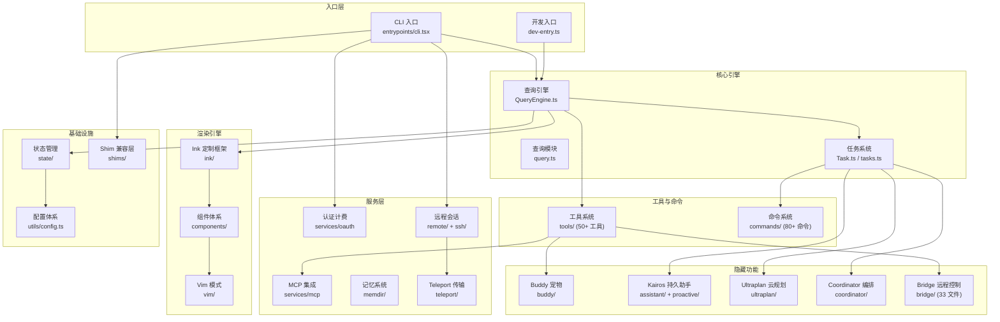

本项目是一个通过对 `@anthropic-ai/claude-code` npm 包的 source map 进行逆向还原而得到的完整 TypeScript 源码仓库。它不是官方源码的拷贝，而是从编译产物中考古重建的可运行源码树——总计约 **1,987 个 TypeScript 源文件**，涵盖 CLI 入口、查询引擎、工具系统、终端 UI 渲染、命令框架等全部核心模块。还原后的代码已通过 `bun install && bun run dev` 验证可本地启动，版本号标记为 `999.0.0-restored` 以区分官方发布。本仓库为非官方项目，仅供研究与学习，源码版权归 Anthropic 所有。

Sources: [README.md](README.md#L1-L11), [package.json](package.json#L1-L8)

## 项目背景：为什么需要"还原"

Claude Code 是 Anthropic 推出的命令行 AI 编程助手，通过 npm 以编译后的 JavaScript 包发布。与许多 npm 包不同，`@anthropic-ai/claude-code` 的发布包中包含了 source map 文件——这是调试用的标准格式，记录了编译后代码到原始源码的映射关系。利用 source map 的逆向能力，开发者可以从编译产物中重建出接近原始的 TypeScript 源码，包括文件名、目录结构、类型信息和大部分逻辑。本仓库正是这种逆向工程的成果：它还原了完整的 `src/` 目录树，并额外编写了 **shim 层**（位于 `shims/` 目录）来替代 Anthropic 内部的原生 NAPI 模块和私有 npm 包，使代码在本地环境中可以正常运行。

Sources: [README.md](README.md#L1-L4), [package.json](package.json#L94-L97)

## 核心架构一览

还原后的源码揭示了一个远比"终端聊天机器人"复杂得多的系统架构。Claude Code 不仅是 CLI 工具，它同时是一个终端渲染引擎、一个多 Agent 编排平台、一个远程控制终端、一个持久化记忆系统。以下架构图展示了核心模块及其依赖关系：

Sources: [src/QueryEngine.ts](src/QueryEngine.ts#L1), [src/Task.ts](src/Task.ts#L1), [src/Tool.ts](src/Tool.ts#L1), [src/main.tsx](src/main.tsx#L1), [src/dev-entry.ts](src/dev-entry.ts#L1)

## 目录结构速览

还原后的 `src/` 目录包含以下核心模块分组。每个目录的规模和职责如下表所示：

| 目录 | 文件数（约） | 职责 |
|------|-------------|------|
| `src/tools/` | 50+ | 内置工具实现：文件读写、Bash、搜索、MCP、Agent 调度等 |
| `src/commands/` | 80+ | 斜杠命令注册：从 `/help` 到隐藏的 `/buddy`、`/ultraplan` |
| `src/components/` | 60+ | React 终端 UI 组件：消息渲染、对话框、状态栏等 |
| `src/ink/` | 40+ | 定制 Ink 框架：终端 React 渲染引擎、虚拟滚动、布局计算 |
| `src/bridge/` | 33 | 远程控制桥接：WebSocket 双向通道、权限回调、状态同步 |
| `src/utils/` | 200+ | 通用工具库：Git 操作、认证、配置、遥测、沙箱等 |
| `src/services/` | 30+ | 服务层：MCP、压缩、语音、OAuth、插件、速率限制 |
| `src/hooks/` | 60+ | React Hooks：输入处理、IDE 集成、会话管理、搜索 |
| `src/state/` | 6 | 应用状态管理：全局 Store、选择器模式 |
| `src/buddy/` | 6 | AI 电子宠物系统 |
| `src/coordinator/` | 2 | 多 Agent 编排（Coordinator + Worker） |
| `src/assistant/` | 3 | Kairos 持久助手（会话发现、历史记录） |
| `src/proactive/` | 2 | 主动模式（自主行动） |
| `src/memdir/` | 8 | 记忆系统：个人记忆、团队记忆、记忆扫描 |
| `src/remote/` | 4 | 远程会话管理 |
| `src/ssh/` | 2 | SSH 远程会话 |
| `src/shims/` | 7 | 原生 NAPI 模块兼容层 |
| `src/vim/` | 5 | Vim 模态编辑支持 |
| `src/migrations/` | 10 | 数据迁移脚本 |

Sources: [package.json](package.json#L22-L97), [src/dev-entry.ts](src/dev-entry.ts#L1)

## 三层门控：为什么外部版本是"阉割版"

还原源码最惊人的发现是：**外部发布版只暴露了全部功能的冰山一角**。Anthropic 通过三层门控机制严格控制功能可见性：

| 门控层 | 机制 | 示例 | 影响 |
|--------|------|------|------|
| **第一层：编译时开关** | `feature('XXX')` 函数，构建时静态返回 `true/false` | `feature('BUDDY')` → 外部恒为 `false` | 代码在编译阶段即被裁剪，外部包中不存在相关逻辑 |
| **第二层：用户类型过滤** | `USER_TYPE === 'ant'` 判断 | `/teleport`、`/bughunter` 等仅内部可见 | 代码虽在包中，但运行时根据账号类型隐藏 |
| **第三层：远程 Feature Flag** | GrowthBook 动态开关 | `tengu_kairos`、`tengu_ultraplan_model` | 服务端实时控制，可随时开关特定功能 |

这意味着普通用户看到的 Claude Code，与 Anthropic 内部员工使用的版本存在巨大差异。Buddy 宠物、Kairos 持久助手、Ultraplan 云端规划、Coordinator 多 Agent、Bridge 远程控制——这些功能均已完整实现，但在外部版本中被编译开关彻底裁剪。详细分析参见 [三层门控体系](16-san-ceng-men-kong-ti-xi-bian-yi-kai-guan-yong-hu-lei-xing-yu-yuan-cheng-feature-flag) 和 [隐藏命令全览](17-yin-cang-ming-ling-yu-mi-mi-cli-can-shu-quan-lan)。

Sources: [README.md](README.md#L24-L30), [README.md](README.md#L161-L200)

## 7 大隐藏功能速览

源码还原揭示了 7 项未公开的隐藏功能，每项均有独立的深度分析文档：

| # | 功能 | 核心概念 | 编译开关 | 详细分析 |
|---|------|---------|---------|---------|
| 1 | **Buddy** | 终端 AI 电子宠物，18 物种 × 5 稀有度 × 1% 闪光 | `BUDDY` | [Buddy 分析](11-buddy-zhong-duan-ai-dian-zi-chong-wu-xi-tong) |
| 2 | **Kairos** | 跨会话持久助手，自动做梦整合记忆 | `KAIROS` | [Kairos 分析](12-kairos-kua-hui-hua-chi-jiu-zhu-shou-yu-zi-dong-ji-yi-zheng-he) |
| 3 | **Ultraplan** | 云端 Opus 深度规划，最长 30 分钟独立研究 | `ULTRAPLAN` | [Ultraplan 分析](13-ultraplan-yun-duan-shen-du-gui-hua-yu-teleport-hui-hua-chuan-shu) |
| 4 | **Coordinator** | 主 Agent 指挥 + Worker 并行执行 | `COORDINATOR_MODE` | [Coordinator 分析](14-coordinator-duo-agent-bian-pai-yu-worker-bing-xing-zhi-xing) |
| 5 | **隐藏命令** | 26+ 被门控的斜杠命令 + 秘密 CLI 参数 | 多个 | [隐藏命令全览](17-yin-cang-ming-ling-yu-mi-mi-cli-can-shu-quan-lan) |
| 6 | **Bridge** | WebSocket 双向远程控制通道 | `BRIDGE_MODE` | [Bridge 分析](15-bridge-yuan-cheng-yao-kong-zhong-duan-de-websocket-shuang-xiang-tong-dao) |
| 7 | **Feature Gates** | 50 个编译开关 + 远程 Feature Flag | — | [门控体系分析](16-san-ceng-men-kong-ti-xi-bian-yi-kai-guan-yong-hu-lei-xing-yu-yuan-cheng-feature-flag) |

Sources: [README.md](README.md#L24-L162)

## 技术栈与依赖

本项目基于以下技术栈构建，还原过程中对所有 Anthropic 内部依赖创建了 shim 兼容层：

| 类别 | 技术 | 用途 |
|------|------|------|
| 运行时 | **Bun** ≥ 1.3.5 / **Node.js** ≥ 24 | ESM 模块加载与 TypeScript 直接执行 |
| UI 框架 | **React** + **Ink**（定制版） | 终端渲染引擎，React Reconciler 适配 |
| AI SDK | **@anthropic-ai/sdk** | Anthropic API 通信 |
| MCP | **@modelcontextprotocol/sdk** | 模型上下文协议集成 |
| 远程控制 | **ws** (WebSocket) | Bridge 双向通信 |
| 遥测 | **@opentelemetry/** 系列 | 分布式追踪与度量 |
| Feature Flag | **@growthbook/growthbook** | 远程门控开关 |
| 认证 | **@aws-sdk/client-bedrock-runtime** / **google-auth-library** | AWS Bedrock / Vertex AI 认证 |
| 原生模块 | **shims/** 目录 | 替代 `color-diff-napi`、`modifiers-napi`、`url-handler-napi` 等 |

Sources: [package.json](package.json#L1-L98)

## 本文档导航

本文档按 **快速入门 → 深入解析 → 基础设施** 三层组织，建议按以下顺序阅读：

**快速入门**（建议先读）：
1. 📍 **概述：Claude Code 源码还原项目**（当前页）
2. 👉 [快速启动：环境搭建与运行](2-kuai-su-qi-dong-huan-jing-da-jian-yu-yun-xing) — 如何在本地安装依赖并启动还原版 CLI
3. 👉 [还原工程说明：从 Source Map 到可运行源码](3-huan-yuan-gong-cheng-shuo-ming-cong-source-map-dao-ke-yun-xing-yuan-ma) — 逆向还原的技术方法与 shim 兼容策略

**深入解析 · 核心架构**：
4. 👉 [整体架构：CLI 入口、查询引擎与会话生命周期](4-zheng-ti-jia-gou-cli-ru-kou-cha-xun-yin-qing-yu-hui-hua-sheng-ming-zhou-qi)
5. 👉 [工具系统：50+ 内置工具的注册、调度与权限管控](5-gong-ju-xi-tong-50-nei-zhi-gong-ju-de-zhu-ce-diao-du-yu-quan-xian-guan-kong)
6. 👉 [命令系统：斜杠命令注册、Feature Gate 与用户类型过滤](6-ming-ling-xi-tong-xie-gang-ming-ling-zhu-ce-feature-gate-yu-yong-hu-lei-xing-guo-lu)
7. 👉 [状态管理：React 状态树、应用状态存储与选择器模式](7-zhuang-tai-guan-li-react-zhuang-tai-shu-ying-yong-zhuang-tai-cun-chu-yu-xuan-ze-qi-mo-shi)

**深入解析 · 隐藏功能**与**基础设施**各专题页，可根据兴趣跳转阅读。