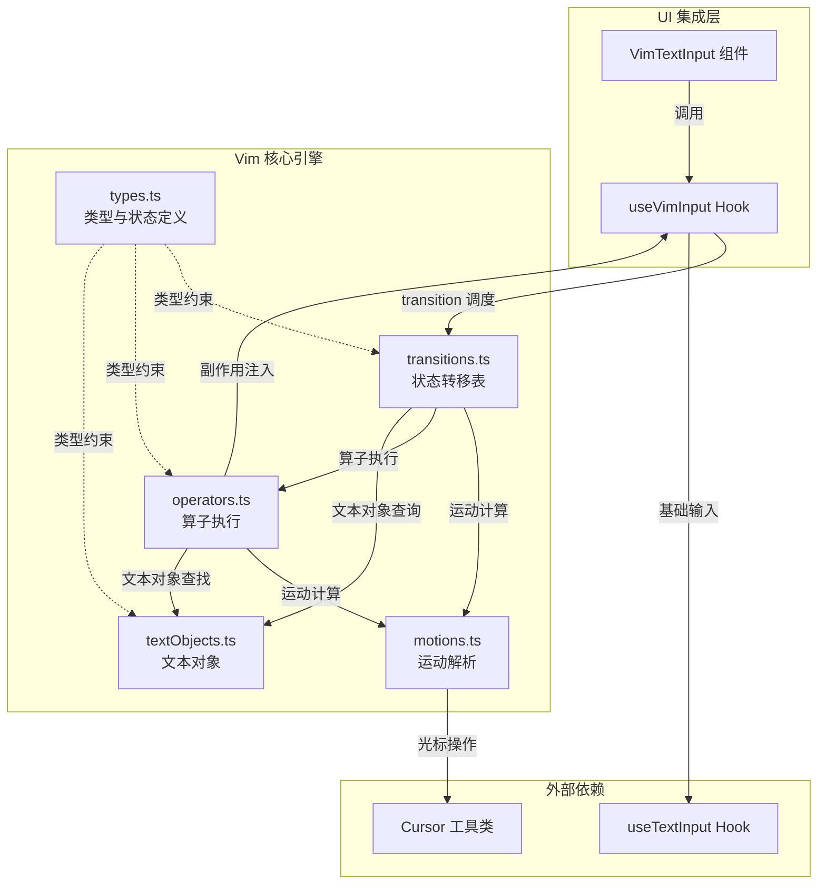

Claude Code 在终端环境中实现了一套完整的 Vim 模态编辑系统，让习惯 Vim 操作的开发者可以在提示输入框中以 INSERT/NORMAL 双模式进行高效文本编辑。该系统并非一个简陋的快捷键映射层，而是一个**基于有限状态机的规范 Vim 命令解析器**——从 operator-motion 组合、text object 选中、计数前缀到 dot-repeat 重放，均以类型安全的纯函数架构实现。本文将逐层剖析其状态机模型、运动解析、算子执行、文本对象、集成管道与切换命令的完整设计。

Sources: [types.ts](src/vim/types.ts#L1-L200), [motions.ts](src/vim/motions.ts#L1-L83), [operators.ts](src/vim/operators.ts#L1-L557), [textObjects.ts](src/vim/textObjects.ts#L1-L187), [transitions.ts](src/vim/transitions.ts#L1-L491)

## 整体架构：五模块纯函数协作

Vim 系统由五个核心模块组成，各自职责边界清晰，通过 `OperatorContext` 接口进行副作用注入，实现**计算逻辑与 UI 状态的彻底分离**。

**数据流方向**：用户按键 → `VimTextInput` → `useVimInput.handleVimInput` → `transition()` 状态转移 → 调用 `motions` / `operators` / `textObjects` 纯函数 → 通过 `OperatorContext` 回调修改 React 状态 → UI 重渲染。所有计算逻辑（运动解析、范围计算、文本对象查找）均为纯函数，副作用（修改文本、切换偏移、切换模式）全部收敛在 `OperatorContext` 的回调中。

Sources: [VimTextInput.tsx](src/components/VimTextInput.tsx#L1-L140), [useVimInput.ts](src/hooks/useVimInput.ts#L1-L317), [types.ts](src/vim/types.ts#L1-L200)

## 状态机模型：类型即文档的命令解析

### 双模式顶层状态

Vim 系统的顶层状态 `VimState` 是一个标签联合类型，区分 INSERT 和 NORMAL 两大模式。INSERT 模式跟踪 `insertedText`（用于 dot-repeat 记录），NORMAL 模式内嵌 `CommandState` 命令状态机。初始状态为 INSERT 模式，匹配用户"默认即可输入"的心智模型。

Sources: [types.ts](src/vim/types.ts#L49-L51), [types.ts](src/vim/types.ts#L188-L199)

### NORMAL 模式命令状态机

`CommandState` 定义了 NORMAL 模式下的 11 种命令状态，每种状态精确声明了它在等待什么输入。TypeScript 的穷尽式 switch 保证每个状态都有对应处理，遗漏任一状态即编译报错。

| 状态类型 | 含义 | 等待的输入 | 示例键序 |
|---|---|---|---|
| `idle` | 空闲，等待新命令 | 操作符/数字/运动/特殊键 | 初始状态 |
| `count` | 正在累积数字前缀 | 更多数字或命令 | `3`, `5d` |
| `operator` | 已收到操作符，等待动作 | 运动/数字/文本对象/Find | `d`, `dw` |
| `operatorCount` | 操作符后的运动计数 | 更多数字或运动 | `d3`, `d3w` |
| `operatorFind` | 操作符+Find，等待目标字符 | 任意字符 | `df`, `dt` |
| `operatorTextObj` | 操作符+i/a，等待对象类型 | 文本对象键 | `di`, `daw` |
| `find` | 等待 Find 目标字符 | 任意字符 | `f`, `fa` |
| `g` | 等待 g 后续命令 | `g/j/k` | `g`, `gg` |
| `operatorG` | 操作符+g 后续 | `g/j/k` | `dg`, `dgg` |
| `replace` | 等待替换字符 | 任意字符 | `r`, `rx` |
| `indent` | 等待第二个缩进键 | `>` 或 `<` | `>`, `>>` |

Sources: [types.ts](src/vim/types.ts#L59-L76)

### 状态转移全景图

```mermaid
stateDiagram-v2
    [*] --> idle

    idle --> count: [1-9]
    idle --> operator: [d/c/y]
    idle --> find: [f/F/t/T]
    idle --> g: [g]
    idle --> replace: [r]
    idle --> indent: [>/<]
    idle --> idle: 简单运动 / i/a/o/A/I/O/x/J/p/P/D/C/Y/G/u/./;/

    count --> count: [0-9] 继续累积
    count --> operator: [d/c/y]
    count --> idle: 运动 / 其他命令

    operator --> idle: dd/cc/yy (行操作)
    operator --> operatorCount: [0-9]
    operator --> operatorFind: [f/F/t/T]
    operator --> operatorTextObj: [i/a]
    operator --> idle: motion 执行
    operator --> operatorG: [g]
    operator --> idle: 无效输入

    operatorCount --> operatorCount: [0-9]
    operatorCount --> idle: motion/Find/textObj

    operatorFind --> idle: 接收目标字符，执行
    operatorTextObj --> idle: 接收对象类型，执行
    find --> idle: 接收目标字符，跳转

    g --> idle: gg/gj/gk / 无效输入
    operatorG --> idle: g/j/k / 无效输入
    replace --> idle: 接收替换字符 / 取消
    indent --> idle: 第二个缩进键 / 无效输入
```

Sources: [transitions.ts](src/vim/transitions.ts#L59-L88), [types.ts](src/vim/types.ts#L8-L26)

## 运动解析：纯函数的光标位置计算

`motions.ts` 提供两个核心纯函数：`resolveMotion` 和运动类型判断。运动解析遵循 **单步迭代** 模式——`resolveMotion` 循环调用 `applySingleMotion`，若某步光标未移动则提前终止（防止如 `k` 到文件首行后的无限循环）。

| 运动键 | 行为 | 运动类型 |
|---|---|---|
| `h` / `l` | 左/右移一个字素 | 排他性字符运动 |
| `j` / `k` | 逻辑行下/上移 | 行级运动 |
| `gj` / `gk` | 显示行下/上移（软换行） | 排他性字符运动 |
| `w` / `b` / `e` | Vim 单词 前移/后移/词尾 | 排他性(`w`,`b`) / 包含性(`e`) |
| `W` / `B` / `E` | WORD（空白分隔）前移/后移/词尾 | 同上 |
| `0` / `^` / `$` | 行首/首非空白/行尾 | 包含性(`$`) / 排他性(`0`,`^`) |
| `G` | 末行首 / 指定行 | 行级运动 |

运动类型对算子执行至关重要：**包含性运动**（`e`, `E`, `$`）的操作范围会包含目标位置字符；**行级运动**（`j`, `k`, `G`, `gg`）的操作范围会扩展到整行；其余为**排他性**，操作范围不含目标位置字符。

Sources: [motions.ts](src/vim/motions.ts#L1-L83)

## 算子执行：副作用注入的操作框架

### OperatorContext 接口

算子通过 `OperatorContext` 与外部世界交互，这是一个典型的**依赖注入**模式。所有纯函数只描述"对什么范围做什么"，而修改文本、移动光标、切换模式等副作用全部通过 ctx 回调完成。

Sources: [operators.ts](src/vim/operators.ts#L26-L37)

### 核心算子函数

| 函数 | 对应命令 | 关键行为 |
|---|---|---|
| `executeOperatorMotion` | `dw`, `cw`, `yw`, `d3w` 等 | 计算运动目标 → 获取操作范围 → 执行算子 |
| `executeOperatorFind` | `dfa`, `ct.` 等 | Find 定位 → 范围计算 → 执行 + 记录 lastFind |
| `executeOperatorTextObj` | `diw`, `da"`, `ci)` 等 | 查找文本对象 → 直接执行 |
| `executeLineOp` | `dd`, `cc`, `yy`, `3dd` | 行级操作，内容存入寄存器时追加 `\n` 标记 linewise |
| `executeX` | `x`, `3x` | 按字素删除，非按 code unit |
| `executeReplace` | `r`, `3r` | 逐字素替换，光标停在替换后最后一个字符 |
| `executeToggleCase` | `~`, `3~` | 按字素切换大小写 |
| `executeJoin` | `J`, `3J` | 合并行，自动处理空格连接 |
| `executePaste` | `p` / `P` | 区分 linewise/字符式，支持计数重复 |
| `executeIndent` | `>>` / `<<` | 两空格缩进/反缩进，兼容 Tab |
| `executeOpenLine` | `o` / `O` | 开新行并进入 INSERT |

### cw 特殊规则与图片徽标保护

Vim 传统中 `cw` 不删除到下一个单词开头，而是删除到当前单词末尾——这与 `dw` 行为不同。代码中 `getOperatorRange` 明确处理了这一特例。此外，当运动目标落在 `[Image #N]` 占位符内部时，`snapOutOfImageRef` 会将范围扩展到完整占位符边界，防止部分截断导致的渲染异常。

Sources: [operators.ts](src/vim/operators.ts#L42-L166), [operators.ts](src/vim/operators.ts#L429-L522)

### 持久状态与 Dot-Repeat

`PersistentState` 跨命令存活，存储三项关键数据：`lastChange`（最近一次修改，用于 `.` 重放）、`lastFind`（最近一次 Find，用于 `;` / `,` 重复）、以及 `register` + `registerIsLinewise`（无名寄存器内容与行级标记）。`RecordedChange` 是一个标签联合类型，涵盖所有可重放的修改类型——从 `insert` 到 `operatorTextObj` 共 9 种。重放时通过 `createOperatorContext(cursor, true)` 传入 `isReplay=true`，抑制 `recordChange` 回调，避免重放覆盖原始记录。

Sources: [types.ts](src/vim/types.ts#L81-L119), [useVimInput.ts](src/hooks/useVimInput.ts#L82-L173)

## 文本对象：词、引号与括号的范围查找

`textObjects.ts` 实现了 `iw/aw/iW/aW` 及所有配对符号的文本对象查找。查找函数接收文本、偏移量、对象类型和 inner/around 标志，返回 `{ start, end }` 范围或 `null`。

**词对象**（`w/W`）使用 grapheme segmenter 进行字素安全迭代，将字符分为 word / punctuation / whitespace 三类，向两侧扩展直到类别变化。`around` 变体会将尾部或首部空白纳入范围。**引号对象**（`"`/`'`/`` ` ``）在同行内成对匹配。**括号对象**（`()`/`[]`/`{}`/`<>`）从光标位置双向扫描匹配开闭符号，支持嵌套计数。

Sources: [textObjects.ts](src/vim/textObjects.ts#L1-L187)

## 集成管道：从按键到状态变更

### useVimInput Hook

`useVimInput` 是连接 Vim 核心引擎与 React UI 的桥梁。它内部维护 `vimStateRef`（当前 VimState）和 `persistentRef`（持久状态），并通过 `useTextInput` 复用基础输入处理。

**按键路由逻辑**：

1. **Ctrl 组合键**：直接委托给基础 `textInput.onInput`，Vim 不拦截
2. **Escape + INSERT**：触发 `switchToNormalMode`，记录 `insertedText` 到 `lastChange`，光标左移一位（标准 Vim 行为）
3. **Escape + NORMAL**：取消当前待定命令，重置为 `idle`
4. **Enter**：无论模式，直接委托给基础处理器（允许 NORMAL 模式提交）
5. **INSERT 模式**：追踪 `insertedText`（正向追加，退格时移除末尾字素），委托给基础处理器
6. **NORMAL 模式 idle 态 + 方向键**：委托给基础处理器（保留历史导航）
7. **NORMAL 模式其余**：将方向键映射为 `h/j/k/l`，Delete 映射为 `x`，调用 `transition()` 获取结果

**状态更新策略**：若 `transition` 返回 `execute`，立即执行副作用；若返回 `next`，更新命令状态；若返回 `execute` 但未切换到 INSERT，自动将命令状态重置为 `idle`。

Sources: [useVimInput.ts](src/hooks/useVimInput.ts#L34-L317)

### VimTextInput 组件

`VimTextInput` 是面向调用方的 React 组件封装。它将 `useVimInput` 返回的 `VimInputState` 透传给 `BaseTextInput`，同时处理 `initialMode` 同步和终端焦点状态。组件通过 `chalk.inverse` 在终端焦点活跃时实现光标反色效果，失焦时回退为普通显示。

Sources: [VimTextInput.tsx](src/components/VimTextInput.tsx#L1-L140)

## /vim 命令：模式切换入口

用户通过 `/vim` 斜杠命令在普通编辑模式与 Vim 模式之间切换。命令实现简洁：读取全局配置中的 `editorMode` 字段，在 `'normal'` 与 `'vim'` 之间翻转，写入并返回提示文本。值得注意的是存在 `'emacs'` 值的向后兼容处理——旧版 `emacs` 模式被映射为 `'normal'`，此后只保留两种模式。每次切换触发 `tengu_editor_mode_changed` 遥测事件。

Sources: [vim.ts](src/commands/vim/vim.ts#L1-L39), [index.ts](src/commands/vim/index.ts#L1-L12)

## 支持的命令速查表

以下表格汇总当前 Vim 实现支持的所有 NORMAL 模式命令：

| 类别 | 命令 | 行为 |
|---|---|---|
| **模式切换** | `i` / `I` / `a` / `A` / `o` / `O` | 进入 INSERT（光标位置各异） |
| | `Esc` (INSERT中) | 返回 NORMAL |
| **移动** | `h` `j` `k` `l` | 左 下 上 右 |
| | `w` `b` `e` / `W` `B` `E` | 单词/WORD 前后移动 |
| | `0` `^` `$` | 行首/首非空白/行尾 |
| | `f/F/t/T` + 字符 | 行内查找 |
| | `;` `,` | 重复/反向重复查找 |
| | `gg` / `G` / `NG` | 首行/末行/第N行 |
| | `gj` `gk` | 显示行移动 |
| **操作符** | `d` + motion | 删除 |
| | `c` + motion | 修改（删除+INSERT） |
| | `y` + motion | 复制 |
| | `dd` `cc` `yy` | 行级删除/修改/复制 |
| | `D` `C` `Y` | `d$` / `c$` / 行复制快捷键 |
| | `x` | 删除光标字符 |
| **文本对象** | `di/ai` + `w/W` | 词对象 |
| | `di/ai` + `"` `'` `` ` `` | 引号对象 |
| | `di/ai` + `(`/`)`/`b` | 小括号对象 |
| | `di/ai` + `[`/`]` | 中括号对象 |
| | `di/ai` + `{`/`}`/`B` | 大括号对象 |
| | `di/ai` + `<`/`>` | 尖括号对象 |
| **编辑** | `r` + 字符 | 替换 |
| | `~` | 切换大小写 |
| | `J` | 合并行 |
| | `p` / `P` | 粘贴 |
| | `>>` / `<<` | 缩进/反缩进 |
| | `u` | 撤销 |
| | `.` | 重复上次修改 |
| **计数** | `[1-9][0-9]*` + 命令 | 重复次数前缀 |

Sources: [transitions.ts](src/vim/transitions.ts#L98-L200), [types.ts](src/vim/types.ts#L124-L182)

## 设计亮点与取舍

**类型即规范**。`CommandState` 的标签联合设计使得编译器成为文档的一部分——新增状态必须同时更新 `transition()` 的 switch 与所有 `fromXxx` 函数，否则编译不通过。这是在动态语言生态中用 TypeScript 类型系统模拟代数数据类型（ADT）穷尽匹配的经典手法。

**纯函数与副作用分离**。运动解析、文本对象查找、范围计算均为纯函数，所有状态修改通过 `OperatorContext` 回调注入。这使得核心逻辑可独立测试，且 dot-repeat 只需在重放时替换 ctx 即可。

**Grapheme 安全**。`executeX`、`executeReplace`、`executeToggleCase` 以及文本对象查找均使用 grapheme segmenter 进行迭代，确保 emoji、组合字符等多码点字素不被截断。

**取舍之处**：当前实现为无名寄存器单寄存器模型，不支持命名寄存器（`"a`/`"b`）；标记（`m`/`'`）、宏录制（`q`）、可视模式（`v`/`V`/`Ctrl-V`）均未实现——这是终端输入框场景下的合理取舍，毕竟用户在此编辑的是简短提示文本而非代码文件。

Sources: [types.ts](src/vim/types.ts#L59-L76), [operators.ts](src/vim/operators.ts#L170-L253), [textObjects.ts](src/vim/textObjects.ts#L60-L116)

---

本文聚焦于 Vim 模态编辑的内部实现。如需了解 Vim 系统运行其上的终端渲染框架，可参阅 [Ink 定制框架：终端 React 渲染器的适配与扩展](8-ink-ding-zhi-kuang-jia-zhong-duan-react-xuan-ran-qi-de-gua-pei-yu-kuo-zhan)；如需了解文本输入组件与虚拟滚动的整体设计，可参阅 [组件体系：消息渲染、虚拟滚动与交互式对话框](9-zu-jian-ti-xi-xiao-xi-xuan-ran-xu-ni-gun-dong-yu-jiao-hu-shi-dui-hua-kuang)。