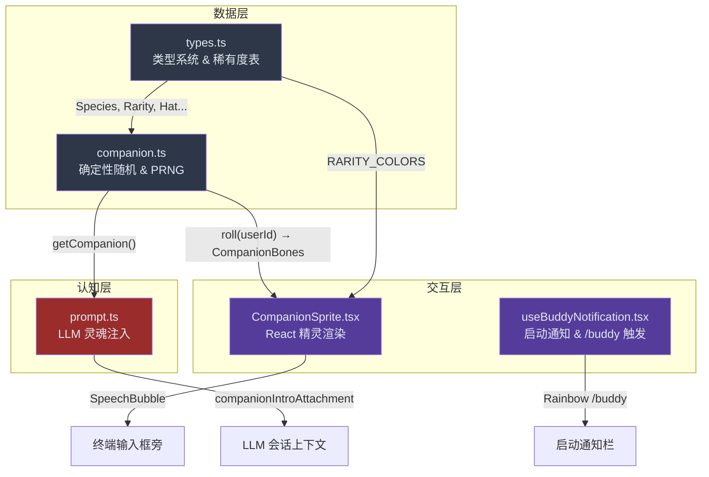
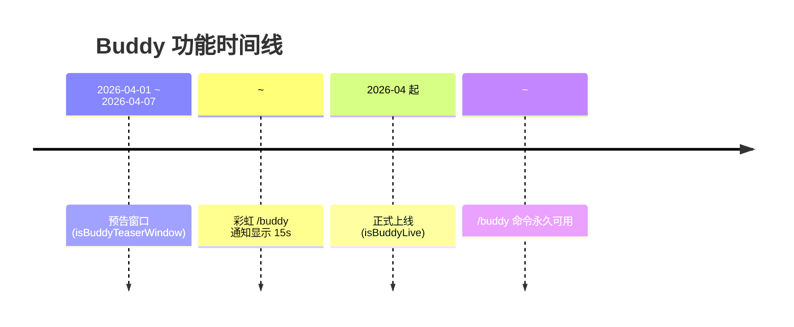

Buddy 是 Claude Code 中一个隐藏的终端电子宠物系统——用户通过 `/buddy` 命令孵化一只独一无二的 ASCII 像素伙伴，它会栖息在输入框旁，以眨眼、扭动和对话气泡的方式陪伴你的编码 session。整个系统融合了**确定性随机生成**、**稀有度抽卡**、**LLM 灵魂注入**三重机制，将终端从冰冷工具变成有温度的交互空间。

Sources: [types.ts](src/buddy/types.ts#L1-L149), [companion.ts](src/buddy/companion.ts#L1-L134), [sprites.ts](src/buddy/sprites.ts#L1-L25)

## 核心架构总览

Buddy 系统由五个紧密协作的模块构成，覆盖从数据模型到终端渲染的完整链路：



**数据层**定义了伙伴的全部基因参数（物种、稀有度、帽子、眼睛、属性值），并通过确定性 PRNG 保证同一用户永远生成同一只伙伴。**交互层**负责终端中的 React 组件渲染与动画帧调度。**认知层**则将伙伴的名字与性格注入 LLM 的系统提示，使 AI 在被用户直接呼唤伙伴名字时做出自然响应。

Sources: [types.ts](src/buddy/types.ts#L1-L149), [companion.ts](src/buddy/companion.ts#L86-L133), [CompanionSprite.tsx](src/buddy/CompanionSprite.tsx#L1-L20), [prompt.ts](src/buddy/prompt.ts#L1-L37)

## 伙伴基因：类型系统与稀有度阶梯

### 三层组合模型

Buddy 的伙伴数据由三层结构组成，每一层有不同的持久化策略：

| 层次 | 类型名 | 内容 | 持久化位置 | 生成方式 |
|------|--------|------|------------|----------|
| **骨架** | `CompanionBones` | rarity, species, eye, hat, shiny, stats | **不持久化**，每次从 userId 重新计算 | 确定性 PRNG |
| **灵魂** | `CompanionSoul` | name, personality | `globalConfig.companion` | LLM 首次生成 |
| **完整伙伴** | `Companion` | Bones + Soul + hatchedAt | 灵魂存储于 config，骨架即时算出 | 合并策略 |

骨架**绝不落盘**的设计极为精妙——这意味着物种列表重命名或稀有度权重调整不会破坏现有伙伴，用户也无法通过编辑配置文件伪造一只传说级宠物。每次读取时，`getCompanion()` 重新 `roll(userId)` 生成骨架，然后用 `{ ...stored, ...bones }` 将骨架覆盖上去，灵魂信息从存储中恢复。`StoredCompanion` 类型只包含灵魂和孵化时间，是真正写入磁盘的数据。

Sources: [types.ts](src/buddy/types.ts#L100-L124), [companion.ts](src/buddy/companion.ts#L124-L133)

### 18 种物种与反审查编码

系统定义了 18 种 ASCII 物种，但物种名称并没有直接以字符串字面量写入代码。代码注释揭示了原因——其中一种物种名与内部的 model-codename 检测黑名单冲突。构建系统会 grep 产物（而非源码）检查敏感关键字，因此运行时动态拼接字符串可以绕过这一检测：

```typescript
// 运行时构造：字面量不出现在 bundle 中
const c = String.fromCharCode
export const duck = c(0x64, 0x75, 0x63, 0x6b) as 'duck'   // "duck"
export const dragon = c(0x64, 0x72, 0x61, 0x67, 0x6f, 0x6e) as 'dragon'
export const capybara = c(0x63, 0x61, 0x70, 0x79, 0x62, 0x61, 0x72, 0x61) as 'capybara'
```

全部 18 种物种如下：

| 物种 | 关键词 | 视觉特征 |
|------|--------|----------|
| duck | 🦆 鸭子 | `<(O )___` 嘴部标志 |
| goose | 🪿 鹅 | `(O)>` 长颈 |
| blob | 🟡 团子 | 圆形弹性体，呼吸动画 |
| cat | 🐱 猫 | `/\_/\` 经典猫耳 |
| dragon | 🐉 龙 | `/^\  /^\` 双角 + 喷火帧 |
| octopus | 🐙 章鱼 | `/\/\/\/\` 触手交替 |
| owl | 🦉 猫头鹰 | `((O)(O))` 大眼 |
| penguin | 🐧 企鹅 | 圆胖体型 |
| turtle | 🐢 乌龟 | 带壳 |
| snail | 🐌 蜗牛 | 触角 + 壳 |
| ghost | 👻 幽灵 | 半透明飘动 |
| axolotl | 🦎 蝾螈 | 鳃须 |
| capybara | 🐹 水豚 | 佛系体型 |
| cactus | 🌵 仙人掌 | 刺座 |
| robot | 🤖 机器人 | 方形头 |
| rabbit | 🐰 兔子 | 长耳 |
| mushroom | 🍄 蘑菇 | 菌盖 |
| chonk | 🐷 胖墩 | 圆润体型 |

Sources: [types.ts](src/buddy/types.ts#L10-L73)

### 五阶稀有度与加权抽取

稀有度系统采用加权随机抽取，权重分布呈现陡峭的长尾分布：

| 稀有度 | 星级 | 权重 | 概率（约） | 属性值下限 | 主题色 |
|--------|------|------|------------|------------|--------|
| common | ★ | 60 | 60% | 5 | inactive（灰色） |
| uncommon | ★★ | 25 | 25% | 15 | success（绿色） |
| rare | ★★★ | 10 | 10% | 25 | permission（黄色） |
| epic | ★★★★ | 4 | 4% | 35 | autoAccept（蓝色） |
| legendary | ★★★★★ | 1 | 1% | 50 | warning（红色） |

`rollRarity()` 函数实现了一个简单的**轮盘赌算法**：总权重为 100，生成 `[0, 100)` 的随机数，依次减去各稀有度权重，首次降至负值时即命中。稀有度直接影响属性值底限——传说级伙伴的每项属性至少 50，而普通级仅为 5，这使得稀有伙伴在属性面板上有压倒性的数值优势。

Sources: [types.ts](src/buddy/types.ts#L126-L148), [companion.ts](src/buddy/companion.ts#L43-L59)

### 属性系统：峰值、低谷与散布

5 项属性（DEBUGGING、PATIENCE、CHAOS、WISDOM、SNARK）并非独立随机——`rollStats()` 采用了**峰值-低谷机制**：随机指定一项为峰值属性（底限 + 50 + 额外 0~30），另一项为低谷属性（底限 - 10 + 额外 0~15，最低为 1），其余属性在底限基础上浮动 0~40。这种设计保证了每只伙伴都有鲜明的强项与弱项，增强了角色的辨识度。

Sources: [companion.ts](src/buddy/companion.ts#L62-L82)

## 确定性生成：Mulberry32 PRNG

### 种子链与防篡改

伙伴的生成链路是严格确定性的：`userId + SALT → hashString → mulberry32 → rollFrom → CompanionBones`。其中盐值 `SALT = 'friend-2026-401'` 确保即使用户 ID 被其他系统用作种子，Buddy 的输出也不会与之碰撞。

```mermaid
flowchart LR
    A["userId"] --> B["+ SALT"]
    B --> C["hashString()"]
    C --> D["mulberry32()"]
    D --> E["rollRarity()")
    D --> F["pick(SPECIES)"]
    D --> G["pick(EYES)"]
    D --> H["rollStats()"]
    D --> I["shiny: rng() < 0.01"]
    E & F & G & H & I --> J["CompanionBones"]
```

`hashString()` 使用 FNV-1a 哈希算法（在 Bun 运行时则切换为 `Bun.hash()`），将字符串转为 32 位整数种子。Mulberry32 是一个极简但品质足够好的 32 位 PRNG——它不追求密码学安全，只需要在伙伴生成的规模下（18 物种 × 6 眼睛 × 8 帽子 × 5 稀有度 × 属性组合）提供足够的均匀性和不可预测性，让不同用户获得不同伙伴。

**关键设计细节**：普通级伙伴**永远不戴帽子**（`hat: rarity === 'common' ? 'none' : pick(rng, HATS)`），这是唯一的稀有度门控。闪光（shiny）概率固定为 1%，与稀有度独立——你可以拥有一只闪光普通鸭子，但绝不会是闪光传说龙（因为传说本身只有 1% 概率）。

Sources: [companion.ts](src/buddy/companion.ts#L16-L37), [companion.ts](src/buddy/companion.ts#L84-L117)

### 缓存机制

`roll()` 函数被三个热路径频繁调用：500ms 精灵 tick、每次按键的 PromptInput、每轮对话的 observer。由于同一 userId 的结果恒定不变，函数内维护了一个单条缓存 `rollCache`，以 `userId + SALT` 为 key 直接返回，避免重复计算。

Sources: [companion.ts](src/buddy/companion.ts#L104-L113)

## 精灵渲染：ASCII 动画引擎

### 多帧动画与闲置序列

每种物种拥有 **3 帧** ASCII 精灵，尺寸统一为 **5 行 × 12 列**（`{E}` 替换为单字符眼睛后）。三帧的动画语义为：

- **帧 0**：静止姿态（idle rest）
- **帧 1**：轻微扭动（fidget），如鸭子尾巴 `~` 出现、blob 呼吸膨胀
- **帧 2**：显著动作，如龙喷火 `~` ~ ~ `、猫眨眼、章鱼吐泡泡

动画并非按 1→2→3 循环播放，而是由一个精心设计的**闲置序列**驱动：`[0, 0, 0, 0, 1, 0, 0, 0, -1, 0, 0, 2, 0, 0, 0]`。序列索引中 `-1` 代表"在帧 0 上眨眼"。这个 15 步序列模拟了真实宠物的行为节奏——长时间静止（4 帧）→ 短暂扭动 → 回到静止 → 眨眼 → 再次静止 → 较大动作 → 静止，以 500ms tick 间隔播放，一个完整周期约 7.5 秒。

Sources: [sprites.ts](src/buddy/sprites.ts#L23-L26), [CompanionSprite.tsx](src/buddy/CompanionSprite.tsx#L21-L23)

### 眼睛替换与帽子层

精灵模板中的 `{E}` 占位符在渲染时替换为伙伴的眼睛字符。6 种眼睛风格赋予了同一物种截然不同的气质：

| 眼睛 | 字符 | 风格 |
|------|------|------|
| · | 圆点 | 安静、天真 |
| ✦ | 星形 | 神秘、闪亮 |
| × | 叉号 | 呆滞、懵逼 |
| ◉ | 靶心 | 警觉、专注 |
| @ | 螺旋 | 诡异、疯狂 |
| ° | 圆圈 | 慵懒、睡意 |

帽子系统是精灵的独立图层——第一行（索引 0）是帽子槽位，帧 0-1 必须留空，只有帧 2 允许使用帽子行。8 种帽子从无到尖，分别赋予了贵族、魔法、可爱等不同人格暗示：none、crown（皇冠）、tophat（高礼帽）、propeller（螺旋桨）、halo（光环）、wizard（巫师帽）、beanie（绒线帽）、tinyduck（迷你鸭）。

Sources: [types.ts](src/buddy/types.ts#L76-L89), [sprites.ts](src/buddy/sprites.ts#L23-L26)

### CompanionSprite 组件架构

`CompanionSprite` 是 Buddy 系统的视觉核心，一个 Ink React 组件，渲染在终端输入框旁。其架构要点如下：

**对话气泡**：`SpeechBubble` 子组件以 30 字符宽度自动换行，边框颜色取自稀有度主题色。气泡有 20 tick（~10s）的展示时长，最后 6 tick（~3s）进入消退状态——边框变为 inactive 色，文字变暗，提示用户气泡即将消失。气泡尾部方向（`right` 或 `down`）根据终端是否处于全屏模式动态切换。

**宠物互动**：当用户执行 `/buddy pet` 时，`petAt` 时间戳触发 5 帧心形上升动画（`PET_HEARTS`），持续约 2.5s（`PET_BURST_MS = 2500`）。心形（`figures.heart`）从精灵上方飘出，逐渐扩散并化为圆点消散。

**终端宽度响应**：`MIN_COLS_FOR_FULL_SPRITE = 100` 列是完整精灵显示的阈值。低于此宽度时，`companionReservedColumns()` 返回 0，REPL 将伙伴切换为单行模式（堆叠在独立行上，不占输入框宽度）。全屏模式下气泡浮于滚动区上方，非全屏模式则内联占用额外 36 列（BUBBLE_WIDTH）。

Sources: [CompanionSprite.tsx](src/buddy/CompanionSprite.tsx#L16-L175)

## LLM 灵魂注入

### 伙伴认知协议

Buddy 的最终魅力在于：它不只是一个像素装饰，而是被 LLM "认可" 的对话参与者。`prompt.ts` 中的 `companionIntroText()` 生成一段系统提示注入，告诉 LLM 伙伴的存在和行为准则：

> *A small ${species} named ${name} sits beside the user's input box and occasionally comments in a speech bubble. You're not ${name} — it's a separate watcher.*

这段提示的关键约束是：当用户直接用伙伴名字呼叫时，LLM 应退居幕后，**用一行或更少回应**，不解释自己不是伙伴，不替伙伴说话。这创造了一个精妙的双重人格——伙伴的视觉人格由 ASCII 精灵承载，语言人格由 LLM 通过对话气泡间接表达，而 Claude 自身保持克制。

Sources: [prompt.ts](src/buddy/prompt.ts#L7-L13)

### 附件注入机制

`getCompanionIntroAttachment()` 将伙伴介绍作为 `companion_intro` 类型的附件注入消息流。它有三个前置条件：

1. **Feature Gate**：`feature('BUDDY')` 必须为 true（编译时开关）
2. **伙伴存在**：`getCompanion()` 返回有效伙伴且未静音（`companionMuted`）
3. **去重**：遍历已有消息，若发现同名的 `companion_intro` 附件则跳过，避免每个 turn 重复注入

这个附件只在伙伴首次出现时注入一次，后续对话中 LLM 会记住伙伴的存在，但不会在上下文中反复消费 token。

Sources: [prompt.ts](src/buddy/prompt.ts#L15-L36)

## 启动时序与通知系统

### 愚人节彩蛋窗口

`useBuddyNotification.tsx` 实现了一个精心设计的时间门控启动通知：



预告窗口仅限 2026 年 4 月 1-7 日（本地时间，非 UTC——这让全球不同时区用户形成 24 小时滚动传播波）。在此期间，尚未孵化伙伴的用户会看到彩虹色的 `/buddy` 通知，持续 15 秒后自动消失。`RainbowText` 组件为每个字符赋予不同的彩虹色（通过 `getRainbowColor(i)` 实现），形成流光效果。

4 月之后，`isBuddyLive()` 返回 true，`/buddy` 命令永久可用，但启动彩蛋通知不再显示。内部用户（`"external" === 'ant'`）始终处于上线状态，不受时间限制。

Sources: [useBuddyNotification.tsx](src/buddy/useBuddyNotification.tsx#L9-L21), [useBuddyNotification.tsx](src/buddy/useBuddyNotification.tsx#L43-L78)

### /buddy 触发位置检测

`findBuddyTriggerPositions()` 是一个工具函数，扫描文本中所有 `/buddy` 的匹配位置（使用 `\b` 词边界），返回起止索引数组。这用于在输入框中为 `/buddy` 文本添加特殊高亮或响应式交互。

Sources: [useBuddyNotification.tsx](src/buddy/useBuddyNotification.tsx#L79-L97)

## Feature Gate 与用户 ID 解析

Buddy 系统受 `feature('BUDDY')` 编译时门控保护——如果该 feature 未启用，所有入口函数（`companionReservedColumns`、`getCompanionIntroAttachment`、`useBuddyNotification`）都会提前返回零值/空值，伙伴不会出现在终端中。这是[三层门控体系](16-san-ceng-men-kong-ti-xi-bian-yi-kai-guan-yong-hu-lei-xing-yu-yuan-cheng-feature-flag)中编译开关层的典型应用。

`companionUserId()` 确定伙伴的主人身份，优先取 OAuth 账户 UUID，其次取本地 userID，兜底为 `'anon'`。这意味着同一 OAuth 账户在不同设备上会获得同一只伙伴，而匿名用户始终得到基于 `'anon'` 种子的固定伙伴。

Sources: [companion.ts](src/buddy/companion.ts#L119-L122), [prompt.ts](src/buddy/prompt.ts#L18), [CompanionSprite.tsx](src/buddy/CompanionSprite.tsx#L168-L169)

## 扩展阅读

| 主题 | 说明 | 链接 |
|------|------|------|
| 三层门控体系 | Buddy 的编译开关 (BUDDY) 属于编译层门控 | [三层门控体系](16-san-ceng-men-kong-ti-xi-bian-yi-kai-guan-yong-hu-lei-xing-yu-yuan-cheng-feature-flag) |
| 隐藏命令 | `/buddy` 属于隐藏命令系统的一部分 | [隐藏命令与秘密 CLI 参数全览](17-yin-cang-ming-ling-yu-mi-mi-cli-can-shu-quan-lan) |
| Ink 渲染框架 | CompanionSprite 的终端渲染基础 | [Ink 定制框架](8-ink-ding-zhi-kuang-jia-zhong-duan-react-xuan-ran-qi-de-gua-pei-yu-kuo-zhan) |
| 状态管理 | companionReaction 等状态的应用状态存储 | [状态管理](7-zhuang-tai-guan-li-react-zhuang-tai-shu-ying-yong-zhuang-tai-cun-chu-yu-xuan-ze-qi-mo-shi) |
| Kairos 记忆系统 | Buddy 的人格可被视为另一种跨会话持久性 | [Kairos](12-kairos-kua-hui-hua-chi-jiu-zhu-shou-yu-zi-dong-ji-yi-zheng-he) |