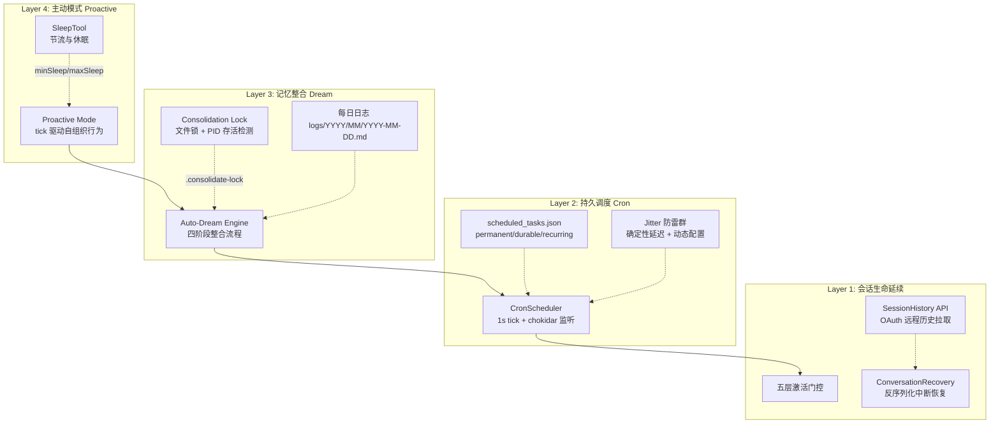
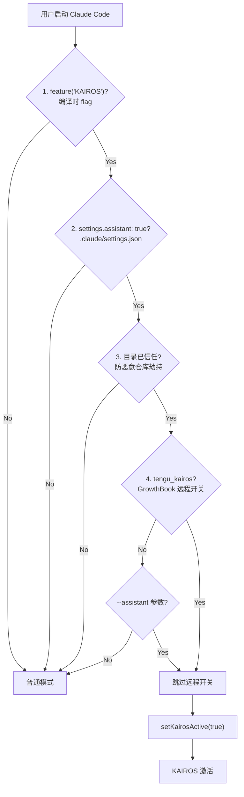
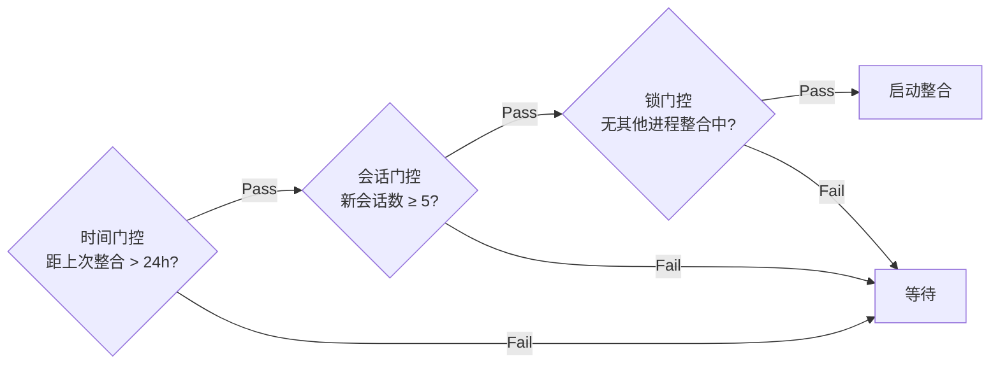

Kairos 是 Claude Code 中架构最精巧的隐藏功能——它将 CLI 工具从一个"请求-响应"式对话终端，转变为一个**永不关机的持久 AI 助手**。关闭终端后 Claude 仍在后台运行；每天自动写日志；夜间自动"做梦"整合记忆；没人说话时自己找活干。这一系统的核心挑战在于：**如何让一个无状态的 LLM 会话获得时间连续性**。Kairos 通过会话恢复、Cron 持久任务、记忆整合子代理和主动模式四根支柱给出了回答。本文将从激活门控开始，逐层深入各子系统的实现细节。Sources: [02-kairos.md](docs/02-kairos.md#L1-L31)

## 架构总览：从一次性对话到持久助手

Kairos 的核心架构可以用四层模型来理解——每一层解决一个"持久性"维度的缺失：



| 层级 | 解决问题 | 核心机制 | 关键文件 |
|------|----------|----------|----------|
| **Layer 1** | 会话如何不随终端关闭而终止 | 五层门控 + 会话恢复 + 远程历史 | `src/bootstrap/state.ts`, `src/assistant/sessionHistory.ts` |
| **Layer 2** | 没有用户在线时谁触发行为 | Cron 调度器 + permanent 任务 + Jitter 防雷群 | `src/utils/cronScheduler.ts`, `src/utils/cronJitterConfig.ts` |
| **Layer 3** | 分散会话的知识如何沉淀 | Auto-Dream 四阶段整合 + 文件锁 | `src/services/autoDream/autoDream.ts` |
| **Layer 4** | 空闲时如何自主推进 | tick 驱动 + SleepTool 节流 | `src/proactive/index.ts`, `src/tools/SleepTool` |

Sources: [02-kairos.md](docs/02-kairos.md#L1-L31)

## 激活门控：五层安全检查链

Kairos 的激活不是简单的开关——它通过五层递进检查，从编译时 flag 到运行时远程开关，逐层确认授权。这种设计体现了 Claude Code 的**三层门控体系**（编译开关、用户类型过滤、远程 Feature Flag）在单个功能上的完整实践。



五层检查的职责划分：

| 层级 | 检查项 | 来源 | 绕过条件 |
|------|--------|------|----------|
| 1 | `feature('KAIROS')` | 编译时 flag，源码中硬编码 | 不可绕过，需重新构建 |
| 2 | `settings.assistant: true` | 用户本地配置文件 | 显式启用 |
| 3 | 目录信任状态 | 信任链检查 | 防止恶意仓库劫持助手权限 |
| 4 | `tengu_kairos` | GrowthBook 远程实验开关 | `--assistant` CLI 参数 |
| 5 | `setKairosActive(true)` | 全局状态写入 | 前四层全通过 |

**关键设计决策**：`--assistant` 参数可跳过第 4 层远程开关——这是为 Agent SDK daemon 模式保留的后门。当 Claude Code 作为后台服务被其他系统以 daemon 方式启动时，不应受 GrowthBook 远程实验开关控制。而全局状态存储在 `src/bootstrap/state.ts` 中，通过 `getKairosActive()` / `setKairosActive()` 两个访问器管理，默认值为 `false`，确保未激活时零开销。Sources: [02-kairos.md](docs/02-kairos.md#L33-L52), [state.ts](src/bootstrap/state.ts)

## 会话生命延续：从断点恢复到远程历史

### 会话恢复：识别中断的 Turn

普通模式下，终端关闭意味着会话死亡。Kairos 的会话恢复机制让 Claude 能从"断点"继续，关键在于**识别哪些 turn 是正常完成的，哪些是被中断的**。

`src/utils/conversationRecovery.ts` 使用 `feature('KAIROS')` 条件导入 `BriefTool` 和 `SendUserFileTool`——这两个工具只在 Kairos 模式下可用。在反序列化会话时，系统检查工具结果是否属于这些"终端工具"：如果一个 turn 的结果是终端工具的结果，说明 turn 正常完成；否则，该 turn 可能被中断，需要恢复。Sources: [02-kairos.md](docs/02-kairos.md#L54-L61)

### 远程会话历史 API

本地会话数据可能因进程崩溃而丢失。`src/assistant/sessionHistory.ts` 通过 OAuth API 从服务端拉取远程会话历史，使用 `v1/sessions/{sessionId}/events` 端点，支持分页拉取。这构成了一个**本地-远程双源恢复机制**：优先使用本地数据，缺失时从服务端补全。Sources: [02-kairos.md](docs/02-kairos.md#L63-L66)

### 持久 Cron 任务：permanent 标记

Kairos 的三个核心 Cron 任务标记为 `permanent: true`，不受普通任务 7 天自动过期限制：

| 任务 | 职责 | 触发逻辑 |
|------|------|----------|
| `catch-up` | 恢复中断的工作 | 进程启动时检测未完成 turn |
| `morning-checkin` | 每日早间签到 | 每日定时触发 |
| `dream` | 记忆整合 | 时间 + 会话双重门控 |

这些任务的配置存储在 `.claude/scheduled_tasks.json` 中，由 Cron 调度器持续监视。Sources: [02-kairos.md](docs/02-kairos.md#L54-L66)

## 做梦机制（Dream）：记忆整合的四阶段引擎

**Dream** 是 Kairos 最精巧的子系统。它是一个后台运行的子代理，将分散在多个会话中的碎片化记忆，整合为持久的结构化知识。这个设计隐喻了人类睡眠中的记忆巩固过程——白天碎片化的经历在睡眠中被重组为长期记忆。

### 三层门控：由廉到贵

Dream 的触发受三层门控保护，每一层消耗的资源递增，确保整合不会在不必要时启动：



| 门控层 | 检查项 | 成本 | 配置来源 |
|--------|--------|------|----------|
| 1. 时间 | `minHours`（默认 24h） | 零开销，纯时间比较 | GrowthBook `tengu_onyx_plover` |
| 2. 会话 | `minSessions`（默认 5） | 需扫描会话列表 | GrowthBook `tengu_onyx_plover` |
| 3. 锁 | `.consolidate-lock` 文件 | 文件 I/O | 本地文件系统 |

阈值通过 GrowthBook 的 `tengu_onyx_plover` 远程配置**动态控制**——运维可以无需发版就调整整合频率，应对服务端负载变化。Sources: [02-kairos.md](docs/02-kairos.md#L68-L79)

### 四阶段整合流程

整合不是简单的"读取 → 写入"，而是一个精心设计的四阶段认知流程，定义在 `src/services/autoDream/consolidationPrompt.ts` 中：

```mermaid
flowchart TB
    O["🌏 Orient<br/>定向：了解已有知识全貌"] --> G["🔍 Gather<br/>收集：搜罗新信号"]
    G --> C["🧩 Consolidate<br/>整合：合并新信号到主题文件"]
    C --> P["✂️ Prune<br/>修剪：更新索引、控制大小"]
    
    subgraph "Orient 阶段"
        O1["列出记忆目录"]
        O2["读取 MEMORY.md 索引"]
        O3["浏览已有主题文件"]
    end
    
    subgraph "Gather 阶段"
        G1["每日日志"]
        G2["已有记忆"]
        G3["JSONL transcript"]
    end
    
    subgraph "Consolidate 阶段"
        C1["合并新信号到主题文件"]
        C2["相对日期 → 绝对日期"]
        C3["删除过时事实"]
    end
    
    subgraph "Prune 阶段"
        P1["更新 MEMORY.md 索引"]
        P2["行数限制检查"]
        P3["大小限制检查"]
    end
    
    O --- O1 & O2 & O3
    G --- G1 & G2 & G3
    C --- C1 & C2 & C3
    P --- P1 & P2 & P3
```



**Orient（定向）** 是最关键的认知步骤：LLM 必须先了解已有知识的全貌——哪些主题已经覆盖、哪些记忆已经存在——才能决定新信息如何归并。这避免了"遗忘式整合"——即整合过程中意外丢失已有知识。

**Consolidate（整合）** 中的"相对日期转绝对日期"是一个精妙的细节：会话中的日期常以"昨天"、"上周三"等相对形式记录。如果不转换为绝对日期，随时间推移这些引用会变得无法解读。整合时将所有相对日期锚定为绝对时间戳，确保记忆的长期可读性。

**Prune（修剪）** 确保记忆不会无限膨胀。MEMORY.md 索引有行数和大小双重限制，超出时需要裁剪低优先级条目。这一步维持了记忆系统的**可持续增长**。Sources: [02-kairos.md](docs/02-kairos.md#L81-L96)

### 整合锁：防竞争的文件锁机制

当多个 Claude Code 实例在同一台机器上运行时（例如用户在多个终端窗口中使用 Kairos），需要防止多个实例同时执行记忆整合。`src/services/autoDream/consolidationLock.ts` 实现了一个基于文件的互斥锁：

| 锁属性 | 实现 | 防御场景 |
|--------|------|----------|
| 锁文件路径 | `.consolidate-lock` | 标准文件锁 |
| 锁持有者 PID | 文件内容 | 崩溃检测 |
| 最后整合时间 | 文件 mtime | `lastConsolidatedAt` |
| 超时机制 | 1 小时 | 持有者崩溃后自动释放 |
| 防竞争 | double-write + re-read 验证 | 写入竞争丢失 |

**double-write 后 re-read 验证**是关键的防竞争手段：写入 PID 后，立即读回文件内容，确认写入的确实是自己的 PID。如果读回的是其他 PID，说明发生了写入竞争，当前进程放弃锁。这种乐观锁策略比 flock 更适合跨进程场景，且在 NFS 等分布式文件系统上更可靠。Sources: [02-kairos.md](docs/02-kairos.md#L98-L109)

### 每日日志与 UI 呈现

每日日志路径由 `src/memdir/paths.ts` 的 `getAutoMemDailyLogPath()` 计算，格式为 `<autoMemPath>/logs/YYYY/MM/YYYY-MM-DD.md`——按年月分目录，便于长期归档和按时间检索。Sources: [02-kairos.md](docs/02-kairos.md#L111-L118)

Dream 的 UI 呈现相对节制：Footer 区域显示 **"dreaming"** pill 标签，提示用户整合正在进行。`src/components/tasks/` 中提供了专门的详情对话框（DreamDetailDialog），支持查看实时进度和手动中止。用户可通过 `Shift+Down` 快捷键打开后台任务对话框，这是 Kairos 设计哲学的体现——**后台运行不打扰，但可随时查看和控制**。Sources: [02-kairos.md](docs/02-kairos.md#L111-L118)

## 主动模式（Proactive Mode）：无人值守时的自主行为

如果说 Dream 解决的是"记忆如何持久化"，Proactive Mode 解决的是**"没人说话时 Claude 该干什么"**。它让 Claude 从被动应答者变为主动探索者。

### 状态机：三维度控制

`src/proactive/index.ts` 维护三个维度的状态，每个维度解决不同的问题：

| 状态 | 类型 | 解决的问题 | 触发条件 |
|------|------|------------|----------|
| `active` | boolean | 是否启用主动行为 | `--proactive` 参数 / `CLAUDE_CODE_PROACTIVE` 环境变量 |
| `paused` | boolean | 用户中断后的冷却 | 用户按 Esc 取消时设为 true，下次用户输入时恢复 false |
| `contextBlocked` | boolean | API 错误时的熔断 | API 返回错误时阻塞 tick，防止 tick-error-tick 死循环 |

`paused` 的设计尤为巧妙：它不是永久的关闭，而是"暂缓"——用户按 Esc 表示"现在别打扰我"，但下次用户输入时自动恢复，表示"我回来了，你可以继续"。这种"软中断"模式比硬开关更符合人机交互直觉。

`contextBlocked` 是系统自保护机制：如果 API 调用失败，继续 tick 只会产生更多失败请求。设置此标志后 tick 被阻塞，直到错误条件解除。这防止了**tick-error-tick 死循环**——一种可能在无人值守时持续消耗 API 配额的灾难性场景。Sources: [02-kairos.md](docs/02-kairos.md#L120-L140)

### 系统提示与 Tick 机制

激活 Proactive Mode 后，系统提示追加以下指令：

```
# Proactive Mode

You are in proactive mode. Take initiative -- explore, act, and make progress
without waiting for instructions.

Start by briefly greeting the user.

You will receive periodic <tick> prompts. These are check-ins. Do whatever
seems most useful, or call Sleep if there's nothing to do.
```

关键设计点：**SleepTool 是 Proactive Mode 的节流阀**。设置中的 `minSleepDurationMs` 和 `maxSleepDurationMs` 控制 Sleep 的持续时间范围。当 Claude 判断没有值得做的事时，调用 Sleep 等待下一个 tick——而不是空转消耗 token。这实现了**自适应节流**：有事时高频工作，无事时低频等待。Sources: [02-kairos.md](docs/02-kairos.md#L142-L156)

### 激活路径与 Feature Gate

Proactive Mode 的激活受 `feature('PROACTIVE') || feature('KAIROS')` 保护——它既可以作为独立功能启用，也可以作为 Kairos 的子功能自动启用。这种"或"逻辑让功能门控更具弹性：Kairos 开启时 Proactive 自动获得，但 Proactive 也可以在不启用完整 Kairos 的情况下独立使用。Sources: [02-kairos.md](docs/02-kairos.md#L142-L156)

## 后台任务管理：Cron 调度与防雷群机制

### Cron 调度器：1 秒精度的后台心跳

`src/utils/cronScheduler.ts` 是 Kairos 后台行为的时基——每 1 秒 tick 一次（`CHECK_INTERVAL_MS = 1000`），检查是否有任务到期。它使用 chokidar 监视 `.claude/scheduled_tasks.json`，支持热更新：修改配置文件后无需重启，调度器自动感知变化。Sources: [02-kairos.md](docs/02-kairos.md#L160-L165)

多实例并行时，`src/utils/cronTasksLock.ts` 提供调度器级锁，防止多个 Claude Code 进程重复触发同一任务。锁探测间隔 5 秒，如果持有者崩溃，其他实例自动接管。Sources: [02-kairos.md](docs/02-kairos.md#L160-L165)

### 四类任务的语义区分

| 任务类型 | `recurring` | `permanent` | `durable` | 生命周期 |
|----------|-------------|-------------|-----------|----------|
| 一次性 | `false` | — | — | 触发后自动删除，支持错过检测 |
| 循环 | `true` | `false` | `true` | 触发后重新调度，7 天过期 |
| 永久 | `true` | `true` | `true` | 不受过期限制（KAIROS 专用） |
| 会话级 | — | — | `false` | 仅内存中，进程退出即消失 |

**`durable`** 标志区分"写入文件持久化"与"仅存于内存"。会话级任务（如临时监控）不需要持久化，进程退出自然清除；而 Kairos 的 permanent 任务必须持久化——即使进程崩溃重启，任务配置仍然存在。Sources: [02-kairos.md](docs/02-kairos.md#L167-L178)

### Jitter 防雷群：避免全局同步风暴

当百万级客户端在同一个 Cron 表达式上触发时，会在服务端产生**雷群效应（thundering herd）**。`src/utils/cronJitterConfig.ts` 通过引入确定性延迟来打散请求：

| 任务类型 | Jitter 策略 | 计算 |
|----------|-------------|------|
| 循环任务 | 基于 taskId 的确定性延迟 | interval × 10%，上限 15 分钟 |
| 一次性任务 | 在 :00 和 :30 施加提前量 | 最多 90 秒提前 |

**确定性**是关键设计：Jitter 基于 taskId 哈希计算，同一个任务在不同客户端上获得不同的、但确定的延迟。这意味着同一客户端每次触发的延迟相同（避免重复计算），而不同客户端的延迟各不相同（打散请求）。

更精妙的是，Jitter 配置可以通过 GrowthBook **动态推送**：运维在事故期间可以增大 Jitter 幅度，60 秒内全客户端生效——这是 [三层门控体系](16-san-ceng-men-kong-ti-xi-bian-yi-kai-guan-yong-hu-lei-xing-yu-yuan-cheng-feature-flag) 中远程 Feature Flag 的实战应用。Sources: [02-kairos.md](docs/02-kairos.md#L180-L191)

## 记忆文件系统：memdir 的路径与扫描

Kairos 的记忆持久化依赖 `src/memdir/` 模块，它定义了记忆文件的存储路径和扫描策略：

| 文件 | 职责 |
|------|------|
| `memdir.ts` | 记忆目录的根路径解析 |
| `paths.ts` | 各类记忆文件的路径计算（含每日日志路径） |
| `memoryTypes.ts` | 记忆的数据类型定义 |
| `memoryScan.ts` | 记忆目录的扫描与索引 |
| `findRelevantMemories.ts` | 基于相关性检索记忆 |
| `memoryAge.ts` | 记忆时效性评估 |
| `memoryShapeTelemetry.ts` | 记忆形态遥测（用于优化整合策略） |
| `teamMemPaths.ts` | 团队记忆路径计算 |
| `teamMemPrompts.ts` | 团队记忆提示词生成 |

记忆系统的完整架构（包括个人记忆与团队记忆的分工）在 [记忆系统：个人记忆、团队记忆与跨项目知识持久化](20-ji-yi-xi-tong-ge-ren-ji-yi-tuan-dui-ji-yi-yu-kua-xiang-mu-zhi-shi-chi-jiu-hua) 中详述；Kairos 的 Dream 机制是记忆系统的**写入端**，而 memdir 是其**存储端**。Sources: [02-kairos.md](docs/02-kairos.md#L193-L205)

## 关键源码文件速查

| 文件 | 层级 | 职责 |
|------|------|------|
| `src/bootstrap/state.ts` | Layer 1 | KAIROS 全局状态 `kairosActive` |
| `src/assistant/index.ts` | Layer 1 | 助手模式入口，五层门控执行点 |
| `src/assistant/sessionHistory.ts` | Layer 1 | 远程会话历史 API（OAuth 分页拉取） |
| `src/assistant/sessionDiscovery.ts` | Layer 1 | 会话发现与匹配 |
| `src/utils/conversationRecovery.ts` | Layer 1 | 会话恢复，识别中断的 turn |
| `src/utils/cronScheduler.ts` | Layer 2 | 1 秒精度 Cron 调度器 |
| `src/utils/cronJitterConfig.ts` | Layer 2 | Jitter 防雷群策略 |
| `src/utils/cronTasksLock.ts` | Layer 2 | 调度器级多实例锁 |
| `src/services/autoDream/autoDream.ts` | Layer 3 | Auto-Dream 引擎，三层触发门控 |
| `src/services/autoDream/consolidationPrompt.ts` | Layer 3 | 四阶段整合提示（Orient→Gather→Consolidate→Prune） |
| `src/services/autoDream/consolidationLock.ts` | Layer 3 | 整合锁（文件锁 + PID 存活 + double-write 验证） |
| `src/proactive/index.ts` | Layer 4 | 主动模式三维度状态机 |
| `src/memdir/paths.ts` | Storage | 记忆文件路径计算 |
| `src/memdir/memoryScan.ts` | Storage | 记忆目录扫描与索引 |

Sources: [02-kairos.md](docs/02-kairos.md#L193-L205)

## 延伸阅读

- **[Buddy：终端 AI 电子宠物系统](11-buddy-zhong-duan-ai-dian-zi-chong-wu-xi-tong)**：Kairos 与 Buddy 共享 `src/assistant/` 目录，Buddy 的 companion 精灵可作为 Kairos 持久运行的视觉指示器
- **[三层门控体系](16-san-ceng-men-kong-ti-xi-bian-yi-kai-guan-yong-hu-lei-xing-yu-yuan-cheng-feature-flag)**：Kairos 是三层门控的典型案例——`feature('KAIROS')` 对应编译开关，`tengu_kairos` 对应远程 Feature Flag，`--assistant` 参数绕过展示了门控的弹性设计
- **[记忆系统](20-ji-yi-xi-tong-ge-ren-ji-yi-tuan-dui-ji-yi-yu-kua-xiang-mu-zhi-shi-chi-jiu-hua)**：Dream 是记忆系统的写入端，memdir 是存储端，两者共同构成完整的知识持久化链路
- **[Bridge：远程遥控终端](15-bridge-yuan-cheng-yao-kong-zhong-duan-de-websocket-shuang-xiang-tong-dao)**：Bridge 的 WebSocket 双向通道让远程客户端可以与 Kairos 的持久会话交互，形成"远程持久助手"的组合能力