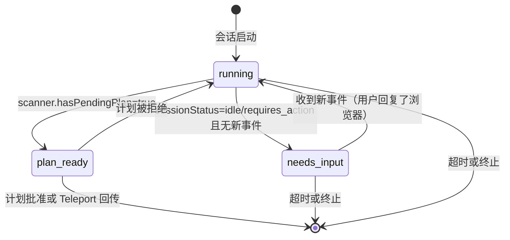

Ultraplan 是 Claude Code 中一项将本地终端会话"投射"至云端（Claude Code on the Web，简称 CCR）、由最强大模型（Opus）执行深度规划再传回本地的能力。它不是一个独立的规划引擎，而是一套 **"Teleport 出 → 云端思考 → 用户审批 → Teleport 回"** 的完整异步管线。本文将从架构层面拆解 Ultraplan 的启动流程、CCR 事件轮询状态机、Teleport 双向传输机制，以及两条执行路径（远程执行 vs 本地 Teleport 回传）的分歧逻辑。

Sources: [ultraplan.tsx](src/commands/ultraplan.tsx#L1-L471), [ccrSession.ts](src/utils/ultraplan/ccrSession.ts#L1-L350), [teleport.tsx](src/utils/teleport.tsx#L1-L500)

## 整体架构：从 /ultraplan 到批准计划

Ultraplan 的生命周期围绕三个核心模块展开——**命令入口**（`/ultraplan`）、**Teleport 传输层**、**CCR 轮询状态机**。下方 Mermaid 图展示了从用户触发到最终结果回传的完整数据流。

```mermaid
sequenceDiagram
    participant User as 用户终端
    participant Cmd as /ultraplan 命令
    participant TP as Teleport 传输层
    participant CCR as Claude Code on the Web
    participant Poll as ExitPlanModeScanner

    User->>Cmd: /ultraplan &lt;prompt&gt;
    Cmd->>Cmd: 检查资格 & 防重入
    Cmd->>TP: teleportToRemote(prompt, model=Opus, permissionMode=plan)
    TP->>CCR: 创建远程会话 + Git Bundle
    CCR-->>TP: sessionId + URL
    TP-->>Cmd: Session 对象
    Cmd->>User: 显示监控 URL（药丸状态）
    Cmd->>Poll: startDetachedPoll(sessionId, 30min)

    loop 每 3 秒轮询
        Poll->>CCR: pollRemoteSessionEvents(cursor)
        CCR-->>Poll: SDKMessage[] + sessionStatus
        Poll->>Poll: scanner.ingest(events) → ScanResult
        Poll->>Poll: 推断 UltraplanPhase
        Poll-->>User: 药丸状态更新 (running/needs_input/plan_ready)
    end

    alt 用户在浏览器批准 (approved)
        Poll-->>Cmd: {executionTarget: 'remote'}
        Cmd->>User: 通知远程执行中
    else 用户点击 Teleport 回传
        Poll-->>Cmd: {executionTarget: 'local'}
        Cmd->>User: 显示 UltraplanChoiceDialog
    else 超时或终止
        Poll-->>Cmd: UltraplanPollError
        Cmd->>CCR: archiveRemoteSession
        Cmd->>User: 失败通知
    end
```

Sources: [ultraplan.tsx](src/commands/ultraplan.tsx#L74-L181), [ccrSession.ts](src/utils/ultraplan/ccrSession.ts#L198-L306)

## 命令入口与防重入机制

`/ultraplan` 命令注册为 `local-jsx` 类型的斜杠命令，**仅对 `ant` 用户类型可见**（`isEnabled: () => "external" === 'ant'`）。这意味着外部构建产物中该命令被编译时移除，而非运行时隐藏。

Sources: [ultraplan.tsx](src/commands/ultraplan.tsx#L461-L470)

### 启动流程的两次防重入

启动流程中存在**两级防重入守卫**：第一级在 `call()` 入口同步检查 `ultraplanSessionUrl` 和 `ultraplanLaunching`；第二级在 `launchUltraplan()` 中再次检查并立即设置 `ultraplanLaunching = true`，然后才启动异步脱离流（`launchDetached`）。这种双层守卫确保了在 `teleportToRemote` 数秒的往返延迟内，用户无法重复触发。

Sources: [ultraplan.tsx](src/commands/ultraplan.tsx#L234-L293), [ultraplan.tsx](src/commands/ultraplan.tsx#L431-L443)

### 预启动对话框模式

当用户输入 `/ultraplan <prompt>` 时，命令并不直接启动远程会话，而是将 `ultraplanLaunchPending: { blurb }` 写入 AppState，由 REPL 层在终端底部（`focusedInputDialog` 区域，类似权限对话框的位置）挂载预启动对话框。这种设计避免了将交互式 UI 元素渲染到消息滚动区域（transcript area），保持了终端的干净布局。

Sources: [ultraplan.tsx](src/commands/ultraplan.tsx#L445-L459)

## Teleport 传输层：在本地与云端之间搬运会话

Teleport 是 Ultraplan 的物理基础设施——它负责将会话上下文打包传输至 CCR，以及将远程成果拉回本地。核心函数 `teleportToRemote()` 接受一组参数来配置远程会话的创建：

| 参数 | 类型 | Ultraplan 场景值 | 说明 |
|------|------|-----------------|------|
| `initialMessage` | string | `buildUltraplanPrompt()` 组装的提示词 | 远程会话的首条用户消息 |
| `description` | string | 用户原始 blurb | 会话标题描述 |
| `model` | string | `tengu_ultraplan_model` 特性标志值，默认 Opus 4.6 | 远程使用的模型（使用第一方 API ID，非 Bedrock/Vertex 的 ARN） |
| `permissionMode` | `'plan'` | `plan` | CCR 以规划模式运行，工具权限受限 |
| `ultraplan` | boolean | `true` | 标记为 Ultraplan 会话 |
| `useDefaultEnvironment` | boolean | `true` | 使用默认云端环境 |
| `onBundleFail` | callback | 记录失败消息 | Git bundle 创建失败的回调 |

Sources: [ultraplan.tsx](src/commands/ultraplan.tsx#L328-L341)

### 模型选择的第一方 ID 转换

一个值得注意的细节：`getUltraplanModel()` 返回的是 **第一方 API 的规范模型 ID**（如 `claude-opus-4-6`），而非本地 CLI 可能使用的 Bedrock ARN 或 Vertex ID。这是因为 CCR 直接调用 Anthropic 第一方 API，`getModelStrings()` 在本地 CLI 上可能返回的是 provider-specific 的标识符，在远程环境中无法解析。模型 ID 在调用时（而非模块加载时）从 GrowthBook 缓存读取，以响应 `/config` 和 Feature Gate 的动态变更。

Sources: [ultraplan.tsx](src/commands/ultraplan.tsx#L32-L34)

### Git 状态验证与 Bundle 传输

在 Teleport 出发前，`validateGitState()` 检查工作目录是否干净（忽略未跟踪文件），`createAndUploadGitBundle()` 将当前仓库状态打包上传至 CCR。远程会话收到 Git Bundle 后在其容器中还原代码环境，实现本地与云端的工作树一致性。若 Bundle 创建失败，`onBundleFail` 捕获错误消息并呈现给用户。

Sources: [teleport.tsx](src/utils/teleport.tsx#L172-L181)

### 标题与分支的自动生成

Teleport 在创建远程会话时，会通过 `queryHaiku()` 调用 Haiku 模型生成会话标题和 Git 分支名。提示词要求标题不超过 6 词、分支名以 `claude/` 前缀开头、使用短横线分隔的小写格式。解析失败时回退至截断描述 + `claude/task` 默认值。

Sources: [teleport.tsx](src/utils/teleport.tsx#L76-L166)

## CCR 事件轮询：ExitPlanModeScanner 状态机

远程会话启动后，本地终端通过 `startDetachedPoll()` 进入长时间轮询循环。轮询的核心逻辑由 `ExitPlanModeScanner` 类驱动——这是一个**纯状态分类器**，不包含任何 I/O 或定时器，仅接受 SDK 事件批次并返回当前 ExitPlanMode 的裁决结果。

Sources: [ccrSession.ts](src/utils/ultraplan/ccrSession.ts#L80-L181)

### ScanResult 分类体系

Scanner 对每批事件的裁决结果为以下六种之一：

| ScanResult 类型 | 含义 | 触发条件 |
|----------------|------|---------|
| `approved` | 计划被批准 | ExitPlanMode tool_result 存在且 `is_error !== true` |
| `teleport` | 用户选择回传本地 | tool_result 为错误且包含 `ULTRAPLAN_TELEPORT_SENTINEL` |
| `rejected` | 计划被拒绝 | tool_result 为错误且不含 teleport 标记 |
| `pending` | 等待用户操作 | ExitPlanMode tool_use 存在但无对应的 tool_result |
| `terminated` | 远程会话终止 | 收到非 success 的 result subtype |
| `unchanged` | 无新状态 | 无新事件且非拒绝后重扫 |

**优先级**：`approved/teleport` > `terminated` > `rejected` > `pending` > `unchanged`。这一优先级至关重要——同一批次可能同时包含批准的 tool_result 和后续的 result 错误（用户批准后远程崩溃），但批准的计划已写入 threadstore，不应被丢弃。

Sources: [ccrSession.ts](src/utils/ultraplan/ccrSession.ts#L50-L180)

### UltraplanPhase 状态转换

Scanner 的裁决被进一步映射为用户可见的**药丸状态**（UltraplanPhase），转换逻辑如下：



关键设计考量：CCR 在工具轮次之间会短暂翻转为 `idle` 状态。为避免状态闪烁（running → needs_input → running 的快速跳变），仅当 **同时满足** `sessionStatus` 为 idle/requires_action **且** `newEvents.length === 0` 时才进入 `needs_input`。反之，如果事件仍在流入，即使 sessionStatus 暂时为 idle，状态仍保持 `running`。

Sources: [ccrSession.ts](src/utils/ultraplan/ccrSession.ts#L58-L66), [ccrSession.ts](src/utils/ultraplan/ccrSession.ts#L274-L295)

### 轮询容错策略

轮询循环每 3 秒调用一次 `pollRemoteSessionEvents()`，该函数不做内建重试。30 分钟的超时窗口大约产生 600 次调用——任何非零的 5xx 错误率都可能导致单次瞬断杀死整个轮询。因此实现了 **连续 5 次失败容忍**机制：仅当连续失败次数达到 `MAX_CONSECUTIVE_FAILURES = 5` 时才抛出 `UltraplanPollError('network_or_unknown')`，否则静默等待下一轮。

Sources: [ccrSession.ts](src/utils/ultraplan/ccrSession.ts#L21-L24), [ccrSession.ts](src/utils/ultraplan/ccrSession.ts#L229-L241)

## 两条执行路径的分歧：远程执行 vs 本地 Teleport

当 `pollForApprovedExitPlanMode()` 成功返回时，`executionTarget` 决定了后续行为的根本分歧：

Sources: [ultraplan.tsx](src/commands/ultraplan.tsx#L100-L138), [ccrSession.ts](src/utils/ultraplan/ccrSession.ts#L183-L188)

### 路径一：远程执行（executionTarget = 'remote'）

用户在浏览器 PlanModal 中选择"在 CCR 中执行"。远程会话已经进入编码阶段，**跳过归档**（archive 调用没有 running 检查，会杀掉正在执行的会话）和选择对话框。本地任务状态直接设为 `completed`，清除 `ultraplanSessionUrl`，并通过通知告知用户跟踪 URL。最终结果以 Pull Request 形式落地。

Sources: [ultraplan.tsx](src/commands/ultraplan.tsx#L100-L120)

### 路径二：本地 Teleport 回传（executionTarget = 'local'）

用户在浏览器中点击"Teleport 回传终端"按钮。这个按钮在反馈中嵌入了 `ULTRAPLAN_TELEPORT_SENTINEL` 标记字符串，Scanner 检测到此标记后从 tool_result 内容中提取计划文本。本地设置 `ultraplanPendingChoice` 状态，REPL 挂载 `UltraplanChoiceDialog`，用户确认后：
1. 归档远程会话（`archiveRemoteSession`）
2. 清除 `ultraplanSessionUrl`
3. 将批准的计划注入本地查询上下文继续执行

Sources: [ultraplan.tsx](src/commands/ultraplan.tsx#L121-L138), [ccrSession.ts](src/utils/ultraplan/ccrSession.ts#L318-L329)

### Sentinel 标记的设计巧思

Teleport 回传的 Sentinel 机制体现了 Ultraplan 的核心约束：**浏览器 PlanModal 的"拒绝"按钮是唯一能将计划文本带出远程会话的信道**。正常批准（`is_error !== true`）只返回 "## Approved Plan:" 标记后的文本，不携带原始计划到本地执行；而 Teleport 回传通过在 `is_error = true` 的 tool_result 中嵌入 `__ULTRAPLAN_TELEPORT_LOCAL__` 标记，使远程会话保持在 plan mode（因为"拒绝"不会退出规划），同时将计划文本走私回本地。

Sources: [ccrSession.ts](src/utils/ultraplan/ccrSession.ts#L48-L49), [ccrSession.ts](src/utils/ultraplan/ccrSession.ts#L321-L329), [ccrSession.ts](src/utils/ultraplan/ccrSession.ts#L331-L349)

## 错误处理与会话清理

Ultraplan 的错误路径需要特别注意**孤儿会话**问题。`teleportToRemote()` 成功后若后续步骤抛出异常，远程会话将在无人轮询的情况下持续运行至 30 分钟超时。因此 `launchDetached()` 在 catch 块中主动调用 `archiveRemoteSession()` 归档已确认的会话。同理，`stopUltraplan()` 通过 `RemoteAgentTask.kill()`（内含 archive 调用）和 `ultraplanSessionUrl` / `ultraplanPendingChoice` / `ultraplanLaunching` 的三重清除来确保状态一致性。

Sources: [ultraplan.tsx](src/commands/ultraplan.tsx#L203-L223), [ultraplan.tsx](src/commands/ultraplan.tsx#L383-L410)

### 超时分类

超时错误被细分为两种：

| 错误原因 | 含义 | 触发条件 |
|---------|------|---------|
| `timeout_pending` | 曾见 pending 但未获批准 | `scanner.everSeenPending === true`，说明容器启动成功但用户未完成审批 |
| `timeout_no_plan` | ExitPlanMode 从未被调用 | `scanner.everSeenPending === false`，说明远程容器可能启动失败或 session ID 不匹配 |

Sources: [ccrSession.ts](src/utils/ultraplan/ccrSession.ts#L298-L305)

## Teleport 回传：完整的会话还原流程

Teleport 不仅仅是 Ultraplan 的传输管道，它也是 `/teleport` 命令（`--teleport` CLI 标志）的底层实现，负责完整的会话还原：

1. **仓库验证**：`validateSessionRepository()` 比对本地仓库与远程会话的 `git_repository` source，支持跨 GHE 实例检测（比较 host 时剥离端口号以避免误判）
2. **分支检出**：`checkOutTeleportedSessionBranch()` 经历三级回退——本地检出 → 从 origin 创建跟踪分支 → 直接跟踪远程分支
3. **消息处理**：`processMessagesForTeleportResume()` 反序列化消息、追加 Teleport 恢复的系统通知和用户消息，使模型感知到上下文已跨机器迁移

Sources: [teleport.tsx](src/utils/teleport.tsx#L301-L344), [teleport.tsx](src/utils/teleport.tsx#L367-L399)

### Teleport UI 组件支持

Teleport 在终端中有配套的 React 组件体系支撑用户交互：

| 组件 | 职责 |
|------|------|
| `TeleportProgress` | 渲染传输进度（validating → fetching_logs → fetching_branch → checking_out → done） |
| `TeleportError` | 分类展示错误（network、git_not_clean、branch_checkout 等） |
| `TeleportRepoMismatchDialog` | 处理本地仓库与远程会话仓库不匹配的交互式选择 |
| `TeleportResumeWrapper` | Teleport 恢复会话的顶层包装组件 |
| `TeleportStash` | 处理本地未提交变更的 stash/unstash 流程 |

Sources: [TeleportError.tsx](src/components/TeleportError.tsx), [TeleportProgress.tsx](src/components/TeleportProgress.tsx), [TeleportRepoMismatchDialog.tsx](src/components/TeleportRepoMismatchDialog.tsx), [TeleportResumeWrapper.tsx](src/components/TeleportResumeWrapper.tsx), [TeleportStash.tsx](src/components/TeleportStash.tsx)

## 提示词工程与关键词自触发回避

Ultraplan 的远程提示词包裹在 `<system-reminder>` 标签中，原因是 CCR 浏览器端会剥离系统通知标签以隐藏脚手架内容，但模型仍能看到完整文本。更关键的是，提示词中**刻意避免使用 "ultraplan" 这个词**——因为远程 CCR CLI 在 headless 模式下会进行关键词检测，如果提示词中包含裸露的 "ultraplan"，它会自我触发另一轮 `/ultraplan` 调用，形成递归循环。

Sources: [ultraplan.tsx](src/commands/ultraplan.tsx#L36-L48)

## 资格预检与 Feature Gate

Ultraplan 的启用受多层门控约束。除了命令层面的 `isEnabled` 编译时门控（仅 `ant` 构建），运行时还有 `checkRemoteAgentEligibility()` 检查远程代理资格条件。资格不足时，`formatPreconditionError()` 将错误格式化后通知用户，而非静默失败。事件 `tengu_ultraplan_create_failed` 以 `precondition` 原因记录，并附带具体错误类型列表。

Sources: [ultraplan.tsx](src/commands/ultraplan.tsx#L314-L327)

## 远程代理任务注册

Ultraplan 使用 `registerRemoteAgentTask()` 在本地任务系统中注册远程代理任务，传入 `remoteTaskType: 'ultraplan'` 和 `isUltraplan: true` 标志。这使任务药丸（pill）能展示 Ultraplan 特有的状态指示器——包括运行阶段（running/needs_input/plan_ready）和远程会话 URL。任务 ID 同时也作为 `stopUltraplan()` 的入口，允许用户通过药丸中止正在进行的 Ultraplan 会话。

Sources: [ultraplan.tsx](src/commands/ultraplan.tsx#L366-L382)

## 架构小结

Ultraplan 的设计体现了 CLI 工具与云服务交互的一套成熟模式：**分离关注点**（Scanner 不含 I/O，Poll 不含状态分类）、**防御性编程**（双层防重入、孤儿会话归档、连续失败容忍）、**信令走私**（通过 rejection 信道回传 Teleport 计划）。其与 Teleport 的关系是"消费者-基础设施"——Ultraplan 利用 Teleport 的双向传输能力，在其上构建了规划-审批-执行的异步工作流。

若要继续深入了解 Ultraplan 所依赖的远程代理任务框架，可参阅 [Coordinator：多 Agent 编排与 Worker 并行执行](14-coordinator-duo-agent-bian-pai-yu-worker-bing-xing-zhi-xing)；若要了解 Teleport 底层的 WebSocket 双向通信机制，可参阅 [Bridge：远程遥控终端的 WebSocket 双向通道](15-bridge-yuan-cheng-yao-kong-zhong-duan-de-websocket-shuang-xiang-tong-dao)；若要了解 Ultraplan 命令的 Feature Gate 门控层级，可参阅 [三层门控体系：编译开关、用户类型与远程 Feature Flag](16-san-ceng-men-kong-ti-xi-bian-yi-kai-guan-yong-hu-lei-xing-yu-yuan-cheng-feature-flag)。