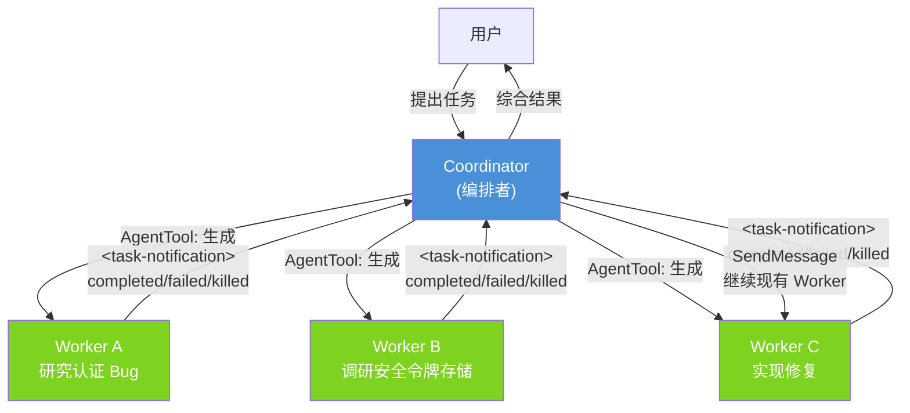
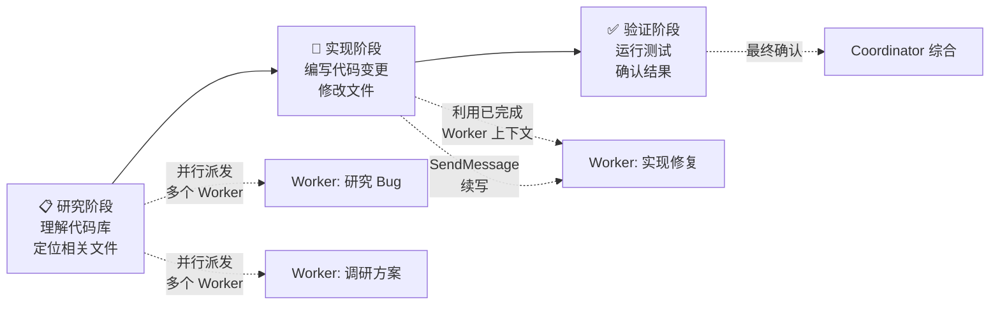

Coordinator 模式是 Claude Code 中实现多 Agent 协作的核心机制。当启用该模式时，Claude Code 的角色从单一执行者转变为**编排者（Coordinator）**——本身不再直接操作文件或终端，而是通过生成半自治 Worker Agent 来并行执行任务，自身专注于任务拆解、结果综合与用户沟通。这一架构使得复杂软件工程任务能够在多个并行管道中同时推进，显著缩短端到端完成时间。

Sources: [coordinatorMode.ts](src/coordinator/coordinatorMode.ts#L1-L109)

## 架构总览

Coordinator 模式的核心是**控制与执行的分离**：Coordinator 持有对话上下文和用户意图，Worker 持有工具和执行能力。两者通过 `AgentTool`（启动工作单元）和 `<task-notification>` XML 消息（结果回传）形成异步交互闭环。



在这个架构中，Coordinator 的每一条消息都是面向用户的；Worker 的结果以 `<task-notification>` 形式作为用户角色消息注入，但 Coordinator 被指示不将其当作对话伙伴，而是将其视为内部信号并进行总结。

Sources: [coordinatorMode.ts](src/coordinator/coordinatorMode.ts#L111-L200)

## 启用机制：三层门控

Coordinator 模式通过三层门控协同控制：

| 层级 | 机制 | 代码位置 | 说明 |
|------|------|----------|------|
| **编译开关** | `feature('COORDINATOR_MODE')` | `coordinatorMode.ts#L37` | 由 `bun:bundle` 提供的编译期特性开关，未开启时直接返回 `false` |
| **环境变量** | `CLAUDE_CODE_COORDINATOR_MODE` | `coordinatorMode.ts#L38` | 编译开关开启后，还需设置此环境变量为 `1` 才真正激活 |
| **会话恢复** | `matchSessionMode()` | `coordinatorMode.ts#L49-L78` | 恢复会话时自动校准模式，若会话存储的模式与当前环境变量不一致，动态翻转环境变量 |

关键实现细节：`isCoordinatorMode()` 每次调用都实时读取环境变量，不做缓存，这使得 `matchSessionMode()` 可以通过直接修改 `process.env` 来校准模式，无需额外的状态管理机制。

Sources: [coordinatorMode.ts](src/coordinator/coordinatorMode.ts#L36-L78)

## Coordinator 的工具集与角色定义

启用 Coordinator 模式后，系统提示完整定义了编排者的角色边界。Coordinator 不直接操作 Bash、文件系统等工具，而是通过以下三个核心工具实施编排：

| 工具 | 用途 | 关键约束 |
|------|------|----------|
| **`AgentTool`** | 生成新 Worker | 不设 `model` 参数（Worker 需默认模型执行实质性任务）；不用于"检查另一个 Worker"或执行低级读命令；启动后简短告知用户即可结束当前轮次 |
| **`SendMessageTool`** | 继续现有 Worker 的对话 | 利用已加载的上下文，`to` 字段使用 `<task-notification>` 中的 `task-id` |
| **`TaskStopTool`** | 停止运行中的 Worker | 用于终止不再需要的 Worker |

另有辅助工具：`subscribe_pr_activity` / `unsubscribe_pr_activity`（订阅 GitHub PR 事件）。

`INTERNAL_WORKER_TOOLS` 集合标记了四类仅限内部使用的工具——`TeamCreate`、`TeamDelete`、`SendMessage`、`SyntheticOutput`——在向 Coordinator 报告可用工具列表时被过滤掉，避免 Coordinator 误将内部协调工具当作可委派的能力告知用户。

Sources: [coordinatorMode.ts](src/coordinator/coordinatorMode.ts#L29-L34), [coordinatorMode.ts](src/coordinator/coordinatorMode.ts#L111-L200)

## Worker Agent：执行单元

Worker 是 Coordinator 通过 `AgentTool` 生成的半自治执行单元，类型为 `worker`（定义在 [workerAgent.ts](src/coordinator/workerAgent.ts#L1-L2)）。Worker 拥有独立的工具集和上下文，以异步方式执行任务，完成后通过 `<task-notification>` 通知 Coordinator。

### Worker 工具集：标准模式 vs 简化模式

Worker 可用的工具集取决于 `CLAUDE_CODE_SIMPLE` 环境变量：

| 模式 | 触发条件 | Worker 可用工具 |
|------|----------|----------------|
| **标准模式** | `CLAUDE_CODE_SIMPLE` 未设置 | `ASYNC_AGENT_ALLOWED_TOOLS` 中所有工具（排除内部工具），含 MCP 工具和项目技能（Skill tool） |
| **简化模式** | `CLAUDE_CODE_SIMPLE=true` | 仅 `Bash`、`Read`、`Edit` 三项核心工具 |

标准模式下，Coordinator 的系统提示明确指出："Delegate skill invocations (e.g. /commit, /verify) to workers"，这意味着斜杠命令和技能也是可委派的执行能力。

Sources: [coordinatorMode.ts](src/coordinator/coordinatorMode.ts#L80-L109), [coordinatorMode.ts](src/coordinator/coordinatorMode.ts#L111-L116)

### Worker 结果回传格式

Worker 执行完毕后，结果以 `<task-notification>` XML 格式注入 Coordinator 的后续轮次：

```xml
<task-notification>
  <task-id>{agentId}</task-id>
  <status>completed|failed|killed</status>
  <summary>{人类可读的状态摘要}</summary>
  <result>{Worker 最终文本响应}</result>       <!-- 可选 -->
  <usage>
    <total_tokens>N</total_tokens>
    <tool_uses>N</tool_uses>                    <!-- 可选 -->
    <duration_ms>N</duration_ms>                <!-- 可选 -->
  </usage>
</task-notification>
```

三态状态模型——`completed`（成功完成）、`failed`（执行失败）、`killed`（被停止）——覆盖了 Worker 生命周期的所有终态。其中 `task-id` 是续写 Worker 的关键标识，Coordinator 通过 `SendMessage` 工具的 `to` 字段引用此 ID 来继续 Worker 的对话，复用其已加载的上下文。

Sources: [coordinatorMode.ts](src/coordinator/coordinatorMode.ts#L142-L165)

## Scratchpad：跨 Worker 持久化知识区

当 `tengu_scratch` 特性门控（通过 `checkStatsigFeatureGate_CACHED_MAY_BE_STALE` 检查）开启时，Coordinator 的用户上下文会注入一个 **Scratchpad 目录**路径：

```
Scratchpad directory: {scratchpadDir}
Workers can read and write here without permission prompts.
Use this for durable cross-worker knowledge — structure files however fits the work.
```

Scratchpad 解决了多 Worker 并行执行中的核心难题——**跨 Worker 信息共享**。不同于通过 Coordinator 中转的即时消息，Scratchpad 提供持久化的文件级知识存储，Worker 可以自主读写而无需权限提示。值得注意的是 `isScratchpadGateEnabled()` 被刻意复制在此文件中而非从 `utils/permissions/filesystem.ts` 导入，原因注释明确指出：导入 filesystem 会产生**循环依赖**（filesystem → permissions → ... → coordinatorMode），因此采用了依赖注入方式——由 `QueryEngine.ts`（位于依赖图更高层）传入 `scratchpadDir` 参数。

Sources: [coordinatorMode.ts](src/coordinator/coordinatorMode.ts#L19-L27), [coordinatorMode.ts](src/coordinator/coordinatorMode.ts#L104-L108)

## 任务工作流：从拆解到综合

Coordinator 的系统提示定义了典型任务工作流的阶段分解，体现了一种**研究→实现→验证**的三阶段范式：



关键的编排策略包括：

- **并行启动**：多个独立研究任务同时派发给不同 Worker，Coordinator 简短告知用户后立即结束当前轮次，不虚构或预测 Worker 结果
- **上下文复用**：完成的 Worker 通过 `SendMessage` 继续复用，避免重新加载上下文的开销——"Continue workers whose work is complete via SendMessage to take advantage of their loaded context"
- **直接回答**：Coordinator 可以不使用工具直接回答用户问题——"Answer questions directly when possible — don't delegate work that you can handle without tools"，避免不必要的编排开销

Sources: [coordinatorMode.ts](src/coordinator/coordinatorMode.ts#L120-L141)

## 会话模式校准与恢复

`matchSessionMode()` 函数处理了一个微妙的状态一致性问题：用户可能在一个 Coordinator 模式会话中暂停，然后在未设置 `CLAUDE_CODE_COORDINATOR_MODE` 的终端中恢复（或反之）。该函数通过比较会话存储的 `sessionMode`（`'coordinator' | 'normal' | undefined`）与当前环境变量，动态翻转 `process.env.CLAUDE_CODE_COORDINATOR_MODE`：

| 场景 | 会话模式 | 环境变量 | 操作 | 返回 |
|------|----------|----------|------|------|
| 一致 | `coordinator` | `1` | 无 | `undefined` |
| 一致 | `normal` | 未设置 | 无 | `undefined` |
| 不一致 | `coordinator` | 未设置 | 设置 `env=1` | `"Entered coordinator mode..."` |
| 不一致 | `normal` | `1` | 删除 `env` | `"Exited coordinator mode..."` |
| 旧会话 | `undefined` | 任意 | 无 | `undefined` |

每次模式切换都会触发 `tengu_coordinator_mode_switched` 遥测事件，用于追踪模式迁移频率。旧会话（`sessionMode` 为 `undefined`）不做任何操作，保持了向后兼容。

Sources: [coordinatorMode.ts](src/coordinator/coordinatorMode.ts#L43-L78)

## 与相关系统的关联

Coordinator 模式并非孤立的特性，它与 Claude Code 中多个子系统深度交织：

| 关联系统 | 关系 | 交互方式 |
|----------|------|----------|
| **AgentTool** | Worker 的生成入口 | Coordinator 通过此工具实例化 Worker，指定 `subagent_type: "worker"` |
| **SendMessageTool** | Worker 的续写通道 | 使用 `<task-notification>` 中的 `task-id` 作为 `to` 参数 |
| **ASYNC_AGENT_ALLOWED_TOOLS** | Worker 工具白名单 | 定义 Worker 可用的完整工具集，Coordinator 上下文将此列表透传给用户 |
| **Feature Gate 体系** | 三层门控的编译层和远程层 | `feature('COORDINATOR_MODE')` 为编译开关，`tengu_scratch` 为远程 Feature Flag |
| **QueryEngine** | 依赖注入上层 | 注入 `scratchpadDir`，避免 coordinatorMode 的循环依赖 |
| **CoordinatorAgentStatus 组件** | UI 层状态展示 | 在终端界面中显示 Coordinator / Worker 的实时状态 |

这套架构体现了一个核心设计原则——**编排层与执行层严格分离**，同时通过依赖注入和特性门控保持了模块间的低耦合。Coordinator 不需要知道 Worker 如何执行，Worker 也不需要知道自己在被谁编排；两者通过 XML 格式的异步消息协议完成信息交换，实现了真正的关注点分离。

Sources: [coordinatorMode.ts](src/coordinator/coordinatorMode.ts#L1-L17), [workerAgent.ts](src/coordinator/workerAgent.ts#L1-L2), [CoordinatorAgentStatus.tsx](src/components/CoordinatorAgentStatus.tsx#L1)

## 延伸阅读

- [工具系统：50+ 内置工具的注册、调度与权限管控](5-gong-ju-xi-tong-50-nei-zhi-gong-ju-de-zhu-ce-diao-du-yu-quan-xian-guan-kong) — 深入了解 `AgentTool`、`SendMessageTool` 等工具的注册与调度机制
- [三层门控体系：编译开关、用户类型与远程 Feature Flag](16-san-ceng-men-kong-ti-xi-bian-yi-kai-guan-yong-hu-lei-xing-yu-yuan-cheng-feature-flag) — 理解 `feature('COORDINATOR_MODE')` 和 `tengu_scratch` 门控的完整技术栈
- [整体架构：CLI 入口、查询引擎与会话生命周期](4-zheng-ti-jia-gou-cli-ru-kou-cha-xun-yin-qing-yu-hui-hua-sheng-ming-zhou-qi) — 了解 QueryEngine 如何作为依赖注入的上层为 Coordinator 提供 scratchpad 路径
- [状态管理：React 状态树、应用状态存储与选择器模式](7-zhuang-tai-guan-li-react-zhuang-tai-shu-ying-yong-zhuang-tai-cun-chu-yu-xuan-ze-qi-mo-shi) — 探索 `CoordinatorAgentStatus` 组件如何接入全局状态树