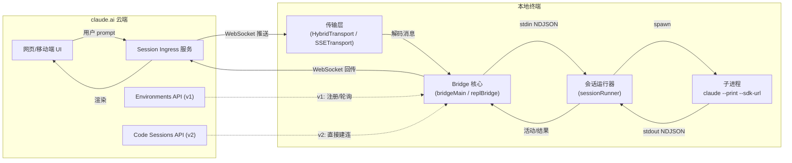
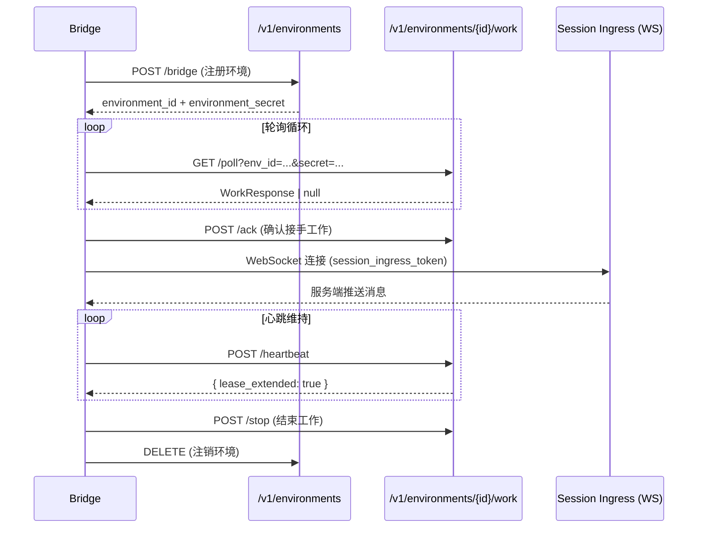
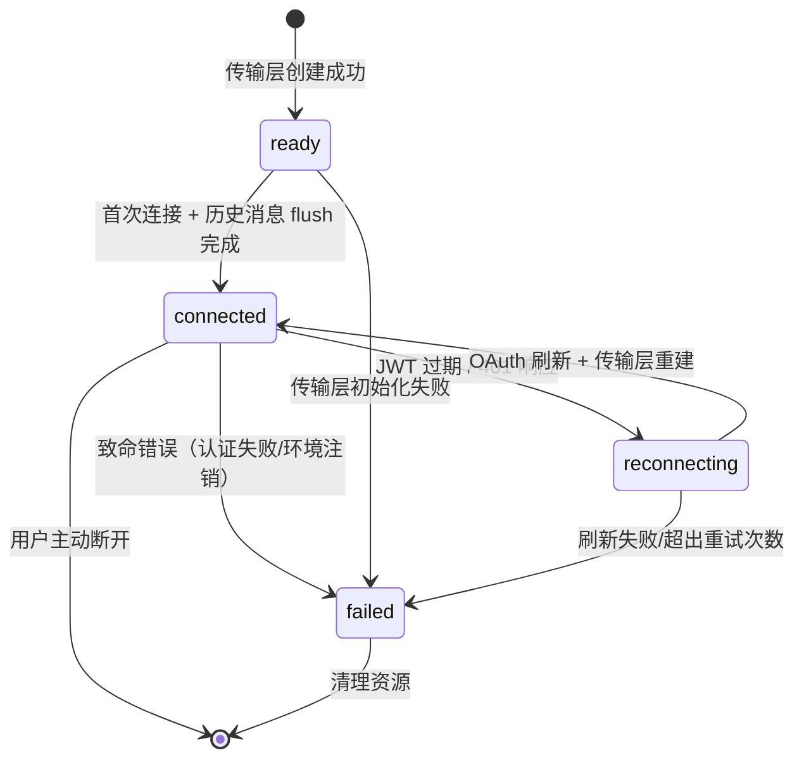
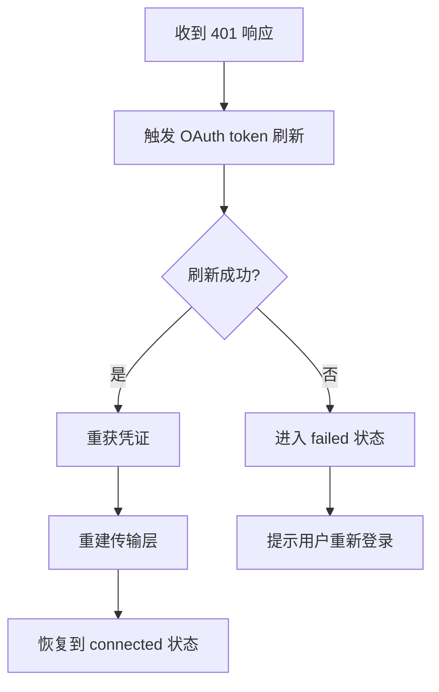
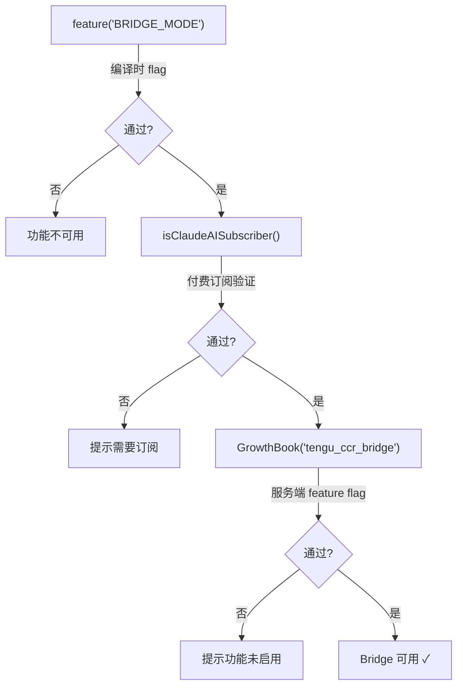

Bridge 是 Claude Code 中最精巧的远程控制子系统——它将本地终端会话暴露为可从 claude.ai 网页端或移动端远程驱动的双向通道。用户在浏览器中输入的 prompt 通过 WebSocket 实时注入本地 CLI，CLI 的输出同步回传至远端；权限审批、模型切换、思考 token 限流等控制信号也在同一条通道上双向流转。整套系统由 33 个模块协同实现，涵盖传输协议、会话管理、安全认证、崩溃恢复与状态机驱动的连接生命周期。

Sources: [types.ts](src/bridge/types.ts#L1-L263), [bridgeMain.ts](src/bridge/bridgeMain.ts)

## 核心架构：从远端到本地的完整数据通路

Bridge 的核心设计思想是**本地进程不主动暴露端口**——它通过出站 WebSocket 连接到 claude.ai 的 session-ingress 服务，将本地 Claude Code 进程变成一个"可被远端遥控的工作节点"。这避免了 NAT 穿透和防火墙问题，使得处于任何网络环境的终端都能被远程访问。

Bridge 存在两种运行模式与两代传输协议，它们正交组合，形成四种可能的部署形态。模式决定"谁在运行 Bridge"，协议决定"数据如何走到云端"。

Sources: [types.ts](src/bridge/types.ts#L18-L115), [bridgeMain.ts](src/bridge/bridgeMain.ts)

## 两种运行模式

### 独立模式（`claude remote-control`）

独立模式将 Bridge 作为长运行守护进程运行，核心逻辑在 [bridgeMain.ts](src/bridge/bridgeMain.ts) 中实现。它不依赖交互式 REPL，而是自行管理会话的完整生命周期：注册环境 → 轮询工作 → 生成子进程 → 监控执行 → 清理回收。

独立模式支持 3 种 `SpawnMode`，决定会话如何在工作目录中隔离：

| 模式 | 隔离策略 | 生命周期 | 适用场景 |
|------|----------|----------|----------|
| `single-session` | 无隔离，使用 cwd | 一个 session 结束后 bridge 退出 | 临时任务、CI 集成 |
| `worktree` | 每个 session 获得独立 git worktree | 持久运行，session 间互不干扰 | 多人共享同一台开发机 |
| `same-dir` | 所有 session 共享 cwd | 持久运行，可能产生文件竞争 | 单用户多任务场景 |

SpawnMode 的类型定义明确区分了会话的隔离边界和行为模式，其中 `worktree` 模式通过为每个会话创建隔离的 git worktree 实现真正的文件系统级隔离。

Sources: [types.ts](src/bridge/types.ts#L64-L69)

### REPL 内嵌模式（`/remote-control`）

REPL 内嵌模式在交互式会话中启动，核心逻辑在 [initReplBridge.ts](src/bridge/initReplBridge.ts) 和 [replBridge.ts](src/bridge/replBridge.ts) 中实现。它的独特之处在于**双向驱动**——用户既可以在本地终端直接输入，也可以在 claude.ai 网页端输入，两者驱动同一个会话实例。本地输入同步镜像到远端，远端输入注入本地，实现真正的"远程同屏"。

内嵌模式的关键实现要点：它复用了当前 REPL 会话的查询引擎，而非启动新的子进程；消息通过 React hook [useReplBridge.tsx](src/hooks/useReplBridge.tsx) 注入组件树，使得 UI 状态变更（如 `BridgeDialog`）能即时反映连接状态。

Sources: [initReplBridge.ts](src/bridge/initReplBridge.ts), [replBridge.ts](src/bridge/replBridge.ts)

## 两代传输协议

### v1 协议：环境层方案

v1 协议遵循完整的 Environments API 生命周期，传输层由 [replBridgeTransport.ts](src/bridge/replBridgeTransport.ts) 中定义的 `HybridTransport` 实现：

`HybridTransport` 的"混合"之名源于其双通道设计：**WebSocket 用于下行读取**（服务端 → 本地），**HTTP POST 用于上行写入**（本地 → 服务端）。这种不对称设计使得写入操作能绕过 WebSocket 的消息队列拥塞，同时在写入时携带独立的鉴权头。

v1 协议的 `BridgeApiClient` 接口定义了完整的环境生命周期操作：`registerBridgeEnvironment`（注册）、`pollForWork`（轮询）、`acknowledgeWork`（确认接手）、`heartbeatWork`（心跳续租）、`stopWork`（停止工作）、`deregisterEnvironment`（注销环境）。

Sources: [types.ts](src/bridge/types.ts#L133-L176), [replBridgeTransport.ts](src/bridge/replBridgeTransport.ts)

### v2 协议：无环境层方案

v2 协议跳过了整个 Environments API，直接通过 Code Sessions API 建立会话，大幅简化了连接建立流程：

| 对比维度 | v1 协议 | v2 协议 |
|----------|---------|---------|
| 环境注册 | 必须 | 跳过 |
| 轮询机制 | HTTP 长轮询 | 无需轮询 |
| 下行通道 | WebSocket | SSE (Server-Sent Events) |
| 上行通道 | HTTP POST | CCRClient → `/worker/*` |
| 鉴权方式 | environment_secret | Worker JWT |
| 会话创建 | 服务端分配 | `POST /v1/code/sessions` 主动创建 |
| 门控开关 | `tengu_ccr_bridge` | `tengu_bridge_repl_v2` |

v2 协议的连接建立流程：先通过 `POST /v1/code/sessions` 创建会话，再通过 `POST /v1/code/sessions/{id}/bridge` 获取 Worker JWT 和 epoch 编号，然后用 SSE 建立下行读取通道，用 CCRClient 写入 `/worker/*` 端点。JWT 在到期前 5 分钟主动刷新，保持连接不中断。

`SessionSpawnOpts` 中的 `useCcrV2` 和 `workerEpoch` 字段标识是否使用 v2 协议及其所需的 epoch 编号——这个编号在 `POST /worker/register` 时获得，用于 CCR v2 的分区路由。

Sources: [types.ts](src/bridge/types.ts#L192-L220), [codeSessionApi.ts](src/bridge/codeSessionApi.ts)

## 消息处理与路由

[bridgeMessaging.ts](src/bridge/bridgeMessaging.ts) 是 Bridge 的消息路由中枢，负责入站消息的分类分发和出站消息的过滤。

### 入站消息类型

| 类型 | 来源 | 处理方式 |
|------|------|----------|
| `control_response` | 服务端（权限决策回传） | 路由到 `bridgePermissionCallbacks` 等待中的回调 |
| `control_request` | 服务端（下行控制指令） | 分发到对应处理器，必须在 10-14 秒内响应 |
| `SDKMessage` | 服务端（用户 prompt） | 仅转发 `user` 类型消息，注入本地会话 |

### 去重机制

Bridge 运行在双向通信环境中，消息回声和重投递是两大隐患：

- **回声去重**：`BoundedUUIDSet` 是一个环形缓冲区（默认容量 2000 条），记录本地发出的消息 UUID。当远端将该消息回传时，通过 UUID 匹配直接丢弃，避免无限回声。
- **重投递去重**：`recentInboundUUIDs` 过滤服务端因未收到确认而重发的入站 prompt，确保同一条用户指令不会被执行两次。

### 服务端控制请求

服务端通过 `control_request` 消息实施运行时控制，Bridge 必须在超时窗口内响应：

| 请求类型 | 功能 | 说明 |
|----------|------|------|
| `initialize` | 能力声明 | 返回当前 Bridge 支持的控制能力集合 |
| `set_model` | 切换模型 | 远端切换本地 CLI 使用的 LLM 模型 |
| `set_max_thinking_tokens` | 设置思考上限 | 限制 extended thinking 的 token 预算 |
| `set_permission_mode` | 设置权限模式 | 切换自动允许/手动审批模式 |
| `interrupt` | 中断操作 | 等效于本地按下 Ctrl+C |

响应超时（10-14 秒）是硬性约束——服务端在超时后会主动关闭连接，Bridge 需要进入重连状态机。

Sources: [bridgeMessaging.ts](src/bridge/bridgeMessaging.ts), [inboundMessages.ts](src/bridge/inboundMessages.ts), [bridgePermissionCallbacks.ts](src/bridge/bridgePermissionCallbacks.ts)

## 连接状态机与生命周期

Bridge 的连接管理由状态机驱动，定义在 [replBridge.ts](src/bridge/replBridge.ts) 和 [remoteBridgeCore.ts](src/bridge/remoteBridgeCore.ts) 中：

| 状态 | 语义 | 触发条件 |
|------|------|----------|
| `ready` | 传输层已创建，尚未建立连接 | 初始化完成 |
| `connected` | 连接正常 + 历史消息已 flush | WebSocket 握手成功 + flush 完成 |
| `reconnecting` | 正在恢复连接 | JWT 过期 / 收到 401 / WebSocket 断开 |
| `failed` | 不可恢复的致命错误 | 认证失效 / 服务端注销环境 / 重试耗尽 |

关键的状态转换语义：`ready → connected` 不仅要求 WebSocket 握手成功，还要求**历史消息 flush 完成**——这意味着在连接建立后，Bridge 会先将积压的离线消息（如用户在断连期间发送的 prompt）全部消费，然后才宣布进入 `connected` 状态。这保证了 UI 显示"已连接"时，用户看到的是完全同步的会话状态。

Sources: [replBridge.ts](src/bridge/replBridge.ts), [remoteBridgeCore.ts](src/bridge/remoteBridgeCore.ts)

## 安全机制：多层令牌体系

Bridge 的安全模型建立在三层令牌体系之上，每层令牌的生存周期和权限范围各不相同：

| 令牌类型 | 生存周期 | 权限范围 | 获取方式 |
|----------|----------|----------|----------|
| **OAuth 令牌** | 长期（支持刷新） | 全局身份凭证 | keychain 读取 + 自动刷新 |
| **Worker JWT** | 短期（数小时） | 单 session 读写 | `POST /sessions/{id}/bridge` |
| **Trusted Device Token** | 中期 | 设备级信任 | [trustedDevice.ts](src/bridge/trustedDevice.ts) |

### 401 恢复流程

当任何 API 调用返回 401 时，Bridge 触发令牌恢复链：

[jwtUtils.ts](src/bridge/jwtUtils.ts) 实现了 JWT 的主动刷新策略：在 JWT 到期前 5 分钟调度刷新，避免在请求途中偶遇过期导致的短暂中断。这种"预刷新"模式将令牌过期对用户体验的侵扰降至零。

Sources: [jwtUtils.ts](src/bridge/jwtUtils.ts), [trustedDevice.ts](src/bridge/trustedDevice.ts), [workSecret.ts](src/bridge/workSecret.ts)

## 会话运行器与子进程管理

[sessionRunner.ts](src/bridge/sessionRunner.ts) 是独立模式下的会话执行引擎，负责子进程的生成、监控和回收。`SessionHandle` 类型定义了完整的进程控制接口：

| 能力 | 方法/属性 | 说明 |
|------|-----------|------|
| 等待完成 | `done: Promise<SessionDoneStatus>` | 等待子进程退出，返回 completed/failed/interrupted |
| 优雅终止 | `kill()` | 发送 SIGTERM |
| 强制终止 | `forceKill()` | 发送 SIGKILL |
| 活动监控 | `activities / currentActivity` | 环形缓冲区（~10 条），记录工具调用和文本输出 |
| 输入注入 | `writeStdin(data)` | 直接写入子进程 stdin |
| 令牌更新 | `updateAccessToken(token)` | 运行中刷新访问令牌 |
| 错误捕获 | `lastStderr` | 环形缓冲区，保留最近的 stderr 输出 |

子进程以 `claude --print --sdk-url ... --session-id ...` 方式启动，通过 NDJSON 格式的 stdin/stdout 进行结构化通信。`SessionDoneStatus` 明确区分了三种终止状态：`completed`（正常完成）、`failed`（执行错误）、`interrupted`（用户中断）。

Sources: [types.ts](src/bridge/types.ts#L178-L190), [sessionRunner.ts](src/bridge/sessionRunner.ts), [createSession.ts](src/bridge/createSession.ts)

## 崩溃恢复：Bridge Pointer 机制

[bridgePointer.ts](src/bridge/bridgePointer.ts) 实现了优雅的崩溃恢复策略。当 Bridge 进程因异常退出（OOM、SIGKILL、断电）时，正在运行的会话可能已经提交了部分工作，用户不需要重头来过。

恢复指针的生命周期：

1. **写入**：session 创建后，将 `{ sessionId, environmentId, source }` 写入 `{projectsDir}/{sanitized-cwd}/bridge-pointer.json`
2. **刷新**：运行中定期更新文件的 mtime，证明进程仍然存活
3. **清除**：干净退出时删除指针文件
4. **检测**：下次启动时，如果发现指针文件且 mtime 在 4 小时 TTL 内，说明上次异常退出
5. **恢复**：提供 `--session-id` 选项，通过 `reconnectSession` API 强制回收旧 worker 并重新排队

Bridge 还会扫描 git worktree 兄弟目录，发现其他 worktree 中的残留指针，避免多 worktree 环境下的恢复冲突。

Sources: [bridgePointer.ts](src/bridge/bridgePointer.ts)

## Flush Gate：有序消息同步

[flushGate.ts](src/bridge/flushGate.ts) 解决了一个微妙的一致性问题：Bridge 上线时，远端可能已经积压了若干待消费的消息（用户在离线期间发送的 prompt）。如果 Bridge 未消费完这些积压消息就宣布"已连接"，会导致本地和远端的状态不一致。

Flush Gate 的工作原理：在 `ready → connected` 状态转换期间，Bridge 先消费完所有积压消息，然后"开闸"允许后续消息流入本地会话。这确保了 UI 显示"已连接"时，会话状态是完全同步的。

Sources: [flushGate.ts](src/bridge/flushGate.ts)

## Capacity Wake：按需唤醒

[capacityWake.ts](src/bridge/capacityWake.ts) 实现了会话容量耗尽时的智能唤醒机制。当所有 session 槽位都被占用时，新到达的工作请求不会直接失败，而是排队等待某个槽位释放。这通过 `BridgeConfig.maxSessions` 控制并发上限，配合指数退避轮询实现优雅的负载调节。

Sources: [capacityWake.ts](src/bridge/capacityWake.ts)

## CCR Mirror 模式

Mirror 模式是一种特殊的只写模式，用于将本地 REPL 会话的动作单向镜像到 claude.ai，但不接收远端输入。这种模式下，Bridge 充当一个"观察者端口"——远端用户可以看到本地正在发生什么，但不能干预。这在演示场景和协作审查场景中非常有用。

Sources: [bridgeMessaging.ts](src/bridge/bridgeMessaging.ts)

## 启用条件：三层门控

[bridgeEnabled.ts](src/bridge/bridgeEnabled.ts) 定义了严格的检查链，Bridge 功能必须通过三层门控才能启用：

不满足时的诊断消息精确区分了失败原因：非订阅用户会看到需要订阅的提示；缺少 `user:profile` OAuth scope 会提示重新登录；无法确定组织 UUID 会提示刷新账户信息；GrowthBook 未通过则提示功能未对当前账户启用。`BRIDGE_LOGIN_ERROR` 常量提供了完整的错误文案。

Sources: [bridgeEnabled.ts](src/bridge/bridgeEnabled.ts), [types.ts](src/bridge/types.ts#L4-L11)

## 模块全景图

`src/bridge/` 目录下 33 个文件的职责划分：

| 模块分类 | 文件 | 职责 |
|----------|------|------|
| **入口与核心** | `bridgeMain.ts` | 独立模式主循环 |
| | `initReplBridge.ts` | REPL 内嵌模式初始化 |
| | `replBridge.ts` | REPL Bridge 实例与状态机 |
| | `remoteBridgeCore.ts` | 共享连接逻辑 |
| **传输层** | `replBridgeTransport.ts` | HybridTransport / SSETransport |
| | `bridgeApi.ts` | API 客户端实现 |
| | `codeSessionApi.ts` | v2 Code Sessions API 客户端 |
| **会话管理** | `sessionRunner.ts` | 子进程管理与监控 |
| | `createSession.ts` | 会话创建逻辑 |
| | `peerSessions.ts` | 并发会话管理 |
| | `sessionIdCompat.ts` | 会话 ID 格式兼容 |
| **消息处理** | `bridgeMessaging.ts` | 消息路由与去重 |
| | `inboundMessages.ts` | 入站消息处理 |
| | `inboundAttachments.ts` | 入站附件处理 |
| | `bridgePermissionCallbacks.ts` | 权限回调管理 |
| **安全** | `jwtUtils.ts` | JWT 解析与主动刷新 |
| | `trustedDevice.ts` | 设备信任令牌 |
| | `workSecret.ts` | WorkSecret 解码 |
| | `webhookSanitizer.ts` | Webhook 输入净化 |
| **配置** | `bridgeConfig.ts` | Bridge 运行时配置 |
| | `envLessBridgeConfig.ts` | 无环境模式配置 |
| | `pollConfig.ts` | 轮询策略配置 |
| | `pollConfigDefaults.ts` | 默认轮询参数 |
| **状态与 UI** | `bridgeStatusUtil.ts` | 状态工具函数 |
| | `bridgeUI.ts` | UI 状态展示 |
| | `bridgeDebug.ts` | 调试信息输出 |
| | `debugUtils.ts` | 调试工具 |
| **生命周期** | `bridgePointer.ts` | 崩溃恢复指针 |
| | `flushGate.ts` | 消息同步门控 |
| | `capacityWake.ts` | 容量唤醒 |
| | `bridgeEnabled.ts` | 启用条件检查 |
| | `replBridgeHandle.ts` | REPL Bridge 句柄 |
| **类型** | `types.ts` | 共享类型定义 |

Sources: [bridgeApi.ts](src/bridge/bridgeApi.ts), [bridgeConfig.ts](src/bridge/bridgeConfig.ts), [peerSessions.ts](src/bridge/peerSessions.ts), [inboundAttachments.ts](src/bridge/inboundAttachments.ts), [webhookSanitizer.ts](src/bridge/webhookSanitizer.ts), [pollConfig.ts](src/bridge/pollConfig.ts), [bridgeDebug.ts](src/bridge/bridgeDebug.ts), [bridgeStatusUtil.ts](src/bridge/bridgeStatusUtil.ts), [bridgeUI.ts](src/bridge/bridgeUI.ts), [debugUtils.ts](src/bridge/debugUtils.ts)

## 与其他子系统的关联

Bridge 不是孤立运作的——它与 Claude Code 的多个核心子系统深度交互：

- **状态管理**：通过 [useReplBridge.tsx](src/hooks/useReplBridge.tsx) hook 将连接状态注入 React 组件树，`BridgeDialog` 组件基于此渲染连接 UI
- **权限系统**：`bridgePermissionCallbacks` 与 [useCanUseTool.tsx](src/hooks/useCanUseTool.tsx) 交互，将远端权限决策注入本地的工具审批流
- **Feature Gate**：Bridge 的启用受三层门控约束，与 [Feature Gate 体系](16-san-ceng-men-kong-ti-xi-bian-yi-kai-guan-yong-hu-lei-xing-yu-yuan-cheng-feature-flag) 紧密耦合
- **远程会话**：Bridge 的 v1 环境注册与 [远程会话管理](22-yuan-cheng-hui-hua-ssh-lian-jie-yuan-cheng-huan-jing-yu-direct-connect-hui-hua-guan-li) 共享部分 API 客户端逻辑
- **Coordinator**：Bridge 的 `workerType: 'claude_code_assistant'` 标识使得 claude.ai 的 Assistant Tab 可以筛选出由 [Coordinator](14-coordinator-duo-agent-bian-pai-yu-worker-bing-xing-zhi-xing) 编排的远程工作节点

Sources: [useReplBridge.tsx](src/hooks/useReplBridge.tsx), [BridgeDialog.tsx](src/components/BridgeDialog.tsx)

## 延伸阅读

Bridge 涉及的门控机制、远程连接和会话管理在以下页面中有更深入的分析：

- [三层门控体系：编译开关、用户类型与远程 Feature Flag](16-san-ceng-men-kong-ti-xi-bian-yi-kai-guan-yong-hu-lei-xing-yu-yuan-cheng-feature-flag) — 理解 `bridgeEnabled` 三层检查的底层实现
- [远程会话：SSH 连接、远程环境与 Direct Connect 会话管理](22-yuan-cheng-hui-hua-ssh-lian-jie-yuan-cheng-huan-jing-yu-direct-connect-hui-hua-guan-li) — Bridge 与 SSH/Direct Connect 的异同对比
- [Coordinator：多 Agent 编排与 Worker 并行执行](14-coordinator-duo-agent-bian-pai-yu-worker-bing-xing-zhi-xing) — Bridge 如何作为 Coordinator 的远程执行节点
- [Ultraplan：云端深度规划与 Teleport 会话传输](13-ultraplan-yun-duan-shen-du-gui-hua-yu-teleport-hui-hua-chuan-shu) — Ultraplan 启动时如何与 Bridge 交互