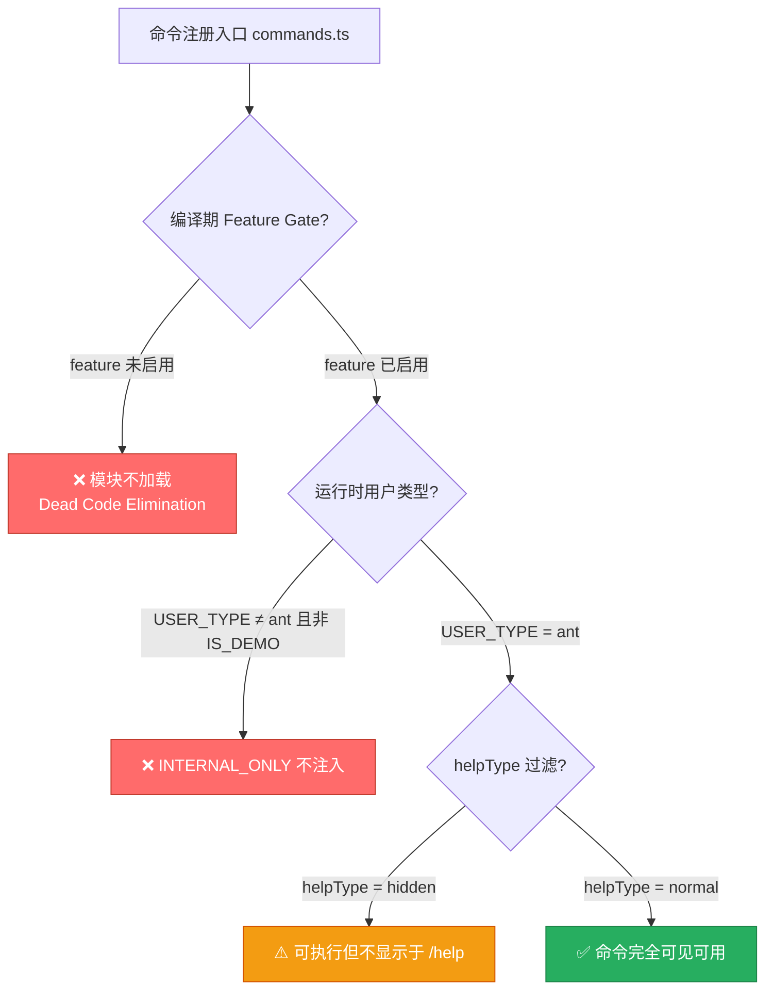
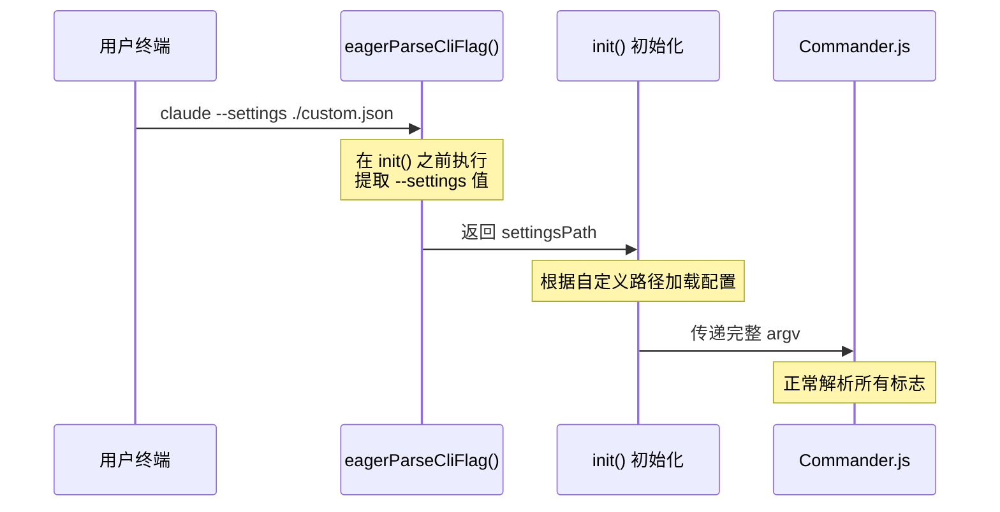
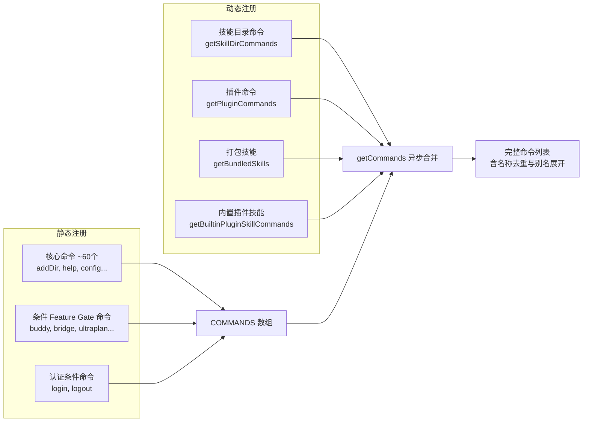

本文系统梳理 Claude Code 源码中被 **Feature Gate 条件编译**、**用户类型过滤**、**内部专用列表** 等机制隐藏的斜杠命令与 CLI 启动参数。这些功能不会出现在标准 `/help` 输出中，但蕴含着产品演进的轨迹与内部调试的入口。理解它们，就掌握了 Claude Code 的"完整功能图谱"。

## 隐藏机制总览：三条不可见路径

Claude Code 的命令可见性由三层门控共同决定。仅当全部通过时，命令才会出现在用户的交互界面中；任何一层拦截，命令即"隐形"——代码已编译入产物，但永远不会被加载执行。



**第一层**是编译期 Feature Gate——使用 Bun 的 `feature('...')` 进行条件 `require()`，未启用的模块根本不会被加载，属于 Dead Code Elimination 策略。**第二层**是运行时用户类型——`USER_TYPE === 'ant'` 与 `!process.env.IS_DEMO` 联合判断，将 `INTERNAL_ONLY_COMMANDS` 列表中的命令从外部构建中彻底剔除。**第三层**是 `helpType` 元数据字段——设为 `hidden` 的命令虽可执行，但不出现在帮助列表中，形成"知道就能用"的彩蛋式入口。三层机制形成纵深防御：编译消除 → 运行时过滤 → UI 隐藏，逐层收紧可见性。
Sources: [commands.ts](src/commands.ts#L48-L101), [commands.ts](src/commands.ts#L218-L243), [cliArgs.ts](src/utils/cliArgs.ts#L1-L61)

## Feature Gate 门控命令全表

以下是源码中通过 `feature('...')` 条件加载的全部命令。每一行代表一项需要特定编译开关才能激活的隐藏能力。

| Feature 标识 | 斜杠命令 | 功能描述 | 所属领域 |
|---|---|---|---|
| `PROACTIVE` / `KAIROS` | `/proactive` | 跨会话主动提醒与上下文整合 | Kairos 助手 |
| `KAIROS` / `KAIROS_BRIEF` | `/brief` | 生成会话摘要与关键信息提取 | Kairos 助手 |
| `KAIROS` | `/assistant` | Kairos 持久助手交互入口 | Kairos 助手 |
| `BRIDGE_MODE` | `/bridge` | 远程遥控终端 WebSocket 通道管理 | Bridge 远程控制 |
| `DAEMON` + `BRIDGE_MODE` | `/remote-control-server` | 远程控制守护进程服务端 | Bridge 远程控制 |
| `VOICE_MODE` | `/voice` | 语音输入/输出模式切换 | 语音交互 |
| `HISTORY_SNIP` | `/force-snip` | 强制触发历史消息剪裁 | 上下文管理 |
| `WORKFLOW_SCRIPTS` | `/workflows` | 工作流脚本管理与执行 | 自动化 |
| `CCR_REMOTE_SETUP` | `/remote-setup` | 远程环境 Web 配置入口 | 远程环境 |
| `EXPERIMENTAL_SKILL_SEARCH` | (内部清除函数) | 清除技能索引缓存 | 技能搜索 |
| `KAIROS_GITHUB_WEBHOOKS` | `/subscribe-pr` | 订阅 PR 的 GitHub Webhook 通知 | GitHub 集成 |
| `ULTRAPLAN` | `/ultraplan` | 云端深度规划与方案生成 | 规划系统 |
| `TORCH` | `/torch` | Torch 功能（内部代号） | 内部功能 |
| `UDS_INBOX` | `/peers` | Unix Domain Socket 对等消息收件箱 | 进程通信 |
| `FORK_SUBAGENT` | `/fork` | 子 Agent 派生与独立执行 | Agent 系统 |
| `BUDDY` | `/buddy` | 终端 AI 电子宠物交互 | Buddy 系统 |

Feature Gate 呈现出明显的**领域聚类**特征：Kairos 相关的三个命令共享 `KAIROS` feature，Bridge 的两个命令分别需要 `BRIDGE_MODE` 单独或组合 `DAEMON`。这种设计允许产品团队按功能域灰度发布，而非逐命令开关——一个 feature flag 即可开启整个功能族。值得注意的是，Bun 的 `feature()` 函数在编译期执行，未启用的 `require()` 调用会被整行消除，确保外部构建产物中不残留任何受限模块的代码。
Sources: [commands.ts](src/commands.ts#L48-L101)

## INTERNAL_ONLY_COMMANDS：内部专用命令列表

`INTERNAL_ONLY_COMMANDS` 是一个硬编码的命令数组，仅当 `USER_TYPE === 'ant'` 且 `IS_DEMO` 未设置时，才会注入到完整命令列表中。这是 Anthropic 内部员工的专属工具集，涵盖调试、运维、测试和内部工作流四大类。

| 命令 | 文件路径 | 分类 | 功能描述 |
|---|---|---|---|
| `/backfill-sessions` | `commands/backfill-sessions/index.js` | 运维 | 回填历史会话数据 |
| `/break-cache` | `commands/break-cache/index.js` | 调试 | 强制破坏缓存以验证缓存无关路径 |
| `/bughunter` | `commands/bughunter/index.js` | 调试 | Bug 猎手模式，自动排查问题 |
| `/commit` | `commands/commit.ts` | 内部工作流 | 内部 Git 提交快捷方式 |
| `/commit-push-pr` | `commands/commit-push-pr.ts` | 内部工作流 | 一键提交、推送并创建 PR |
| `/ctx_viz` | `commands/ctx_viz/index.js` | 调试 | 上下文可视化，查看 token 预算分配 |
| `/good-claude` | `commands/good-claude/index.js` | 测试 | Good Claude 评估模式 |
| `/issue` | `commands/issue/index.js` | 内部工作流 | 内部 Issue 管理快捷方式 |
| `/init-verifiers` | `commands/init-verifiers.ts` | 运维 | 初始化验证器配置 |
| `/mock-limits` | `commands/mock-limits/index.js` | 测试 | 模拟速率限制以测试限流逻辑 |
| `/bridge-kick` | `commands/bridge-kick.ts` | 运维 | 强制唤醒 Bridge 连接 |
| `/version` | `commands/version.ts` | 调试 | 输出详细版本信息 |
| `/reset-limits` | `commands/reset-limits/index.js` | 运维 | 重置模拟速率限制 |
| `/onboarding` | `commands/onboarding/index.js` | 测试 | 重新触发引导流程 |
| `/share` | `commands/share/index.js` | 内部工作流 | 分享会话（内部版） |
| `/summary` | `commands/summary/index.js` | 调试 | 会话摘要生成 |
| `/teleport` | `commands/teleport/index.js` | 运维 | Teleport 会话传输调试 |
| `/ant-trace` | `commands/ant-trace/index.js` | 调试 | Anthropic 内部链路追踪 |
| `/perf-issue` | `commands/perf-issue/index.js` | 调试 | 性能问题报告与采集 |
| `/env` | `commands/env/index.js` | 调试 | 查看当前运行环境变量 |
| `/oauth-refresh` | `commands/oauth-refresh/index.js` | 运维 | 强制刷新 OAuth Token |
| `/debug-tool-call` | `commands/debug-tool-call/index.js` | 调试 | 工具调用调试器 |
| `/agents-platform` | `commands/agents-platform/index.ts` | 运维 | 内部 Agent 平台管理 |
| `/autofix-pr` | `commands/autofix-pr/index.js` | 内部工作流 | 自动修复 PR 问题 |
| `/force-snip` | (Feature Gate 条件加载) | 调试 | 强制历史消息剪裁 |
| `/ultraplan` | (Feature Gate 条件加载) | 内部工作流 | 云端规划（内部版） |
| `/subscribe-pr` | (Feature Gate 条件加载) | 内部工作流 | PR Webhook 订阅 |

这些命令在 `COMMANDS()` 函数中通过以下逻辑注入：`...(process.env.USER_TYPE === 'ant' && !process.env.IS_DEMO ? INTERNAL_ONLY_COMMANDS : [])`。条件中的 `IS_DEMO` 排除项确保即使在内部演示场景下，调试命令也不会暴露给观众。列表还包含两个条件加载项（`forceSnip` 和 `ultraplan`、`subscribePr`），它们需要同时满足 Feature Gate 和用户类型才能出现。
Sources: [commands.ts](src/commands.ts#L218-L243)

## 秘密 CLI 参数：提前解析与隐藏标志

除了斜杠命令，Claude Code 还有一套 CLI 启动参数的隐藏机制。核心在于 `eagerParseCliFlag` 函数——它在 Commander.js 处理参数**之前**就提前解析关键标志，用于影响初始化流程本身。



### 已知的提前解析标志

| CLI 参数 | 用途 | 影响范围 |
|---|---|---|
| `--settings <path>` | 指定自定义配置文件路径，在初始化阶段加载 | 全局配置加载 |
| `--` (双横线分隔符) | Unix 标准参数终止符，分隔 Claude Code 参数与子命令参数 | 命令解析 |

`eagerParseCliFlag` 支持两种语法格式：`--flag value`（空格分隔）和 `--flag=value`（等号分隔）。它遍历 `process.argv` 数组逐项匹配，找到目标标志后立即返回值。这种设计确保了像 `--settings` 这样必须在 `init()` 之前生效的参数，不会因为 Commander.js 的延迟解析而错过加载时机。

`extractArgsAfterDoubleDash` 则处理 `--` 分隔符的边界情况。当用户执行 `claude --opt value name -- subcmd --flag arg` 时，Commander.js 会将 `--` 之后的内容视为位置参数而非选项，此函数负责将其正确还原为子命令与参数列表。

Sources: [cliArgs.ts](src/utils/cliArgs.ts#L1-L61)

## 第三方服务与认证条件命令

命令列表中还有一类特殊的条件过滤：基于**认证状态**和**服务类型**动态决定是否注册。

```javascript
...(!isUsing3PServices() ? [logout, login()] : []),
```

当用户使用第三方 API 服务（如 AWS Bedrock、Google Vertex AI）时，`/login` 和 `/logout` 命令被移除，因为这些服务的认证由各自平台管理，不通过 Anthropic 的 OAuth 流程。这是一种**优雅降级**策略：功能存在，但仅在对应认证模式下暴露。

同样，`ultrareview` 命令在 `commands.ts` 注册中无条件存在，但其内部实现可能包含基于 `isClaudeAISubscriber()` 或 feature flag 的二次检查，确保仅授权用户可以触发云端深度评审功能。
Sources: [commands.ts](src/commands.ts#L335-L340)

## 命令注册的完整装配流程

`COMMANDS()` 是一个 `memoize` 缓存的工厂函数，延迟求值直到首次调用 `getCommands()`。其装配策略如下：



完整的命令获取流程在 `getCommands` 异步函数中完成：先调用 `COMMANDS()` 获取静态命令数组，再并行加载四类动态命令源（技能目录、插件命令、打包技能、内置插件技能），最后合并去重。`builtInCommandNames()` 函数则提取所有内置命令的名称与别名，构建 `Set<string>` 用于快速查找和输入补全过滤。`isCommandEnabled()` 函数对每个命令检查其 `enabledIf` 条件，实现最终的运行时可见性裁决。
Sources: [commands.ts](src/commands.ts#L246-L330), [command.ts](src/types/command.ts#L1-L1)

## 隐藏命令的分类学：功能、调试与产品策略

将所有隐藏命令按动机分类，可以揭示 Claude Code 团队的产品策略思路：

| 隐藏动机 | 代表命令 | 设计哲学 |
|---|---|---|
| **灰度发布** | `/buddy`, `/ultraplan`, `/fork` | Feature Gate 控制，逐步放量 |
| **内部运维** | `/ant-trace`, `/perf-issue`, `/break-cache` | 仅 ant 员工可见，生产调试专用 |
| **测试工具** | `/mock-limits`, `/reset-limits`, `/good-claude` | 质量保障工具，不面向终端用户 |
| **认证依赖** | `/login`, `/logout` | 根据服务类型动态显示 |
| **向后兼容** | `/onboarding`, `/share` | 内部版本保留旧入口，外部版已移除 |
| **领域整合** | `/brief`, `/proactive`, `/assistant` | 同一 feature 聚合发布 |

**灰度发布**类命令的核心模式是：代码已合入主分支，但通过 feature flag 按用户群体逐步开放。Bun 的 `feature()` 编译期消除确保未开放功能的代码不会增加产物体积。**内部运维**类命令则是开发者的日常工具——生产环境排查问题需要比用户界面更底层的访问能力。**认证依赖**类命令体现了多租户架构下的功能裁剪：不同后端服务的用户看到的命令集自然不同。

这种分层隐藏策略的精妙之处在于：它不是一个简单的开关，而是一个**可见性光谱**——从完全不存在（编译消除），到存在但不可见（helpType=hidden），到可见但受限（enabledIf），直到完全开放。每一层都有独立的技术实现，组合起来形成了精细的功能访问控制体系。
Sources: [commands.ts](src/commands.ts#L48-L101), [commands.ts](src/commands.ts#L218-L243)

## 延伸阅读

- 命令的 Feature Gate 机制源自三层门控体系，详见 [三层门控体系：编译开关、用户类型与远程 Feature Flag](16-san-ceng-men-kong-ti-xi-bian-yi-kai-guan-yong-hu-lei-xing-yu-yuan-cheng-feature-flag)
- Buddy 电子宠物的完整实现逻辑，参见 [Buddy：终端 AI 电子宠物系统](11-buddy-zhong-duan-ai-dian-zi-chong-wu-xi-tong)
- Bridge 远程控制的 WebSocket 通道架构，参见 [Bridge：远程遥控终端的 WebSocket 双向通道](15-bridge-yuan-cheng-yao-kong-zhong-duan-de-websocket-shuang-xiang-tong-dao)
- Ultraplan 云端规划的深度规划算法，参见 [Ultraplan：云端深度规划与 Teleport 会话传输](13-ultraplan-yun-duan-shen-du-gui-hua-yu-teleport-hui-hua-chuan-shu)
- Kairos 助手的持久化与主动提醒系统，参见 [Kairos：跨会话持久助手与自动记忆整合](12-kairos-kua-hui-hua-chi-jiu-zhu-shou-yu-zi-dong-ji-yi-zheng-he)
- 命令注册与调度的完整架构，参见 [命令系统：斜杠命令注册、Feature Gate 与用户类型过滤](6-ming-ling-xi-tong-xie-gang-ming-ling-zhu-ce-feature-gate-yu-yong-hu-lei-xing-guo-lu)