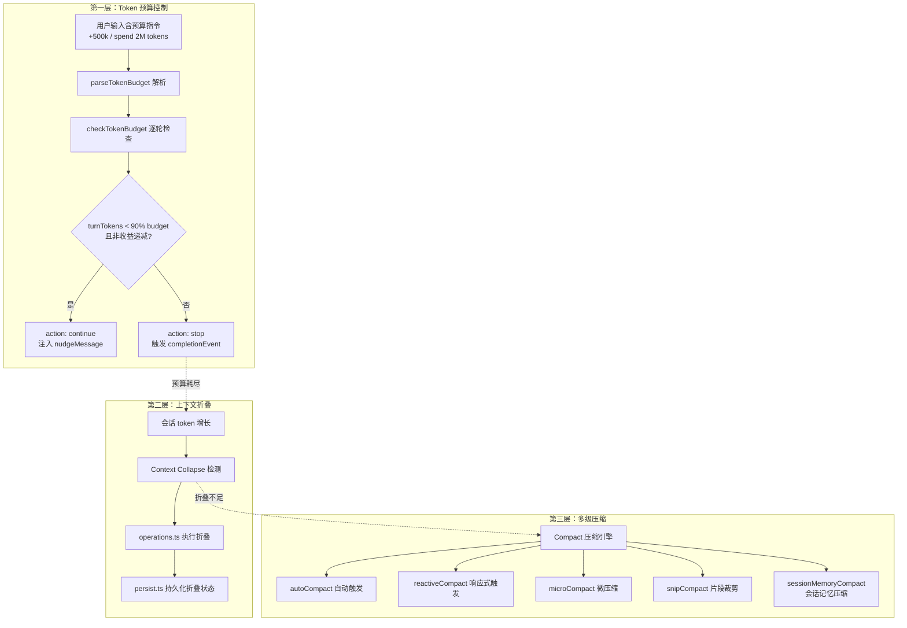
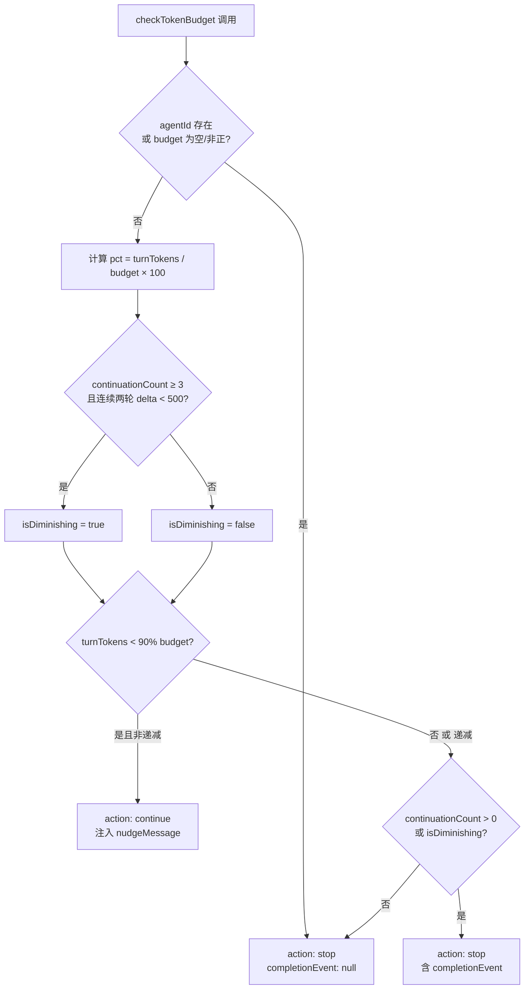
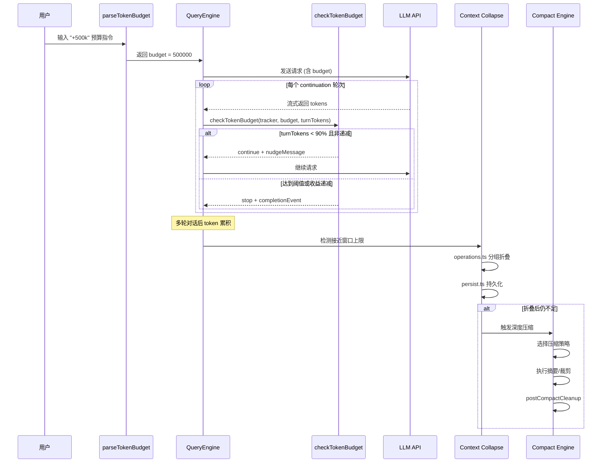

在长会话中，Claude Code 面临一个核心工程挑战：LLM 的上下文窗口是有限的，而用户的对话和工具输出会持续增长。本文深入剖析 Claude Code 的三层上下文管理架构——**Token 预算控制**、**上下文折叠**与**多级压缩策略**——如何在 token 耗尽前主动干预，保证对话质量和持续性。

Sources: [tokenBudget.ts](src/query/tokenBudget.ts#L1-L94), [tokenBudget.ts](src/utils/tokenBudget.ts#L1-L74)

## 架构总览：三层防线体系

Claude Code 的上下文管理遵循一个渐进式防线设计：第一层通过 Token 预算在单回合内控制输出长度，防止模型"跑偏"或过度消耗；第二层通过上下文折叠（Context Collapse）在接近窗口上限时主动缩减历史消息；第三层通过多级压缩（Compact）策略在折叠不足以缓解压力时进行深度摘要与裁剪。

Sources: [tokenBudget.ts](src/query/tokenBudget.ts#L1-L94), [index.ts](src/services/contextCollapse/index.ts), [compact.ts](src/services/compact/compact.ts)

## Token 预算系统：单回合精度控制

### 预算指令解析

Claude Code 支持用户在提示中声明 token 预算，系统通过正则匹配从自然语言中提取预算值。支持的语法格式分为**简写式**与**描述式**两类：

| 语法格式 | 示例 | 正则模式 | 解析逻辑 |
|---|---|---|---|
| 简写式（句首锚定） | "+500k" | `^\s*\+(\d+(?:\.\d+)?)\s*(k\|m\|b)\b` | 值 × 单位乘数 |
| 简写式（句尾锚定） | "... +2m." | `\s\+(\d+(?:\.\d+)?)\s*(k\|m\|b)\s*[.!?]?\s*$` | 值 × 单位乘数 |
| 描述式 | "use 2m tokens" | `\b(?:use\|spend)\s+(\d+(?:\.\d+)?)\s*(k\|m\|b)\s*tokens?\b` | 值 × 单位乘数 |

单位乘数映射为：`k` → 1,000、`m` → 1,000,000、`b` → 1,000,000,000。简写式使用锚定匹配（句首或句尾）以避免在自然语言中产生误匹配，而描述式则可匹配任意位置。`findTokenBudgetPositions` 函数还负责定位预算指令在文本中的精确位置，用于 UI 高亮显示。值得注意的是，简写结尾模式的正则使用了 `\s` 前缀而非 lookbehind (`(?<=\s)`)，这是因为 JSC (JavaScriptCore) 的 YARR JIT 引擎不支持 lookbehind，会导致回退到 O(n) 的解释器扫描。

Sources: [tokenBudget.ts](src/utils/tokenBudget.ts#L1-L74)

### 预算检查与收益递减检测

`checkTokenBudget` 是预算控制的核心决策函数，它在模型的每个 continuation 轮次中被调用，追踪当前回合已消耗的 token 数量：

**收益递减检测**是这个机制的精妙之处：当连续三次 continuation 后，每轮新增 token 数均低于 500 时，系统判定模型已进入**收益递减**（diminishing returns）状态。这意味着模型虽然未达到 90% 预算上限，但输出效率已显著下降——可能陷入了重复生成或低信息密度的循环。此时即使预算尚有余量，也果断终止回合。

`BudgetTracker` 维护的四个关键字段为：`continuationCount`（累计续写次数）、`lastDeltaTokens`（上一轮新增 token 数）、`lastGlobalTurnTokens`（上一轮检查时的全局回合 token 数）和 `startedAt`（回合启动时间戳）。当决策为 `continue` 时，系统将 `getBudgetContinuationMessage` 的返回值作为 nudge 注入，提示模型"已在 xx% 的 token 目标处暂停，继续工作——不要总结"，明确引导模型延续而非收束。

Sources: [tokenBudget.ts](src/query/tokenBudget.ts#L6-L93)

### 预算控制参数一览

| 参数 | 值 | 含义 |
|---|---|---|
| `COMPLETION_THRESHOLD` | 0.9 | 预算消耗 90% 后停止续写 |
| `DIMINISHING_THRESHOLD` | 500 | 连续两轮新增 token 低于此值触发收益递减判定 |
| 最少续写次数 | 3 | 至少续写 3 轮后才开始检测收益递减 |

Sources: [tokenBudget.ts](src/query/tokenBudget.ts#L3-L4)

## 上下文折叠：窗口边界主动收缩

当会话 token 接近模型上下文窗口上限时，Claude Code 启动上下文折叠（Context Collapse）机制。与简单的消息截断不同，折叠是一个结构化的操作——它对历史消息进行分组、摘要化并持久化，确保关键信息不丢失的同时释放窗口空间。

上下文折叠模块由三个核心文件组成：`index.ts` 提供折叠的触发入口和整体编排，`operations.ts` 定义具体的折叠操作（消息分组、摘要生成、状态标记），`persist.ts` 负责将折叠后的状态持久化到磁盘，使得会话恢复时能够保持折叠的一致性。

Sources: [index.ts](src/services/contextCollapse/index.ts), [operations.ts](src/services/contextCollapse/operations.ts), [persist.ts](src/services/contextCollapse/persist.ts)

## 多级压缩策略：Compact 引擎家族

压缩引擎是上下文管理的最后一道也是最深的防线。Claude Code 并非只有一个压缩算法，而是根据触发时机、压缩深度和保留策略的不同，部署了一个**多级 Compact 家族**：

| 压缩策略 | 模块文件 | 触发方式 | 压缩深度 | 适用场景 |
|---|---|---|---|---|
| 自动压缩 | `autoCompact.ts` | 窗口占用触发 | 深度摘要 | 常规长对话 |
| 响应式压缩 | `reactiveCompact.ts` | API 错误触发 | 紧急裁剪 | 窗口溢出应急 |
| 微压缩 | `microCompact.ts` | 增量触发 | 轻量裁剪 | 频繁短交互场景 |
| 片段裁剪 | `snipCompact.ts` | 选择性触发 | 精准移除 | 大块冗余输出 |
| 会话记忆压缩 | `sessionMemoryCompact.ts` | 记忆整合触发 | 记忆整合 | Kairos 记忆系统 |

### SnipProjection：片段预投影

`snipProjection.ts` 实现了一个预投影机制——在实际执行裁剪前，先模拟计算裁剪操作能释放多少 token 空间，再决定是否值得执行。这种"先测算后行动"的策略避免了无效的压缩开销。

Sources: [autoCompact.ts](src/services/compact/autoCompact.ts), [reactiveCompact.ts](src/services/compact/reactiveCompact.ts), [microCompact.ts](src/services/compact/microCompact.ts), [snipCompact.ts](src/services/compact/snipCompact.ts), [snipProjection.ts](src/services/compact/snipProjection.ts), [sessionMemoryCompact.ts](src/services/compact/sessionMemoryCompact.ts)

### MicroCompact 的时基配置

微压缩采用时间维度的自适应配置：`timeBasedMCConfig.ts` 根据会话活跃时间动态调整微压缩的触发阈值和压缩粒度。`cachedMCConfig.ts` 则缓存配置结果，避免每次压缩时重新计算。

Sources: [timeBasedMCConfig.ts](src/services/compact/timeBasedMCConfig.ts), [cachedMCConfig.ts](src/services/compact/cachedMCConfig.ts)

### 压缩提示词与分组策略

`prompt.ts` 包含压缩操作使用的系统提示词——指导模型如何在摘要时保留关键信息。`grouping.ts` 实现消息分组逻辑，将连续的工具调用和结果聚合为逻辑单元，使得摘要以"对话意图"为单位而非以"单条消息"为单位进行，大幅提升摘要的语义连贯性。

Sources: [prompt.ts](src/services/compact/prompt.ts), [grouping.ts](src/services/compact/grouping.ts)

### 压缩前后的清理与警告

`postCompactCleanup.ts` 在压缩完成后执行善后清理——包括更新内存中的消息索引、清理悬空引用和同步 UI 状态。`compactWarningHook.ts` 和 `compactWarningState.ts` 构成了压缩警告系统：在压缩即将发生前向用户发出通知，避免用户困惑于消息突然"消失"。

Sources: [postCompactCleanup.ts](src/services/compact/postCompactCleanup.ts), [compactWarningHook.ts](src/services/compact/compactWarningHook.ts), [compactWarningState.ts](src/services/compact/compactWarningState.ts)

## 用户侧入口：/compact 命令与 /ctx_viz 可视化

用户可以通过 `/compact` 斜杠命令手动触发压缩。该命令注册于 `src/commands/compact` 目录，允许用户在认为对话冗余时主动释放上下文空间。对应的组件 `CompactSummary.tsx` 在压缩完成后展示摘要信息。

`/ctx_viz` 命令（位于 `src/commands/ctx_viz`）提供上下文可视化——展示当前会话中各消息的 token 占比，帮助用户直观理解上下文的消耗分布，进而决定是否需要压缩或裁剪特定内容。前端组件 `ContextVisualization.tsx` 负责渲染可视化图表。

Sources: [CompactSummary.tsx](src/components/CompactSummary.tsx), [ContextVisualization.tsx](src/components/ContextVisualization.tsx)

## Token 估算与成本追踪

压缩决策依赖于精确的 token 估算。`src/services/tokenEstimation.ts` 提供 token 计数功能，而 `src/utils/tokens.ts` 和 `src/utils/tokenBudget.ts` 在工具和查询层面使用这些估算来做出实时决策。成本追踪器 `src/cost-tracker.ts` 和费用钩子 `src/costHook.ts` 将 token 消耗映射为费用，用于超出阈值时的警告与阻断。前端组件 `TokenWarning.tsx` 和 `MemoryUsageIndicator.tsx` 则在 UI 层展示 token 使用状态和内存占用。

Sources: [tokenEstimation.ts](src/services/tokenEstimation.ts), [cost-tracker.ts](src/cost-tracker.ts), [TokenWarning.tsx](src/components/TokenWarning.tsx), [MemoryUsageIndicator.tsx](src/components/MemoryUsageIndicator.tsx)

## 全局数据流：从输入到压缩的完整链路

Sources: [tokenBudget.ts](src/utils/tokenBudget.ts#L21-L29), [tokenBudget.ts](src/query/tokenBudget.ts#L45-L93), [operations.ts](src/services/contextCollapse/operations.ts), [compact.ts](src/services/compact/compact.ts)

## 设计哲学与关键洞察

**渐进式防线**是 Claude Code 上下文管理的核心设计哲学。三层防线各自独立运作、逐级升级：预算控制在回合级别精确干预，折叠在会话级别结构性收缩，压缩在内容级别深度蒸馏。这种分层设计确保了每一层都可以独立演进——例如微压缩策略可以单独调整不触发阈值，而不影响预算检查逻辑。

**收益递减检测**体现了一个重要的工程洞察：模型输出质量并非随 token 线性增长。当连续多轮产出低于阈值时，及时终止比盲目续写更高效——这不仅节省了 token 预算，也减少了后续压缩的压力。

**预投影机制**（SnipProjection）展现了"先测算后行动"的工程理性。压缩操作本身需要消耗一次 LLM 调用来生成摘要，如果裁剪能释放的空间有限，则不值得付出这个成本。预投影通过模拟裁剪结果来量化预期收益，避免"压缩反而浪费更多"的悖论。

Sources: [tokenBudget.ts](src/query/tokenBudget.ts#L59-L62), [snipProjection.ts](src/services/compact/snipProjection.ts)

## 与其他系统的关联

上下文管理并非孤立运作。Kairos 记忆系统（[记忆系统：个人记忆、团队记忆与跨项目知识持久化](20-ji-yi-xi-tong-ge-ren-ji-yi-tuan-dui-ji-yi-yu-kua-xiang-mu-zhi-shi-chi-jiu-hua)）通过 `sessionMemoryCompact` 与压缩引擎深度集成，确保压缩时记忆不会被意外丢失。Coordinator 多 Agent 编排（[Coordinator：多 Agent 编排与 Worker 并行执行](14-coordinator-duo-agent-bian-pai-yu-worker-bing-xing-zhi-xing)）中，worker agent 的预算检查会跳过 token 预算逻辑（当 `agentId` 存在时直接返回 stop），因为子 agent 的生命周期由编排器统一管理。工具系统（[工具系统：50+ 内置工具的注册、调度与权限管控](5-gong-ju-xi-tong-50-nei-zhi-gong-ju-de-zhu-ce-diao-du-yu-quan-xian-guan-kong)）中的 `SnipTool` 提供了手动裁剪上下文的入口，是压缩策略在工具层面的延伸。