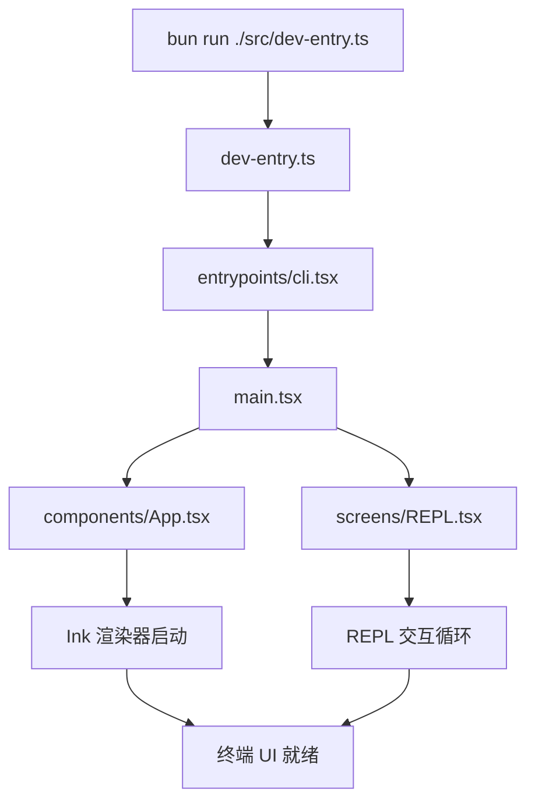

本文档是 Claude Code 源码还原项目的环境搭建与运行指南。你将从零开始，搭建完整的开发环境，成功在本地启动这个从 npm 包 source map 中还原出的 TypeScript 源码项目，并验证其可运行性。阅读本文后，你将理解项目的依赖拓扑、入口机制以及常见启动问题的排查思路。

Sources: [package.json](package.json#L1-L99), [README.md](README.md#L1-L23)

## 环境前置要求

在开始之前，确认你的系统满足以下硬性要求。项目的 `package.json` 中明确定义了引擎版本约束，低于这些版本将无法正常启动。

| 依赖 | 最低版本 | 用途 | 验证命令 |
|------|---------|------|---------|
| **Bun** | ≥ 1.3.5 | 包管理器 + TypeScript 运行时 | `bun --version` |
| **Node.js** | ≥ 24.0.0 | 原生 NAPI 模块兼容层运行依赖 | `node --version` |
| **Git** | 任意稳定版 | 源码获取与会话上下文感知 | `git --version` |

**为什么同时需要 Bun 和 Node.js？** Bun 是项目的主运行时与包管理器（`packageManager: "bun@1.3.5"`），所有 TypeScript 源码通过 `bun run` 直接执行，无需预编译步骤。Node.js ≥ 24 则是因为项目中的 shim 层（`shims/` 目录）包裹了原生 NAPI 模块，这些模块的 ABI 兼容性要求较高版本的 Node 运行时。

Sources: [package.json](package.json#L8-L16)

### 安装 Bun

```bash
# macOS (官方推荐)
curl -fsSL https://bun.sh/install | bash

# 或使用 Homebrew
brew install bun
```

安装完成后，重启终端并验证：

```bash
bun --version
# 期望输出: 1.3.5 或更高
```

Sources: [package.json](package.json#L8)

### 安装 Node.js

推荐使用 `nvm` 或 `fnm` 管理多版本 Node.js：

```bash
# 使用 fnm (推荐，速度更快)
fnm install 24
fnm use 24

# 或使用 nvm
nvm install 24
nvm use 24
```

Sources: [package.json](package.json#L14-L16)

## 获取源码与安装依赖

### 克隆仓库

```bash
git clone https://github.com/anthropics/claude-code.git
cd claude-code
```

> **注意**：本仓库为非官方还原版本，基于公开 npm 发布包 source map 还原，仅供研究学习。源码版权归 Anthropic 所有。
> 实际仓库地址请以项目主页为准。

Sources: [README.md](README.md#L1-L12)

### 安装依赖

```bash
bun install
```

这一步会解析 `package.json` 和 `bun.lock`，安装约 90 个直接依赖及其传递依赖。其中三个依赖（`color-diff-napi`、`modifiers-napi`、`url-handler-napi`）指向本地 `shims/` 目录，无需从远程下载。

Sources: [package.json](package.json#L22-L97)

### 依赖拓扑概览

理解项目的依赖结构有助于排查安装问题。以下是核心依赖的功能分组：

| 分组 | 核心依赖 | 职责 |
|------|---------|------|
| **终端渲染** | `ink`、`react`、`react-reconciler` | 终端内 React 渲染引擎 |
| **AI/SDK** | `@anthropic-ai/sdk`、`@anthropic-ai/claude-agent-sdk` | Anthropic API 与 Agent 通信 |
| **协议/MCP** | `@modelcontextprotocol/sdk`、`vscode-jsonrpc`、`vscode-languageserver-*` | MCP 协议与 LSP 集成 |
| **远端通信** | `ws`、`axios`、`undici` | WebSocket、HTTP 客户端 |
| **遥测** | `@opentelemetry/*`（7 个包） | OpenTelemetry 可观测性 |
| **云服务** | `@aws-sdk/client-bedrock-runtime`、`google-auth-library` | AWS Bedrock 与 GCP 认证 |
| **原生模块** | `color-diff-napi`、`modifiers-napi`、`url-handler-napi` | 高性能原生扩展（shim 层） |
| **工具链** | `zod`、`ajv`、`yaml`、`jsonc-parser` | Schema 验证与配置解析 |

Sources: [package.json](package.json#L22-L97)

## 启动项目

项目定义了三个 npm scripts，均指向同一个入口文件：

| 命令 | 实际执行 | 用途 |
|------|---------|------|
| `bun run dev` | `bun run ./src/dev-entry.ts` | 开发模式启动 CLI |
| `bun run start` | `bun run ./src/dev-entry.ts` | 生产模式启动 CLI（与 dev 相同入口） |
| `bun run version` | `bun run ./src/dev-entry.ts --version` | 输出版本号并退出 |

Sources: [package.json](package.json#L17-L21)

### 首次启动

```bash
bun run dev
```

如果你看到 Claude Code 的交互式终端界面（带有提示符和输入框），说明环境搭建成功。

### 验证版本

```bash
bun run version
# 期望输出: 999.0.0-restored
```

版本号 `999.0.0-restored` 标识这是一个还原版本，不是官方发布版本。

Sources: [package.json](package.json#L3), [package.json](package.json#L20)

## 入口文件解读

理解启动流程需要追踪入口文件的调用链。整个项目采用 **TypeScript 直执行** 模式——无需 `tsc` 编译，Bun 原生解析 TS 并执行。



**启动链路解析**：

1. **`src/dev-entry.ts`** — 最顶层入口，处理开发模式下的初始化逻辑
2. **`src/entrypoints/cli.tsx`** — CLI 入口，解析命令行参数、配置环境
3. **`src/main.tsx`** — 应用主模块，组装核心组件与状态
4. **`src/components/App.tsx`** — React 根组件，挂载 Ink 渲染器
5. **`src/screens/REPL.tsx`** — REPL 交互界面，用户输入/输出的核心循环

这种分层设计意味着你可以在不同层级进行调试和拦截——例如在 `cli.tsx` 中添加参数处理，或在 `App.tsx` 中注入全局状态。

Sources: [package.json](package.json#L18-L19)

## 项目结构导览

成功启动后，你可能想深入探索源码。以下是项目核心目录的结构化概览，帮助你快速定位感兴趣的模块：

```
src/
├── dev-entry.ts          # 开发模式入口
├── main.tsx              # 应用主模块
├── entrypoints/          # 多入口点（CLI、SDK、MCP）
├── components/           # 150+ React 终端组件
├── screens/              # 页面级组件（REPL、Doctor、Resume）
├── commands/             # 60+ 斜杠命令实现
├── tools/                # 50+ 内置工具（Bash、FileEdit、Grep...）
├── bridge/               # 远程控制桥接（33 个文件）
├── buddy/                # AI 电子宠物系统
├── coordinator/          # 多 Agent 编排
├── assistant/            # Kairos 持久助手
├── services/             # 关键服务（MCP、OAuth、语音、压缩...）
├── hooks/                # 80+ React Hooks
├── ink/                  # 定制版 Ink 终端渲染框架
├── utils/                # 200+ 工具函数
├── state/                # React 状态管理
├── memdir/               # 记忆持久化系统
├── keybindings/          # 键绑定系统
└── vim/                  # Vim 编辑模式
shims/                    # 原生 NAPI 模块的兼容适配层
docs/                     # 隐藏功能分析文档
```

Sources: [README.md](README.md#L1-L23)

## TypeScript 编译配置

项目使用 Bun 原生 TypeScript 支持，无需预编译。`tsconfig.json` 的关键配置如下：

| 配置项 | 值 | 含义 |
|-------|-----|------|
| `target` | `ESNext` | 输出目标为最新 ES 标准 |
| `module` | `ESNext` | 使用 ES 模块系统（匹配 `"type": "module"`） |
| `moduleResolution` | `bundler` | Bundler 模式解析（Bun 标准） |
| `jsx` | `react-jsx` | React 17+ 自动 JSX 转换（无需 `import React`） |
| `strict` | `false` | 非严格模式（还原代码，保留原始风格） |
| `paths` | `src/* → ./src/*` | 路径别名，源码中 `import ... from 'src/...'` 可用 |
| `types` | `["bun"]` | 加载 Bun 类型定义 |

**关于 `strict: false`**：还原源码未启用严格模式，这是因为从 source map 还原的代码保留了原始构建后的松散类型风格。如果你计划进行二次开发，建议渐进式开启严格检查。

Sources: [tsconfig.json](tsconfig.json#L1-L30), [package.json](package.json#L7)

## Shim 层：原生模块的兼容适配

`shims/` 目录是项目能在还原源码上运行的关键。原始 Claude Code 依赖多个内部原生 NAPI 模块（颜色计算、修饰符、URL 处理等），这些模块不公开发布。Shim 层为每个原生模块提供了 TypeScript 纯实现替代：

| Shim 目录 | 包名 | 替代的原生功能 |
|----------|------|-------------|
| `shims/color-diff-napi/` | `color-diff-napi` | 颜色差异计算 |
| `shims/modifiers-napi/` | `modifiers-napi` | 输入修饰键检测 |
| `shims/url-handler-napi/` | `url-handler-napi` | URL 协议处理 |
| `shims/ant-claude-for-chrome-mcp/` | `@ant/claude-for-chrome-mcp` | Chrome 扩展通信 |
| `shims/ant-computer-use-input/` | `@ant/computer-use-input` | Computer Use 输入 |
| `shims/ant-computer-use-mcp/` | `@ant/computer-use-mcp` | Computer Use MCP |
| `shims/ant-computer-use-swift/` | `@ant/computer-use-swift` | Swift 平台 Computer Use |

`package.json` 中通过 `"file:./shims/..."` 协议将这些本地目录声明为依赖，`bun install` 时自动链接而非下载，无需额外配置。

Sources: [package.json](package.json#L24-L28), [package.json](package.json#L94-L96)

## 常见问题排查

| 问题现象 | 可能原因 | 解决方案 |
|---------|---------|---------|
| `bun install` 报错找不到包 | Bun 版本过低 | 升级 Bun：`bun upgrade` |
| `bun run dev` 启动闪退 | Node.js 版本不满足 | 确保 Node ≥ 24：`node --version` |
| 原生模块加载失败 | Shim 链接断裂 | 删除 `node_modules` 后重新 `bun install` |
| 终端渲染异常（乱码/错位） | 终端不支持真彩色 | 使用 kitty、iTerm2、WezTerm 等现代终端 |
| TypeScript 类型报错 | IDE 使用了错误的 tsconfig | 确认 IDE 识别项目根目录的 `tsconfig.json` |
| `ESM` 模块加载错误 | Node.js 而非 Bun 运行 | 使用 `bun run` 而非 `node`/`npx` 执行 |

Sources: [package.json](package.json#L8-L16), [package.json](package.json#L7)

## 下一步阅读

环境搭建完成后，推荐按以下顺序深入探索项目：

1. **理解还原工程** — 了解这些源码是如何从 source map 中还原的：[还原工程说明：从 Source Map 到可运行源码](3-huan-yuan-gong-cheng-shuo-ming-cong-source-map-dao-ke-yun-xing-yuan-ma)

2. **纵览全局架构** — 从 CLI 入口到查询引擎的完整链路：[整体架构：CLI 入口、查询引擎与会话生命周期](4-zheng-ti-jia-gou-cli-ru-kou-cha-xun-yin-qing-yu-hui-hua-sheng-ming-zhou-qi)

3. **探索隐藏功能** — 从最有趣的 AI 电子宠物开始：[Buddy：终端 AI 电子宠物系统](11-buddy-zhong-duan-ai-dian-zi-chong-wu-xi-tong)