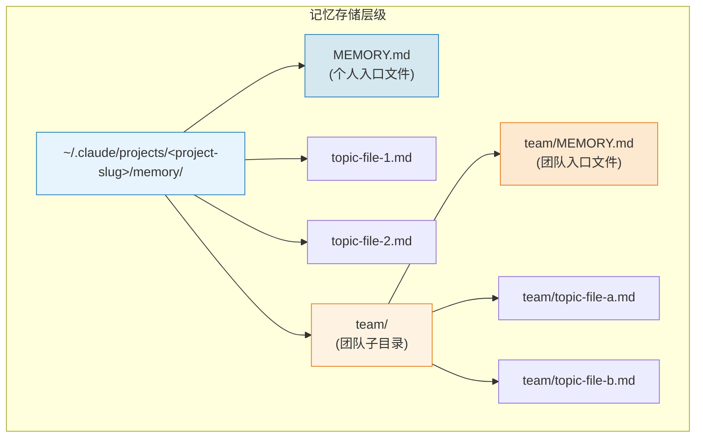
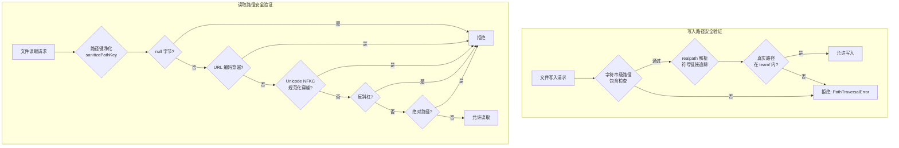
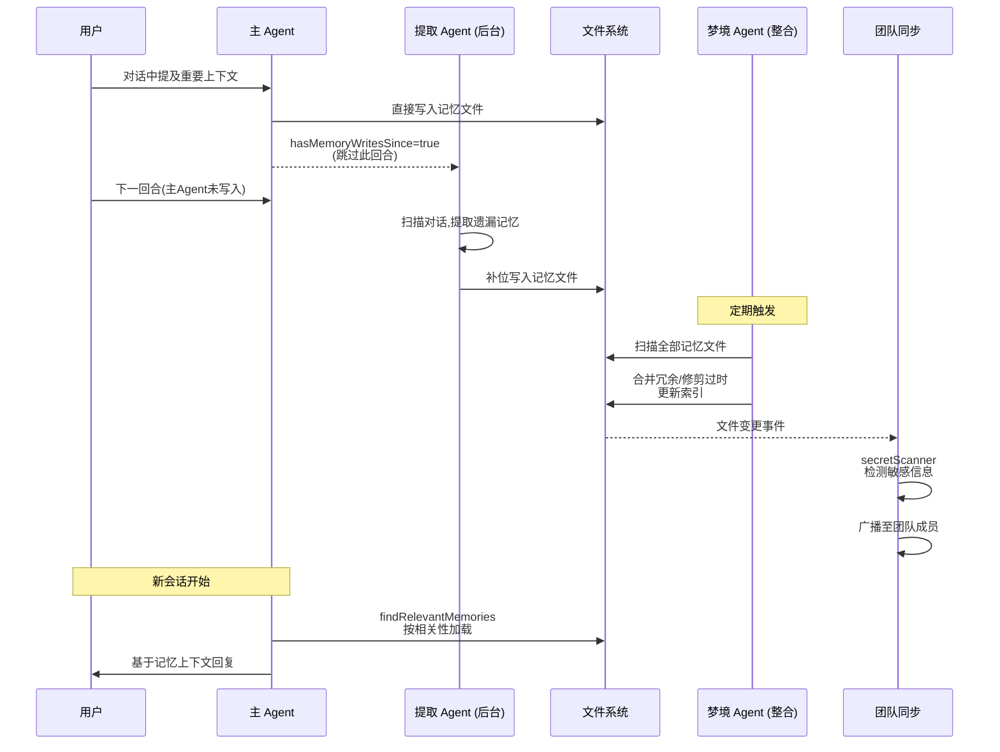

Claude Code 的记忆系统是一套多层持久化机制，旨在让 AI 助手跨会话、跨项目、跨协作者积累和应用不可从代码状态直接推导的知识。系统围绕 **四类型分类法**（user / feedback / project / reference）构建，以文件系统为存储介质，通过 `MEMORY.md` 入口文件 + 主题文件的分层结构组织知识，并区分**个人私有记忆**与**团队共享记忆**两个作用域。本页将深入解析记忆的类型体系、存储路径、自动提取与整合、团队同步，以及安全防护机制。

## 记忆类型分类法：四种不可推导的知识

记忆系统的核心设计原则是**只持久化不可从当前项目状态推导的信息**——代码模式、架构、Git 历史、文件结构均可通过 `grep`/`git`/`CLAUDE.md` 实时获取，存储它们只会产生冗余和漂移。基于这一原则，系统定义了四种封闭的记忆类型：

| 类型 | 用途 | 作用域偏好 | 典型场景 |
|------|------|-----------|---------|
| **user** | 用户角色、目标、偏好与知识背景 | 始终私有 | "我是数据科学家，正在排查日志系统" |
| **feedback** | 用户对工作方式的纠正与确认 | 默认私有；项目级约定为团队 | "不要 mock 数据库——上次因此翻车" |
| **project** | 项目内非代码可推导的进展、决策、约束 | 强烈倾向团队 | "3月5日起冻结合入，移动端要切发布分支" |
| **reference** | 外部系统的信息指针（Linear、Grafana 等） | 通常团队 | "管道 Bug 在 Linear 项目 INGEST 中追踪" |

每种类型在写入时都遵循统一的**正文结构**：先陈述规则或事实，再附 `**Why:**` 行（给出理由——通常是过往事故或强烈偏好），最后附 `**How to apply:**` 行（说明何时/何处触发此记忆）。这种"知其然更知其所以然"的结构使 AI 在遇到边界情况时能基于理由做出判断，而非机械执行。值得注意的是，`feedback` 类型特别强调不要只记录纠正——用户沉默接受一种非显然方案时（"对，一个打包的 PR 就是对的"），这种**静默确认**同样值得记忆。

系统还明确定义了**不应保存的内容**：代码模式/约定/架构、Git 历史、调试方案、CLAUDE.md 已文档化内容、以及临时任务细节。即使用户显式要求保存这些内容，系统也应追问"其中什么是令人意外或非显然的"，只保留那个真正有价值的部分。

Sources: [memoryTypes.ts](src/memdir/memoryTypes.ts#L1-L195)

## 双层存储架构：私有记忆与团队记忆

记忆系统在文件系统上维护两个物理隔离的目录：**私有记忆目录**（`~/.claude/projects/<sanitized-cwd>/memory/`）和**团队记忆目录**（同路径下的 `memory/team/` 子目录）。两者各自拥有独立的 `MEMORY.md` 入口文件和主题文件体系。

**入口文件 `MEMORY.md`** 是记忆系统的索引中心——它不应包含详细内容，而是以简洁的链接列表指向各主题文件。系统对入口文件施加双重上限：**200 行**和 **25KB**（约 125 字符/行），防止索引膨胀。超出任一限制时，系统截断内容并追加警告注释，指明哪个限制被触发。截断逻辑先按行截（自然行边界），再按字节截（到最后一个换行符），确保不会切断半行。

**主题文件** 则是任意命名的 Markdown 文件，承载具体记忆内容。每个主题文件通过 YAML frontmatter 声明其 `type:`（user / feedback / project / reference），解析函数 `parseMemoryType()` 对未知类型优雅降级为 `undefined`，保证遗留文件向前兼容。

系统运行时通过 `ensureMemoryDirExists()` 确保目录存在——该函数在每次会话初始化时被调用（通过系统提示缓存机制），使用递归 `mkdir` 一键创建完整父链，已存在则静默忽略，使模型可以直接写入而无需先 `ls` 或 `mkdir`。

Sources: [memdir.ts](src/memdir/memdir.ts#L34-L147), [memoryTypes.ts](src/memdir/memoryTypes.ts#L14-L31), [teamMemPaths.ts](src/memdir/teamMemPaths.ts#L80-L94)

## 存储路径解析与启用门控

记忆路径的解析遵循明确的优先级链，允许通过环境变量、设置项和 Feature Flag 多层覆盖：

| 优先级 | 来源 | 说明 |
|--------|------|------|
| 1 | `CLAUDE_CODE_REMOTE_MEMORY_DIR` 环境变量 | 远程环境显式覆盖 |
| 2 | `CLAUDE_COWORK_MEMORY_PATH_OVERRIDE` 环境变量 | SDK/Cowork 范围覆盖 |
| 3 | `settings.json` → `autoMemoryDirectory` | 用户/策略设置（支持 `~/` 展开） |
| 4 | 默认值 `~/.claude` | 标准配置主目录 |

路径经过 `validateMemoryPath()` 严格校验——拒绝相对路径、根路径、Windows 驱动器根、UNC 路径、含空字节的路径以及 `~/` 展开后退化为 `$HOME` 本身的路径。这一安全层防止恶意仓库通过 `projectSettings` 将记忆目录指向 `~/.ssh` 等敏感目录。

**自动记忆功能**的启用同样遵循优先级链：`CLAUDE_CODE_DISABLE_AUTO_MEMORY` → `CLAUDE_CODE_SIMPLE`（`--bare` 模式）→ 远程无持久存储 → `settings.json` → 默认启用。团队记忆功能需自记忆功能和 Feature Flag `tengu_herring_clock` 同时开启，且存储于个人记忆路径的 `team/` 子目录下。

Sources: [paths.ts](src/memdir/paths.ts#L1-L186)

## 自动记忆提取：后台 Agent 的增量扫描

`extractMemories` 服务是一个后台 Agent，在每次对话回合结束时运行，扫描上一回合的对话内容，提取出应被持久化的记忆。该功能的启用需要 Feature Gate `EXTRACT_MEMORIES` 和 GrowthBook flag `tengu_passport_quail` 同时满足，且默认仅在交互式会话中激活（非交互式通过 `tengu_slate_thimble` 可选启用）。

**关键去重机制**：当主 Agent 在对话中已显式写入记忆时，后台 Agent 通过 `hasMemoryWritesSince` 检测跳过该回合——避免对同一条记忆重复存储。仅在主 Agent 遗漏时，后台 Agent 才补位提取。这种互补设计确保记忆覆盖全面但不冗余。

Sources: [paths.ts](src/memdir/paths.ts#L69-L77), [extractMemories](src/services/extractMemories/extractMemories.ts)

## 自动梦境整合：跨会话记忆压缩

`autoDream` 服务是记忆系统的**整合与压缩层**，其命名隐喻了人类睡眠中记忆巩固的过程。它在后台运行时执行以下操作：

1. **扫描** 全部记忆文件，识别冗余、过时和碎片化条目
2. **合并** 同一主题的分散记忆为连贯条目
3. **修剪** 超出入口文件行数/字节限制的内容
4. **更新** 记忆文件的 frontmatter 与索引

该服务通过 `consolidationLock` 实现互斥——防止多个会话同时执行整合操作导致竞态条件。整个整合过程由 `consolidationPrompt` 驱动，它指导 AI 模型在保留核心信息的前提下压缩冗余、删除过时条目、维持记忆文件的结构一致性。

Sources: [autoDream](src/services/autoDream/autoDream.ts), [consolidationLock](src/services/autoDream/consolidationLock.ts), [consolidationPrompt](src/services/autoDream/consolidationPrompt.ts)

## 团队记忆同步与安全防护

团队记忆的同步服务 `teamMemorySync` 是唯一涉及**跨用户知识共享**的子系统，因此也是安全防护最严密的模块：

**写入防护**采用双重路径校验：第一层是字符串级的目录包含检查，第二层通过 `realpathDeepestExisting()` 沿路径向上遍历，找到最深已存在的祖先后调用 `realpath()` 解析符号链接。这防止了攻击者在 `team/` 内放置符号链接指向 `~/.ssh/authorized_keys` 等外部敏感文件。对于悬空符号链接（目标不存在），系统通过 `lstat` 检测并拒绝——因为 `writeFile` 会跟随链接在意外位置创建文件。

**读取防护**通过 `sanitizePathKey()` 拦截多种注入向量：null 字节截断、URL 编码穿越（`%2e%2e%2f`）、Unicode NFKC 规范化攻击（全宽字符 `．．／`）和反斜杠路径分隔符。

此外，`secretScanner` 和 `teamMemSecretGuard` 在团队记忆写入前扫描敏感信息（API 密钥、令牌等），防止将凭据意外共享到团队作用域。`watcher` 模块监控团队记忆目录的文件变更，实现近实时的多端同步。

Sources: [teamMemPaths.ts](src/memdir/teamMemPaths.ts#L1-L200), [teamMemorySync](src/services/teamMemorySync/index.ts), [secretScanner](src/services/teamMemorySync/secretScanner.ts), [teamMemSecretGuard](src/services/teamMemorySync/teamMemSecretGuard.ts), [watcher](src/services/teamMemorySync/watcher.ts)

## 记忆召回的相关性匹配

`findRelevantMemories` 模块负责在用户提问时从记忆库中检索相关条目。它不是简单地加载所有记忆文件，而是基于当前对话上下文计算相关性评分，仅注入高相关的记忆到系统提示中。这与 [上下文管理：Token 预算、上下文折叠与压缩策略](19-shang-xia-wen-guan-li-token-yu-suan-shang-xia-wen-zhe-die-yu-ya-suo-ce-lue) 中的 Token 预算机制协同工作，确保记忆注入不挤占核心上下文空间。

`memoryScan` 模块实现目录扫描逻辑，`memoryAge` 模块对记忆条目计算时效权重——`project` 类型记忆衰减快（项目状态变化频繁），`user` 和 `reference` 类型衰减慢（用户偏好和外部系统指针相对稳定）。`memoryShapeTelemetry` 则收集记忆库的形状特征（文件数、类型分布、平均长度）用于产品分析。

Sources: [findRelevantMemories.ts](src/memdir/findRelevantMemories.ts), [memoryScan.ts](src/memdir/memoryScan.ts), [memoryAge.ts](src/memdir/memoryAge.ts), [memoryShapeTelemetry.ts](src/memdir/memoryShapeTelemetry.ts)

## 会话记忆与记忆命令

`SessionMemory` 服务维护当前会话内的短期记忆状态——它在对话过程中积累上下文，为 `extractMemories` 和 `autoDream` 提供原始素材。该服务通过独立的 prompt 模板指导会话内的记忆行为。

用户可通过 `/memory` 斜杠命令直接管理记忆系统：

- **查看**当前记忆文件的内容和结构
- **手动写入**记忆条目（绕过自动提取）
- **编辑**现有记忆文件
- **清除**指定记忆

UI 层通过 `MemoryFileSelector` 组件提供记忆文件的选择界面，`MemoryUpdateNotification` 组件在记忆被后台 Agent 更新时向用户推送通知，保持透明度。

Sources: [SessionMemory](src/services/SessionMemory/sessionMemory.ts), [commands/memory](src/commands/memory/memory.tsx), [MemoryFileSelector.tsx](src/components/memory/MemoryFileSelector.tsx), [MemoryUpdateNotification.tsx](src/components/memory/MemoryUpdateNotification.tsx)

## 端到端记忆生命周期

整个记忆系统的运作遵循"**即时写入 + 后台补位 + 定期整合**"的三阶段模型：主 Agent 在对话中有意识写入记忆 → 提取 Agent 补位遗漏 → 梦境 Agent 定期整合压缩。团队同步层在写入和读取两端都施加安全校验，确保跨用户共享的知识安全可控。这套机制与 [Kairos：跨会话持久助手与自动记忆整合](12-kairos-kua-hui-hua-chi-jiu-zhu-shou-yu-zi-dong-ji-yi-zheng-he) 的跨会话调度深度配合，构成了 Claude Code 从"无状态对话"到"持续学习助手"跃迁的核心基础设施。

## 关键配置速查

| 配置项 | 位置 | 作用 |
|--------|------|------|
| `CLAUDE_CODE_DISABLE_AUTO_MEMORY` | 环境变量 | 完全禁用自动记忆 |
| `CLAUDE_CODE_SIMPLE` | 环境变量 (`--bare`) | 禁用记忆（精简模式） |
| `CLAUDE_CODE_REMOTE_MEMORY_DIR` | 环境变量 | 远程环境记忆目录覆盖 |
| `CLAUDE_COWORK_MEMORY_PATH_OVERRIDE` | 环境变量 | SDK 范围的记忆路径覆盖 |
| `autoMemoryEnabled` | `settings.json` | 项目级记忆开关 |
| `autoMemoryDirectory` | `settings.json` | 自定义记忆目录路径（支持 `~/`） |
| Feature Flag `tengu_herring_clock` | GrowthBook | 团队记忆功能开关 |
| Feature Flag `tengu_passport_quail` | GrowthBook | 提取 Agent 开关 |

Sources: [paths.ts](src/memdir/paths.ts#L30-L90)

## 延伸阅读

- [Kairos：跨会话持久助手与自动记忆整合](12-kairos-kua-hui-hua-chi-jiu-zhu-shou-yu-zi-dong-ji-yi-zheng-he) — 记忆系统的跨会话调度机制
- [上下文管理：Token 预算、上下文折叠与压缩策略](19-shang-xia-wen-guan-li-token-yu-suan-shang-xia-wen-zhe-die-yu-ya-suo-ce-lue) — 记忆注入与 Token 预算的协同
- [三层门控体系：编译开关、用户类型与远程 Feature Flag](16-san-ceng-men-kong-ti-xi-bian-yi-kai-guan-yong-hu-lei-xing-yu-yuan-cheng-feature-flag) — 记忆功能的 Feature Gate 机制
- [权限与沙箱：工具执行审批流与安全隔离机制](21-quan-xian-yu-sha-xiang-gong-ju-zhi-xing-shen-pi-liu-yu-an-quan-ge-chi-ji-zhi) — 文件写入的权限管控与记忆路径的豁免逻辑