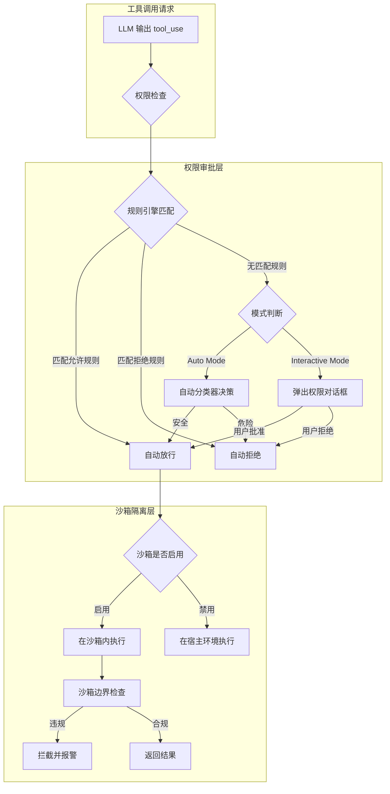
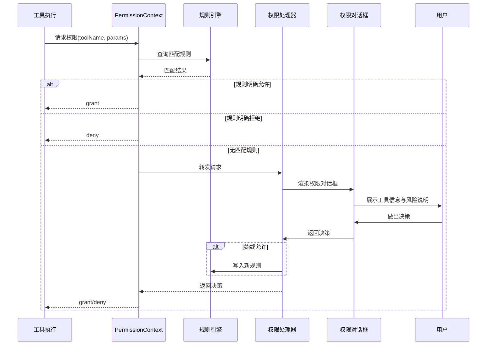
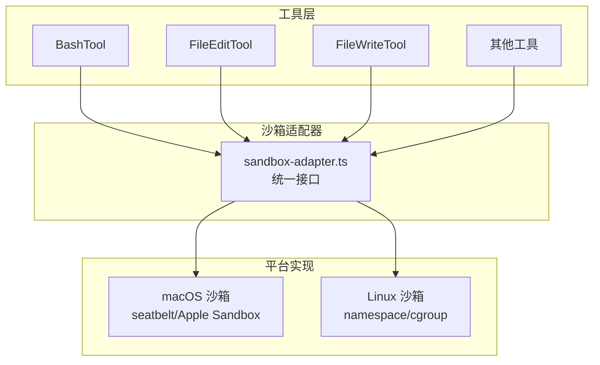

Claude Code 作为一个拥有 50+ 内置工具的 AI 编程助手，其核心安全挑战在于：**如何让智能体自主执行文件编辑、Shell 命令等高危操作的同时，避免对用户系统造成不可控损害？** 本页深入拆解 Claude Code 的两层防御体系——**权限审批流**（决定工具"能不能执行"）与**沙箱隔离机制**（决定工具"在什么边界内执行"），从权限模式切换、规则引擎、自动分类器到沙箱适配器，逐层揭示其安全架构的设计哲学与实现细节。

Sources: [permissions.ts](src/utils/permissions/permissions.ts), [PermissionMode.ts](src/utils/permissions/PermissionMode.ts), [sandbox-adapter.ts](src/utils/sandbox/sandbox-adapter.ts)

---

## 一、安全架构总览：双轨防御模型

Claude Code 的安全体系建立在两条互补的轨道之上：**权限审批**是逻辑门控，决定工具调用是否获得授权；**沙箱隔离**是物理边界，限制已授权工具的实际执行范围。两者共同构成"先审批、后隔离"的纵深防御。

权限审批层覆盖所有工具类型，从 Bash 命令到文件编辑，每种工具拥有专属的权限请求 UI 组件；沙箱隔离层则主要作用于文件系统操作和子进程执行，通过操作系统级沙箱提供运行时隔离。

Sources: [permissions.ts](src/utils/permissions/permissions.ts), [sandbox-adapter.ts](src/utils/sandbox/sandbox-adapter.ts)

---

## 二、权限模式：从严密交互到自主执行的光谱

### 2.1 三种权限模式

Claude Code 定义了三种权限模式，构成从"人机协同"到"完全自主"的光谱：

| 模式 | 交互方式 | 适用场景 | 会话默认 |
|------|---------|---------|---------|
| **Interactive** | 每次未知操作均弹窗确认 | 日常开发、对安全性要求高 | ✅ 默认模式 |
| **Auto** | 自动分类器决定放行/拒绝 | 长时间运行任务、CI 环境 | 需手动切换 |
| **Bypass** | 跳过所有权限检查 | 受信任环境、自动化流水线 | 需特殊命令启用 |

模式切换通过 `permissions` 斜杠命令完成，`getNextPermissionMode.ts` 实现了模式间的循环切换逻辑。Bypass 模式作为最高权限，设有独立的 killswitch 机制（`bypassPermissionsKillswitch.ts`）作为紧急熔断——即使启用了 Bypass 模式，killswitch 仍可在远程层面强制关闭该能力。

Sources: [PermissionMode.ts](src/utils/permissions/PermissionMode.ts), [getNextPermissionMode.ts](src/utils/permissions/getNextPermissionMode.ts), [bypassPermissionsKillswitch.ts](src/utils/permissions/bypassPermissionsKillswitch.ts)

### 2.2 Auto Mode 的分类器引擎

Auto Mode 的核心问题在于：**如何让机器代替人做安全决策？** Claude Code 采用基于 LLM 的 **yolo 分类器**（`yoloClassifier.ts`）实现这一目标。分类器的工作流程如下：

1. 工具调用请求抵达权限系统
2. 规则引擎未找到匹配规则
3. 系统将工具名称、参数、上下文组装为分类器输入
4. 分类器基于系统提示词（`yolo-classifier-prompts/`目录下的 `auto_mode_system_prompt.txt`）进行安全判定
5. 输出 `allow` 或 `deny` 决策

分类器的提示词分为两组：`permissions_anthropic.txt` 适用于 Anthropic 内部环境，`permissions_external.txt` 适用于外部用户，两者对"危险操作"的容忍度不同，体现了环境感知的安全策略。

`autoModeState.ts` 管理 Auto Mode 的状态，而 `classifierDecision.ts` 和 `classifierShared.ts` 封装了分类器的输入输出数据结构和共享逻辑。

Sources: [yoloClassifier.ts](src/utils/permissions/yoloClassifier.ts), [autoModeState.ts](src/utils/permissions/autoModeState.ts), [classifierDecision.ts](src/utils/permissions/classifierDecision.ts)

### 2.3 拒绝追踪与防骚扰机制

当分类器或用户拒绝某个工具调用时，系统会记录拒绝历史（`denialTracking.ts`）。这一机制有两个目的：一是为"近期拒绝"标签页（`RecentDenialsTab.tsx`）提供数据源，让用户了解自己拒绝的模式；二是防止智能体在相同操作上反复请求——连续拒绝会触发"停止追问"逻辑，避免用户体验被恶化。

Sources: [denialTracking.ts](src/utils/permissions/denialTracking.ts), [RecentDenialsTab.tsx](src/components/permissions/rules/RecentDenialsTab.tsx)

---

## 三、规则引擎：权限决策的核心逻辑

### 3.1 权限规则的数据模型

权限规则是权限系统的原子决策单元。每条规则定义了"对什么工具、在什么条件下、做出什么决策"：

| 字段 | 含义 | 示例 |
|------|------|------|
| **工具类型** | 规则适用的工具 | `Bash`、`FileEdit`、`MCP` |
| **操作模式** | 允许或拒绝 | `allow`、`deny` |
| **匹配模式** | 参数匹配规则 | glob 模式、正则表达式 |
| **作用范围** | 规则的边界 | 项目级、用户级 |

规则的持久化存储在项目 `.claude/` 目录和用户全局配置中，`permissionsLoader.ts` 负责在会话启动时加载所有层级的规则，`permissionRuleParser.ts` 实现规则文本的解析语法。

Sources: [PermissionRule.ts](src/utils/permissions/PermissionRule.ts), [permissionsLoader.ts](src/utils/permissions/permissionsLoader.ts), [permissionRuleParser.ts](src/utils/permissions/permissionRuleParser.ts)

### 3.2 规则匹配与阴影检测

当工具调用抵达权限系统时，`permissions.ts` 中的核心逻辑按以下顺序执行匹配：

1. **精确匹配优先**：检查是否有规则精确匹配当前工具+参数
2. **模式匹配次之**：使用 glob/正则匹配参数模式
3. **默认策略兜底**：无匹配规则时根据当前模式决定行为

`shellRuleMatching.ts` 专门处理 Bash/PowerShell 工具的规则匹配——Shell 命令的匹配比文件路径更复杂，需要解析命令名、参数、管道链等。`shadowedRuleDetection.ts` 则检测"阴影规则"——即被更高优先级规则覆盖而永远无法触发的规则，帮助用户识别和清理冗余配置。

Sources: [permissions.ts](src/utils/permissions/permissions.ts), [shellRuleMatching.ts](src/utils/permissions/shellRuleMatching.ts), [shadowedRuleDetection.ts](src/utils/permissions/shadowedRuleDetection.ts)

### 3.3 危险模式识别

`dangerousPatterns.ts` 硬编码了一组高风险操作的正则模式，例如 `rm -rf /`、`sudo`、`chmod 777` 等极具破坏性的命令。这些模式在任何权限模式下都会被标记为高危险，在 Interactive 模式中会以醒目的警告提示用户，在 Auto 模式中大概率被分类器拒绝。这一静态规则层为动态分类器提供了兜底保护——即使分类器误判，危险模式仍能拦截已知的高危操作。

Sources: [dangerousPatterns.ts](src/utils/permissions/dangerousPatterns.ts)

---

## 四、审批流的处理器架构

### 4.1 三种权限处理器

权限请求的处理方式取决于当前的执行上下文，`src/hooks/toolPermission/handlers/` 目录下定义了三种处理器：

| 处理器 | 文件 | 适用场景 | 决策方式 |
|--------|------|---------|---------|
| **Interactive Handler** | `interactiveHandler.ts` | 主会话、用户在场 | 弹出 UI 对话框，等待用户操作 |
| **Coordinator Handler** | `coordinatorHandler.ts` | Coordinator 编排模式 | Worker 的权限请求转发给主会话 |
| **Swarm Worker Handler** | `swarmWorkerHandler.ts` | Swarm 并行执行模式 | Worker 内部自主决策或向主进程请求 |

**Interactive Handler** 是最常见的处理器，它触发 React 组件渲染权限对话框，用户可以选择"允许一次"、"始终允许此模式"或"拒绝"。选择"始终允许"会自动生成一条权限规则并持久化，后续同类操作将自动放行。

**Coordinator Handler** 体现了多 Agent 场景下的权限代理：Worker Agent 无直接 UI 访问权，其权限请求通过消息通道转发至主会话，由用户在主会话界面统一审批。`WorkerPendingPermission.tsx` 和 `WorkerBadge.tsx` 组件在主界面中展示待审批的 Worker 权限请求。

Sources: [interactiveHandler.ts](src/hooks/toolPermission/handlers/interactiveHandler.ts), [coordinatorHandler.ts](src/hooks/toolPermission/handlers/coordinatorHandler.ts), [swarmWorkerHandler.ts](src/hooks/toolPermission/handlers/swarmWorkerHandler.ts), [WorkerPendingPermission.tsx](src/components/permissions/WorkerPendingPermission.tsx)

### 4.2 权限上下文与审批流程

`PermissionContext.ts` 是权限检查的入口点，它持有当前会话的权限状态，协调规则引擎与处理器的交互。当权限决策完成后，结果通过 `PermissionResult.ts` 定义的类型返回给工具执行层。

Sources: [PermissionContext.ts](src/hooks/toolPermission/PermissionContext.ts), [PermissionResult.ts](src/utils/permissions/PermissionResult.ts)

---

## 五、权限 UI：面向工具类型的专属审批组件

### 5.1 组件矩阵

Claude Code 为每种工具类型设计了独立的权限请求组件，确保用户能清晰理解请求内容并做出知情决策：

| 工具类型 | 权限组件 | 核心信息展示 |
|---------|---------|------------|
| **Bash** | `BashPermissionRequest/` | 完整命令、危险等级、分类器解释 |
| **FileEdit** | `FileEditPermissionRequest/` | 文件路径、编辑差异预览 |
| **FileWrite** | `FileWritePermissionRequest/` | 目标路径、写入内容预览、Diff 视图 |
| **NotebookEdit** | `NotebookEditPermissionRequest/` | Notebook Cell 编辑差异 |
| **SedEdit** | `SedEditPermissionRequest/` | 流编辑命令与替换预览 |
| **PowerShell** | `PowerShellPermissionRequest/` | PowerShell 命令内容 |
| **Filesystem** | `FilesystemPermissionRequest/` | 文件系统操作类型与路径 |
| **WebFetch** | `WebFetchPermissionRequest/` | 目标 URL 地址 |
| **Skill** | `SkillPermissionRequest/` | 技能名称与描述 |
| **ComputerUse** | `ComputerUseApproval/` | 屏幕截图与操作预览 |
| **Monitor** | `MonitorPermissionRequest/` | 监控目标与范围 |
| **Sandbox** | `SandboxPermissionRequest.tsx` | 沙箱操作请求 |

通用组件 `FallbackPermissionRequest.tsx` 作为兜底，为未注册专属组件的工具类型提供基础权限请求 UI。

Sources: [BashPermissionRequest/](src/components/permissions/BashPermissionRequest/BashPermissionRequest.tsx), [FileEditPermissionRequest/](src/components/permissions/FileEditPermissionRequest/FileEditPermissionRequest.tsx), [FallbackPermissionRequest.tsx](src/components/permissions/FallbackPermissionRequest.tsx)

### 5.2 Bash 权限请求的深度设计

Bash 工具是权限系统中风险最高的工具，其权限请求组件也最为精细：

- **命令展示**：完整显示待执行命令，高亮危险参数
- **分类器解释**（`permissionExplainer.ts`）：当 Auto 模式做出拒绝决策时，展示分类器的推理过程，让用户理解"为什么被拒绝"
- **Shell 权限反馈**（`useShellPermissionFeedback.ts`）：根据命令类型动态调整反馈信息
- **工具选项**（`bashToolUseOptions.tsx`）：提供"允许一次"、"始终允许此类命令"等选项

Sources: [BashPermissionRequest.tsx](src/components/permissions/BashPermissionRequest/BashPermissionRequest.tsx), [bashToolUseOptions.tsx](src/components/permissions/BashPermissionRequest/bashToolUseOptions.tsx), [permissionExplainer.ts](src/utils/permissions/permissionExplainer.ts), [useShellPermissionFeedback.ts](src/components/permissions/useShellPermissionFeedback.ts)

### 5.3 文件权限对话框的差异预览

文件编辑/写入操作的权限对话框集成了差异预览能力，这是 Claude Code 安全 UX 的亮点设计。`FilePermissionDialog/` 目录下的 `useFilePermissionDialog.ts` 和 `usePermissionHandler.ts` 协同工作，不仅展示"要修改什么文件"，还通过 Diff 视图展示"具体修改了什么内容"。`ideDiffConfig.ts` 允许用户将差异视图发送到 IDE 中审查，`permissionOptions.tsx` 则定义了文件操作的权限选项（允许一次、始终允许对此文件的编辑等）。

Sources: [FilePermissionDialog.tsx](src/components/permissions/FilePermissionDialog/FilePermissionDialog.tsx), [useFilePermissionDialog.ts](src/components/permissions/FilePermissionDialog/useFilePermissionDialog.ts), [ideDiffConfig.ts](src/components/permissions/FilePermissionDialog/ideDiffConfig.ts)

---

## 六、规则管理 UI：可视化权限配置

### 6.1 规则管理界面

`src/components/permissions/rules/` 目录提供了权限规则的可视化管理界面：

| 组件 | 功能 |
|------|------|
| `PermissionRuleList.tsx` | 展示当前所有规则的列表 |
| `PermissionRuleInput.tsx` | 输入新规则的表单 |
| `PermissionRuleDescription.tsx` | 规则的人类可读描述 |
| `AddPermissionRules.tsx` | 批量添加规则的入口 |
| `AddWorkspaceDirectory.tsx` | 将工作区目录加入白名单 |
| `RemoveWorkspaceDirectory.tsx` | 移除工作区目录白名单 |
| `WorkspaceTab.tsx` | 工作区范围规则的标签页 |
| `RecentDenialsTab.tsx` | 近期拒绝记录标签页 |

用户可以通过 `permissions` 斜杠命令（`src/commands/permissions/`）打开规则管理界面，也可通过 `--dangerously-skip-permissions` CLI 参数直接启用 Bypass 模式（仅供受信任环境使用）。

Sources: [PermissionRuleList.tsx](src/components/permissions/rules/PermissionRuleList.tsx), [PermissionRuleInput.tsx](src/components/permissions/rules/PermissionRuleInput.tsx), [permissions.tsx](src/commands/permissions/permissions.tsx)

---

## 七、沙箱隔离：操作系统级安全边界

### 7.1 沙箱适配器架构

沙箱系统通过 **适配器模式**（`sandbox-adapter.ts`）抽象不同操作系统的沙箱实现。这种设计使 Claude Code 能在 macOS、Linux 等不同平台上使用各自最优的沙箱技术，而工具层代码无需关心底层差异。

`sandbox-ui-utils.ts` 为沙箱相关的 UI 交互提供辅助函数，而 `src/components/sandbox/` 目录则包含了完整的沙箱管理界面：

| 组件 | 功能 |
|------|------|
| `SandboxSettings.tsx` | 沙箱设置主界面 |
| `SandboxConfigTab.tsx` | 沙箱配置标签页 |
| `SandboxDependenciesTab.tsx` | 沙箱依赖管理标签页 |
| `SandboxOverridesTab.tsx` | 沙箱规则覆盖标签页 |
| `SandboxDoctorSection.tsx` | 沙箱健康检查区域 |

Sources: [sandbox-adapter.ts](src/utils/sandbox/sandbox-adapter.ts), [sandbox-ui-utils.ts](src/utils/sandbox/sandbox-ui-utils.ts), [SandboxSettings.tsx](src/components/sandbox/SandboxSettings.tsx)

### 7.2 沙箱违规检测与展示

当工具在沙箱内的操作越过边界时，`SandboxViolationExpandedView.tsx` 组件以展开视图展示违规详情——包括尝试访问的路径、被拒绝的系统调用、以及沙箱策略的具体限制。这一组件让用户能在权限审批的上下文中理解安全事件，而非面对晦涩的系统错误信息。

沙箱边界检查遵循 **最小权限原则**：默认拒绝所有文件系统和网络访问，仅开放显式声明的白名单路径和端口。用户通过 `SandboxOverridesTab.tsx` 可以声明额外的允许路径，但这些覆盖规则本身也受到审计。

Sources: [SandboxViolationExpandedView.tsx](src/components/SandboxViolationExpandedView.tsx), [SandboxOverridesTab.tsx](src/components/sandbox/SandboxOverridesTab.tsx)

### 7.3 沙箱开关与模式切换

`sandbox-toggle` 斜杠命令（`src/commands/sandbox-toggle/`）允许用户在会话中动态启用或禁用沙箱。这一设计承认了安全性与灵活性的权衡：开发初期可能需要更宽松的执行环境来快速迭代，而在生产代码操作时则需要严格的沙箱保护。

`SandboxPermissionRequest.tsx` 处理沙箱操作自身的权限请求——即使工具调用已通过权限审批，如果沙箱策略不允许该操作，仍需弹出沙箱权限请求，形成**双重确认**机制。

Sources: [sandbox-toggle.tsx](src/commands/sandbox-toggle/sandbox-toggle.tsx), [SandboxPermissionRequest.tsx](src/components/permissions/SandboxPermissionRequest.tsx)

---

## 八、文件系统权限的路径验证

`pathValidation.ts` 和 `filesystem.ts` 构成了文件系统权限的专项安全层。路径验证器执行以下检查：

1. **路径规范化**：将相对路径转换为绝对路径，消除 `..` 和符号链接的歧义
2. **范围检查**：验证目标路径是否在项目工作区内
3. **敏感路径保护**：检测对 `.ssh/`、`.gnupg/`、系统目录等敏感路径的访问
4. **写入保护**：对二进制文件、隐藏文件、`.env` 文件的写入施加额外审查

这些静态检查先于权限审批执行，作为快速拒绝已知不安全操作的早期过滤器，避免无意义的权限对话框弹出。

Sources: [pathValidation.ts](src/utils/permissions/pathValidation.ts), [filesystem.ts](src/utils/permissions/filesystem.ts)

---

## 九、Bash 命令分类器：从 Shell 语法到安全决策

`bashClassifier.ts` 实现了 Bash 命令的**语法感知分类**，这比简单的字符串匹配更精确：

- **命令提取**：从完整命令字符串中提取主命令名（处理管道、子 Shell、变量替换等场景）
- **参数分析**：识别关键参数的模式（如 `-rf` 标志、重定向目标）
- **风险分级**：基于命令结构将操作分为"读取安全"、"低风险写入"、"高风险破坏"等级别

`classifierApprovals.ts` 和 `classifierApprovalsHook.ts` 则管理分类器决策的审批记录——当分类器自动放行一个操作后，其决策依据被记录以供审计，用户可以在后续查看"Auto Mode 做了哪些安全决策"。

Sources: [bashClassifier.ts](src/utils/permissions/bashClassifier.ts), [classifierApprovals.ts](src/utils/classifierApprovals.ts), [classifierApprovalsHook.ts](src/utils/classifierApprovalsHook.ts)

---

## 十、权限更新的传播机制

当用户在权限对话框中选择"始终允许"时，系统需要执行以下操作：

1. **生成规则**（`PermissionUpdate.ts`）：根据工具类型和参数模式生成新的权限规则
2. **验证规则**（`PermissionUpdateSchema.ts`）：确保生成的规则语法正确且无安全冲突
3. **持久化规则**：将规则写入项目或用户级配置文件
4. **广播更新**：通知所有活跃的权限上下文刷新规则缓存

在多 Agent 场景（Coordinator、Swarm）中，规则更新需要跨进程传播。`swarmPermissionPoller`（`useSwarmPermissionPoller.ts`）定期轮询主进程的权限状态变更，确保 Worker Agent 能及时获取最新的权限规则。

Sources: [PermissionUpdate.ts](src/utils/permissions/PermissionUpdate.ts), [PermissionUpdateSchema.ts](src/utils/permissions/PermissionUpdateSchema.ts), [useSwarmPermissionPoller.ts](src/hooks/useSwarmPermissionPoller.ts)

---

## 十一、`useCanUseTool` Hook：权限检查的 React 集成点

`useCanUseTool.tsx` 是前端权限系统的核心 Hook，它将底层的权限基础设施桥接到 React 组件树。任何需要执行工具调用的组件都通过此 Hook 获取权限状态：

- **输入**：工具名称、工具参数、当前会话的权限模式
- **输出**：权限决策结果（`granted`/`denied`/`pending`）、权限请求回调、决策解释
- **副作用**：当决策为 `pending` 时，自动触发权限对话框的渲染

Sources: [useCanUseTool.tsx](src/hooks/useCanUseTool.tsx)

---

## 十二、安全策略的分层视图

将 Claude Code 的安全机制按纵深防御层次整理：

| 层次 | 机制 | 拦截时机 | 可配置性 |
|------|------|---------|---------|
| **L1: 静态检查** | 危险模式匹配、路径验证 | 工具调用发出前 | 硬编码，不可配置 |
| **L2: 规则引擎** | 权限规则匹配 | 权限检查阶段 | 用户可自定义规则 |
| **L3: 交互审批** | 权限对话框 | Interactive 模式下 | 用户实时决策 |
| **L4: 自动分类** | yolo 分类器 | Auto 模式下 | 通过提示词间接影响 |
| **L5: 沙箱隔离** | 操作系统级沙箱 | 工具执行时 | 可启用/禁用、可配置覆盖 |
| **L6: 全局熔断** | bypass killswitch | 远程控制 | 仅 Anthropic 侧控制 |

六层防线从静态到动态、从本地到远程，形成完整的安全纵深。每一层都能独立拦截危险操作，任何单层失效都不会导致系统完全暴露。

Sources: [dangerousPatterns.ts](src/utils/permissions/dangerousPatterns.ts), [permissions.ts](src/utils/permissions/permissions.ts), [yoloClassifier.ts](src/utils/permissions/yoloClassifier.ts), [sandbox-adapter.ts](src/utils/sandbox/sandbox-adapter.ts), [bypassPermissionsKillswitch.ts](src/utils/permissions/bypassPermissionsKillswitch.ts)

---

## 扩展阅读

- 关于工具系统的整体注册与调度机制，参见 [工具系统：50+ 内置工具的注册、调度与权限管控](5-gong-ju-xi-tong-50-nei-zhi-gong-ju-de-zhu-ce-diao-du-yu-quan-xian-guan-kong)
- 关于 Coordinator/Swarm 多 Agent 场景下的权限代理架构，参见 [Coordinator：多 Agent 编排与 Worker 并行执行](14-coordinator-duo-agent-bian-pai-yu-worker-bing-xing-zhi-xing)
- 关于远程会话中的权限桥接机制，参见 [远程会话：SSH 连接、远程环境与 Direct Connect 会话管理](22-yuan-cheng-hui-hua-ssh-lian-jie-yuan-cheng-huan-jing-yu-direct-connect-hui-hua-guan-li)
- 关于配置体系的分层机制（权限规则持久化的底层支撑），参见 [配置体系：分层配置、设置同步与托管环境变量](24-pei-zhi-ti-xi-fen-ceng-pei-zhi-she-zhi-tong-bu-yu-tuo-guan-huan-jing-bian-liang)
- 关于 Feature Flag 对权限模式切换的影响，参见 [三层门控体系：编译开关、用户类型与远程 Feature Flag](16-san-ceng-men-kong-ti-xi-bian-yi-kai-guan-yong-hu-lei-xing-yu-yuan-cheng-feature-flag)