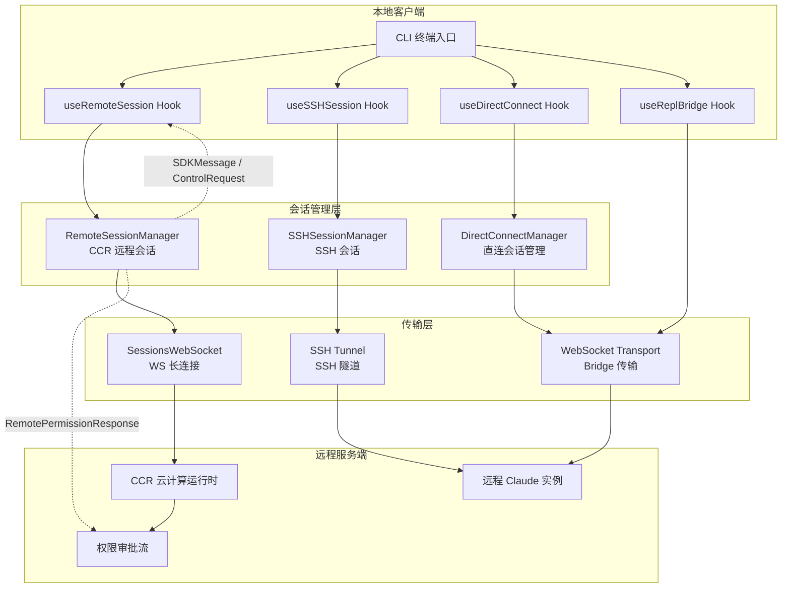
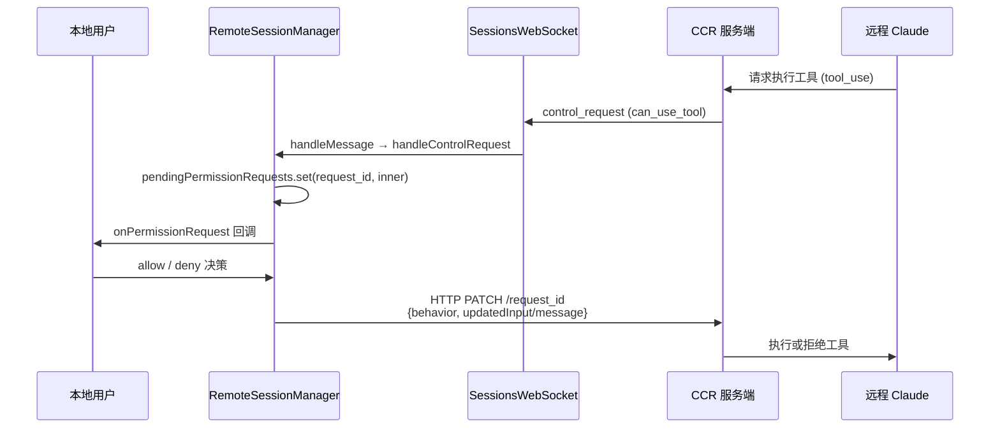

Claude Code 的远程会话系统构建了一套从本地终端到远程计算环境的完整连接拓扑，涵盖 SSH 隧道接入、CCR（Cloud Compute Runtime）远程会话管理、Direct Connect 直连会话创建与 Bridge 双向通道四大子系统。这套架构使得开发者可以在本地终端操控远程服务器上的 Claude 实例，实现跨环境、跨网络的 AI 辅助编程体验。本文将从架构全貌出发，逐层剖析每个子系统的内部机制、数据流与权限管控模型。

Sources: [SSHSessionManager.ts](src/ssh/SSHSessionManager.ts#L1-L2), [RemoteSessionManager.ts](src/remote/RemoteSessionManager.ts#L1-L34), [directConnectManager.ts](src/server/directConnectManager.ts#L1)

## 架构全貌：三层远程连接拓扑

远程会话系统的核心设计遵循一个清晰的分层原则：**传输层**负责建立物理连接（SSH/WS），**会话层**负责管理会话生命周期与消息路由，**控制层**负责权限审批与交互协调。三层之间通过回调接口与事件驱动解耦，使得同一套消息协议可以复用于不同的传输通道。

Sources: [RemoteSessionManager.ts](src/remote/RemoteSessionManager.ts#L87-L103), [directConnectManager.ts](src/server/directConnectManager.ts#L1), [useRemoteSession.ts](src/hooks/useRemoteSession.ts#L1), [useSSHSession.ts](src/hooks/useSSHSession.ts#L1), [useDirectConnect.ts](src/hooks/useDirectConnect.ts#L1)

## SSH 会话系统：远程服务器的安全接入

SSH 会话系统是 Claude Code 与远程计算环境建立安全信道的入口。从源码结构来看，`SSHSessionManager` 和 `createSSHSession` 当前以骨架形态存在，预示着这是一个处于活跃开发中的功能模块，其核心职责是封装 SSH 连接的建立、认证与隧道管理。

### SSH 连接建立流程

`createSSHSession` 函数作为 SSH 会话的工厂方法，返回一个 `SSHSession` 类型实例。当前实现中 `SSHSession` 被定义为 `Record<string, unknown>`，这一松散类型设计表明该接口正处于快速迭代期，最终将收敛为包含连接参数、隧道配置与认证凭据的强类型定义。整个 SSH 连接的编排逻辑由 `useSSHSession` Hook 驱动，该 Hook 在 React 组件树中管理 SSH 连接的生命周期状态——从连接中、已连接到断开连接的状态转换。对应的 `remote-setup` 和 `remote-env` 斜杠命令则为用户提供了 SSH 环境的初始化与配置入口。

Sources: [createSSHSession.ts](src/ssh/createSSHSession.ts#L1-L6), [SSHSessionManager.ts](src/ssh/SSHSessionManager.ts#L1-L2), [useSSHSession.ts](src/hooks/useSSHSession.ts#L1)

### SSH 环境配置与命令入口

Claude Code 提供了两个与 SSH/远程环境直接相关的斜杠命令：`/remote-setup` 负责在远程服务器上安装和配置 Claude Code 运行时环境，`/remote-env` 则用于查看和切换当前远程环境配置。这两个命令的存在揭示了 SSH 会话系统的设计意图——不仅是建立连接，还要确保远程端具备完整的 Claude Code 执行环境，包括 Node.js 运行时、MCP 服务器配置和项目文件系统挂载。

在 UI 层面，`RemoteEnvironmentDialog` 组件提供了远程环境配置的可视化界面，而 `RemoteCallout` 组件则在 REPL 状态栏中指示当前会话的远程/本地运行模式，让用户始终清楚自己在操作哪个环境。

Sources: [remote-setup](src/commands/remote-setup/index.ts#L1), [remote-env](src/commands/remote-env/index.ts#L1), [RemoteEnvironmentDialog.tsx](src/components/RemoteEnvironmentDialog.tsx#L1), [RemoteCallout.tsx](src/components/RemoteCallout.tsx#L1)

## CCR 远程会话管理：WebSocket 驱动的事件流

**RemoteSessionManager** 是远程会话系统的核心引擎，它通过 WebSocket 长连接与 CCR（Cloud Compute Runtime）服务端保持实时通信，同时通过 HTTP POST 发送用户消息。这种非对称通信架构的设计考量在于：下行消息（AI 响应、控制请求）需要实时推送因此使用 WebSocket，而上行消息（用户输入、权限响应）需要可靠送达因此使用 HTTP。

### 消息分类与路由机制

RemoteSessionManager 的 `handleMessage` 方法实现了一套精密的消息分类路由系统，它将 WebSocket 接收到的消息分为四类并分别处理：

| 消息类型 | 标识字段 | 处理策略 | 用途 |
|---|---|---|---|
| **SDKMessage** | 非 `control_*` 类型 | 转发至 `onMessage` 回调 | AI 响应、工具输出等业务数据 |
| **control_request** | `type === 'control_request'` | 进入权限审批流 | 服务端请求客户端审批工具执行 |
| **control_cancel_request** | `type === 'control_cancel_request'` | 清除待审请求并通知 | 服务端取消已发出的权限请求 |
| **control_response** | `type === 'control_response'` | 日志记录（空操作） | 确认类响应的 ACK |

类型守卫函数 `isSDKMessage` 采用排除法：如果消息类型不是三种控制消息之一，则判定为 SDKMessage。这种设计保证了即使未来新增控制消息类型，也能安全地被过滤而非误传。

Sources: [RemoteSessionManager.ts](src/remote/RemoteSessionManager.ts#L146-L184), [RemoteSessionManager.ts](src/remote/RemoteSessionManager.ts#L22-L34)

### 配置模型与回调契约

`RemoteSessionConfig` 定义了建立远程会话所需的最小配置集：`sessionId` 标识目标会话、`getAccessToken` 以惰性求值方式提供认证令牌（避免令牌过期问题）、`orgUuid` 标识组织上下文。两个可选标志位各有深意——`hasInitialPrompt` 告知管理器该会话是否携带初始提示正在处理中，`viewerOnly` 则将客户端降级为纯观察者模式：在此模式下 Ctrl+C/Escape 不发送中断信号、60 秒重连超时被禁用、会话标题永不更新。这个 `viewerOnly` 模式正是 `claude assistant` 命令的实现基础。

`RemoteSessionCallbacks` 以回调契约的方式定义了客户端与 RemoteSessionManager 之间的交互协议。关键回调包括 `onMessage`（业务消息到达）、`onPermissionRequest`（权限审批请求到达）、`onPermissionCancelled`（审批请求被服务端取消）、以及连接状态变更回调 `onConnected`/`onDisconnected`/`onReconnecting`。这种回调驱动的设计使得 RemoteSessionManager 可以在完全不了解 UI 实现细节的情况下运作——React Hook 桥接层 `useRemoteSession` 负责将这些回调映射为状态更新。

Sources: [RemoteSessionManager.ts](src/remote/RemoteSessionManager.ts#L50-L85), [RemoteSessionManager.ts](src/remote/RemoteSessionManager.ts#L95-L103)

### 权限审批流：远程环境的安全阀门

远程会话中的权限审批是一个特别精妙的设计。当远程 Claude 实例需要执行一个需要用户确认的操作（如运行 bash 命令、写入文件）时，CCR 服务端通过 WebSocket 推送一条 `control_request` 消息，其中 `inner.subtype === 'can_use_tool'` 携带了工具名称和输入参数。RemoteSessionManager 收到后将此请求存入 `pendingPermissionRequests` Map 并通过 `onPermissionRequest` 回调上抛至 UI 层。

用户在本地终端做出决策后，审批结果通过 `respondToPermission` 方法回传。该方法支持两种响应：`allow`（附带可选的 `updatedInput` 修改工具参数）和 `deny`（附带拒绝原因）。响应通过 HTTP PATCH 发送至 CCR 服务端，URL 中嵌入 `request_id` 以实现请求-响应的精确匹配。这一机制意味着**用户可以在本地终端审批远程服务器上的操作**，实现了跨环境的权限管控闭环。

Sources: [RemoteSessionManager.ts](src/remote/RemoteSessionManager.ts#L186-L236), [RemoteSessionManager.ts](src/remote/RemoteSessionManager.ts#L40-L48)

### 连接韧性与重连策略

RemoteSessionManager 将连接韧性的实现委托给了 `SessionsWebSocket`。当 WebSocket 连接意外断开时，`SessionsWebSocketCallbacks` 的 `onReconnecting` 回调被触发，RemoteSessionManager 将此状态透传至 UI 层（显示重连指示器）。`onClose` 回调仅在重连彻底失败时触发，标记会话为断开状态。这种设计将重连的指数退避和抖动策略封装在 WebSocket 层，使得会话管理层只需关注连接的语义状态而非底层重试细节。

Sources: [RemoteSessionManager.ts](src/remote/RemoteSessionManager.ts#L108-L141), [SessionsWebSocket.ts](src/remote/SessionsWebSocket.ts#L1)

## Direct Connect 直连会话：去中心化的点对点连接

Direct Connect 是远程会话系统中的一条独立通道，它绕过 CCR 云端中转，在本地客户端与远程 Claude 实例之间建立直接的 WebSocket 连接。这一架构选择的优势在于降低延迟（消除云端中转跳数）和提高隐私性（数据不经第三方），代价是需要自行管理连接寻址与 NAT 穿透。

### 会话创建与管理

`createDirectConnectSession` 是直连会话的工厂函数，负责初始化会话参数并建立 WebSocket 连接。`DirectConnectManager` 作为管理器维护所有活跃的直连会话实例，提供会话的查找、创建与销毁操作。`useDirectConnect` Hook 将这些能力桥接至 React 组件树，使得 UI 可以响应直连会话的状态变化。

直连会话的传输层复用了 Bridge 系统的 `replBridgeTransport`，这意味着 Direct Connect 与 [Bridge：远程遥控终端的 WebSocket 双向通道](15-bridge-yuan-cheng-yao-kong-zhong-duan-de-websocket-shuang-xiang-tong-dao) 共享底层传输协议，但在应用层消息格式上有所不同——Bridge 面向的是本地终端的远程遥控，而 Direct Connect 面向的是完全独立的远程会话。

Sources: [createDirectConnectSession.ts](src/server/createDirectConnectSession.ts#L1), [directConnectManager.ts](src/server/directConnectManager.ts#L1), [useDirectConnect.ts](src/hooks/useDirectConnect.ts#L1), [types.ts](src/server/types.ts#L1)

### 服务端类型定义

`src/server/types.ts` 定义了 Direct Connect 会话的服务端类型契约。这些类型涵盖了会话创建请求、会话状态枚举、WebSocket 消息格式等核心数据结构，是直连系统与外部世界的类型边界。类型系统的严谨设计确保了即使在网络分区等异常场景下，消息解析也不会导致运行时崩溃。

Sources: [types.ts](src/server/types.ts#L1)

## Bridge 远程核心：remoteBridgeCore 的角色

`remoteBridgeCore` 是 Bridge 子系统中专门处理远程会话的模块，它充当了本地 Bridge 引擎与远程传输层之间的胶水层。当 Bridge 配置为远程模式（`bridgeConfig` 中 `remote` 标志为 true）时，消息不经过本地 REPL 管道，而是通过 `remoteBridgeCore` 路由至远程 WebSocket 端点。

这一设计使得 Bridge 系统能够以「透明代理」的方式工作：上层调用代码无需区分本地 Bridge 和远程 Bridge，消息的序列化、传输与反序列化完全由 `remoteBridgeCore` 在内部完成。`capacityWake` 模块则提供了远程会话的唤醒机制——当远程计算资源处于休眠状态时，`capacityWake` 可以通过配置的唤醒策略（如 HTTP webhook）将其激活，确保会话消息能够被及时处理。

Sources: [remoteBridgeCore.ts](src/bridge/remoteBridgeCore.ts#L1), [capacityWake.ts](src/bridge/capacityWake.ts#L1), [bridgeConfig.ts](src/bridge/bridgeConfig.ts#L1)

## 远程权限桥接：remotePermissionBridge

远程会话中的权限审批需要一个独立的桥接模块 `remotePermissionBridge`，它解决了 CCR 权限审批流与本地 Bridge 权限系统之间的协议适配问题。当远程 Claude 实例通过 CCR 发起权限请求时，消息格式是 `SDKControlPermissionRequest`；而本地 Bridge 权限系统使用的是另一套内部格式。`remotePermissionBridge` 负责在两种格式之间进行双向转换，并确保审批结果的语义一致性——本地系统的「allow with modifications」需要被正确映射为 RemotePermissionResponse 的 `allow` + `updatedInput`。

Sources: [remotePermissionBridge.ts](src/remote/remotePermissionBridge.ts#L1)

## SDK 消息适配器：sdkMessageAdapter

`sdkMessageAdapter` 是远程会话系统与 SDK 事件模型之间的适配层。远程会话收到的原始 WebSocket 消息可能是多种格式的混合体（SDK 消息、控制消息、心跳包等），`sdkMessageAdapter` 负责将这些原始消息规范化为统一的 SDK 事件流，供上层消费。这一适配层使得远程会话与本地会话在消息模型上实现了统一——无论会话运行在本地还是远程，上层代码都以相同的方式处理消息事件。

Sources: [sdkMessageAdapter.ts](src/remote/sdkMessageAdapter.ts#L1)

## 三种远程通道的对比与选型

| 维度 | SSH 会话 | CCR 远程会话 | Direct Connect |
|---|---|---|---|
| **传输协议** | SSH 隧道 | WebSocket + HTTP | WebSocket 直连 |
| **中间层** | SSH Server | CCR 云端运行时 | 无（点对点） |
| **延迟特性** | 取决于 SSH 跳数 | 云端中转增加 1-2 跳 | 最低（直连） |
| **权限模型** | 继承 SSH 认证 | CCR 控制面审批 | 本地 Bridge 审批 |
| **连接韧性** | SSH keepalive | 指数退避重连 | 依赖传输层重连 |
| **隐私级别** | 端到端加密 | 经云端中转 | 端到端（需自建 TLS） |
| **适用场景** | 已有 SSH 基础设施 | 云原生化部署 | 低延迟/高隐私需求 |
| **成熟度** | 骨架阶段（开发中） | 已完整实现 | 已实现 |

Sources: [SSHSessionManager.ts](src/ssh/SSHSessionManager.ts#L1-L2), [RemoteSessionManager.ts](src/remote/RemoteSessionManager.ts#L95-L103), [directConnectManager.ts](src/server/directConnectManager.ts#L1), [createDirectConnectSession.ts](src/server/createDirectConnectSession.ts#L1)

## 会话管理 Hook 层：React 桥接

三个核心 Hook——`useRemoteSession`、`useSSHSession`、`useDirectConnect`——构成了远程会话在 React 组件树中的桥接层。它们的共同设计模式是：在 Hook 内部实例化对应的 Manager 类，将 Manager 的回调映射为 React 状态更新，并向外暴露连接状态、消息列表和操作方法。

具体而言，`useRemoteSession` 管理 `RemoteSessionManager` 的生命周期，将 `onMessage` 回调转化为消息状态数组的追加操作、将 `onPermissionRequest` 转化为待审批请求的状态更新。`useSessionBackgrounding` Hook 则与远程会话密切配合，处理会话进入后台时的资源释放与恢复逻辑——当用户切换到其他任务时，远程会话的 WebSocket 连接被优雅降级为低频轮询模式，以节省网络带宽和电量。`useIdeConnectionStatus` 在 IDE 集成场景中为远程会话提供额外的连接状态指示。

Sources: [useRemoteSession.ts](src/hooks/useRemoteSession.ts#L1), [useSSHSession.ts](src/hooks/useSSHSession.ts#L1), [useDirectConnect.ts](src/hooks/useDirectConnect.ts#L1), [useSessionBackgrounding.ts](src/hooks/useSessionBackgrounding.ts#L1)

## Teleport 与远程会话的交汇

远程会话系统与 [Ultraplan：云端深度规划与 Teleport 会话传输](13-ultraplan-yun-duan-shen-du-gui-hua-yu-teleport-hui-hua-chuan-shu) 中的 Teleport 功能存在深层交汇。`sendEventToRemoteSession` 函数（从 `utils/teleport/api` 导入）是 Teleport 系统向远程会话注入事件的通道——当用户在使用 Teleport 传输会话上下文时，远程会话管理器通过此函数接收传输过来的事件数据。这使得一个完整的跨环境工作流成为可能：在本地启动规划 → 通过 Teleport 传输至远程环境 → 远程 Claude 实例基于规划上下文继续执行。

Sources: [RemoteSessionManager.ts](src/remote/RemoteSessionManager.ts#L10-L13), [teleport.tsx](src/utils/teleport.tsx#L1)

## 关键设计决策与权衡

远程会话系统的架构选择体现了几个深层设计决策：

**非对称通信架构**（WS 下行 + HTTP 上行）的权衡在于：WebSocket 保证了 AI 响应和权限请求的实时推送达，而 HTTP POST 保证了用户输入的可靠投递和精确的请求-响应匹配。代价是 HTTP 的额外延迟和连接开销，但对用户交互场景而言这一代价可接受。

**viewerOnly 模式**的引入解决了 `claude assistant` 场景下的安全需求——纯观察者不应具有中断远程会话的能力。这一设计决策通过在配置层面而非权限层面实现，保持了权限系统的简洁性。

**权限审批的跨网络穿透**是整个系统最核心的安全创新。传统的远程执行方案要么完全信任远程端（无审批）、要么在远程端弹出审批提示（用户可能不在远程端）。Claude Code 的方案是将审批请求通过网络传回本地终端，让用户在自己能感知的环境中做出安全决策，同时通过 `updatedInput` 字段允许用户修改工具参数（如将 `rm -rf /` 修改为 `rm -rf /tmp/old`），这在安全性和灵活性之间取得了精妙平衡。