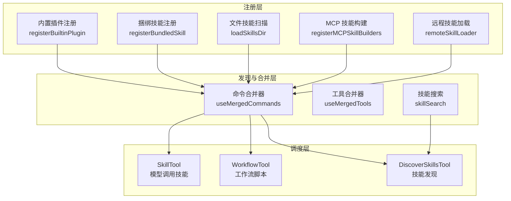

Claude Code 的扩展能力由两条互补的轴线构成：**插件系统**（Plugin）提供用户可启禁的容器化功能包，**技能系统**（Skill）则为 AI 模型提供可调用的结构化提示词命令。两者共享底层注册机制，但生命周期、加载路径和管控粒度截然不同。本文将深入解析插件注册与启禁逻辑、技能的多源发现与 frontmatter 解析、MCP 技能桥接，以及远程技能市场与工作流脚本的完整链路。

Sources: [builtinPlugins.ts](src/plugins/builtinPlugins.ts#L1-L160), [bundledSkills.ts](src/skills/bundledSkills.ts#L1-L221), [loadSkillsDir.ts](src/skills/loadSkillsDir.ts#L1-L200)

## 架构总览：插件与技能的双轴扩展模型

插件和技能在架构层面遵循"注册→发现→合并→调度"的统一流水线，但各自拥有独立的注册表和生命周期管理：

**核心区分**：插件（Plugin）是面向用户的可启禁功能包，可包含技能、Hooks 和 MCP 服务器；技能（Skill）是对模型可见的命令单元，承载提示词内容和执行上下文。每个插件可以包含多个技能，但技能可以独立于插件存在。

Sources: [builtinPlugins.ts](src/plugins/builtinPlugins.ts#L1-L14), [loadSkillsDir.ts](src/skills/loadSkillsDir.ts#L67-L74)

## 插件系统：注册、启禁与清单管理

### 内置插件注册表

内置插件通过 `BuiltinPluginDefinition` 接口定义，以 `{name}@builtin` 格式作为唯一标识，与市场插件 `{name}@{marketplace}` 形成命名空间隔离。注册表使用 `Map<string, BuiltinPluginDefinition>` 存储，在 CLI 启动时通过 `initBuiltinPlugins()` 初始化。

| 属性 | 说明 |
|---|---|
| `name` | 插件名称，构成 pluginId 的前缀 |
| `description` | 在 `/plugin` UI 中展示的描述 |
| `version` | 插件版本号 |
| `defaultEnabled` | 无用户设置时的默认启禁状态（默认 `true`） |
| `isAvailable()` | 运行时可用性检查，返回 `false` 则完全隐藏 |
| `skills` | 包含的技能定义数组 |
| `hooks` | 插件级 Hooks 配置 |
| `mcpServers` | 插件级 MCP 服务器配置 |

启禁判定遵循三级优先链：**用户设置 > 插件默认值 > true**。在 `getBuiltinPlugins()` 中，系统读取 `settings.enabledPlugins[pluginId]` 的布尔值，若用户未设置则回退到 `definition.defaultEnabled`，最终默认为启用。

Sources: [builtinPlugins.ts](src/plugins/builtinPlugins.ts#L21-L102), [bundled/index.ts](src/plugins/bundled/index.ts#L1-L24)

### 插件到命令的映射

启用插件的技能通过 `getBuiltinPluginSkillCommands()` 转换为 `Command[]` 对象，注入命令合并器。映射函数 `skillDefinitionToCommand()` 将每个 `BundledSkillDefinition` 转换为 `type: 'prompt'` 的命令，其 `source` 字段标记为 `'bundled'`（而非 `'builtin'`），这一设计选择确保插件技能仍然走技能工具的列表、分析和提示词截断豁免逻辑，而非被归入 `/help`、`/clear` 等硬编码斜杠命令。

Sources: [builtinPlugins.ts](src/plugins/builtinPlugins.ts#L108-L159)

### 插件安装与市场管理

插件生命周期中更完整的安装管理由 `PluginInstallationManager` 负责，它处理从市场下载、解压到注册的全流程。`pluginOperations.ts` 提供增删查改的基础操作，而 `pluginCliCommands.ts` 则将上述操作暴露为 `/plugin` 命令的子命令。

Sources: [PluginInstallationManager.ts](src/services/plugins/PluginInstallationManager.ts), [pluginOperations.ts](src/services/plugins/pluginOperations.ts), [pluginCliCommands.ts](src/services/plugins/pluginCliCommands.ts)

## 技能系统：从捆绑到文件的多源发现

### 捆绑技能：编译期内嵌

捆绑技能（Bundled Skills）随 CLI 二进制分发给所有用户，通过 `registerBundledSkill()` 在模块初始化阶段注册。其核心特征是 **延迟提取**（Lazy Extraction）：当技能定义包含 `files` 字段时，引用文件在首次调用时才写入磁盘。

`BundledSkillDefinition` 的关键字段如下：

| 字段 | 类型 | 说明 |
|---|---|---|
| `name` | `string` | 技能名称，即 `/skill` 调用时的标识 |
| `description` | `string` | 技能描述 |
| `whenToUse` | `string?` | 模型判断何时使用此技能的指引 |
| `allowedTools` | `string[]?` | 技能执行时允许使用的工具白名单 |
| `model` | `string?` | 指定技能执行使用的模型 |
| `context` | `'inline' \| 'fork'` | 执行上下文：内联或分叉会话 |
| `agent` | `string?` | 指定执行的 Agent |
| `files` | `Record<string, string>?` | 首次调用时提取到磁盘的引用文件 |
| `getPromptForCommand` | `Function` | 生成提示词的异步回调 |
| `disableModelInvocation` | `boolean?` | 是否禁用模型调用（纯命令技能） |
| `userInvocable` | `boolean?` | 用户是否可见可调用 |
| `isEnabled` | `() => boolean?` | 运行时启用检查 |

文件提取采用进程级 Promise 复用策略：`extractionPromise` 作为闭包变量实现 memoization，并发调用方 await 同一个 Promise，避免竞态写入。文件写入使用 `O_WRONLY | O_CREAT | O_EXCL | O_NOFOLLOW` 标志和 `0o600` 权限模式，防止符号链接攻击和权限泄露。路径验证函数 `resolveSkillFilePath()` 拒绝绝对路径和包含 `..` 的遍历路径。

Sources: [bundledSkills.ts](src/skills/bundledSkills.ts#L15-L221)

### 捆绑技能目录一览

`src/skills/bundled/` 下包含丰富的预置技能，按功能分为以下几类：

| 技能文件 | 功能 | 特点 |
|---|---|---|
| `claudeApi.ts` / `claudeApiContent.ts` | Claude API 代码生成 | 多语言 SDK 示例，含 `files` 引用 |
| `claudeInChrome.ts` | Chrome 集成技能 | 自动启用逻辑 |
| `dream.ts` | 自动推理/洞察技能 | 后台运行 |
| `hunter.ts` | Bug 猎手技能 | 代码分析 |
| `debug.ts` | 调试辅助 | 错误定位 |
| `keybindings.ts` | 快捷键配置技能 | |
| `loop.ts` | 循环执行技能 | 自动化任务 |
| `remember.ts` | 记忆操作技能 | 记忆系统交互 |
| `simplify.ts` | 代码简化技能 | 重构精简 |
| `skillify.ts` | 技能生成器 | 从描述创建新技能 |
| `stuck.ts` | 卡住时求助技能 | 故障恢复 |
| `verify.ts` / `verifyContent.ts` | 验证技能 | 含 `files` 引用 |
| `updateConfig.ts` | 配置更新技能 | |
| `runSkillGenerator.ts` | 技能生成器运行器 | 动态创建 |
| `scheduleRemoteAgents.ts` | 远程 Agent 调度技能 | |
| `loremIpsum.ts` | 测试/占位技能 | 开发用 |
| `batch.ts` | 批量处理技能 | |

其中 `claude-api/` 子目录是一个完整的 SDK 示例包，包含 C#、cURL、Go、Java、PHP、Python、Ruby、TypeScript 等语言的代码模板，以及 `SKILL.md` 元数据和 `shared/` 共享资源。

Sources: [bundled/](src/skills/bundled), [index.ts](src/skills/bundled/index.ts)

### 文件技能：多层级目录扫描

文件技能通过 `loadSkillsDir()` 从磁盘 Markdown 文件动态加载，支持三个层级的配置来源：

| 来源 | 路径 | `loadedFrom` 标记 | 优先级 |
|---|---|---|---|
| 策略设置 | `{managedFilePath}/.claude/skills/` | `'managed'` | 最高 |
| 用户设置 | `{claudeConfigHome}/skills/` | `'userSettings'` → `'skills'` | 中 |
| 项目设置 | `.claude/skills/` | `'projectSettings'` → `'skills'` | 最低 |

技能文件的 Frontmatter 解析由 `parseFrontmatter()` 处理，支持以下关键字段：

- **`name`**：覆盖文件名作为技能名
- **`description`**：技能描述（若省略则从 Markdown 正文首段提取）
- **`when-to-use`**：何时使用的指引
- **`allowed-tools`**：工具白名单
- **`model`**：指定模型
- **`argument-hint`**：参数提示
- **`hooks`**：Hooks 配置（经 Zod schema 验证）
- **`paths`**：路径过滤模式（同 CLAUDE.md 规则格式）
- **`context`**：`inline` 或 `fork`
- **`shell`**：Shell 命令前置执行

路径去重通过 `realpath()` 解析符号链接后的规范路径实现，避免因软链接或重叠父目录导致同一文件被重复注册。技能的 Token 预算估算仅基于 Frontmatter（名称、描述、whenToUse），因为完整内容仅在调用时加载。

Sources: [loadSkillsDir.ts](src/skills/loadSkillsDir.ts#L67-L200)

### MCP 技能：协议桥接

MCP（Model Context Protocol）技能通过 `mcpSkillBuilders.ts` 和 `mcpSkills.ts` 将 MCP 服务器暴露的能力转化为技能命令。`registerMCPSkillBuilders()` 将 MCP 工具注册为技能构建器，使模型通过 SkillTool 即可调用 MCP 提供的能力，而无需直接使用 MCPTool。

这一桥接层的关键价值在于 **统一调度入口**：无论是内置技能、文件技能还是 MCP 技能，模型都通过同一套 Skill/DiscoverSkills 工具发现和调用，降低模型上下文的复杂度。

Sources: [mcpSkillBuilders.ts](src/skills/mcpSkillBuilders.ts), [mcpSkills.ts](src/skills/mcpSkills.ts)

### 远程技能市场与搜索

技能发现的远端扩展由 `src/services/skillSearch/` 模块支持：

| 模块 | 职责 |
|---|---|
| `remoteSkillLoader.ts` | 从远程市场加载技能定义 |
| `remoteSkillState.ts` | 远程技能状态管理 |
| `localSearch.ts` | 本地技能索引与搜索 |
| `prefetch.ts` | 技能元数据预取 |
| `featureCheck.ts` | 远程技能功能门控检查 |
| `signals.ts` | 技能搜索的响应式信号 |
| `telemetry.ts` | 技能搜索遥测 |

Sources: [skillSearch/](src/services/skillSearch)

## 技能调度：工具层的执行链路

### SkillTool 与 DiscoverSkillsTool

模型通过两个专用工具与技能交互：

- **`SkillTool`**：执行指定技能，调用 `getPromptForCommand()` 获取提示词并注入模型上下文
- **`DiscoverSkillsTool`**：搜索可用技能，整合本地和远程搜索结果

技能执行时，系统根据 `context` 字段决定是在当前会话内联执行（`'inline'`）还是分叉到新会话（`'fork'`）。`allowedTools` 字段限制技能执行期间可用的工具范围，`model` 字段允许技能指定使用的模型（如复杂推理技能指定 Opus）。

Sources: [SkillTool](src/tools/SkillTool), [DiscoverSkillsTool](src/tools/DiscoverSkillsTool)

### WorkflowTool：工作流脚本

`WorkflowTool` 提供多步骤工作流的编排能力，允许技能定义包含多个顺序或并行步骤的执行计划。工作流脚本与普通技能的关键区别在于：工作流可以组合多个技能调用、条件分支和循环逻辑，形成更复杂的自动化流程。

Sources: [WorkflowTool](src/tools/WorkflowTool), [LocalWorkflowTask.ts](src/tasks/LocalWorkflowTask.ts)

## 命令合并：多源技能的统一视图

`useMergedCommands` Hook 将所有来源的技能命令合并为统一列表，合并顺序反映了优先级：

1. **捆绑技能**（`bundled`）— 编译期注册
2. **内置插件技能**（`builtin` → `bundled`）— 启用的插件提供
3. **MCP 技能**（`mcp`）— MCP 服务器提供
4. **文件技能**（`skills` / `managed`）— 磁盘 Markdown 文件
5. **插件安装技能**（`plugin`）— 市场安装的插件提供

同名的技能在合并时遵循"先到先得"原则，高优先级来源（策略设置、捆绑）的技能不会被低优先级来源覆盖。`useManagePlugins` Hook 提供插件管理 UI 的状态管理，`useSkillsChange` Hook 监听技能变更并触发重新加载。

Sources: [useMergedCommands.ts](src/hooks/useMergedCommands.ts), [useManagePlugins.ts](src/hooks/useManagePlugins.ts), [useSkillsChange.ts](src/hooks/useSkillsChange.ts)

## 插件与技能的关系对比

| 维度 | 插件（Plugin） | 技能（Skill） |
|---|---|---|
| **粒度** | 功能包级别，可包含多个技能 | 单命令级别 |
| **用户控制** | `/plugin` UI 启禁，设置持久化 | 部分可启禁（`isEnabled`） |
| **组成** | 技能 + Hooks + MCP 服务器 | 提示词 + 元数据 + 引用文件 |
| **注册方式** | `registerBuiltinPlugin()` | `registerBundledSkill()` / 文件扫描 / MCP 桥接 |
| **ID 格式** | `{name}@{marketplace}` | 技能名称 |
| **调度入口** | 通过包含的技能间接调用 | SkillTool / 命令合并器直接调用 |
| **适用场景** | 需要用户启禁的复合功能 | 模型可调用的原子化能力 |

Sources: [builtinPlugins.ts](src/plugins/builtinPlugins.ts#L1-L14), [bundledSkills.ts](src/skills/bundledSkills.ts#L15-L41)

## 命令系统中的技能注册

斜杠命令入口 `/skills` 和 `/plugin` 分别对应技能发现和插件管理。`createMovedToPluginCommand.ts` 处理历史命令迁移至插件的兼容性桥接，`/reload-plugins` 命令支持运行时热重载插件而无需重启 CLI。

Sources: [skills/](src/commands/skills), [plugin/](src/commands/plugin), [createMovedToPluginCommand.ts](src/commands/createMovedToPluginCommand.ts), [reload-plugins/](src/commands/reload-plugins)

## 安全考量

技能文件的安全模型体现在三个层面：

1. **路径遍历防护**：`resolveSkillFilePath()` 拒绝绝对路径和含 `..` 的相对路径，防止恶意技能定义跳出预期目录
2. **符号链接攻击防护**：文件写入使用 `O_NOFOLLOW | O_EXCL` 标志，拒绝跟随符号链接和覆盖已有文件
3. **权限隔离**：提取目录使用 `0o700` 权限，文件使用 `0o600` 权限，确保仅进程所有者可访问

Sources: [bundledSkills.ts](src/skills/bundledSkills.ts#L169-L221)

## 扩展阅读

- 插件与技能的工具调度依赖 [工具系统：50+ 内置工具的注册、调度与权限管控](5-gong-ju-xi-tong-50-nei-zhi-gong-ju-de-zhu-ce-diao-du-yu-quan-xian-guan-kong) 的统一调度框架
- 技能执行时的工具白名单机制由 [权限与沙箱：工具执行审批流与安全隔离机制](21-quan-xian-yu-sha-xiang-gong-ju-zhi-xing-shen-pi-liu-yu-an-quan-ge-chi-ji-zhi) 管控
- MCP 技能桥接的完整协议细节见 [MCP 集成：模型上下文协议的服务器管理与工具桥接](18-mcp-ji-cheng-mo-xing-shang-xia-wen-xie-yi-de-fu-wu-qi-guan-li-yu-gong-ju-qiao-jie)
- 技能的 Frontmatter Token 预算影响 [上下文管理：Token 预算、上下文折叠与压缩策略](19-shang-xia-wen-guan-li-token-yu-suan-shang-xia-wen-zhe-die-yu-ya-suo-ce-lue) 的分配决策