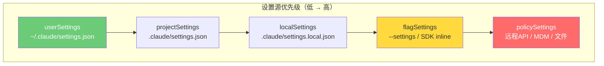
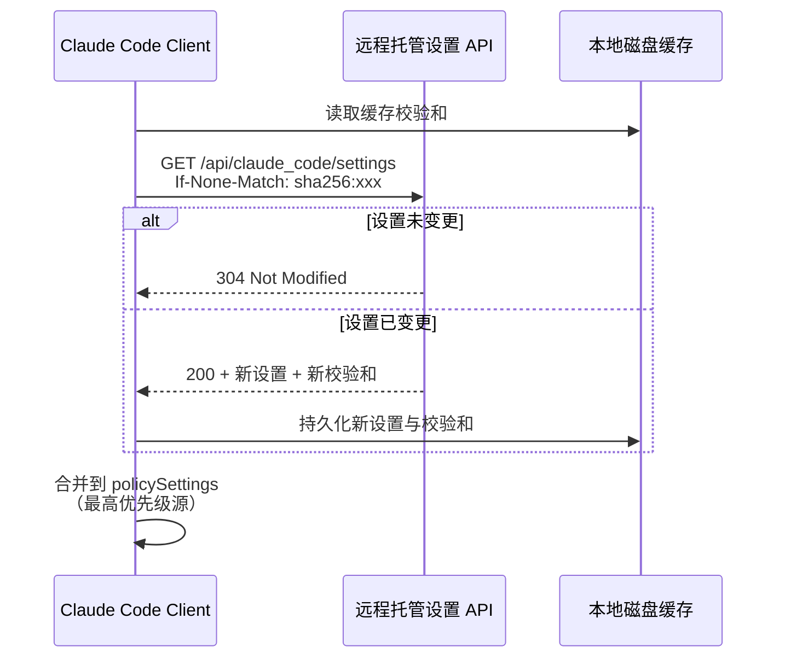
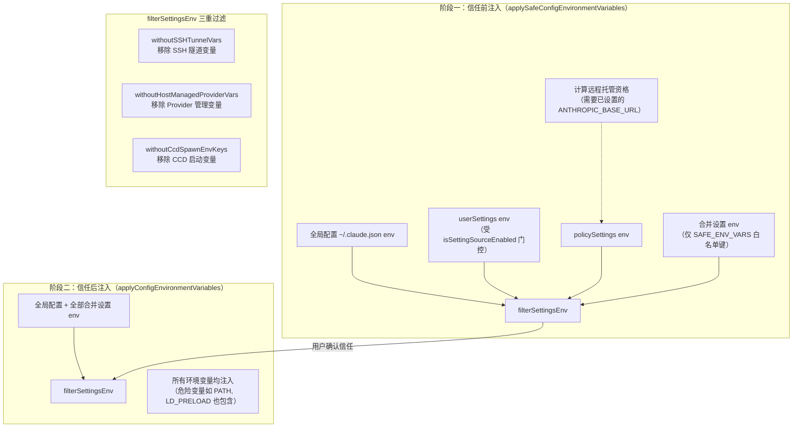
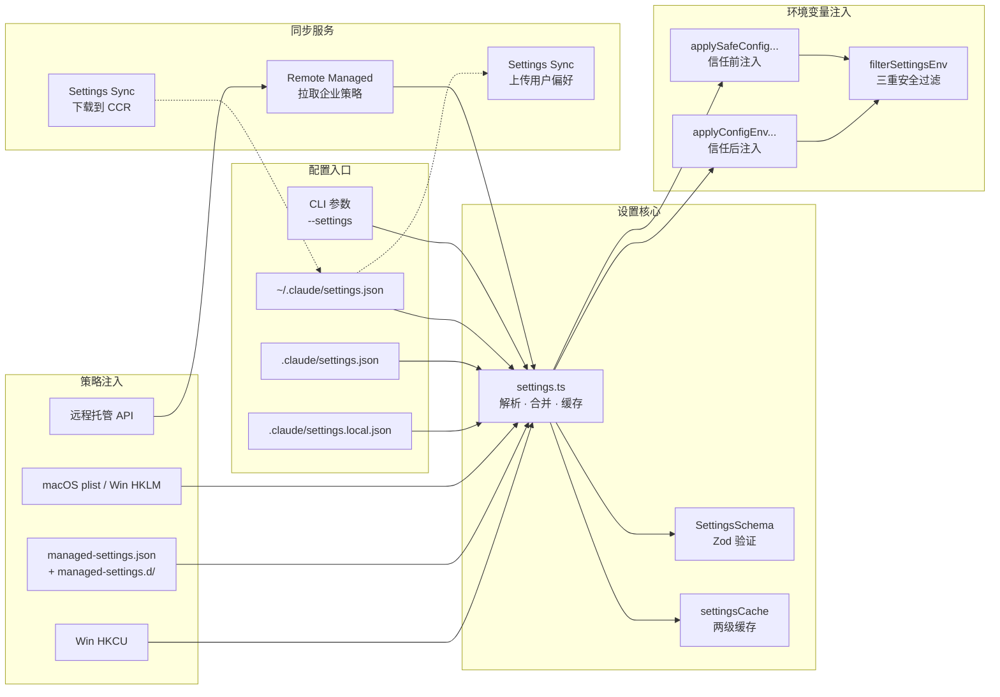

Claude Code 的配置体系并非一个扁平的键值存储，而是一个**五层递进、优先级严格递增**的分层架构。从用户全局偏好到企业 IT 管控策略，每一层都有明确的语义边界与合并规则。在此基础上，设置同步服务将本地配置推送到云端、远程托管策略从 API 拉取并缓存，而环境变量则根据信任等级分阶段注入 `process.env`——三层安全过滤机制确保项目目录中的恶意配置无法劫持认证流量。理解这套体系，是掌握 Claude Code 行为定制与安全管控的基石。

## 五层设置源：优先级与合并语义

Claude Code 定义了五个设置源（Setting Source），它们按照数组顺序依次覆盖，**后者优先级始终高于前者**：

| 层级 | 源标识 | 文件路径 | 可编辑 | 作用域 |
|------|--------|----------|--------|--------|
| 1 | `userSettings` | `~/.claude/settings.json` | ✅ | 用户全局 |
| 2 | `projectSettings` | `.claude/settings.json` | ✅ | 项目共享（提交到 Git） |
| 3 | `localSettings` | `.claude/settings.local.json` | ✅ | 项目本地（gitignored） |
| 4 | `flagSettings` | `--settings` CLI 参数或 SDK 内联 | ❌ | 会话级 |
| 5 | `policySettings` | 托管策略（远程 API / MDM / 文件） | ❌ | 企业管控 |

这五个源在 [constants.ts](src/utils/settings/constants.ts#L7-L22) 中以 `SETTING_SOURCES` 常量数组定义，**顺序即优先级**——后面的源覆盖前面的同名键。值得注意的是，`policySettings` 和 `flagSettings` 始终启用，不受 `--setting-sources` 过滤影响，这确保了企业策略和命令行参数不会被意外屏蔽。

**合并语义**方面，数组字段采用**拼接去重**策略（通过 `mergeArrays` 函数将两个源的数组合并后去重），而对象字段则使用 lodash `mergeWith` 的默认深合并行为——这意味着权限规则（`permissions.allow` / `permissions.deny`）会跨源累加而非替换 [settings.ts](src/utils/settings/settings.ts#L528-L547)。当需要删除某个键时，必须将其设为 `undefined` 而非使用 `delete` 操作符，因为 `mergeWith` 仅在键存在且值为显式 `undefined` 时才识别为删除意图 [settings.ts](src/utils/settings/settings.ts#L410-L414)。

Sources: [constants.ts](src/utils/settings/constants.ts#L7-L22), [settings.ts](src/utils/settings/settings.ts#L410-L547)

## 设置 Schema：Zod 声明式验证与懒加载

所有设置文件共享同一个 `SettingsSchema`，它由 Zod v4 定义并通过 `lazySchema` 包装以实现按需求值——避免在模块加载时触发尚未初始化的 Feature Gate 依赖。Schema 涵盖以下核心字段域：

- **permissions**：`allow` / `deny` / `ask` 三条规则列表 + `defaultMode` 权限模式 + `disableBypassPermissionsMode` 禁止绕过
- **env**：`Record<string, string>` 类型的环境变量映射，值被强制转换为字符串（`z.coerce.string()`）
- **hooks**：`PreToolUse` / `PostToolUse` / `Notification` / `UserPromptSubmit` / `SessionStart` 等事件钩子
- **sandbox**：沙箱开关、网络隔离、文件系统访问控制
- **allowedMcpServers** / **deniedMcpServers**：企业 MCP 服务器白名单/黑名单，支持按 `serverName`、`serverCommand` 或 `serverUrl` 匹配（三选一互斥约束）

Settings: [types.ts](src/utils/settings/types.ts#L35-L85)

文件的解析流程经过缓存优化：`parseSettingsFile` 首先查询路径级缓存，若命中则返回克隆副本（防止调用方突变缓存），否则走 `parseSettingsFileUncached` 读取文件 → `safeParseJSON` 解析 → `filterInvalidPermissionRules` 预过滤 → `SettingsSchema().safeParse()` 完整验证。验证失败时，错误通过 `formatZodError` 格式化为结构化的 `ValidationError` 数组返回，而非丢弃整个文件 [settings.ts](src/utils/settings/settings.ts#L178-L231)。

Sources: [settings.ts](src/utils/settings/settings.ts#L178-L231), [types.ts](src/utils/settings/types.ts#L35-L85)

## 策略设置（policySettings）：四源"先到先得"模型

`policySettings` 是唯一采用**"first source wins"（先到先得）**语义的设置源——而非其他源的"后覆盖前"合并模型。这意味着优先级最高的源一旦存在有效数据，低优先级源将被完全忽略。四源优先级如下 [settings.ts](src/utils/settings/settings.ts#L370-L407)：

| 优先级 | 来源 | 标识 | 说明 |
|--------|------|------|------|
| 1（最高） | 远程 API | `remote` | 企业 SaaS 平台推送的策略 |
| 2 | 系统级 MDM | `plist`（macOS）/ `hklm`（Windows） | 企业设备管理工具下发 |
| 3 | 托管文件 | `file` | `managed-settings.json` + `managed-settings.d/*.json` |
| 4（最低） | 用户级注册表 | `hkcu` | Windows HKCU 注册表（用户可写） |

这种设计确保了企业 IT 管理员通过远程 API 推送的安全策略始终生效，即使用户本地修改了 `managed-settings.json` 也无法覆盖远程来源——这是合规审计的关键保障。

Sources: [settings.ts](src/utils/settings/settings.ts#L319-L407)

### 托管文件与 Drop-in 机制

托管文件路径按平台确定 [managedPath.ts](src/utils/settings/managedPath.ts#L8-L24)：

| 平台 | 路径 |
|------|------|
| macOS | `/Library/Application Support/ClaudeCode` |
| Windows | `C:\Program Files\ClaudeCode` |
| Linux | `/etc/claude-code` |

基础文件 `managed-settings.json` 提供默认值，`managed-settings.d/` 目录下的 `.json` 文件按文件名字典序排列后依次合并覆盖（later files win）。这借鉴了 systemd/sudoers 的 drop-in 约定：不同团队可以独立交付策略片段（如 `10-otel.json`、`20-security.json`），无需协调编辑同一个管理员文件 [settings.ts](src/utils/settings/settings.ts#L62-L73)。

Sources: [managedPath.ts](src/utils/settings/managedPath.ts#L8-L35), [settings.ts](src/utils/settings/settings.ts#L62-L121)

## 远程托管设置服务：校验和驱动的增量同步

远程托管设置服务（Remote Managed Settings）为企业客户提供了从云端 API 拉取策略的能力。其核心设计原则是**校验和驱动的条件请求**与**优雅降级（fail-open）** [remoteManagedSettings/index.ts](src/services/remoteManagedSettings/index.ts#L1-L13)。

**资格判定**逻辑为：Console 用户（API 密钥认证）全部有资格；OAuth 用户（Claude.ai 认证）仅 Enterprise/C4E 和 Team 订阅者有资格。资格判定在环境变量注入完成后执行，因为 `ANTHROPIC_BASE_URL` 和 `CLAUDE_CODE_USE_BEDROCK` 等变量会影响判定结果。

**同步流程**如下：

1. 应用本地缓存校验和（`sha256:` 前缀的 SHA-256 哈希）作为条件请求头
2. 服务端比较校验和——若未变更则返回 304，避免传输完整载荷
3. 若有变更，返回新设置 + 新校验和，客户端持久化到磁盘缓存
4. 后台轮询间隔为 1 小时，超时为 10 秒，最大重试 5 次

校验和计算需与服务端 Python 实现保持一致：将设置对象递归排序键后 JSON 序列化（无空格分隔符），再取 SHA-256 哈希 [remoteManagedSettings/index.ts](src/services/remoteManagedSettings/index.ts#L110-L137)。

为了防止启动阻塞，系统提供了 `initializeRemoteManagedSettingsLoadingPromise` 和 `waitForRemoteManagedSettingsToLoad` 两个协调函数——初始化时创建带 30 秒超时的 Promise，其他系统可等待该 Promise 确保远程策略已加载 [remoteManagedSettings/index.ts](src/services/remoteManagedSettings/index.ts#L77-L159)。

Sources: [remoteManagedSettings/index.ts](src/services/remoteManagedSettings/index.ts#L1-L200)

## 设置同步服务：跨环境双向同步

设置同步服务（Settings Sync）与远程托管设置服务是两个独立系统——前者同步**用户偏好**，后者同步**企业策略**。两者的区别在于数据流向和适用场景 [settingsSync/index.ts](src/services/settingsSync/index.ts#L1-L10)：

| 维度 | 设置同步（Settings Sync） | 远程托管设置（Remote Managed） |
|------|--------------------------|-------------------------------|
| 数据性质 | 用户偏好 | 企业管控策略 |
| 方向 | 双向（上传 + 下载） | 单向（仅下载） |
| 适用模式 | 交互式 CLI 上传 / CCR 下载 | 企业用户拉取 |
| Feature Gate | `UPLOAD_USER_SETTINGS` / `DOWNLOAD_USER_SETTINGS` | 隐式（资格判定） |
| 认证方式 | OAuth only | API Key + OAuth |

**上传流程**（交互式 CLI）：在 `main.tsx` 的 `preAction` 中以 fire-and-forget 方式触发。先获取远端现有条目，对比本地条目（通过 `getRepoRemoteHash` 关联项目 ID），仅上传变更的条目——增量同步避免不必要的网络流量 [settingsSync/index.ts](src/services/settingsSync/index.ts#L60-L111)。

**下载流程**（CCR 模式）：在 `runHeadless` 入口以 fire-and-forget 启动，同时被 `installPluginsAndApplyMcpInBackground` 等待——确保插件安装前设置已就位。首次调用启动下载，后续调用共享同一个 Promise（Join 语义）。还提供 `redownloadUserSettings` 用于 `/reload-plugins` 命令，强制重新下载以获取会话中期的设置变更 [settingsSync/index.ts](src/services/settingsSync/index.ts#L115-L200)。

Sources: [settingsSync/index.ts](src/services/settingsSync/index.ts#L1-L200)

## 环境变量注入：三阶段安全过滤模型

环境变量是配置体系中最敏感的部分——项目目录中的恶意 `.claude/settings.json` 可以设置 `ANTHROPIC_BASE_URL` 将所有 API 请求重定向到攻击者服务器。Claude Code 通过**信任等级划分 + 白名单机制**在两个注入阶段解决这个问题 [managedEnv.ts](src/utils/managedEnv.ts#L93-L178)。

**阶段一**（`applySafeConfigEnvironmentVariables`，信任对话框之前）：

- 受信任源（`userSettings`、`flagSettings`、`policySettings`）的**全部**环境变量直接注入
- 项目作用域源（`projectSettings`、`localSettings`）仅注入 `SAFE_ENV_VARS` 白名单中的变量
- 白名单设计理念：项目目录可能被恶意提交，`ANTHROPIC_BASE_URL` 等认证路由变量绝不允许来自项目源

**阶段二**（`applyConfigEnvironmentVariables`，信任确认之后）：

- 全部合并设置的环境变量注入，不再受白名单限制
- 注入后清除 CA 证书、mTLS、代理缓存并重新配置全局 Agent

**三重过滤函数** `filterSettingsEnv` 以管道方式依次应用三个过滤器：

1. **`withoutSSHTunnelVars`**：SSH 远程会话中移除 `ANTHROPIC_UNIX_SOCKET`、`ANTHROPIC_BASE_URL`、`ANTHROPIC_API_KEY` 等，因为它们由本地代理通过 `-R` 转发设置
2. **`withoutHostManagedProviderVars`**：当 `CLAUDE_CODE_PROVIDER_MANAGED_BY_HOST` 为真时，剥离 Provider 选择/模型默认变量，防止用户设置重定向请求
3. **`withoutCcdSpawnEnvKeys`**：Claude Code Desktop 模式下，捕获启动时的环境变量快照，防止设置覆盖宿主进程的操作变量（如 `OTEL_LOGS_EXPORTER=console` 会破坏 stdio JSON-RPC 传输）

Sources: [managedEnv.ts](src/utils/managedEnv.ts#L1-L200)

## 设置缓存与写入协调

设置系统采用**两级缓存**架构确保读取性能：`settingsCache` 同时维护文件级缓存（`parsedFileCache`，按路径索引）和源级缓存（`settingsForSourceCache`，按 `SettingSource` 索引），以及会话级缓存（`sessionSettingsCache`）以避免重复的合并计算 [settingsCache.ts](src/utils/settings/settingsCache.ts#L1)。

写入操作通过 `updateSettingsForSource` 生效，该函数：

1. 静默忽略对 `policySettings` / `flagSettings` 的写入（只读源）
2. 创建必要的目录结构
3. 读取现有设置并与新值 `mergeWith` 合并（数组替换、对象深合并、`undefined` 删除键）
4. 通过 `markInternalWrite` 标记此次写入，供文件变更监听器（`changeDetector`）识别为内部变更而非外部编辑
5. 写入后调用 `resetSettingsCache` 使所有缓存失效
6. 若目标源为 `localSettings`，自动将 `.claude/settings.local.json` 追加到 `.gitignore`

Sources: [settings.ts](src/utils/settings/settings.ts#L416-L524)

## 跨模块交互总览

Sources: [settings.ts](src/utils/settings/settings.ts#L1-L50), [constants.ts](src/utils/settings/constants.ts#L1-L200), [managedEnv.ts](src/utils/managedEnv.ts#L1-L200), [remoteManagedSettings/index.ts](src/services/remoteManagedSettings/index.ts#L1-L200), [settingsSync/index.ts](src/services/settingsSync/index.ts#L1-L200)

## 延伸阅读

- 企业策略如何通过 Feature Gate 系统进一步管控功能可见性，参见 [三层门控体系：编译开关、用户类型与远程 Feature Flag](16-san-ceng-men-kong-ti-xi-bian-yi-kai-guan-yong-hu-lei-xing-yu-yuan-cheng-feature-flag)
- 环境变量如何影响权限模型的初始化与工具审批流，参见 [权限与沙箱：工具执行审批流与安全隔离机制](21-quan-xian-yu-sha-xiang-gong-ju-zhi-xing-shen-pi-liu-yu-an-quan-ge-chi-ji-zhi)
- 远程会话如何处理配置的环境变量注入，参见 [远程会话：SSH 连接、远程环境与 Direct Connect 会话管理](22-yuan-cheng-hui-hua-ssh-lian-jie-yuan-cheng-huan-jing-yu-direct-connect-hui-hua-guan-li)
- 插件设置如何通过 `pluginOnlyPolicy` 集成到此配置体系，参见 [插件与技能系统：插件加载、技能发现与工作流脚本](23-cha-jian-yu-ji-neng-xi-tong-cha-jian-jia-zai-ji-neng-fa-xian-yu-gong-zuo-liu-jiao-ben)