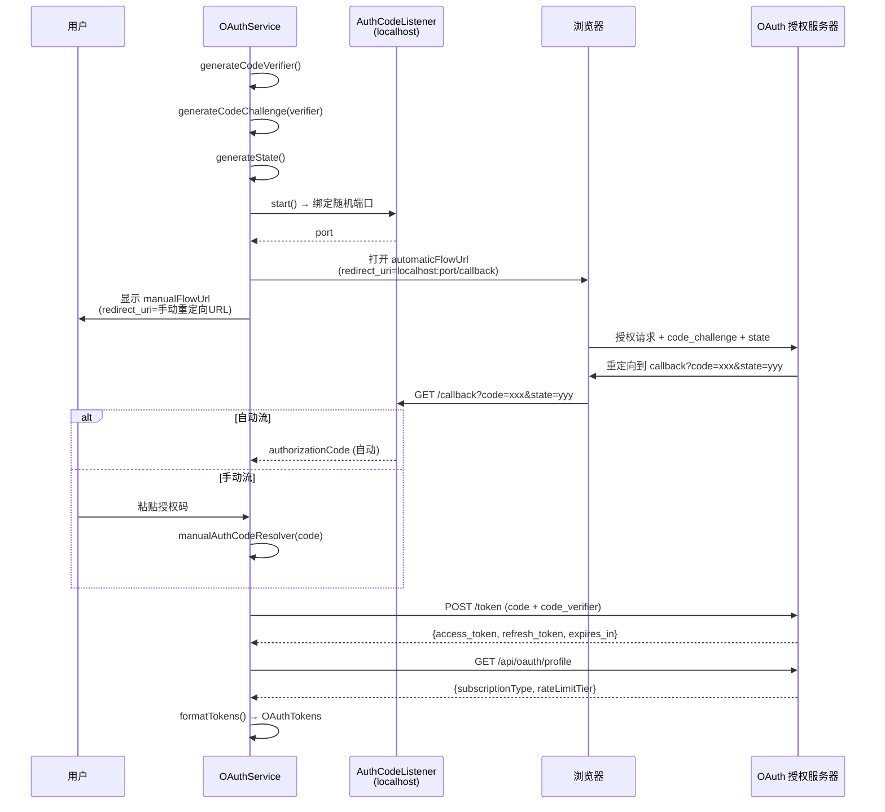

Claude Code 的认证体系构建在 OAuth 2.0 Authorization Code Flow with PKCE 之上，同时兼容第三方 API 密钥直连模式；计费侧则通过订阅类型（Subscription Type）、速率限制层级（Rate Limit Tier）与用量追踪（Usage Tracking）三层机制实现精细化的资源管控。本文将深入解析认证流的完整生命周期、API 密钥的验证与存储策略、以及用量追踪与计费限额的内部实现。

## OAuth 2.0 认证流程：PKCE 增强的授权码模式

**OAuthService** 是认证流程的核心编排器，实现了带 PKCE（Proof Key for Code Exchange）保护的 OAuth 2.0 授权码流程。PKCE 的引入是为了抵御授权码拦截攻击——在本地 CLI 场景中，客户端无法安全存储 `client_secret`，因此通过动态生成的 `code_verifier` / `code_challenge` 对来证明授权码的合法归属。

整个流程支持两条并行的授权码获取路径：**自动流**（打开浏览器，通过 localhost 回调自动捕获授权码）和**手动流**（在无浏览器环境中，用户手动复制粘贴授权码）。两条路径竞速执行——谁先拿到授权码就采用哪条路径的结果。

**OAuthService** 的构造函数在实例化时立即生成 `codeVerifier`，该值通过 `crypto.generateCodeVerifier()` 产生，随后在 `startOAuthFlow` 中派生出 `codeChallenge`（S256 哈希）和 `state`（CSRF 防护令牌）。`buildAuthUrl` 根据 `isManual` 标志选择不同的 `redirect_uri`：手动流指向固定 URL，自动流指向 `http://localhost:{port}/callback`。OAuth 授权服务器验证 `code_challenge` 后颁发授权码，CLI 在 token 交换时提交 `code_verifier` 供服务端交叉验证。`waitForAuthorizationCode` 方法将自动流和手动流封装为 Promise 竞速——`AuthCodeListener` 监听回调的 Promise 和 `manualAuthCodeResolver` 回调，任一先被解决即获胜。

Sources: [index.ts](src/services/oauth/index.ts#L1-L198), [client.ts](src/services/oauth/client.ts#L46-L144)

### 授权码监听器：AuthCodeListener

**AuthCodeListener** 在本地启动一个临时 HTTP 服务器，监听 OAuth 回调请求。当授权服务器将浏览器重定向到 `http://localhost:{port}/callback?code=xxx&state=yyy` 时，该服务器捕获授权码并完成自动流。它同时处理成功和失败场景的重定向——成功时向浏览器返回带有作用域信息的确认页面，失败时返回错误页面。

Sources: [auth-code-listener.ts](src/services/oauth/auth-code-listener.ts#L1-L1)

### Token 交换与作用域解析

`exchangeCodeForTokens` 向 Token 端点提交标准 OAuth 2.0 token 请求，包含 `grant_type: 'authorization_code'`、授权码、`redirect_uri`、`client_id` 和 `code_verifier`。可选的 `expiresIn` 参数允许请求自定义有效期的 token。响应中 `scope` 字段以空格分隔的字符串形式返回，通过 `parseScopes` 转换为数组。两大类作用域定义了不同的访问权限集合：**全量作用域** `ALL_OAUTH_SCOPES` 用于标准登录，**推理专用作用域** `CLAUDE_AI_INFERENCE_SCOPE` 用于长期 API 访问 token。

Sources: [client.ts](src/services/oauth/client.ts#L107-L144), [oauth.ts](src/constants/oauth.ts#L1-L1)

### Token 刷新：无感续期与作用域扩展

`refreshOAuthToken` 实现了 OAuth 2.0 的 refresh_token grant，关键设计在于**作用域扩展（Scope Expansion）**机制：后端允许刷新时请求比原始授权更大的作用域集合，这意味着即使初始 token 只有受限作用域，刷新后也能获得完整的 `CLAUDE_AI_OAUTH_SCOPES` 权限。代码中有一段重要的性能优化注释——跳过额外的 `/api/oauth/profile` 往返请求以节省约 700 万次/天的全局 API 调用量。当全局配置和安全存储中已有订阅信息时，直接使用缓存数据；仅在缓存为空时才发起 profile 请求。这个优化尤其关键：在 `CLAUDE_CODE_OAUTH_REFRESH_TOKEN` 重登录路径中，`installOAuthTokens` 在 refresh 返回之后执行 `performLogout()`，会清空安全存储——如果此处返回 null，则缓存被清空后永久丢失付费用户的订阅类型。

Sources: [client.ts](src/services/oauth/client.ts#L146-L200)

### 配置文件类型定义

`OAuthTokens` 类型是认证数据的统一载体，包含 `accessToken`、`refreshToken`、`expiresAt` 三个核心字段以及通过索引签名支持的扩展属性。`SubscriptionType` 和 `BillingType` 均为字符串别名，允许后端灵活扩展订阅和计费类型而无需前端同步更新类型定义。`OAuthProfileResponse` 和各类引荐相关类型同样以 `Record<string, unknown>` 定义，体现了对后端 API 演进的前向兼容策略。

Sources: [types.ts](src/services/oauth/types.ts#L1-L14)

## API 密钥验证：第三方密钥与 OAuth 双轨认证

Claude Code 同时支持两种认证方式：**OAuth token**（面向 Claude 账号用户）和 **API 密钥**（面向第三方 API 提供商，如 Anthropic API、AWS Bedrock 等）。双轨认证的核心逻辑分布在认证工具链中。

### 密钥存储与检索

API 密钥通过 `saveApiKey` 函数持久化至安全存储中，而 OAuth token 则保存至全局配置与安全存储的双层架构。密钥的检索遵循优先级链：首先检查环境变量（如 `ANTHROPIC_API_KEY`、`CLAUDE_CODE_OAUTH_REFRESH_TOKEN`），其次检查安全存储中的持久化凭证，最后回退到交互式登录流程。这种分层设计确保了 CI/CD 管道、容器化部署和交互式终端三种使用场景的无缝覆盖。

Sources: [client.ts](src/services/oauth/client.ts#L17-L19), [auth.ts](src/utils/auth.ts#L1-L1)

### 密钥验证 Hook

**useApiKeyVerification** Hook 在应用启动和密钥变更时触发验证流程，确认当前 API 密钥是否有效、是否具有正确的权限范围。该 Hook 与认证状态管理深度集成，在密钥失效时自动触发重新认证流程。

Sources: [useApiKeyVerification.ts](src/hooks/useApiKeyVerification.ts#L1-L1)

### ApproveApiKey 组件

**ApproveApiKey** 是 API 密钥审批的 UI 组件，在用户首次使用新的 API 密钥或密钥需要重新授权时呈现，要求用户显式确认密钥的使用权限。这是安全纵深防御的一环——即使密钥被泄露，仍需用户在终端中交互式确认。

Sources: [ApproveApiKey.tsx](src/components/ApproveApiKey.tsx#L1-L1)

## 用量追踪与计费限额

用量追踪体系由三个层次构成：**订阅类型标识**用户的付费层级，**速率限制层级**定义单位时间内的请求配额，**用量追踪**记录实际的 token 消耗并触发阈值告警。

### 订阅类型与速率限制层级

OAuth 认证完成后，`fetchProfileInfo` 从 `/api/oauth/profile` 端点获取用户的订阅类型和速率限制层级。这两个值被嵌入到 `OAuthTokens` 对象中，随 token 在整个系统中传播。速率限制层级 `RateLimitTier` 决定了用户在给定时间窗口内可发出的请求数量，不同层级对应 Pro、Team、Enterprise 等订阅计划的差异化资源配额。

Sources: [index.ts](src/services/oauth/index.ts#L103-L121), [types.ts](src/services/oauth/types.ts#L8-L9)

### 策略限额系统

**policyLimits** 模块定义了结构化的限额策略类型体系，为不同订阅层级提供差异化的资源管控规则。该模块与 OAuth 层的 `RateLimitTier` 配合工作——OAuth 层负责识别用户身份和层级，policyLimits 层负责将层级映射到具体的限额数值。

Sources: [index.ts](src/services/policyLimits/index.ts#L1-L1), [types.ts](src/services/policyLimits/types.ts#L1-L1)

### 用量追踪 API 与成本追踪器

**cost-tracker** 和 **costHook** 构成了用量追踪的运行时核心。`cost-tracker` 按 token 类型（input/output/cache_read/cache_creation）累计消耗量，`costHook` 将消耗量与模型的定价表结合，实时计算会话级别的费用。`modelCost` 模块维护了各模型的 token 单价映射表。

**usage API** 服务模块提供与后端用量查询接口的对接，`extra-usage` 模块处理超出基础配额的增量用量计费。`overageCreditGrant` 模块实现了超额信用授予机制——当用户消耗超出其订阅配额时，系统可在一定范围内自动授予信用额度以避免服务中断。

Sources: [cost-tracker.ts](src/cost-tracker.ts#L1-L1), [costHook.ts](src/costHook.ts#L1-L1), [usage.ts](src/services/api/usage.ts#L1-L1), [extra-usage.ts](src/utils/extra-usage.ts#L1-L1), [overageCreditGrant.ts](src/services/api/overageCreditGrant.ts#L1-L1), [modelCost.ts](src/utils/modelCost.ts#L1-L1)

### Claude AI 限额与速率限制

**claudeAiLimits** 服务和 **claudeAiLimitsHook** 实现了针对 Claude.ai 订阅用户的专属限额逻辑。当用户的 OAuth token 包含 `CLAUDE_AI_INFERENCE_SCOPE` 时（通过 `shouldUseClaudeAIAuth` 判断），系统采用基于订阅类型的限额策略而非通用 API 密钥的按量计费模式。

**rateLimitMessages** 和 **rateLimitMocking** 配合处理速率限制的端侧表现：`rateLimitMessages` 生成用户友好的限额提示信息，`rateLimitMocking` 则提供开发调试用的限额模拟能力，方便在不触发真实限额的情况下测试 UI 表现。`mockRateLimits` 命令直接暴露了这一能力。

Sources: [shouldUseClaudeAIAuth in client.ts](src/services/oauth/client.ts#L38-L40), [rateLimitMessages.ts](src/services/rateLimitMessages.ts#L1-L1), [mockRateLimits.ts](src/services/mockRateLimits.ts#L1-L1), [rateLimitMocking.ts](src/services/rateLimitMocking.ts#L1-L1)

### 成本阈值对话框

**CostThresholdDialog** 组件在会话费用接近或超过用户设定的阈值时弹出，提醒用户当前消耗状况并提供暂停或继续的选项。这是用量追踪的前端出口，将后台的 token 级追踪数据转化为用户可感知的费用信息。

Sources: [CostThresholdDialog.tsx](src/components/CostThresholdDialog.tsx#L1-L1)

## 认证与计费的整体协作架构

下表总结了认证与计费体系中各关键模块的职责分工与协作关系：

| 层级 | 模块 | 核心职责 | 关键输入 | 关键输出 |
|------|------|----------|----------|----------|
| **认证层** | OAuthService | PKCE 授权码流编排 | 用户交互、浏览器回调 | OAuthTokens |
| **认证层** | client.ts | Token 交换与刷新 | 授权码/refresh_token | access_token, profile |
| **认证层** | AuthCodeListener | 本地回调捕获 | HTTP 请求 | 授权码 |
| **认证层** | useApiKeyVerification | 密钥有效性校验 | API 密钥 | 验证状态 |
| **身份层** | getOauthProfile | 订阅身份解析 | access_token | subscriptionType, rateLimitTier |
| **计费层** | policyLimits | 限额策略映射 | rateLimitTier | 具体限额数值 |
| **追踪层** | cost-tracker | Token 消耗累计 | API 响应头 | 累计消耗量 |
| **追踪层** | costHook | 费用实时计算 | token 消耗 + 单价 | 会话费用 |
| **展示层** | CostThresholdDialog | 费用阈值告警 | 费用数据 | 用户确认/暂停 |
| **展示层** | ApproveApiKey | 密钥审批确认 | 新密钥 | 用户授权 |

### JWT 工具与会话入站认证

在 Bridge 远程控制场景中（参见 [Bridge：远程遥控终端的 WebSocket 双向通道](15-bridge-yuan-cheng-yao-kong-zhong-duan-de-websocket-shuang-xiang-tong-dao)），JWT 令牌用于 WebSocket 连接的身份验证。`jwtUtils` 提供 JWT 的签发与验证工具，`sessionIngressAuth` 和 `sessionIngress` 模块则实现了会话入站的鉴权逻辑——确保只有经过授权的远程客户端才能连接到本地 CLI 实例。`workSecret` 为 Bridge 工作进程生成共享密钥，作为 WebSocket 握手的凭证。

Sources: [jwtUtils.ts](src/bridge/jwtUtils.ts#L1-L1), [sessionIngressAuth.ts](src/utils/sessionIngressAuth.ts#L1-L1), [sessionIngress.ts](src/services/api/sessionIngress.ts#L1-L1), [workSecret.ts](src/bridge/workSecret.ts#L1-L1)

## 延伸阅读

- 认证凭证的持久化依赖于分层配置体系，详见 [配置体系：分层配置、设置同步与托管环境变量](24-pei-zhi-ti-xi-fen-ceng-pei-zhi-she-zhi-tong-bu-yu-tuo-guan-huan-jing-bian-liang)
- Bridge 场景下的 JWT 认证是本文 JWT 工具的应用场景，完整链路见 [Bridge：远程遥控终端的 WebSocket 双向通道](15-bridge-yuan-cheng-yao-kong-zhong-duan-de-websocket-shuang-xiang-tong-dao)
- API 密钥的权限校验与工具执行审批流紧密关联，见 [权限与沙箱：工具执行审批流与安全隔离机制](21-quan-xian-yu-sha-xiang-gong-ju-zhi-xing-shen-pi-liu-yu-an-quan-ge-chi-ji-zhi)
- 用量数据通过遥测系统上报，见 [遥测与诊断：OpenTelemetry 集成、性能剖析与错误上报](28-yao-ce-yu-zhen-duan-opentelemetry-ji-cheng-xing-neng-pou-xi-yu-cuo-wu-shang-bao)