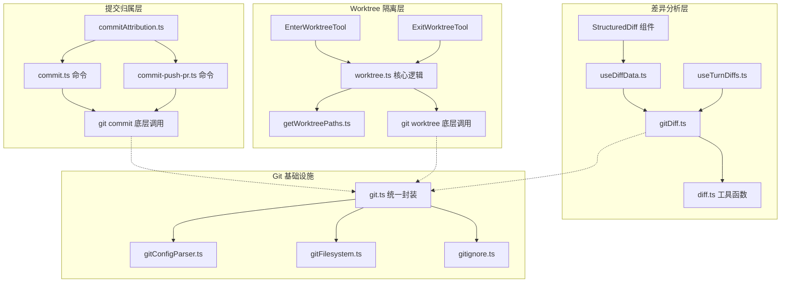
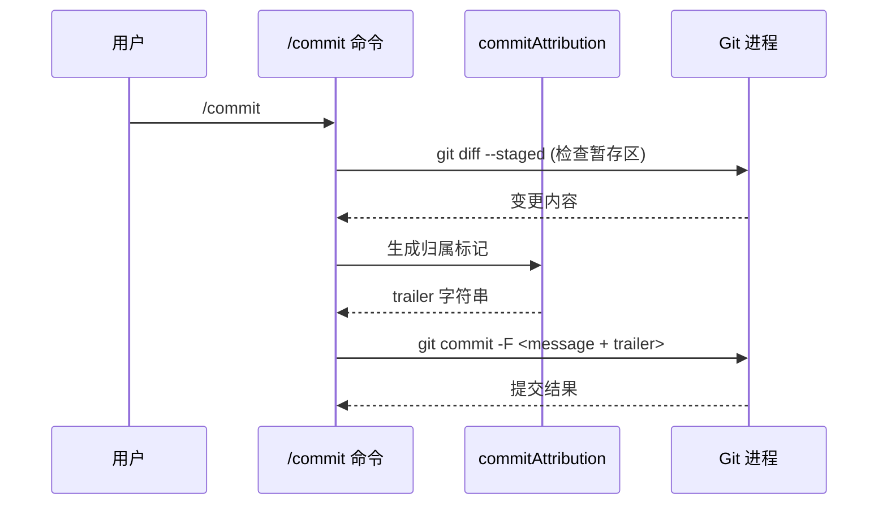
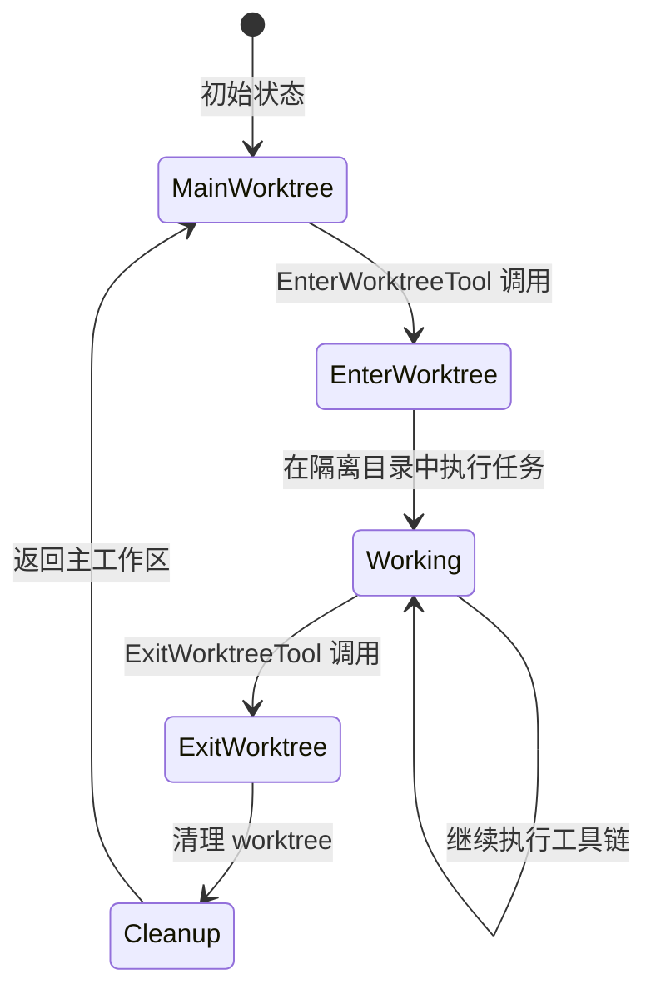
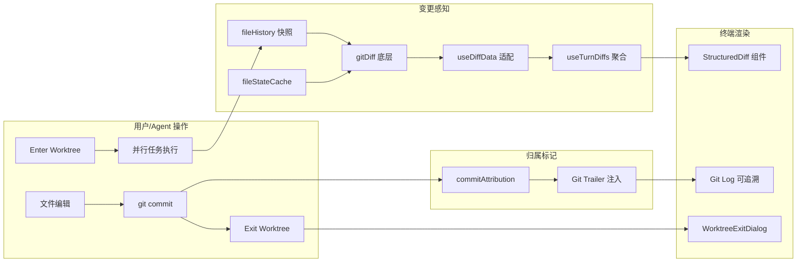

Claude Code 并非简单地将 Git 作为外部命令调用——它在源码层面构建了一套**深度 Git 集成体系**，涵盖差异分析引擎、提交归属标记、Worktree 隔离模式以及 Git 配置/忽略规则解析等核心能力。本文将从架构视角拆解这套集成体系的每一层实现，揭示 CLI 工具如何在终端环境中实现媲美 IDE 的 Git 感知能力。

## 架构总览：Git 集成的三支柱

Claude Code 的 Git 集成可归纳为三大支柱，它们分别服务于不同的架构目标：

| 支柱 | 核心模块 | 架构目标 |
|------|----------|----------|
| **差异分析** | `gitDiff.ts`、`diff.ts`、`useDiffData.ts`、`useTurnDiffs.ts` | 为 LLM 提供精确的代码变更上下文，支撑文件编辑的增量追踪 |
| **提交归属** | `commitAttribution.ts`、`commit.ts`、`commit-push-pr.ts` | 标记 AI 生成的提交，实现人机协作的可追溯性 |
| **Worktree 模式** | `EnterWorktreeTool`、`ExitWorktreeTool`、`worktree.ts`、`getWorktreePaths.ts` | 为并行任务提供物理隔离的 Git 工作目录，避免分支冲突 |



Sources: [gitDiff.ts](src/utils/gitDiff.ts), [commitAttribution.ts](src/utils/commitAttribution.ts), [worktree.ts](src/utils/worktree.ts)

## 差异分析：为 LLM 构建的增量上下文引擎

### 核心设计理念

Claude Code 的差异分析不仅面向人类阅读，更面向 LLM 消费。这意味着差异输出需要同时满足两个约束：**结构化可解析**（供 UI 组件渲染）和**语义精炼**（供 Token 预算有限的上下文窗口使用）。这套引擎的关键入口是 `gitDiff.ts`，它封装了多种差异获取策略。

### 差异获取策略矩阵

| 策略 | 函数/方法 | 用途场景 | 输出特征 |
|------|-----------|----------|----------|
| 工作区差异 | `getWorkingDirectoryDiff` | 实时反映未暂存变更 | 包含 unstaged hunks |
| 暂存区差异 | `getStagedDiff` | 已 `git add` 的变更 | 仅 staged hunks |
| HEAD 对比差异 | `getDiffFromHead` | 当前提交与工作树的完整差异 | 完整变更集 |
| 文件级别差异 | `getFileDiff` | 单文件 diff | 精确到单文件的 hunks |
| Turn 级差异 | `useTurnDiffs` hook | 单轮对话产生的变更 | 与消息流关联 |

### 差异数据的 React 化流转

差异数据通过 React Hook 链路注入 UI 层，这一设计使得差异展示与对话上下文强绑定：

```
gitDiff.ts (底层获取)
  → useDiffData.ts (数据转换 + 缓存)
    → useTurnDiffs.ts (按对话轮次聚合)
      → StructuredDiff 组件 (渲染层)
```

`useDiffData` 充当数据适配层，将原始 Git diff 输出转化为组件可消费的结构化数据。`useTurnDiffs` 则在此基础上按对话轮次（turn）进行分组，使得每个 AI 回复都能关联其产生的精确代码变更。这种"轮次级差异追踪"是 Claude Code 区别于传统 Git 客户端的架构创新——LLM 的每次工具调用结果与 diff 变更形成因果链。

Sources: [gitDiff.ts](src/utils/gitDiff.ts), [useDiffData.ts](src/hooks/useDiffData.ts), [useTurnDiffs.ts](src/hooks/useTurnDiffs.ts)

### `/diff` 命令：用户侧的差异查看入口

`/diff` 斜杠命令为用户提供了终端内的交互式差异查看能力。其实现位于 `src/commands/diff/`，命令注册通过 `index.ts` 导出，核心逻辑在 `diff.tsx` 中。该命令会调用上述差异获取策略，并将结果通过 `StructuredDiff` 系列组件渲染到终端。

`StructuredDiff` 组件体系（位于 `src/components/StructuredDiff.tsx` 和 `src/components/StructuredDiffList.tsx`）实现了终端环境下的差异化渲染，包括行号对齐、增删标记着色、折叠上下文等能力，这在前述 [组件体系：消息渲染、虚拟滚动与交互式对话框](9-zu-jian-ti-xi-xiao-xi-xuan-ran-xu-ni-gun-dong-yu-jiao-hu-shi-dui-hua-kuang) 中已有详述。

Sources: [diff.tsx](src/commands/diff/diff.tsx), [StructuredDiff.tsx](src/components/StructuredDiff.tsx), [StructuredDiffList.tsx](src/components/StructuredDiffList.tsx)

## 提交归属：AI 生成代码的可追溯性标记

### 归属标记的设计动机

在 AI 辅助编程场景中，一个关键问题是：**如何区分人类提交和 AI 提交？** Claude Code 通过 `commitAttribution.ts` 实现了提交归属标记机制，使得代码仓库的提交历史能够清晰追溯每笔变更的来源。

### 归属机制实现

`commitAttribution.ts` 的核心职责是在 `git commit` 操作中注入归属元数据。这通常通过以下方式实现：

- **Co-authored-by 标记**：在提交消息中附加 `Co-authored-by: Claude <noreply@anthropic.com>` 类似格式的尾部标记
- **提交者信息区分**：利用 Git 的 author 与 committer 双重身份机制，author 标识发起者，committer 标识实际执行者
- **Trailer 规范**：遵循 Git trailer 惯例，确保归属信息可被 `git interpret-trailers` 等标准工具解析

### `/commit` 与 `/commit-push-pr` 命令链

提交归属在两个命令中被激活：

1. **`/commit`**：执行 `git add` + `git commit`，自动附加归属标记
2. **`/commit-push-pr`**：在 `/commit` 基础上扩展，执行 `git push` 并创建 Pull Request



`commit.ts` 提供基础的提交流程，而 `commit-push-pr.ts` 则在此基础上编排推送和 PR 创建逻辑，后者涉及与 GitHub API 的交互（参见 [认证与计费：OAuth 流程、API 密钥验证与用量追踪](25-ren-zheng-yu-ji-fei-oauth-liu-cheng-api-mi-yao-yan-zheng-yu-yong-liang-zhui-zong)）。

Sources: [commitAttribution.ts](src/utils/commitAttribution.ts), [commit.ts](src/commands/commit.ts), [commit-push-pr.ts](src/commands/commit-push-pr.ts)

## Worktree 模式：并行任务的物理隔离方案

### 为什么需要 Worktree 模式

Git worktree 是 Git 2.5+ 引入的原生功能，允许在同一仓库下检出多个工作目录，每个目录对应不同分支。Claude Code 将此能力封装为 **Enter/Exit Worktree Tool 对**，解决了 Agent 并行工作时的核心痛点：

- **分支隔离**：多个 Agent 同时工作时，各自在独立 worktree 中操作，互不干扰
- **上下文纯净**：每个 worktree 拥有独立的工作区状态，避免未提交变更的交叉污染
- **安全回退**：Exit Worktree 时可自动清理，确保主工作区不受副作用影响

### Worktree 生命周期



### EnterWorktreeTool 实现

`EnterWorktreeTool` 的核心实现位于 `src/tools/EnterWorktreeTool/`，其目录结构清晰反映了关注点分离：

| 文件 | 职责 |
|------|------|
| `EnterWorktreeTool.ts` | 工具注册、参数校验、worktree 创建编排 |
| `UI.tsx` | 进入 worktree 时的终端 UI 渲染 |
| `constants.ts` | 工具名称、描述等常量定义 |
| `prompt.ts` | LLM 提示词片段，指导 Agent 如何使用 worktree |

工具执行流程的核心逻辑委托给 `src/utils/worktree.ts`，该模块封装了 `git worktree add` 的底层调用，并处理路径计算、分支创建、冲突检测等边界情况。`getWorktreePaths.ts` 和 `getWorktreePathsPortable.ts` 则负责计算 worktree 的物理路径，其中 portable 版本适配了非标准文件系统环境。

### ExitWorktreeTool 实现

`ExitWorktreeTool` 是 Enter 的对称操作，负责将 Agent 从隔离 worktree 中安全撤离：

| 文件 | 职责 |
|------|------|
| `ExitWorktreeTool.ts` | 工具注册、worktree 清理编排 |
| `UI.tsx` | 退出 worktree 时的终端 UI 渲染（含 `WorktreeExitDialog`） |
| `constants.ts` | 常量定义 |
| `prompt.ts` | LLM 提示词片段 |

退出流程涉及的关键决策是：**是否保留 worktree 中的未提交变更？** `WorktreeExitDialog` 组件（位于 `src/components/WorktreeExitDialog.tsx`）为用户提供了这一选择，体现了 Claude Code 在自动化与用户控制之间的平衡设计。

Sources: [EnterWorktreeTool.ts](src/tools/EnterWorktreeTool/EnterWorktreeTool.ts), [ExitWorktreeTool.ts](src/tools/ExitWorktreeTool/ExitWorktreeTool.ts), [worktree.ts](src/utils/worktree.ts), [getWorktreePaths.ts](src/utils/getWorktreePaths.ts), [WorktreeExitDialog.tsx](src/components/WorktreeExitDialog.tsx)

### Worktree 与 Coordinator 的协作

Worktree 模式与 [Coordinator：多 Agent 编排与 Worker 并行执行](14-coordinator-duo-agent-bian-pai-yu-worker-bing-xing-zhi-xing) 存在天然协作关系。Coordinator 编排多个 Worker Agent 并行执行时，每个 Worker 可通过 `EnterWorktreeTool` 获得独立的物理工作空间，从而避免多 Agent 同时操作同一分支时的文件锁冲突。这种"编排层 + 隔离层"的双层架构，是 Claude Code 实现 Agent 并行安全性的核心手段。

Sources: [worktreeModeEnabled.ts](src/utils/worktreeModeEnabled.ts), [coordinatorMode.ts](src/coordinator/coordinatorMode.ts)

## Git 基础设施：统一封装与规则解析

### `git.ts`：统一 Git 操作接口

`src/utils/git.ts` 和 `src/utils/git/` 目录构成了 Git 操作的统一封装层。该层对所有 Git 子进程调用进行抽象，提供类型安全的 Promise 接口，并处理跨平台路径差异、编码问题等底层细节。上层模块（diff、commit、worktree）均通过此层与 Git 交互，而非直接调用 `git` 命令。

### Git 配置解析：`gitConfigParser.ts`

`src/utils/git/gitConfigParser.ts` 实现了对 `.gitconfig` 和仓库级 `.git/config` 的解析能力。这使得 Claude Code 能够感知用户的 Git 身份配置（user.name、user.email）、远程仓库 URL、分支追踪关系等元信息，为提交归属和远程操作提供数据基础。

### Git 文件系统操作：`gitFilesystem.ts`

`gitFilesystem.ts` 封装了与 Git 内部文件系统相关的操作，如读取 `.git/HEAD`、解析 refs、获取暂存区状态等。相比调用 `git` 命令，直接读取 Git 内部文件的开销更低，适合高频调用场景（如状态栏刷新）。

### `.gitignore` 规则解析：`gitignore.ts`

`gitignore.ts` 实现了 `.gitignore` 规则的本地解析，使 Claude Code 在文件搜索（GlobTool、GrepTool）时能够正确忽略被排除的文件。这一实现在 [工具系统：50+ 内置工具的注册、调度与权限管控](5-gong-ju-xi-tong-50-nei-zhi-gong-ju-de-zhu-ce-diao-du-yu-quan-xian-guan-kong) 中的文件搜索工具链中扮演关键角色。

Sources: [git.ts](src/utils/git.ts), [gitConfigParser.ts](src/utils/git/gitConfigParser.ts), [gitFilesystem.ts](src/utils/git/gitFilesystem.ts), [gitignore.ts](src/utils/git/gitignore.ts)

### `/branch` 命令

`src/commands/branch/` 提供了分支管理命令，作为 Git 基础设施在命令层的直接映射。该命令封装了分支的创建、切换、列表展示等操作，是 worktree 模式之外用户进行分支操作的另一入口。

Sources: [branch.ts](src/commands/branch/branch.ts)

## 文件状态追踪与历史快照

### `fileHistory.ts`：文件历史快照系统

`src/utils/fileHistory.ts` 实现了文件级别的历史快照机制。当 Agent 读取或编辑文件时，系统会记录文件的当前状态快照，这使得差异分析能够精确追踪"Agent 本次会话中产生的变更"而非"相对于上次提交的所有变更"。这种**会话级文件状态追踪**是 `useTurnDiffs` 精确关联差异与对话轮次的基础。

### `fileStateCache.ts`：文件状态缓存

`fileStateCache.ts` 提供了文件状态的内存缓存层，避免重复的磁盘 I/O 和 Git diff 计算。缓存以文件路径为键，存储文件的最后已知状态（内容哈希、修改时间等），在与 `fileHistory` 配合时能高效判断文件是否发生变化。

### `useFileHistorySnapshotInit` Hook

`useFileHistorySnapshotInit` Hook 在会话初始化阶段拍摄工作区的全量快照，为后续的增量差异比较建立基准线。这确保了差异分析始终以会话起始状态为参照，而非依赖 Git 的上次提交。

Sources: [fileHistory.ts](src/utils/fileHistory.ts), [fileStateCache.ts](src/utils/fileStateCache.ts), [useFileHistorySnapshotInit.ts](src/hooks/useFileHistorySnapshotInit.ts)

## 整体数据流：从 Git 操作到终端渲染

将上述所有模块串联起来，Claude Code 的 Git 集成在运行时形成了一条清晰的数据流：



这条数据流的精髓在于：**每一个 Git 操作都不是孤立的命令执行，而是被追踪、被归属、被渲染的完整生命周期事件。** 文件编辑触发差异追踪，提交操作注入归属标记，Worktree 操作确保隔离安全——三者共同构成了 Claude Code 对"AI 如何安全地操作 Git 仓库"这一命题的工程答案。

## 延伸阅读

- **差异渲染的终端实现**：参见 [组件体系：消息渲染、虚拟滚动与交互式对话框](9-zu-jian-ti-xi-xiao-xi-xuan-ran-xu-ni-gun-dong-yu-jiao-hu-shi-dui-hua-kuang)，了解 `StructuredDiff` 组件如何在 Ink 框架中渲染
- **工具权限与沙箱**：参见 [权限与沙箱：工具执行审批流与安全隔离机制](21-quan-xian-yu-sha-xiang-gong-ju-zhi-xing-shen-pi-liu-yu-an-quan-ge-chi-ji-zhi)，了解 Git 写入操作（commit、push）的审批流程
- **多 Agent 并行架构**：参见 [Coordinator：多 Agent 编排与 Worker 并行执行](14-coordinator-duo-agent-bian-pai-yu-worker-bing-xing-zhi-xing)，了解 Worktree 如何支撑 Worker Agent 的并行安全
- **Token 预算与差异压缩**：参见 [上下文管理：Token 预算、上下文折叠与压缩策略](19-shang-xia-wen-guan-li-token-yu-suan-shang-xia-wen-zhe-die-yu-ya-suo-ce-lue)，了解差异信息在上下文窗口中的压缩策略