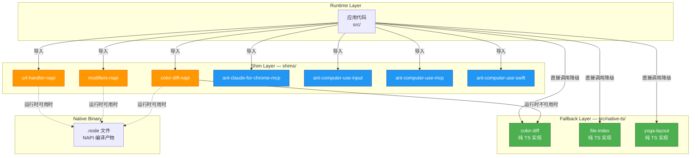

Claude Code 的运行时依赖中存在一类特殊的模块——它们要么是编译后的原生二进制（`.node` 文件），要么是 Anthropic 内部闭源包——在开源还原环境中无法直接获取。**Shim 层**正是为此设计的兼容适配机制：通过 TypeScript 声明与最小实现，为这些不可用依赖提供接口占位与优雅降级，确保项目在缺失原生模块或内部包时仍可完成类型检查与逻辑编译。

## 架构总览：Shim 层的职责边界

Shim 层位于项目根目录的 `shims/` 下，由 **7 个独立子包** 组成，分为两大类别：**NAPI 原生模块适配**（3 个）与 **内部闭源包适配**（4 个）。同时，`src/native-ts/` 提供了对应核心计算逻辑的纯 TypeScript 降级实现，形成"原生优先、TS 回退"的双轨策略。



整个 Shim 层通过 `tsconfig.json` 的 `include` 配置纳入编译范围，与 `src/` 和 `vendor/` 并列为三大源码入口，这从工程层面确认了其一级依赖地位。[tsconfig.json](tsconfig.json#L24-L28)

## NAPI 原生模块适配：二进制接口的 TypeScript 桥接

### 三大 NAPI Shim 的职能划分

NAPI（Node-API）模块是 C/C++ 编译为 `.node` 二进制的原生扩展，在 JavaScript 运行时中以 `napi_create_object` 等接口暴露函数。由于二进制文件依赖特定平台的编译工具链，开源还原环境无法重新构建这些产物，因此需要 Shim 层声明其导出接口。

| Shim 包 | 对应原生能力 | 核心职责 |
|---------|------------|---------|
| `color-diff-napi` | 颜色差异计算 | Delta-E 色差算法的高性能原生实现，用于终端颜色匹配与差异感知 |
| `modifiers-napi` | 修饰键状态检测 | 平台原生 API 获取键盘修饰键（Cmd/Ctrl/Shift/Alt）实时状态 |
| `url-handler-napi` | URL 协议注册 | 注册自定义 URL Scheme（如 `claude://`）的系统级处理器 |

每个 NAPI Shim 包遵循统一的结构约定：`package.json` 声明包名与主入口，`index.ts` 提供导出接口的类型签名与降级实现。当运行时检测到原生 `.node` 模块不可用时，Shim 的 TypeScript 实现将被启用，确保功能链路不中断。[shims/color-diff-napi](shims/color-diff-napi), [shims/modifiers-napi](shims/modifiers-napi), [shims/url-handler-napi](shims/url-handler-napi)

### 原生优先与纯 TS 回退的双轨策略

`src/native-ts/` 目录存放了三个核心模块的纯 TypeScript 实现，它们不是简单的类型占位，而是功能完整的逻辑副本：

| 纯 TS 实现 | 对应 NAPI 模块 | 降级策略 |
|-----------|--------------|---------|
| `color-diff/index.ts` | `color-diff-napi` | 算法等价的 JS 实现，性能略低但结果一致 |
| `file-index/index.ts` | 文件索引原生模块 | 基于 Node.js `fs` API 的递归索引实现 |
| `yoga-layout/index.ts` + `enums.ts` | Yoga 布局引擎 | Flexbox 布局计算的 TypeScript 移植 |

这种双轨设计的关键价值在于：**开发环境无需编译原生模块即可运行完整功能**，而生产环境通过加载 `.node` 二进制获得性能优势。`src/native-ts/yoga-layout/` 额外拆分了 `enums.ts`，表明 Yoga 布局引擎的枚举常量（如 `FlexDirection`、`JustifyContent`）在 TS 与原生实现间共享定义。[src/native-ts](src/native-ts)

## 内部闭源包适配：Anthropic 专有功能的接口占位

四个 `ant-` 前缀的 Shim 包对应 Anthropic 内部开发的专有功能模块，这些包不会发布到公共 npm 仓库，其 Shim 实现提供接口声明以确保类型安全。

### 功能矩阵

| Shim 包 | 内部功能域 | 依赖复杂度 | 额外文件 |
|---------|----------|-----------|---------|
| `ant-claude-for-chrome-mcp` | Chrome 扩展 MCP 集成 | 低 | — |
| `ant-computer-use-input` | 计算机使用输入捕获 | 低 | — |
| `ant-computer-use-mcp` | 计算机使用 MCP 协议 | 中 | `sentinelApps.ts`, `types.ts` |
| `ant-computer-use-swift` | macOS Swift 原生集成 | 低 | — |

### Computer Use 子系统的三模块协作

`ant-computer-use-*` 三个 Shim 共同构成了 **Computer Use**（计算机使用）功能的适配层，这是一个允许 AI 直接操控桌面应用的深层能力：

- **`ant-computer-use-input`**：负责输入事件的注入与模拟（鼠标移动、键盘输入），是 Computer Use 的"手脚"
- **`ant-computer-use-mcp`**：MCP 协议层，将 Computer Use 能力暴露为标准 MCP 工具，使外部客户端可以通过协议调用；额外的 `sentinelApps.ts` 定义了受监控/受保护的应用列表，`types.ts` 声明了模块的数据结构
- **`ant-computer-use-swift`**：macOS 平台的 Swift 原生桥接，利用 macOS 辅助功能 API（Accessibility API）实现窗口管理与 UI 元素查询

这种三模块拆分体现了关注点分离——输入模拟、协议暴露、平台适配各自独立演进，同时共享 `ant-computer-use-mcp/types.ts` 中的类型契约。[shims/ant-computer-use-mcp](shims/ant-computer-use-mcp)

### Claude for Chrome 的 MCP 桥接

`ant-claude-for-chrome-mcp` 是浏览器端 Claude 扩展与桌面 CLI 之间的 MCP 通道适配器。它使 Chrome 扩展中的对话上下文可以通过 MCP 协议流转到 CLI 环境，实现"浏览器中提问、终端中执行"的跨端协作。[shims/ant-claude-for-chrome-mcp](shims/ant-claude-for-chrome-mcp)

## 编译时集成：TypeScript 路径解析与包发现

Shim 层的集成不依赖 npm 安装，而是通过 TypeScript 编译器配置直接纳入。`tsconfig.json` 的 `include` 数组显式包含了 `"shims/**/*"`，这意味着所有 Shim 文件参与类型检查但不受 `baseUrl` + `paths` 映射约束——它们以独立包的形式被解析。

```
// tsconfig.json 关键配置
"baseUrl": ".",
"paths": { "src/*": ["./src/*"] },
"include": ["src/**/*", "vendor/**/*", "shims/**/*"]
```

`src/*` 路径别名确保了应用代码可通过 `import { ... } from "src/native-ts/color-diff"` 直接引用降级实现，而 Shim 包则通过 `package.json` 的 `main` 字段被 Node/Bun 模块解析器发现。这种双路径可达性是"原生优先、TS 回退"策略的工程基石。[tsconfig.json](tsconfig.json#L14-L28)

## 项目根目录的原生二进制产物

项目根目录下的 `image-processor.node` 是一个已编译的 NAPI 二进制文件，负责图像处理相关的高性能计算（如图像缩放、格式转换），与 `src/utils/imageResizer.ts` 中的纯 JS 实现形成互补关系。该文件的存在验证了 NAPI 模块在生产构建中以预编译二进制形式分发的部署模式。[image-processor.node](image-processor.node)

## Shim 层设计模式总结

| 模式 | 描述 | 适用场景 |
|------|------|---------|
| **接口占位（Stub）** | 仅声明类型签名，实现抛出 "not available" 异常 | 运行时不可选装的闭源功能（如 `ant-computer-use-swift`） |
| **等价降级（Fallback）** | 提供功能等价的纯 TS 实现 | 性能敏感但算法可移植的原生模块（如 `color-diff-napi`） |
| **协议适配（Adapter）** | 将内部包的 API 转换为公共接口 | MCP 协议桥接（如 `ant-claude-for-chrome-mcp`） |
| **平台分流（Platform Branch）** | 运行时检测平台能力，动态选择原生/TS 路径 | 跨平台功能（如 `modifiers-napi` 不同 OS 键盘状态 API） |

这种分层适配架构确保了 Claude Code 在以下场景中的编译与运行连贯性：开源还原环境缺失 `.node` 文件、闭源内部包无法安装、跨平台构建时原生模块未就绪。每个 Shim 既是一个编译时类型契约，也是运行时优雅降级的守护者。

**延伸阅读**：Shim 层中的 `ant-computer-use-mcp` 与 [MCP 集成：模型上下文协议的服务器管理与工具桥接](18-mcp-ji-cheng-mo-xing-shang-xia-wen-xie-yi-de-fu-wu-qi-guan-li-yu-gong-ju-qiao-jie) 共享协议规范；`modifiers-napi` 的修饰键检测与 [整体架构：CLI 入口、查询引擎与会话生命周期](4-zheng-ti-jia-gou-cli-ru-kou-cha-xun-yin-qing-yu-hui-hua-sheng-ming-zhou-qi) 中的键绑定系统直接关联；原生模块的平台编译细节可参考 [配置体系：分层配置、设置同步与托管环境变量](24-pei-zhi-ti-xi-fen-ceng-pei-zhi-she-zhi-tong-bu-yu-tuo-guan-huan-jing-bian-liang) 中的构建配置说明。