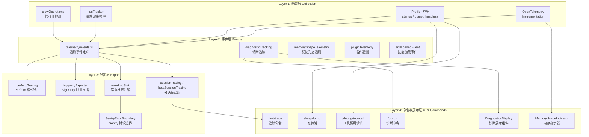
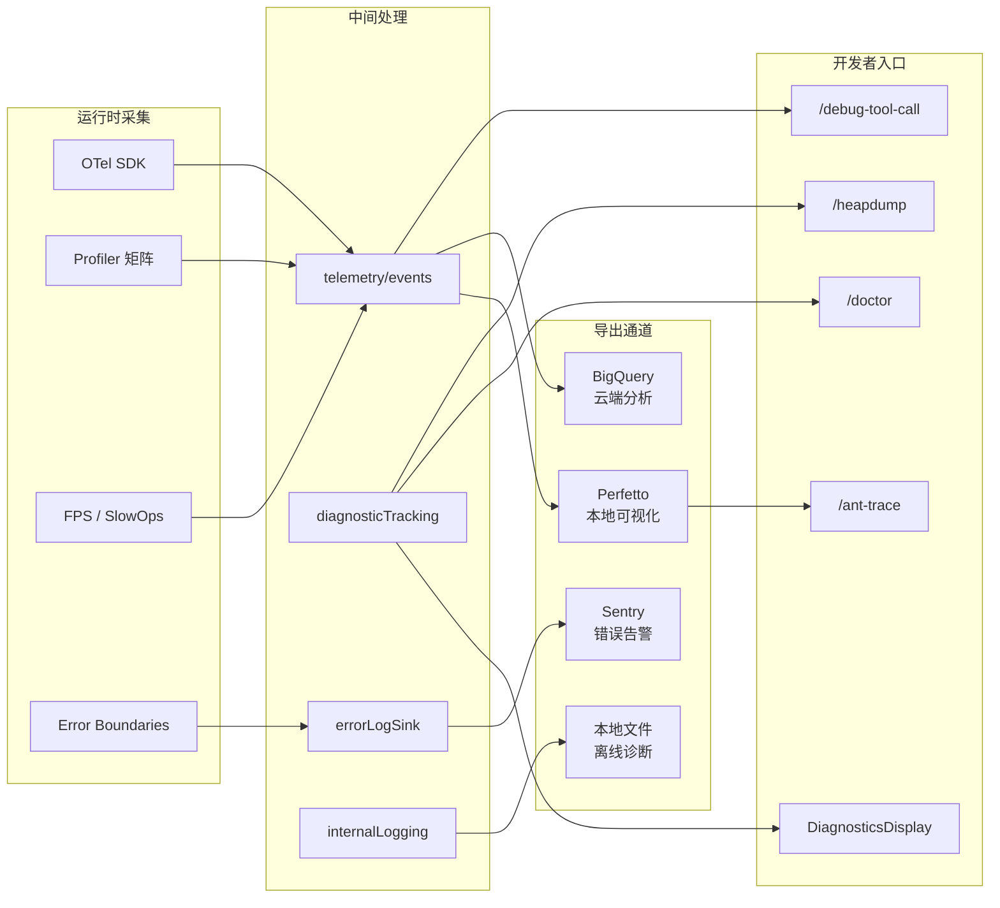

Claude Code 的遥测与诊断体系是一个从**数据采集 → 性能剖析 → 错误上报 → 可视化展示**的完整闭环。它以 OpenTelemetry 为核心骨架，外挂 Sentry 错误边界、Perfetto/BigQuery 导出器，以及多层级 Profiler 和诊断命令，为开发者提供运行时全链路的可观测性。本文将从架构总览出发，逐层拆解每个子系统的工作原理与交互方式。

Sources: [telemetry](src/utils/telemetry), [diagnosticTracking.ts](src/services/diagnosticTracking.ts), [SentryErrorBoundary.ts](src/components/SentryErrorBoundary.ts), [DiagnosticsDisplay.tsx](src/components/DiagnosticsDisplay.tsx)

---

## 架构总览：四层可观测性模型

Claude Code 的遥测与诊断系统可以划分为四个逻辑层次，每个层次承担不同的可观测性职责：

**采集层**在运行时持续捕获指标与 Span 数据；**事件层**定义结构化遥测事件语义；**导出层**将数据路由到不同的后端（Perfetto 可视化、BigQuery 分析、Sentry 告警）；**命令与展示层**则提供开发者可直接交互的诊断入口。

Sources: [telemetry directory](src/utils/telemetry), [profilerBase.ts](src/utils/profilerBase.ts), [slowOperations.ts](src/utils/slowOperations.ts), [fpsTracker.ts](src/utils/fpsTracker.ts)

---

## OpenTelemetry 集成：核心遥测骨架

### Instrumentation 初始化

`src/utils/telemetry/instrumentation.ts` 是整个遥测体系的入口点，负责初始化 OpenTelemetry SDK、注册 TracerProvider 和 MeterProvider。Claude Code 的 OTel 集成遵循标准的三件套模式：**Tracing（分布式追踪）、Metrics（指标采集）、Logging（结构化日志）**。

关键设计决策在于：Claude Code 作为 CLI 应用，其遥测并非服务于微服务间的分布式追踪，而是聚焦于**单进程内的执行剖析**——从用户输入到工具调用、再到 API 响应的完整链路。因此，Tracer 的 Span 语义被重新定义为 CLI 交互的各个阶段。

Sources: [instrumentation.ts](src/utils/telemetry/instrumentation.ts)

### 会话追踪：Session Tracing

会话追踪是 Claude Code 遥测中最核心的概念。`sessionTracing.ts` 为每个 CLI 会话创建根 Span，所有后续操作（查询执行、工具调用、MCP 通信等）均作为子 Span 挂载。`betaSessionTracing.ts` 则为 Beta 功能提供独立的追踪通道，确保实验性功能的遥测数据不会污染主干指标。

Sources: [sessionTracing.ts](src/utils/telemetry/sessionTracing.ts), [betaSessionTracing.ts](src/utils/telemetry/betaSessionTracing.ts)

### Perfetto 集成：可视化性能剖析

`perfettoTracing.ts` 将 OpenTelemetry Span 数据转换为 **Perfetto Trace 格式**——Chrome 团队开发的高性能追踪可视化格式。这使得开发者可以通过 Perfetto UI 打开 Claude Code 的执行追踪，以时间轴形式直观查看：

- 各查询阶段的耗时分布
- 工具调用的嵌套层级与阻塞关系
- 流式响应的分块传输时间

Perfetto 格式选择体现了对**本地离线诊断**场景的优先支持——开发者无需配置远程后端即可获得专业级追踪可视化。

Sources: [perfettoTracing.ts](src/utils/telemetry/perfettoTracing.ts)

### BigQuery Exporter：云端批量分析

`bigqueryExporter.ts` 实现了将遥测数据批量导出到 Google BigQuery 的能力，支持大规模聚合分析。这条导出路径主要用于**产品团队的用户行为分析**——通过 SQL 查询理解用户在不同命令上的耗时分布、错误率趋势和功能采用率。

| 导出通道 | 目标受众 | 使用场景 | 数据格式 |
|---------|---------|---------|---------|
| Perfetto | 开发者/调试 | 本地性能剖析 | .perfetto-trace |
| BigQuery | 产品/数据团队 | 大规模聚合分析 | Structured rows |
| Session Trace | 开发者/调试 | 会话级端到端追踪 | OTel Span tree |

Sources: [bigqueryExporter.ts](src/utils/telemetry/bigqueryExporter.ts), [perfettoTracing.ts](src/utils/telemetry/perfettoTracing.ts), [sessionTracing.ts](src/utils/telemetry/sessionTracing.ts)

### 遥测事件定义与属性体系

`events.ts` 定义了所有遥测事件的类型与元数据，`src/telemetryAttributes.ts` 则统一管理遥测属性的命名规范。这套属性体系确保了所有模块在同一语义空间内产出数据——例如 `session.id`、`tool.name`、`query.duration_ms` 等属性在不同模块中具有完全一致的含义。

Sources: [events.ts](src/utils/telemetry/events.ts), [telemetryAttributes.ts](src/telemetryAttributes.ts)

### 专项遥测：插件、技能与记忆

在核心遥测骨架之外，Claude Code 还为特定子系统建立了专项遥测通道：

- **`pluginTelemetry.ts`**：追踪插件的加载时间、初始化状态与运行时错误，确保插件生态的健康度可度量
- **`skillLoadedEvent.ts`**：记录技能的加载时机与来源（内置/用户自定义/MCP 派生），辅助技能发现系统的优化
- **`memoryShapeTelemetry.ts`**：采集记忆条目的形态数据（长度分布、标签频率、衰减曲线），为记忆检索算法的调优提供数据支撑

Sources: [pluginTelemetry.ts](src/utils/telemetry/pluginTelemetry.ts), [skillLoadedEvent.ts](src/utils/telemetry/skillLoadedEvent.ts), [memoryShapeTelemetry.ts](src/memdir/memoryShapeTelemetry.ts)

---

## Profiler 矩阵：多维度性能剖析

Claude Code 的性能剖析并非单一工具，而是由四个专职 Profiler 组成的矩阵，覆盖从启动到查询再到后台任务的全生命周期。

### Profiler 矩阵总览

| Profiler | 文件 | 剖析目标 | 关键指标 |
|---------|------|---------|---------|
| Startup Profiler | `startupProfiler.ts` | CLI 启动流程 | 各阶段启动耗时 |
| Query Profiler | `queryProfiler.ts` | 查询执行引擎 | Token 生成速率、首 Token 延迟 |
| Headless Profiler | `headlessProfiler.ts` | 无头模式执行 | 端到端任务完成时间 |
| Base Profiler | `profilerBase.ts` | 公共剖析基础设施 | Span 创建、时间戳管理 |

Sources: [startupProfiler.ts](src/utils/startupProfiler.ts), [queryProfiler.ts](src/utils/queryProfiler.ts), [headlessProfiler.ts](src/utils/headlessProfiler.ts), [profilerBase.ts](src/utils/profilerBase.ts)

### Base Profiler：基础设施层

`profilerBase.ts` 提供了所有 Profiler 共享的能力：高精度时间戳记录、Span 生命周期管理、以及与 OTel Tracing 的桥接。它确保了不同 Profiler 产出的数据在格式和时间对齐上保持一致，避免因剖析工具差异导致的数据割裂。

Sources: [profilerBase.ts](src/utils/profilerBase.ts)

### Startup Profiler：启动耗时剖析

启动流程是 CLI 应用用户体验的关键瓶颈。`startupProfiler.ts` 将启动过程拆解为可度量的阶段——配置加载、认证检查、MCP 服务器初始化、会话恢复——每个阶段的耗时被精确记录。这些数据不仅用于性能回归检测，还驱动了 [配置体系](24-pei-zhi-ti-xi-fen-ceng-pei-zhi-she-zhi-tong-bu-yu-tuo-guan-huan-jing-bian-liang) 中懒加载策略的决策。

Sources: [startupProfiler.ts](src/utils/startupProfiler.ts)

### Query Profiler：查询性能剖析

`queryProfiler.ts` 聚焦于查询引擎的执行性能，追踪从用户提交 Prompt 到收到首个响应 Token（TTFT）的完整链路。关键度量维度包括：

- **首 Token 延迟 (TTFT)**：从请求发出到首字节到达的时间
- **Token 生成速率**：流式响应中每秒产出的 Token 数
- **工具调用开销**：工具调度决策 → 工具执行 → 结果回传的总耗时
- **上下文处理时间**：消息序列组装、Token 计数与裁剪的耗时

Sources: [queryProfiler.ts](src/utils/queryProfiler.ts)

### 慢操作检测：slowOperations

`slowOperations.ts` 实现了运行时慢操作的自动检测与上报。不同于 Profiler 的主动剖析，慢操作检测是被动的——它在关键路径上设置阈值，当操作耗时超出预设阈值时自动生成告警事件。这种机制确保了**性能退化不会被淹没在正常指标的平均值中**。

Sources: [slowOperations.ts](src/utils/slowOperations.ts)

### FPS 追踪：终端渲染帧率

`fpsTracker.ts` 和 `fpsMetrics.tsx` 将游戏开发中的帧率概念引入终端应用。Claude Code 使用 Ink 框架进行 React 终端渲染（详见 [Ink 定制框架](8-ink-ding-zhi-kuang-jia-zhong-duan-react-xuan-ran-qi-de-gua-pei-yu-kuo-zhan)），FPS 追踪监控渲染循环的流畅度——当虚拟滚动、Markdown 渲染或大量工具输出导致帧率下降时，系统可以精确定位绘制瓶颈。

Sources: [fpsTracker.ts](src/utils/fpsTracker.ts), [fpsMetrics.tsx](src/context/fpsMetrics.tsx)

---

## 错误上报：Sentry 与诊断追踪

### Sentry 错误边界

`SentryErrorBoundary.ts` 是 Claude Code UI 层的最后一道防线——一个 React Error Boundary 组件，捕获渲染过程中的未处理异常。当组件树崩溃时，它将错误上下文上报至 Sentry，并展示一个优雅的降级 UI 而非空白终端。

Claude Code 选择 Sentry 作为错误上报平台的核心原因在于：Sentry 提供了**丰富的错误上下文**（堆栈追踪、Breadcrumbs、用户环境信息）和**错误聚合**能力——将同一根因的不同表象归并为单一 Issue，避免告警风暴。

Sources: [SentryErrorBoundary.ts](src/components/SentryErrorBoundary.ts)

### 错误日志汇聚：errorLogSink

`errorLogSink.ts` 充当所有内部错误的汇聚点。它不仅采集未捕获异常，还记录被 `try/catch` 吞噬的"静默错误"——这些错误虽未导致程序崩溃，但可能意味着功能降级或数据不一致。Error Log Sink 将这些错误结构化后，统一路由到诊断追踪系统和遥测管线。

Sources: [errorLogSink.ts](src/utils/errorLogSink.ts)

### 诊断追踪服务：diagnosticTracking

`diagnosticTracking.ts` 是一个跨模块的诊断信息聚合服务。它维护一个诊断事件的环形缓冲区，记录：

- API 错误（速率限制、认证失败、模型过载）
- 工具执行异常（权限拒绝、沙箱违规、超时中断）
- 网络连接状态变更
- 会话恢复失败

这些诊断数据服务于两个出口：**DiagnosticsDisplay 组件**（实时展示在 CLI 界面）和 **`/doctor` 命令**（批量诊断与修复建议）。

Sources: [diagnosticTracking.ts](src/services/diagnosticTracking.ts), [DiagnosticsDisplay.tsx](src/components/DiagnosticsDisplay.tsx)

### 内部日志服务：internalLogging

`internalLogging.ts` 提供了结构化的内部日志能力。与 `console.log` 不同，内部日志服务确保日志输出遵循统一的格式规范，并遵守用户的隐私设置——在遥测被禁用时，内部日志仍然工作，但仅输出到本地文件而非远程后端。

Sources: [internalLogging.ts](src/services/internalLogging.ts)

---

## 诊断命令：开发者可交互的诊断入口

### /doctor：全面诊断与修复

`/doctor` 命令是 Claude Code 的"体检中心"（具体实现见 `src/screens/Doctor.tsx` 和 `src/commands/doctor/`），它执行一系列自动化检查：

| 检查项 | 说明 |
|-------|------|
| 认证状态 | API 密钥有效性、OAuth Token 刷新状态 |
| 网络连通性 | 与 Anthropic API 的连接质量 |
| 配置完整性 | 设置文件语法、Feature Flag 一致性 |
| MCP 服务器 | 已配置服务器的连接状态与工具可用性 |
| Git 集成 | 仓库检测、SSH 密钥、GitHub App 授权 |
| IDE 连接 | VS Code / JetBrains 插件的连接状态 |
| 沙箱环境 | 沙箱二进制的安装与权限检查 |

Sources: [Doctor.tsx](src/screens/Doctor.tsx), [doctor](src/commands/doctor), [doctorContextWarnings.ts](src/utils/doctorContextWarnings.ts), [doctorDiagnostic.ts](src/utils/doctorDiagnostic.ts)

### /heapdump：堆内存转储

`/heapdump` 命令（`src/commands/heapdump/`）触发 V8 引擎的堆内存快照，生成 `.heapsnapshot` 文件。这在排查内存泄漏时至关重要——开发者可以导入 Chrome DevTools 进行对象引用分析和_retained size_ 排序。`heapdump.ts` 封装了堆转储的核心逻辑，确保在 Node.js 单线程环境中安全地触发快照而不阻塞主循环。

Sources: [heapdump.ts](src/commands/heapdump/heapdump.ts), [index.ts](src/commands/heapdump/index.ts), [heapDumpService.ts](src/utils/heapDumpService.ts)

### /ant-trace：追踪数据导出

`/ant-trace` 命令（`src/commands/ant-trace/`）是与会话追踪系统直接交互的入口，允许开发者导出当前会话的追踪数据。结合 Perfetto 格式导出，开发者可以在本地获得端到端的执行时间线可视化。

Sources: [ant-trace](src/commands/ant-trace)

### /debug-tool-call：工具调用调试

`/debug-tool-call` 命令（`src/commands/debug-tool-call/`）提供了工具调用的专项调试能力，允许开发者查看工具调用的完整生命周期：参数构造 → 权限检查 → 执行 → 结果处理。这对于排查复杂工具链（如 MCP 工具桥接）的行为异常尤为有用。

Sources: [debug-tool-call](src/commands/debug-tool-call)

---

## 诊断 UI 组件

### DiagnosticsDisplay：诊断信息展示

`DiagnosticsDisplay.tsx` 是在 CLI 界面中实时展示诊断信息的 React 组件。它从 `diagnosticTracking.ts` 获取数据流，以非阻塞方式在终端底部或侧边栏显示当前活跃的警告与错误。

Sources: [DiagnosticsDisplay.tsx](src/components/DiagnosticsDisplay.tsx)

### MemoryUsageIndicator：内存用量指示器

`MemoryUsageIndicator.tsx` 持续监控并展示 Node.js 进程的内存占用。当 `rss`（常驻内存集）或 `heapUsed`（已用堆内存）超出合理范围时，该指示器会以醒目样式提醒开发者，引导其使用 `/heapdump` 命令进一步排查。

Sources: [MemoryUsageIndicator.tsx](src/components/MemoryUsageIndicator.tsx), [useMemoryUsage.ts](src/hooks/useMemoryUsage.ts)

---

## 数据流全景：从采集到消费

Sources: [telemetry](src/utils/telemetry), [services](src/services/diagnosticTracking.ts), [commands](src/commands)

---

## 遥测隐私与控制

Claude Code 的遥测系统遵循**最小必要**原则：遥测数据仅包含功能使用指标与性能特征，绝不包含用户 Prompt 内容、工具输出的文件内容或任何可识别个人身份的信息。用户可通过隐私设置完全禁用远程遥测导出——在遥测禁用模式下，所有诊断能力（`/doctor`、`/heapdump`、本地 Perfetto 导出）仍然正常工作，仅上传到远程后端的通道被关闭。

这一设计选择体现了一个关键架构理念：**诊断是开发者的权利，遥测是开发者的选择**。本地诊断能力永远不依赖于远程遥测的开启状态。

Sources: [internalLogging.ts](src/services/internalLogging.ts), [privacy-settings](src/commands/privacy-settings)

---

## 与其他系统的关联

遥测与诊断体系并非孤立存在，它与 Claude Code 的其他核心模块紧密交织：

- **[查询引擎](4-zheng-ti-jia-gou-cli-ru-kou-cha-xun-yin-qing-yu-hui-hua-sheng-ming-zhou-qi)**：Query Profiler 直接嵌入查询循环，每个查询的执行就是一组 OTel Span
- **[工具系统](5-gong-ju-xi-tong-50-nei-zhi-gong-ju-de-zhu-ce-diao-du-yu-quan-xian-guan-kong)**：`/debug-tool-call` 暴露工具调用的完整生命周期；权限拒绝事件被 `diagnosticTracking` 追踪
- **[MCP 集成](18-mcp-ji-cheng-mo-xing-shang-xia-wen-xie-yi-de-fu-wu-qi-guan-li-yu-gong-ju-qiao-jie)**：MCP 服务器的连接状态是 `/doctor` 的关键检查项；MCP 工具调用被纳入会话追踪的 Span 树
- **[内存系统](20-ji-yi-xi-tong-ge-ren-ji-yi-tuan-dui-ji-yi-yu-kua-xiang-mu-zhi-shi-chi-jiu-hua)**：`memoryShapeTelemetry` 采集记忆形态数据，驱动检索算法迭代
- **[Bridge 远程控制](15-bridge-yuan-cheng-yao-kong-zhong-duan-de-websocket-shuang-xiang-tong-dao)**：Bridge 连接状态与消息延迟被持续监控
- **[Ink 渲染引擎](8-ink-ding-zhi-kuang-jia-zhong-duan-react-xuan-ran-qi-de-gua-pei-yu-kuo-zhan)**：FPS 追踪确保终端渲染的流畅度可度量

如果你希望继续了解 Claude Code 的基础设施全貌，推荐阅读 [配置体系：分层配置、设置同步与托管环境变量](24-pei-zhi-ti-xi-fen-ceng-pei-zhi-she-zhi-tong-bu-yu-tuo-guan-huan-jing-bian-liang) 和 [Shim 层：原生 NAPI 模块与内部包的兼容适配](27-shim-ceng-yuan-sheng-napi-mo-kuai-yu-nei-bu-bao-de-jian-rong-gua-pei)。