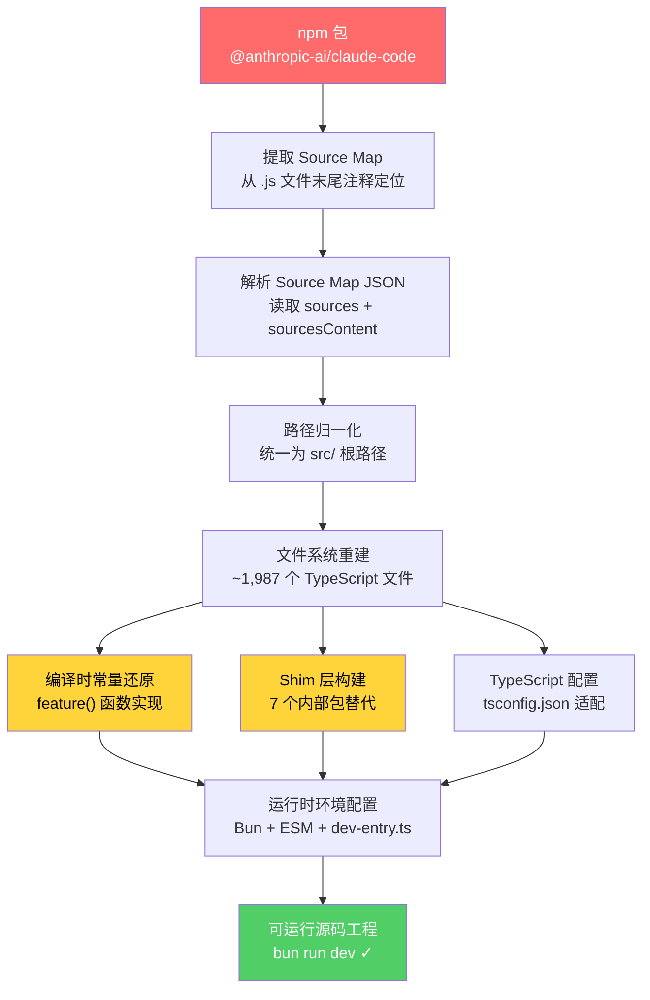

这是一份关于将 `@anthropic-ai/claude-code` npm 发布包中的 Source Map 还原为完整、可本地运行的 TypeScript 源码工程的技术说明。我们将拆解还原过程中的核心挑战——Source Map 解码、路径重建、依赖适配与编译时常量替换——揭示从"可读但零散"到"可构建且可运行"的关键工程步骤。

Sources: [README.md](README.md#L1-L7), [package.json](package.json#L1-L6)

## Source Map 还原的基本原理

Source Map 是 JavaScript 生态中的标准调试辅助机制。当 TypeScript/Bundler 将源码编译为生产 JavaScript 时，构建工具可以选择生成 `.map` 文件，记录编译产物与原始源码之间的位置映射关系。`@anthropic-ai/claude-code` 的 npm 包虽然只发布了编译后的 `.js` 文件，但这些文件末尾附带了 `//# sourceMappingURL` 注释，指向内联或外联的 Source Map 数据。

Source Map JSON 的核心结构包含以下关键字段：

| 字段 | 含义 | 还原作用 |
|------|------|----------|
| `version` | Source Map 规范版本（通常为 3） | 确定解析策略 |
| `sources` | 原始源文件的逻辑路径列表 | **重建目录结构的骨架** |
| `sourcesContent` | 与 `sources` 一一对应的原始源码内容 | **直接提取源码** |
| `mappings` | VLQ 编码的位置映射（编译行→源码行/列） | 辅助验证对齐关系 |
| `names` | 映射中引用的标识符名称 | 辅助变量名还原 |

还原的核心操作并不复杂：**读取 `sources` 数组获得逻辑路径，从 `sourcesContent` 数组提取对应源码，按逻辑路径写入文件系统**。但"可读"距离"可运行"之间，横亘着数道工程鸿沟。

Sources: [README.md](README.md#L1-L11)

## 从零散源码到工程化目录的重建

Source Map 的 `sources` 字段记录的是编译时的逻辑路径，格式类似于 `../src/bridge/replBridge.ts`。这些路径基于 Bundler 的虚拟文件系统，可能包含相对路径跳跃、重复模块引用（同一文件被多个 chunk 引用）以及路径规范化差异。还原工程需要完成以下步骤：

**第一步：路径归一化**。将所有相对路径统一为以 `src/` 为根的规范路径，去除 `../` 跳跃和重复的模块引用，建立唯一的路径→内容映射表。

**第二步：目录树重建**。根据归一化路径创建完整的文件系统目录结构。从目录结构可以看出，还原后的项目包含约 1,987 个 TypeScript 文件，覆盖从 `src/entrypoints/` 到 `src/voice/` 的完整功能模块。

**第三步：TypeScript 配置适配**。还原项目需要一套 `tsconfig.json` 来让 IDE 和运行时正确解析模块路径。关键配置包括：`moduleResolution: "bundler"` 以兼容 Bundler 风格的路径解析，`jsx: "react-jsx"` 支持 TSX 文件，`strict: false` 因为还原代码无法保证原始类型严格性，以及 `paths` 别名将 `src/*` 映射到 `./src/*`。

Sources: [tsconfig.json](tsconfig.json#L1-L29)

## 编译时常量的识别与替换

这是还原工程中最关键也最隐蔽的步骤。Claude Code 的源码中大量使用 **编译时常量替换**——即在构建时将特定标识符替换为字面量，使得 Bundler 的 Tree-shaking 可以在编译阶段直接移除不可达分支。

核心模式是 `feature('XXX')` 函数调用。在原始构建流水线中，这个函数调用会被替换为布尔字面量 `true` 或 `false`。当 Bundler 遇到如下代码结构时：

```typescript
if (feature('BUDDY')) {
  // 整个 buddy 模块初始化逻辑
}
```

如果 `feature('BUDDY')` 被替换为 `false`，Bundler 将**整段代码连同其依赖**从最终产物中移除。这就是为什么外部发布版中几乎找不到 Buddy、Kairos 等功能的运行痕迹。

Source Map 还原时获得的是替换**之前**的源码，因此 `feature('XXX')` 调用仍然以函数形式存在。还原工程需要提供该函数的运行时实现——一个简单的查找表，根据目标环境返回 `true`/`false`。同理，`USER_TYPE` 或 `'ant'` 的字符串常量比较也需要被正确还原为可求值的表达式。

Sources: [README.md](README.md#L26-L27), [README.md](README.md#L165-L200)

## Shim 层：填补内部依赖的空白

还原后的源码引用了大量 Anthropic 内部包——这些包未在公共 npm 仓库发布，直接安装会导致依赖解析失败。还原工程通过 **Shim 层** 解决这个问题，位于 `shims/` 目录下。

Shim 层的核心设计原则是**接口兼容、实现最小化**。每个 shim 包只导出源码中实际用到的 API 签名，实现体要么返回空值/默认值，要么提供基础功能。以下是最关键的 shim 列表：

| Shim 包 | 对应内部包 | 用途 | 策略 |
|---------|-----------|------|------|
| `ant-claude-for-chrome-mcp` | `@ant/claude-for-chrome-mcp` | Chrome 扩展 MCP 集成 | 空实现导出 |
| `ant-computer-use-input` | `@ant/computer-use-input` | Computer Use 输入处理 | 空实现导出 |
| `ant-computer-use-mcp` | `@ant/computer-use-mcp` | Computer Use MCP 服务 | 空实现导出 |
| `ant-computer-use-swift` | `@ant/computer-use-swift` | macOS Swift 原生交互 | 空实现导出 |
| `color-diff-napi` | `color-diff-napi` | 颜色差异计算（NAPI 原生模块） | 纯 JS 降级实现 |
| `modifiers-napi` | `modifiers-napi` | 键盘修饰键检测（NAPI 原生模块） | 纯 JS 降级实现 |
| `url-handler-napi` | `url-handler-napi` | URL 协议注册（NAPI 原生模块） | 纯 JS 降级实现 |

`package.json` 中通过 `"file:./shims/xxx"` 的本地路径引用方式将这些 shim 包注入依赖图，而非从远程 registry 拉取。

Sources: [package.json](package.json#L24-L28), [package.json](package.json#L94-L96)

## 运行时环境适配：从 Node.js 到 Bun

还原项目选择 **Bun** 作为运行时而非标准的 Node.js，这一选择并非偶然。Claude Code 的原始构建产物在多处使用了 Node.js 的实验性 API（如 `fs.watch` 的递归模式、`child_process` 的特定行为），而 Bun 对这些 API 的兼容性处理更为宽松。更重要的是，Bun 原生支持 TypeScript 直接运行，无需预编译步骤。

工程配置中的关键适配点：

- **入口文件**：`src/dev-entry.ts` 作为开发模式入口，内含开发环境特有的初始化逻辑（如 feature flag 默认值设定），区别于 `src/entrypoints/cli.tsx` 的生产入口
- **ESM 模式**：`package.json` 中 `"type": "module"` 确保 Bun 以 ESM 模式解析所有 `.js`/`.ts` 文件
- **依赖版本通配**：所有 `dependencies` 使用 `"*"` 版本号，配合 `bun.lock` 锁定具体版本，因为还原项目无法确定原始精确版本约束
- **TypeScript 松散模式**：`strict: false` + `skipLibCheck: true`，承认还原代码的类型注解可能不完全一致

Sources: [package.json](package.json#L4-L21), [tsconfig.json](tsconfig.json#L1-L29)

## 还原工程的完整性边界

必须坦诚说明还原工程的**固有局限**，这些是无法通过工程手段完全弥合的信息鸿沟：

**丢失的构建配置**。原始项目的 Rollup/esbuild 配置、Tree-shaking 规则、插件链等构建元数据不在 Source Map 中，还原项目无法复现原始构建流水线。

**编译时内联的值**。除了 `feature()` 函数外，可能还有其他构建时替换的常量（如版本号注入、环境变量内联），这些在 Source Map 中表现为原始标识符，但运行时行为依赖具体替换值。

**原生二进制模块**。`color-diff-napi`、`modifiers-napi`、`url-handler-napi` 三个 NAPI 模块原本是编译后的 `.node` 二进制文件，Source Map 只包含其 TypeScript 入口声明。Shim 层提供的是功能降级的纯 JS 替代。

**内部服务端点**。源码中硬编码的 API 端点（如 `api.anthropic.com` 下的内部路径）、OAuth 回调 URL 等可能指向内部服务，外部环境无法访问。

**远程 Feature Flag 体系**。GrowthBook 的远程配置（如 `tengu_kairos`、`tengu_ultraplan_model` 等）的默认值和完整 flag 列表无法从源码中完全恢复。

Sources: [README.md](README.md#L9-L11)

## 还原流程全景图

以下 Mermaid 图展示了从 npm 包到可运行源码的完整还原流程：



Sources: [README.md](README.md#L14-L20), [package.json](package.json#L17-L20)

## 关键适配决策总结

| 决策领域 | 问题 | 还原方案 | 影响范围 |
|----------|------|----------|----------|
| 运行时 | 编译产物依赖 Node 实验性 API | 选用 Bun 运行时 | 全局 |
| 入口点 | 生产入口不可直达 | `dev-entry.ts` 开发入口 | 启动流程 |
| 类型检查 | 还原代码类型不完整 | `strict: false` + `skipLibCheck` | 全局 |
| 内部包 | `@ant/*` 不在公共 npm | `shims/` 目录本地包替代 | 7 个包 |
| 原生模块 | `.node` 二进制无法还原 | 纯 JS 功能降级实现 | 3 个模块 |
| 版本约束 | 原始精确版本未知 | `"*"` 通配符 + lockfile | 全部依赖 |
| Feature Flag | 编译时替换的布尔值 | 运行时 `feature()` 函数 | ~50 个开关 |
| 路径解析 | Bundler 虚拟路径 | `paths` 别名 `src/*` | 模块导入 |

Sources: [package.json](package.json#L4-L98), [tsconfig.json](tsconfig.json#L1-L29)

## 延伸阅读

还原工程的产物是一份**可读、可搜索、可运行**的完整源码树。理解了还原方法后，你可以按照以下路径深入探索源码本身：

- 如果你想了解还原后代码的整体架构模式，请阅读 [整体架构：CLI 入口、查询引擎与会话生命周期](4-zheng-ti-jia-gou-cli-ru-kou-cha-xun-yin-qing-yu-hui-hua-sheng-ming-zhou-qi)
- 如果你对编译开关体系如何控制功能可见性感兴趣，请阅读 [三层门控体系：编译开关、用户类型与远程 Feature Flag](16-san-ceng-men-kong-ti-xi-bian-yi-kai-guan-yong-hu-lei-xing-yu-yuan-cheng-feature-flag)
- 如果你想快速看到还原代码中的隐藏功能，请阅读 [隐藏命令与秘密 CLI 参数全览](17-yin-cang-ming-ling-yu-mi-mi-cli-can-shu-quan-lan)
- 如果你想了解 Shim 层中 NAPI 模块的具体适配策略，请阅读 [Shim 层：原生 NAPI 模块与内部包的兼容适配](27-shim-ceng-yuan-sheng-napi-mo-kuai-yu-nei-bu-bao-de-jian-rong-gua-pei)