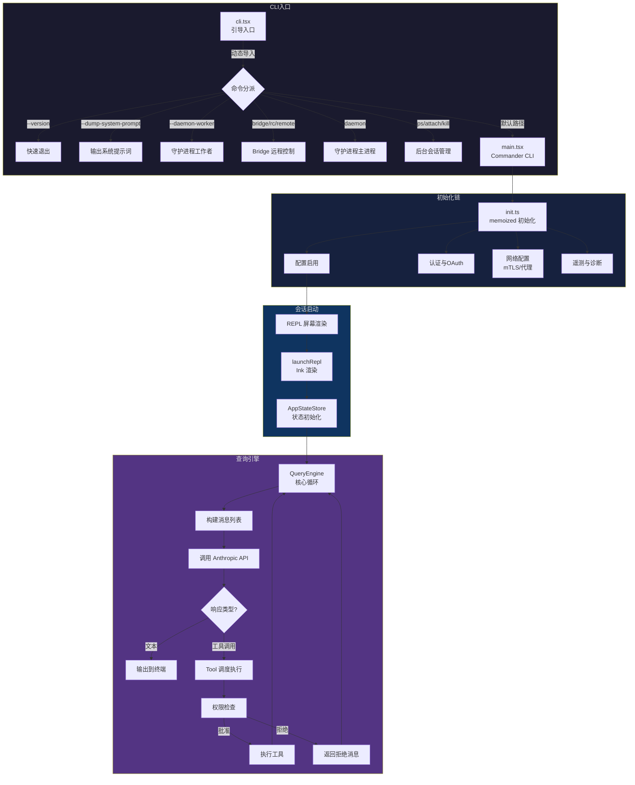
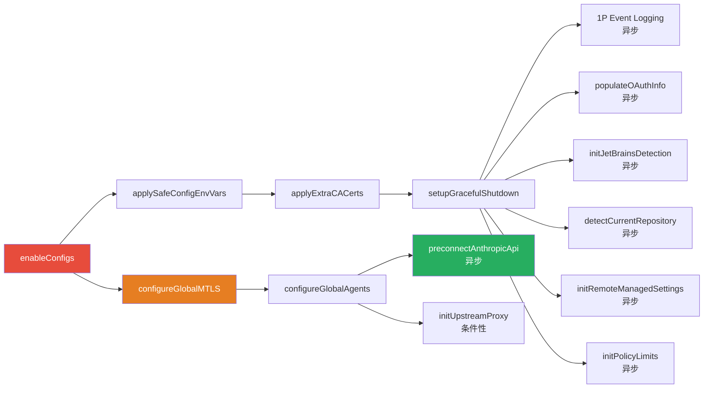
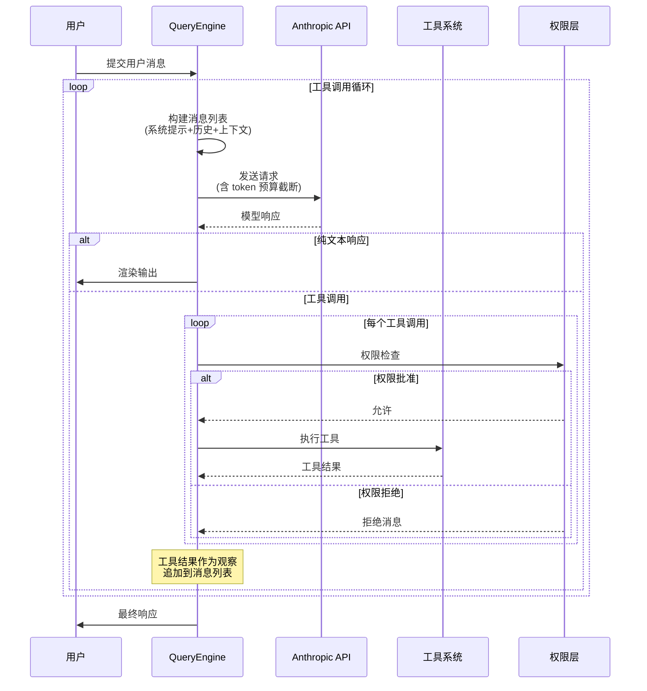
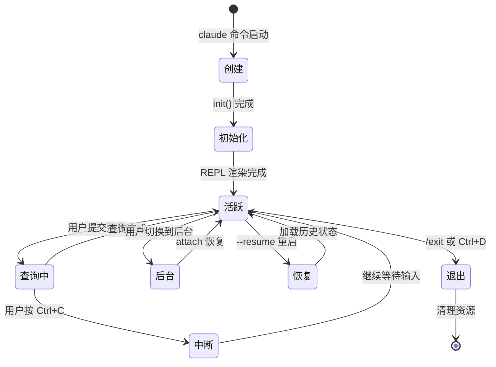

Claude Code 是一个基于终端的 AI 编程助手，其架构围绕三个核心概念展开：**CLI 入口**负责引导与命令分派，**查询引擎**驱动模型交互的工具调用循环，**会话生命周期**管理从创建、恢复到退出的完整状态流转。本文将从第一性原理出发，揭示这三个子系统如何协同工作，构成 Claude Code 的运行骨架。

## 架构总览

在深入每个子系统之前，先建立全局视图。下图展示了 Claude Code 从用户敲下 `claude` 命令到会话运行的完整数据流：

Sources: [cli.tsx](src/entrypoints/cli.tsx#L1-L200), [init.ts](src/entrypoints/init.ts#L1-L200), [main.tsx](src/main.tsx#L1-L200)

## CLI 入口：多路径分派机制

`cli.tsx` 是整个 Claude Code 的**引导入口**（bootstrap entrypoint），其设计遵循一个核心原则：**最小化模块加载**。在用户仅查询版本号等场景下，系统不应付出数百毫秒的模块初始化代价。

### 快速路径优先策略

`cli.tsx` 的 `main()` 函数采用**渐进式导入**模式——所有非必要模块均通过动态 `import()` 加载，使得快速路径的模块加载量趋近于零：

| 快速路径 | 触发条件 | 加载模块数 | 用途 |
|---|---|---|---|
| 版本查询 | `--version` / `-v` | 0（MACRO 内联） | 即时输出版本号退出 |
| 系统提示词转储 | `--dump-system-prompt` | 3（config, model, prompts） | 提取当前系统提示词 |
| Chrome MCP | `--claude-in-chrome-mcp` | 1（mcpServer） | 启动浏览器扩展 MCP 服务 |
| Computer Use MCP | `--computer-use-mcp` | 1（mcpServer） | 启动计算机操作 MCP 服务 |
| 守护进程工作者 | `--daemon-worker` | 1（workerRegistry） | 内部工作者进程 |
| Bridge 远程控制 | `remote-control` / `rc` / `remote` | 5+（auth, bridge, policy） | 本机作为被控环境 |
| 守护进程 | `daemon` | 3（config, sinks, daemon） | 长驻后台服务 |
| 后台会话 | `ps`/`attach`/`kill`/`--bg` | 2（config, bg） | 后台任务管理 |

这个分派机制的一个精妙之处在于 **Feature Gate 的编译期消除**。`feature('DAEMON')`、`feature('BRIDGE_MODE')` 等条件在构建时会被静态求值——如果特性标志为 `false`，整个 `if` 分支会被 Dead Code Elimination 移除，外部构建版本甚至不会包含守护进程或 Bridge 的代码路径。[cli.tsx](src/entrypoints/cli.tsx#L86-L106)

### 环境预处理

在分派逻辑之前，`cli.tsx` 还执行了两项关键的环境预处理：

1. **Corepack 隔离**：设置 `COREPACK_ENABLE_AUTO_PIN=0`，防止 corepack 自动修改用户的 `package.json`。[cli.tsx](src/entrypoints/cli.tsx#L3-L5)
2. **容器堆内存**：在 CCR 远程环境（`CLAUDE_CODE_REMOTE=true`）中预热 `--max-old-space-size=8192`，确保 16GB 容器内的子进程有充足堆空间。[cli.tsx](src/entrypoints/cli.tsx#L7-L14)
3. **消融基线**：`ABLATION_BASELINE` 特性标志为实验控制变量，一次性禁用思考、压缩、后台任务等高级特性，简化行为基线。[cli.tsx](src/entrypoints/cli.tsx#L16-L26)

### 主路径：Commander CLI

当没有匹配任何快速路径时，控制流进入 `main.tsx`——一个基于 `@commander-js/extra-typings` 的完整 CLI 定义。这里注册了所有用户可交互的命令行选项（`--model`、`--resume`、`--print` 等），并执行以下核心编排：

1. **会话恢复**：通过 `--resume` 标志加载历史会话
2. **权限模式初始化**：解析 `--permission-mode`、`--allowedTools` 等权限配置
3. **MCP 服务器发现**：扫描并连接所有配置的 MCP 服务器
4. **REPL 启动**：调用 `launchRepl()` 进入交互循环

Sources: [cli.tsx](src/entrypoints/cli.tsx#L28-L42), [main.tsx](src/main.tsx#L21-L68)

## 初始化链：从配置到网络的全栈准备

`init.ts` 通过 `memoize` 导出的 `init()` 函数确保**全局只执行一次**。这是整个系统的初始化中枢，其执行顺序经过精心编排以解决依赖前置问题：

### 初始化顺序的关键约束

初始化链中存在严格的**因果依赖**：

- **CA 证书必须在 TLS 之前**：`applyExtraCACertsFromConfig()` 在 `configureGlobalMTLS()` 和 `preconnectAnthropicApi()` 之前执行，因为 Bun 的 BoringSSL 会在首次 TLS 握手时缓存证书存储——一旦缓存形成，后续的证书注入将无效。[init.ts](src/entrypoints/init.ts#L76-L79)
- **安全环境变量先于信任对话框**：`applySafeConfigEnvironmentVariables()` 仅应用不涉及代码执行的"安全"变量，完整的 `applyConfigEnvironmentVariables()` 要等到用户通过信任对话框后才执行。[init.ts](src/entrypoints/init.ts#L71-L74)
- **API 预连接延迟加载**：`preconnectAnthropicApi()` 在代理和 mTLS 配置之后触发，确保预热连接使用正确的传输层，重叠约 100-200ms 的 TCP+TLS 握手与后续逻辑。[init.ts](src/entrypoints/init.ts#L153-L159)

### 异步服务的发射后不管模式

大量服务采用**发射后不管**（fire-and-forget）模式初始化——OAuth 账户信息填充、JetBrains IDE 检测、GitHub 仓库检测等用 `void` 前缀异步执行，不阻塞主启动路径。这是一种有意的权衡：这些服务的延迟加载错误不会阻止 CLI 启动，但可能在首次访问时出现短暂的缓存未命中。[init.ts](src/entrypoints/init.ts#L94-L118)

Sources: [init.ts](src/entrypoints/init.ts#L57-L200)

## 查询引擎：工具调用循环的核心

**查询引擎**（QueryEngine）是 Claude Code 的心脏——它实现了 LLM 应用的核心抽象：**查询-工具-观察循环**（Query-Tool-Observation Loop）。

### 循环本质

查询引擎遵循 ReAct 模式的基本结构，但加入了多层工程优化：

这个循环的终止条件包括：模型返回纯文本（无工具调用）、用户中断（Ctrl+C）、达到 token 预算上限、或遇到中止钩子。[QueryEngine.ts](src/QueryEngine.ts#L1-L50)

### 查询配置与 Token 预算

每次查询都携带一组配置参数，控制着循环的行为边界：

| 配置项 | 位置 | 作用 |
|---|---|---|
| token 预算 | `query/tokenBudget.ts` | 截断历史消息以适配上下文窗口 |
| 查询配置 | `query/config.ts` | 模型选择、温度、最大输出 token |
| 停止钩子 | `query/stopHooks.ts` | 在循环迭代间检查是否应中止 |
| 状态转换 | `query/transitions.ts` | 管理查询状态的合法转换 |
| 依赖收集 | `query/deps.ts` | 追踪查询间的依赖关系 |

**Token 预算**是查询引擎最关键的约束之一。它需要在有限的上下文窗口内平衡三个竞争者：**系统提示词**（通常占数千 token）、**历史对话**（可能跨多轮工具调用）、**工具结果**（可能包含大段文件内容）。预算分配策略采用优先级截断：系统提示词不可截断，历史消息从最旧的开始裁剪，工具结果可通过独立的内容折叠机制压缩。[tokenBudget.ts](src/query/tokenBudget.ts#L1-L1), [config.ts](src/query/config.ts#L1-L1)

Sources: [QueryEngine.ts](src/QueryEngine.ts#L1-L50), [query/](src/query/)

## 会话生命周期：从创建到退出

会话（Session）是 Claude Code 中用户交互的**持久化单元**。一个会话从创建到退出经历以下阶段：

### 会话创建流程

会话创建的核心路径是 `main.tsx` → `launchRepl()` → Ink React 渲染。在这个过程中，系统完成以下关键初始化：

1. **会话 ID 生成**：通过 `asSessionId()` 创建唯一标识符，用于会话持久化和日志关联
2. **应用状态初始化**：`AppStateStore` 构建默认状态（`getDefaultAppState()`），包含消息列表、工具权限、模型选择等
3. **权限上下文建立**：`initializeToolPermissionContext()` 根据命令行参数和用户类型确定当前会话的工具权限边界
4. **MCP 客户端连接**：`getMcpToolsCommandsAndResources()` 连接所有配置的 MCP 服务器，将外部工具注入当前会话
5. **历史消息加载**：若为恢复会话（`--resume`），通过 `loadConversationForResume()` 从磁盘加载之前的对话记录

[main.tsx](src/main.tsx#L191-L199), [replLauncher.tsx](src/replLauncher.tsx#L1-L50)

### 会话持久化与恢复

Claude Code 的会话数据存储在 `~/.claude/sessions/` 目录下。每个会话由以下文件组成：

- **会话日志**：NDJSON 格式的消息流，记录了每个查询的完整往返
- **会话元数据**：包含标题、创建时间、模型配置等
- **会话标题缓存**：`cacheSessionTitle()` 将 AI 生成的标题缓存到磁盘，避免重新生成

恢复会话的核心挑战在于**状态重建**：不仅需要还原消息历史，还需要重建工具权限上下文、MCP 服务器连接、以及可能的中间状态（如未完成的工具调用）。`processResumedConversation()` 负责将磁盘上的原始记录转换为可继续的会话状态。[sessionRestore.ts](src/utils/sessionRestore.ts#L1-L50), [sessionStorage.ts](src/utils/sessionStorage.ts#L1-L50)

### 会话退出与资源清理

退出路径通过**清理注册表**（cleanupRegistry）实现有序的资源释放。在 `init()` 中注册的清理函数（如 `shutdownLspServerManager`、`cleanupSessionTeams`）会在 `gracefulShutdown()` 时按注册顺序的逆序执行。这确保了即使在中断或异常退出场景中，MCP 服务器连接、LSP 进程、子 Agent 团队等资源也不会泄漏。[cleanupRegistry.ts](src/utils/cleanupRegistry.ts#L1-L50), [gracefulShutdown.ts](src/utils/gracefulShutdown.ts#L1-L50)

Sources: [AppStateStore.ts](src/state/AppStateStore.ts#L1-L50), [sessionRestore.ts](src/utils/sessionRestore.ts#L1-L50)

## 启动性能优化：关键路径分析

Claude Code 的启动性能经过了刻意的分层优化。理解这些优化有助于把握架构的设计哲学：

| 优化策略 | 实现位置 | 效果 |
|---|---|---|
| 快速路径零加载 | `cli.tsx` 动态 import | `--version` 零模块开销 |
| 渐进式初始化 | `init.ts` memoize + fire-and-forget | 非关键服务不阻塞主路径 |
| 预连接重叠 | `preconnectAnthropicApi()` | TCP+TLS 与本地逻辑并行 |
| Keychain 预取 | `startKeychainPrefetch()` | macOS 下节省约 65ms 串行读取 |
| MDM 并行读取 | `startMdmRawRead()` | MDM 子进程与模块求值并行 |
| 编译期消除 | `feature()` Dead Code Elimination | 未启用的功能零代码体积 |

`main.tsx` 文件头部的注释精确描述了这些预取逻辑的动机——`startKeychainPrefetch` 将两个 macOS Keychain 读取（OAuth 和 API Key）并行化，否则 `applySafeConfigEnvironmentVariables()` 内的同步调用会串行执行每次约 32ms 的 `spawn` 调用，累计约 65ms。[main.tsx](src/main.tsx#L1-L20)

## 三大子系统的协作边界

CLI 入口、查询引擎和会话生命周期之间存在明确的协作边界：

- **CLI 入口 → 会话**：CLI 负责**一次性编排**——解析参数、建立认证、选择会话模式（新建/恢复/后台），然后将控制权移交给 REPL 循环
- **会话 → 查询引擎**：会话管理查询引擎的**生命周期**——每次用户提交消息时创建新查询，查询结果追加到会话历史中
- **查询引擎 → 会话**：查询引擎在执行过程中可能触发**会话状态变更**——如工具权限授予、模型切换、上下文压缩等，这些变更通过 AppStateStore 传播到 UI 层

这种分层架构使得每个子系统可以独立演进：查询引擎的优化不影响入口分派逻辑，会话持久化格式的变更不需要修改查询循环。

Sources: [cli.tsx](src/entrypoints/cli.tsx#L28-L42), [init.ts](src/entrypoints/init.ts#L57-L100), [main.tsx](src/main.tsx#L1-L200)

## 延伸阅读

- 要深入了解 50+ 内置工具如何注册和被查询引擎调度，参见 [工具系统：50+ 内置工具的注册、调度与权限管控](5-gong-ju-xi-tong-50-nei-zhi-gong-ju-de-zhu-ce-diao-du-yu-quan-xian-guan-kong)
- 要理解会话状态如何在 React 组件树中流转，参见 [状态管理：React 状态树、应用状态存储与选择器模式](7-zhuang-tai-guan-li-react-zhuang-tai-shu-ying-yong-zhuang-tai-cun-chu-yu-xuan-ze-qi-mo-shi)
- 要查看终端渲染层如何支撑 REPL 屏幕输出，参见 [Ink 定制框架：终端 React 渲染器的适配与扩展](8-ink-ding-zhi-kuang-jia-zhong-duan-react-xuan-ran-qi-de-gua-pei-yu-kuo-zhan)
- 要了解远程会话如何复用本架构，参见 [Bridge：远程遥控终端的 WebSocket 双向通道](15-bridge-yuan-cheng-yao-kong-zhong-duan-de-websocket-shuang-xiang-tong-dao)