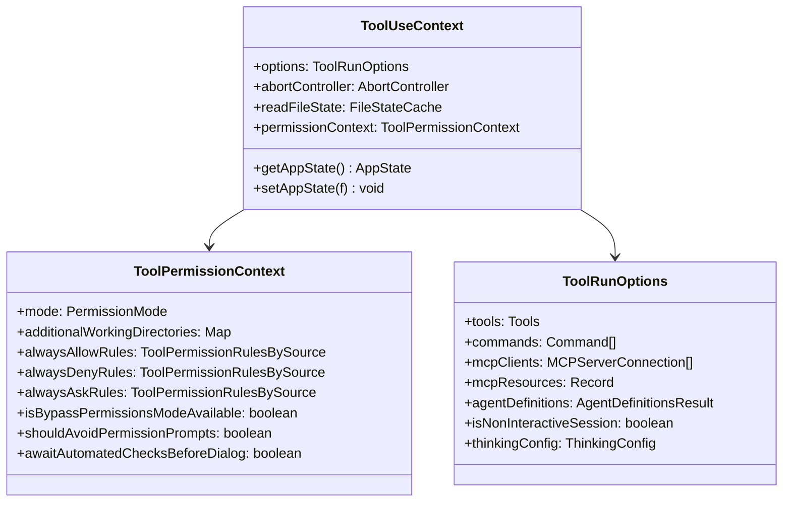
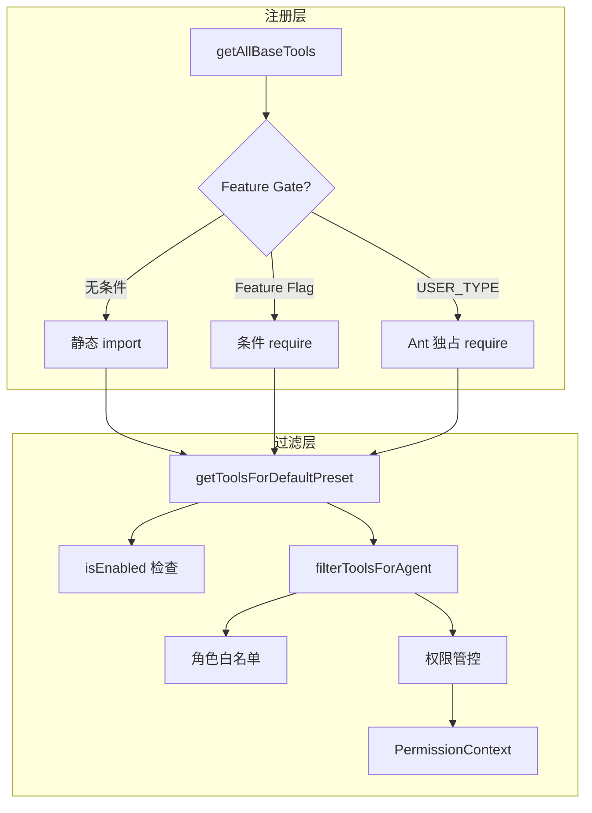
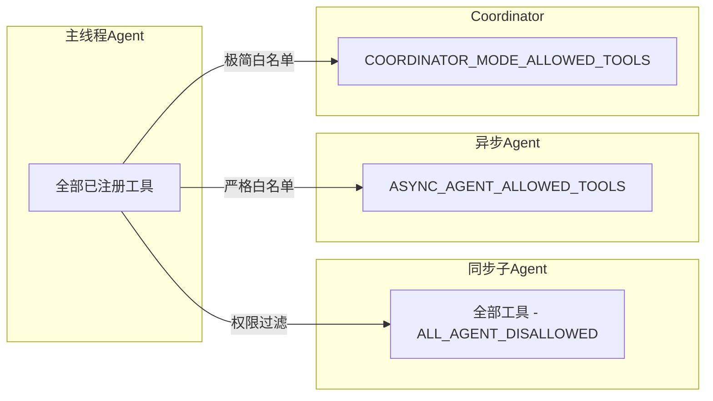
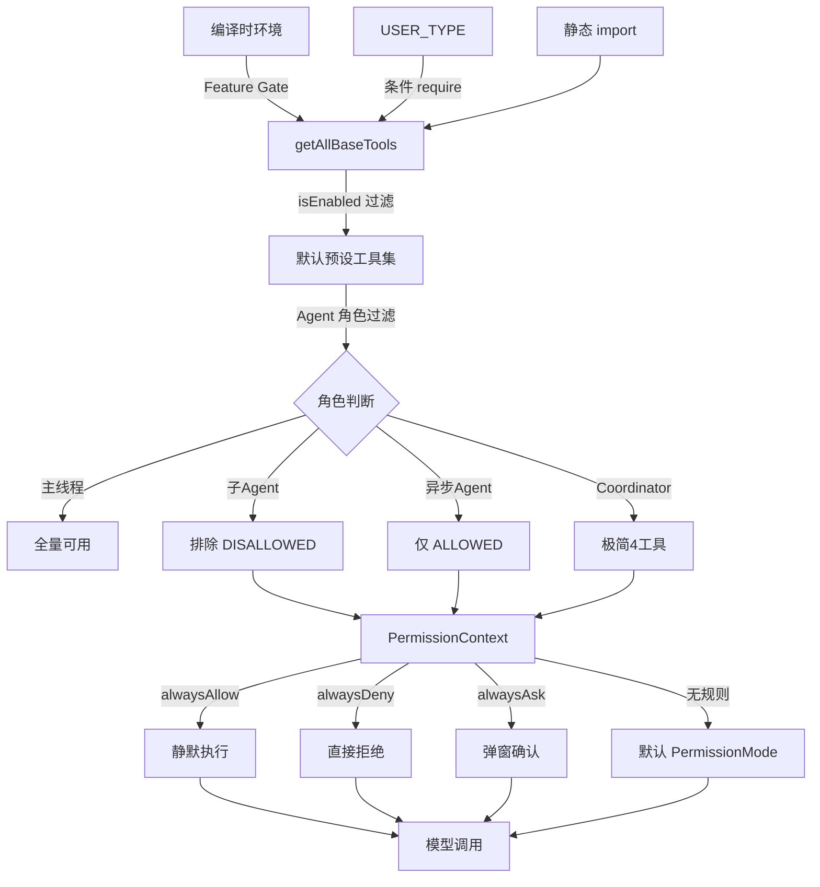

Claude Code 的工具系统是其能力边界的核心定义——模型能做什么、不能做什么，全部由工具注册表决定。这套系统并非简单的函数映射，而是一个融合了**条件编译注册**、**多层权限过滤**、**Feature Gate 门控**和**Agent 角色隔离**的精密调度引擎。本文将从工具的生命周期出发，逐层拆解 50+ 内置工具如何被注册、如何被筛选、如何被执行，以及权限管控如何在每一个环节设防。

Sources: [Tool.ts](src/Tool.ts#L1-L200), [tools.ts](src/tools.ts#L1-L200)

## 类型基石：Tool 接口与 ToolUseContext

工具系统的类型根基在 `src/Tool.ts`。核心类型 `ToolUseContext` 定义了工具执行时的完整上下文：它携带 `options`（包含 `tools` 列表、`commands`、`mcpClients`、`agentDefinitions` 等运行时配置）、`abortController`（取消信号）、`readFileState`（文件状态缓存）以及 `getAppState/setAppState`（全局状态读写入口）。这意味着每个工具调用都不是孤立的——它拥有一条通往整个应用状态的管道。

权限上下文 `ToolPermissionContext` 是另一块关键拼图，它将权限模式（`PermissionMode`）、工作目录白名单（`additionalWorkingDirectories`）、三类规则（`alwaysAllowRules`、`alwaysDenyRules`、`alwaysAskRules`）以及多个行为标志位（`isBypassPermissionsModeAvailable`、`shouldAvoidPermissionPrompts`、`awaitAutomatedChecksBeforeDialog`）封装为一个不可变结构。`DeepImmutable` 的包裹确保运行时无法意外篡改权限规则，任何权限决策都基于快照而非可变引用。

Sources: [Tool.ts](src/Tool.ts#L158-L200), [Tool.ts](src/Tool.ts#L123-L148)

## 注册引擎：getAllBaseTools() 与条件编译策略

`src/tools.ts` 中的 `getAllBaseTools()` 是工具注册的**唯一真相源**。它的核心设计哲学是：工具列表由编译时环境和运行时 Feature Flag 共同决定，而非运行时动态注册。这带来两个关键特征——**零运行时开销**（未启用的工具根本不会被加载）和**确定性**（同一环境下工具列表始终一致）。

注册策略分为三个层次：

| 策略 | 机制 | 示例 |
|------|------|------|
| **无条件注册** | 静态 import，始终可用 | `BashTool`、`FileEditTool`、`GrepTool` |
| **Feature Gate 门控** | `feature('X')` 条件 require | `SleepTool`(PROACTIVE/KAIROS)、`WorkflowTool`(WORKFLOW_SCRIPTS) |
| **用户类型过滤** | `process.env.USER_TYPE === 'ant'` | `REPLTool`、`SuggestBackgroundPRTool` |

Feature Gate 门控的工具采用延迟 require（`require()` 而非 `import`），配合注释 `/* Dead code elimination: conditional import */`，使得 Bun 的打包器可以在编译时将未启用分支整块剔除。这是一个精妙的构建优化——未付费用户永远不会下载 `SleepTool` 的代码。同时，`TeamCreateTool`、`TeamDeleteTool`、`SendMessageTool` 等工具使用**惰性获取函数**（`getTeamCreateTool()`）而非直接 import，其目的是打断循环依赖链——这些工具内部可能反向引用 `tools.ts` 中的类型，惰性求值将初始化顺序问题消弭于无形。

Sources: [tools.ts](src/tools.ts#L1-L200)

## 完整工具清单：50+ 工具分类总览

基于 `getAllBaseTools()` 的注册列表和 `src/tools/` 目录结构，以下按功能域分类所有内置工具：

### 文件操作域

| 工具名 | 功能 | 门控条件 |
|--------|------|----------|
| `FileReadTool` | 读取文件内容（支持范围读取） | 无 |
| `FileEditTool` | 精确行级编辑（旧字符串→新字符串替换） | 无 |
| `FileWriteTool` | 创建或覆写文件 | 无 |
| `NotebookEditTool` | Jupyter Notebook 单元格编辑 | 无 |
| `GlobTool` | 文件名模式匹配搜索 | 无（Ant 构建可能禁用） |
| `GrepTool` | 正则内容搜索 | 无（Ant 构建可能禁用） |

### Shell 执行域

| 工具名 | 功能 | 门控条件 |
|--------|------|----------|
| `BashTool` | 执行 shell 命令 | 无 |
| `PowerShellTool` | Windows PowerShell 执行 | 平台检测 |
| `TerminalCaptureTool` | 捕获终端输出快照 | `TERMINAL_PANEL` |
| `LSPTool` | 语言服务器协议集成 | 无 |

### 任务与 Agent 域

| 工具名 | 功能 | 门控条件 |
|--------|------|----------|
| `AgentTool` | 子 Agent 调度执行 | 无 |
| `TaskCreateTool` | 创建后台任务 | 无 |
| `TaskGetTool` | 获取任务详情 | 无 |
| `TaskListTool` | 列出所有任务 | 无 |
| `TaskUpdateTool` | 更新任务状态 | 无 |
| `TaskOutputTool` | 获取任务输出 | 无 |
| `TaskStopTool` | 停止运行中任务 | 无 |
| `TeamCreateTool` | 创建协作团队 | 无 |
| `TeamDeleteTool` | 删除团队 | 无 |
| `SendMessageTool` | Agent 间消息传递 | 无 |

### 搜索与网络域

| 工具名 | 功能 | 门控条件 |
|--------|------|----------|
| `WebSearchTool` | 网络搜索 | 无 |
| `WebFetchTool` | 抓取网页内容 | 无 |
| `WebBrowserTool` | 浏览器交互 | `WEB_BROWSER_TOOL` |
| `ToolSearchTool` | 工具发现搜索 | 无 |

### MCP 集成域

| 工具名 | 功能 | 门控条件 |
|--------|------|----------|
| `MCPTool` | MCP 协议工具桥接 | 无 |
| `ListMcpResourcesTool` | 列出 MCP 资源 | 无 |
| `ReadMcpResourceTool` | 读取 MCP 资源 | 无 |
| `McpAuthTool` | MCP 认证 | 无 |

### 规划与工作流域

| 工具名 | 功能 | 门控条件 |
|--------|------|----------|
| `EnterPlanModeTool` | 进入规划模式 | 无 |
| `ExitPlanModeV2Tool` | 退出规划模式 | 无 |
| `EnterWorktreeTool` | 进入 worktree 隔离 | `WORKTREE` |
| `ExitWorktreeTool` | 退出 worktree | `WORKTREE` |
| `WorkflowTool` | 工作流脚本执行 | `WORKFLOW_SCRIPTS` |
| `VerifyPlanExecutionTool` | 规划执行验证 | `CLAUDE_CODE_VERIFY_PLAN` |
| `BriefTool` | 简短摘要生成 | 无 |

### 定时与触发域

| 工具名 | 功能 | 门控条件 |
|--------|------|----------|
| `SleepTool` | 延时等待 | `PROACTIVE` 或 `KAIROS` |
| `CronCreateTool` | 创建定时任务 | `AGENT_TRIGGERS` |
| `CronDeleteTool` | 删除定时任务 | `AGENT_TRIGGERS` |
| `CronListTool` | 列出定时任务 | `AGENT_TRIGGERS` |
| `RemoteTriggerTool` | 远程触发 | `AGENT_TRIGGERS_REMOTE` |
| `MonitorTool` | 监控观察 | `MONITOR_TOOL` |

### 用户交互域

| 工具名 | 功能 | 门控条件 |
|--------|------|----------|
| `AskUserQuestionTool` | 向用户提问 | 无 |
| `TodoWriteTool` | 待办事项管理 | 无 |
| `ConfigTool` | 配置读写 | 无 |
| `SkillTool` | 技能调用 | 无 |
| `DiscoverSkillsTool` | 技能发现 | 无 |
| `SendUserFileTool` | 发送文件给用户 | `KAIROS` |
| `ReviewArtifactTool` | 审查产物 | 无 |

### 内部/调试域

| 工具名 | 功能 | 门控条件 |
|--------|------|----------|
| `SyntheticOutputTool` | 合成输出 | 无 |
| `TungstenTool` | 虚拟终端 | 无 |
| `OverflowTestTool` | 溢出测试 | `OVERFLOW_TEST_TOOL` |
| `TestingPermissionTool` | 权限测试 | 无 |
| `CtxInspectTool` | 上下文检查 | `CONTEXT_COLLAPSE` |
| `SnipTool` | 历史裁剪 | `HISTORY_SNIP` |
| `ListPeersTool` | 对等节点列表 | `UDS_INBOX` |

### Ant 独占域

| 工具名 | 功能 | 门控条件 |
|--------|------|----------|
| `REPLTool` | REPL 交互执行 | `USER_TYPE === 'ant'` |
| `SuggestBackgroundPRTool` | PR 建议 | `USER_TYPE === 'ant'` |
| `PushNotificationTool` | 推送通知 | `KAIROS` 或 `KAIROS_PUSH_NOTIFICATION` |
| `SubscribePRTool` | PR 订阅 | `KAIROS_GITHUB_WEBHOOKS` |

Sources: [tools.ts](src/tools.ts#L179-L200), [constants/tools.ts](src/constants/tools.ts#L36-L113)

## 权限管控：三层过滤与角色隔离

工具权限管控的核心矛盾在于：**主线程 Agent 需要全部能力，子 Agent 只能拥有受限子集，异步 Agent 更需严格白名单**。`src/constants/tools.ts` 定义了三套隔离策略，构成权限管控的硬编码骨架。

**第一层：全 Agent 禁用列表（`ALL_AGENT_DISALLOWED_TOOLS`）**。所有子 Agent——无论同步还是异步——都不能使用以下工具：`TaskOutputTool`（防递归读取自身输出）、`ExitPlanModeV2Tool`（计划模式是主线程抽象）、`EnterPlanModeTool`、`AskUserQuestionTool`（子 Agent 不能打断用户）、`TaskStopTool`（需要主线程任务状态）。值得注意的是，`AgentTool` 本身在非 Ant 用户类型下也被禁用——防止无限嵌套递归，但 Ant 用户被豁免以支持多层 Agent 编排。

**第二层：异步 Agent 白名单（`ASYNC_AGENT_ALLOWED_TOOLS`）**。异步 Agent 运行在独立进程中，只能使用经过验证的安全工具集：文件读写编辑、Shell 执行、搜索工具、技能调用、合成输出和 worktree 切换。设计注释明确指出被阻断的工具及原因：`MCPTool` 待定（`TBD`）、`TungstenTool` 因虚拟终端单例冲突而阻断。

**第三层：Coordinator 模式白名单（`COORDINATOR_MODE_ALLOWED_TOOLS`）**。Coordinator 作为编排者只保留四种工具：`AgentTool`（派发 Worker）、`TaskStopTool`（终止失控 Worker）、`SendMessageTool`（与 Worker 通信）、`SyntheticOutputTool`（输出合成）。这种极简设计确保 Coordinator 只做调度不做执行。

| Agent 角色 | 可用工具数量 | 策略类型 | 设计原则 |
|-----------|------------|---------|---------|
| 主线程 Agent | 50+（全量） | 黑名单 | 最大能力 |
| 同步子 Agent | 全量 - 5~6 | 黑名单排除 | 防递归/防越权 |
| 异步 Agent | ~17 | 白名单 | 最小权限 |
| Coordinator | 4 | 极简白名单 | 单一职责调度 |
| In-Process Teammate | 异步白名单 + 额外4~7 | 扩展白名单 | 协作补充 |

Sources: [constants/tools.ts](src/constants/tools.ts#L36-L113)

## 运行时过滤管道：从注册到可用

工具从注册到最终被模型调用，需经过一条多层过滤管道。入口函数 `getToolsForDefaultPreset()` 先调用 `getAllBaseTools()` 获取全量列表，再逐一调用 `tool.isEnabled()` 过滤掉当前环境不可用的工具。这个 `isEnabled()` 方法是每个工具实例自行实现的——例如 `GlobTool` 在 Ant 构建中检测内嵌的 `bfs` 二进制后返回 `false`（因为 Shell 已有更快的替代），`PowerShellTool` 检测当前平台是否为 Windows。

当工具列表传递给 Agent 执行上下文时，`filterToolsForAgent()` 函数根据 Agent 角色应用对应白名单。权限管控的 `PermissionContext` 则在更细粒度上决定每个工具调用是否需要用户确认——`alwaysAllowRules` 允许静默执行、`alwaysDenyRules` 直接拒绝、`alwaysAskRules` 强制弹窗询问，无规则匹配的走默认 `PermissionMode`。

`ToolSearchTool` 是管道中一个特殊的元工具：它允许模型在运行时搜索和发现可用工具，其启用状态由 `isToolSearchEnabledOptimistic()` 控制。当工具数量超过模型上下文承载力时，`ToolSearchTool` 让模型按需查询而非一次性加载全部工具描述——这是工具系统在大规模场景下的自适应降级策略。

Sources: [tools.ts](src/tools.ts#L179-L200), [Tool.ts](src/Tool.ts#L123-L148)

## 进度追踪与状态反馈

工具执行通常是异步且耗时的。`src/types/tools.ts` 定义了结构化进度类型体系：每种工具对应一种 `ToolProgressData` 子类型（`BashProgress`、`MCPProgress`、`AgentToolProgress` 等），并通过 `ToolUseContext` 中的 `setToolJSX` 回调将实时渲染控制权交给工具实现。`SetToolJSXFn` 的参数设计体现了精细的 UI 控制——`shouldHidePromptInput` 在长时任务中隐藏输入框、`shouldContinueAnimation` 保持加载动画、`isLocalJSXCommand` 区分本地命令渲染。这套机制让 `BashTool` 能实时流式输出终端内容，同时让 `AgentTool` 能展示子 Agent 的进度条。

Sources: [types/tools.ts](src/types/tools.ts#L1-L16), [Tool.ts](src/Tool.ts#L103-L114)

## MCP 工具桥接：动态扩展的平行宇宙

MCP（Model Context Protocol）工具是内置工具系统的平行扩展。`MCPTool` 作为通用桥接器，将远程 MCP 服务器的工具动态映射为本地 `Tool` 接口实现。`ListMcpResourcesTool` 和 `ReadMcpResourceTool` 则处理 MCP 资源的枚举与读取。MCP 工具不经过 `getAllBaseTools()` 注册——它们由 `ToolUseContext.options.mcpClients` 在运行时注入，通过 `refreshTools` 回调实现热更新。这意味着 MCP 服务器可以在会话中途上线，其工具立即对模型可用，无需重启会话。

Sources: [tools.ts](src/tools.ts#L159-L179)

## 架构总结：确定性注册 + 分层过滤

Claude Code 的工具系统采用**确定性注册 + 分层过滤**的架构范式。注册阶段由编译时条件保证确定性——同一构建产物的工具列表固定不变；过滤阶段由运行时上下文动态决定可见性——Agent 角色、权限规则、Feature Flag 共同构成过滤条件。这种设计避免了运行时动态注册带来的不确定性风险（如工具名冲突、初始化顺序依赖），同时通过白名单/黑名单的分层组合实现了精细化的权限管控。

进阶阅读建议：权限审批流的完整交互逻辑参见 [权限与沙箱：工具执行审批流与安全隔离机制](21-quan-xian-yu-sha-xiang-gong-ju-zhi-xing-shen-pi-liu-yu-an-quan-ge-chi-ji-zhi)；MCP 工具的协议细节参见 [MCP 集成：模型上下文协议的服务器管理与工具桥接](18-mcp-ji-cheng-mo-xing-shang-xia-wen-xie-yi-de-fu-wu-qi-guan-li-yu-gong-ju-qiao-jie)；Agent 编排如何使用 AgentTool 参见 [Coordinator：多 Agent 编排与 Worker 并行执行](14-coordinator-duo-agent-bian-pai-yu-worker-bing-xing-zhi-xing)；Feature Gate 的三层门控机制参见 [三层门控体系：编译开关、用户类型与远程 Feature Flag](16-san-ceng-men-kong-ti-xi-bian-yi-kai-guan-yong-hu-lei-xing-yu-yuan-cheng-feature-flag)。