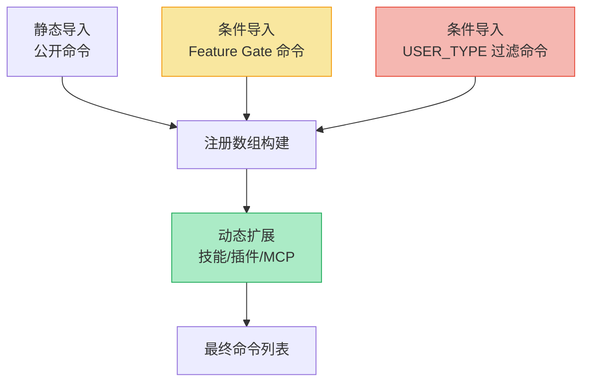
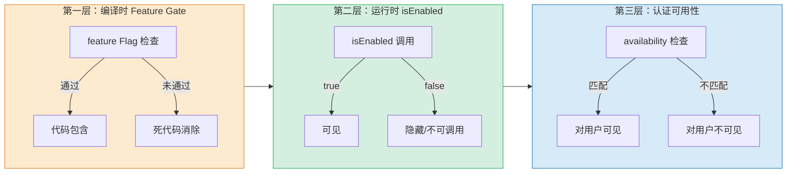
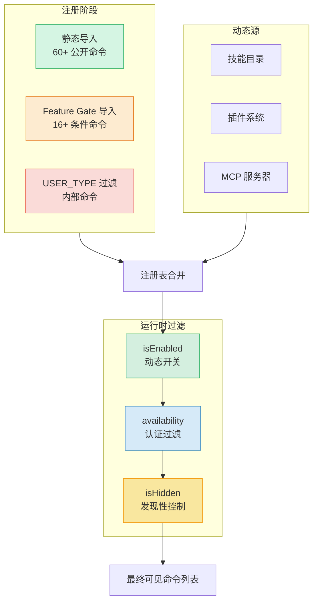

Claude Code 的斜杠命令系统是一套三层过滤架构：**编译时 Feature Gate** 决定代码是否进入产物，**运行时 `isEnabled()`** 控制动态开关，**`availability` 声明**限定认证用户范围。三者正交组合，实现了从公开功能到内部实验的精细可见性管控，同时保持零运行时开销——被 Gate 排除的命令根本不会出现在编译输出中。

## 命令类型体系：三种执行范型

所有斜杠命令共享 `CommandBase` 基础字段，但按执行模式分为三个子类型，每个子类型对应不同的调度路径与上下文需求。

| 类型 | 触发方式 | 执行上下文 | 典型场景 |
|------|---------|-----------|---------|
| `prompt` | 注入到对话流 | 模型上下文（System Prompt 扩展） | `/compact`、`/plan`、`/review` |
| `local` | 同步函数调用 | CLI 上下文，非交互 | `/clear`、`/reset-limits` |
| `local-jsx` | React 组件渲染 | 交互式 UI 上下文 | `/config`、`/login`、`/model` |

**`prompt` 类型**将命令内容作为对话上下文注入，模型看到命令返回的 `ContentBlockParam[]` 后自主决定下一步行动，适合需要模型推理的命令（如 `/compact` 请求压缩、`/plan` 进入规划模式）。`contentLength` 字段用于 Token 预算估算，`allowedTools` 限制命令执行期间模型可调用的工具集，`context` 字段控制命令是内联执行（`'inline'`）还是作为子 Agent 分叉执行（`'fork'`），前者将内容扩展到当前对话，后者在独立上下文与 Token 预算的子代理中运行。

**`local` 类型**适用于无 UI 需求的纯逻辑命令，通过 `load()` 延迟加载实现模块，返回 `LocalCommandResult`——可以是文本输出（`{ type: 'text'; value: string }`）、压缩结果（`{ type: 'compact' }`）或跳过标记（`{ type: 'skip' }`）。`supportsNonInteractive` 标志决定命令是否可在非交互模式（如 CI/CD 管道）执行。

**`local-jsx` 类型**是交互式命令的标准形态，`load()` 返回的模块包含 `call(onDone, context, args)` 签名，其中 `onDone` 回调支持精细控制完成行为：`display` 决定结果显示方式（`'skip'` 隐藏、`'system'` 系统消息、`'user'` 用户消息），`shouldQuery` 控制是否触发后续模型查询，`metaMessages` 插入模型可见但用户不可见的元信息。`LocalJSXCommandContext` 在 `ToolUseContext` 基础上扩展了 `setMessages`、IDE 安装状态、动态 MCP 配置等交互上下文。

Sources: [command.ts](src/types/command.ts#L1-L217)

## 命令注册表：静态导入、条件裁剪与动态扩展

命令注册的过程发生在 [commands.ts](src/commands.ts) 中，该文件构成了一个中心化的命令注册表。注册逻辑分为四个阶段：



**静态导入**涵盖所有公开可用的核心命令——`/help`、`/compact`、`/config`、`/commit`、`/diff`、`/doctor` 等 60 余个命令通过顶部 `import` 语句无条件引入。这些命令始终存在于编译产物中，其可见性由运行时 `isEnabled()` 和 `availability` 过滤。

**条件导入（Feature Gate）**利用 Bun 的 `feature()` API（源自 `bun:bundle`）实现编译时死代码消除。当特性标志未启用时，对应模块的 `require()` 调用根本不会进入产物，实现了零体积开销。关键映射如下：

| Feature Gate | 命令 | 功能 |
|-------------|------|------|
| `PROACTIVE` \| `KAIROS` | `/proactive` | 跨会话持久助手 |
| `KAIROS` \| `KAIROS_BRIEF` | `/brief` | 会话摘要 |
| `KAIROS` | `/assistant` | Kairos 助手模式 |
| `BRIDGE_MODE` | `/bridge` | 远程遥控终端 |
| `DAEMON` ∧ `BRIDGE_MODE` | `/remoteControlServer` | 守护进程远程控制 |
| `VOICE_MODE` | `/voice` | 语音交互模式 |
| `HISTORY_SNIP` | `/force-snip` | 强制历史裁剪 |
| `WORKFLOW_SCRIPTS` | `/workflows` | 工作流脚本 |
| `CCR_REMOTE_SETUP` | `/remote-setup` | 远程环境配置 |
| `ULTRAPLAN` | `/ultraplan` | 云端深度规划 |
| `TORCH` | `/torch` | Torch 功能 |
| `UDS_INBOX` | `/peers` | Unix 域套接字消息收件箱 |
| `FORK_SUBAGENT` | `/fork` | 子代理派生 |
| `BUDDY` | `/buddy` | 终端 AI 电子宠物 |
| `KAIROS_GITHUB_WEBHOOKS` | `/subscribe-pr` | PR 订阅 |
| `EXPERIMENTAL_SKILL_SEARCH` | `(技能搜索缓存清理)` | 实验性技能搜索 |

注意 `DAEMON` 和 `BRIDGE_MODE` 的组合门控使用了逻辑与 (`&&`)——只有当两个 Feature 同时启用时，`/remoteControlServer` 才会被注册。

Sources: [commands.ts](src/commands.ts#L1-L123)

**条件导入（USER_TYPE 过滤）**使用 `process.env.USER_TYPE === 'ant'` 判断是否为 Anthropic 内部用户，仅内部用户可见 `/agents-platform` 命令。这是一种比 Feature Gate 更粗粒度的过滤——它基于用户身份而非特性标志。`agentsPlatform` 变量在非内部用户环境下被赋值为 `null`，后续注册逻辑通过空值检查自然跳过。

**动态扩展**通过 `getSkillDirCommands()`、`getBundledSkills()`、`getBuiltinPluginSkillCommands()`、`getPluginCommands()` 和 `getPluginSkills()` 函数，在运行时从用户技能目录、内置技能、插件系统和 MCP 服务器动态加载命令。这些命令的 `source` 字段分别标记为 `'builtin'`、`'bundled'`、`'plugin'`、`'mcp'`，区别于内置命令的静态注册。`/insights` 命令采用特殊的延迟加载策略——因其主模块体积达 113KB（3200+ 行含差异渲染逻辑），注册时仅创建一个"壳"对象，首次调用时才 `import('./commands/insights.js')` 加载真正实现。

Sources: [commands.ts](src/commands.ts#L59-L200)

## 三层过滤机制：编译时、运行时与认证层

命令的最终可见性由三层过滤机制协同决定，每一层处理不同粒度的可见性需求：



**第一层（编译时）**通过 `bun:bundle` 的 `feature()` API 实现。这在构建阶段即完成裁剪——未启用的命令模块不会被编译进最终产物，对运行时性能和产物体积零影响。适用于实验性功能和尚未公开的内部特性。

**第二层（运行时）**通过 `CommandBase.isEnabled()` 可选回调实现。该回调在每次命令列表渲染时动态求值，适用于需要根据 GrowthBook 特性标志、平台检测、环境变量等运行时状态决定可见性的命令。与编译时 Gate 不同，`isEnabled()` 允许同一构建产物在不同环境下呈现不同命令集。`isHidden` 标志提供另一种运行时隐藏方式——命令可调用但不出现在自动补全和帮助列表中，适合调试命令和过渡期命令。

**第三层（认证可用性）**通过 `CommandAvailability` 类型实现。`availability` 字段声明命令所需的认证类型，当前支持两种值：`'claude-ai'`（claude.ai OAuth 订阅者，含 Pro/Max/Team/Enterprise）和 `'console'`（直接使用 Console API 密钥连接 api.anthropic.com 的用户）。`meetsAvailabilityRequirement()` 函数在命令过滤时检查当前用户的认证类型是否匹配命令声明的可用性列表。未声明 `availability` 的命令对所有用户可见；声明了 `availability` 的命令仅对匹配认证类型的用户可见。这种设计使得 Bedrock/Vertex/Foundry 用户和自定义 Base URL 用户可以与 claude.ai 订阅者看到不同的命令集。

Sources: [command.ts](src/types/command.ts#L155-L200)

## 命令元数据与交互属性

`CommandBase` 定义了丰富的元数据字段，控制命令的显示、发现和执行行为：

| 属性 | 类型 | 作用 |
|------|------|------|
| `name` | `string` | 命令标识符，即 `/name` 斜杠调用名 |
| `aliases` | `string[]` | 别名列表，提供快捷调用路径 |
| `description` | `string` | 命令描述，显示在帮助和自动补全中 |
| `hasUserSpecifiedDescription` | `boolean` | 用户是否自定义了描述（区分自动生成的描述） |
| `argumentHint` | `string` | 参数提示文本，灰色显示在命令名后 |
| `whenToUse` | `string` | 详细使用场景说明，来自 Skill 规范 |
| `version` | `string` | 命令/技能版本号 |
| `source` | `SettingSource \| 'builtin' \| 'mcp' \| 'plugin' \| 'bundled'` | 命令来源标识 |
| `loadedFrom` | `'commands_DEPRECATED' \| 'skills' \| 'plugin' \| 'managed' \| 'bundled' \| 'mcp'` | 加载位置标记 |
| `kind` | `'workflow'` | 工作流类型标记，在自动补全中特殊标记 |
| `immediate` | `boolean` | 为 `true` 时跳过命令队列立即执行 |
| `isSensitive` | `boolean` | 为 `true` 时参数从对话历史中脱敏 |
| `disableModelInvocation` | `boolean` | 禁止模型调用此命令（仅用户可触发） |
| `userInvocable` | `boolean` | 用户是否可通过 `/skill-name` 调用 |

`immediate` 属性值得关注——默认情况下，斜杠命令进入命令队列按序执行，但 `immediate: true` 命令绕过队列立即执行，适用于需要即时响应的操作（如 `/exit`、紧急中断等）。`isSensitive` 则确保如 `/login` 等命令的参数（含 Token 或密钥）不会泄露到对话记录中。`disableModelInvocation` 实现了"仅人类可触发"的安全边界——模型不能自主调用 `/login` 或 `/permissions` 等特权命令。

Sources: [command.ts](src/types/command.ts#L175-L200)

## 模式一：命令文件的典型结构

大多数命令采用 `index.ts` + 实现文件的两层结构。`index.ts` 导出命令定义对象，实现文件包含具体逻辑：

**`local-jsx` 命令**（如 `/config`）的 `index.ts` 导出类型为 `{ type: 'local-jsx'; load: () => Promise<LocalJSXCommandModule> }` 的对象，`load()` 返回包含 `call()` 函数的模块。这种延迟加载模式确保重量级 UI 组件（如 `/install-github-app` 的多步表单）仅在命令被调用时才加载，显著减少启动时间。

**`prompt` 命令**（如 `/compact`）的 `index.ts` 导出类型为 `{ type: 'prompt'; ...; getPromptForCommand: (...) => Promise<ContentBlockParam[]> }` 的对象，`getPromptForCommand` 接收用户参数和工具上下文，返回注入到对话流的 Anthropic API `ContentBlockParam` 数组。

**`local` 命令**（如 `/clear`）的 `index.ts` 导出类型为 `{ type: 'local'; supportsNonInteractive: boolean; load: () => Promise<LocalCommandModule> }` 的对象，`load()` 返回包含 `call()` 函数的模块，`call()` 返回 `LocalCommandResult`。

Sources: [command.ts](src/types/command.ts#L25-L78)

## 模式二：Feature Gate 命令的条件注册

Feature Gate 控制的命令不使用标准 `import`，而是通过 `require()` 条件加载。这种模式的核心约束是：`import` 语句会被提升到模块顶部并始终执行，无法基于运行时条件跳过；而 `require()` 在条件分支内只在条件满足时执行。结合 Bun 的死代码消除，未满足条件的 `require()` 调用及其目标模块在编译阶段即被移除。

```typescript
// 编译时条件导入模式
const bridge = feature('BRIDGE_MODE')
  ? require('./commands/bridge/index.js').default
  : null
```

注册数组的构建通过条件空值检查自然过滤：所有 Gate 命令变量（`bridge`、`voiceCommand`、`ultraplan` 等）在不满足条件时为 `null`，被统一收集后通过 `.filter(Boolean)` 或逐项空值检查排除。这使得注册逻辑无需为每个条件命令添加独立的 `if` 分支——编译器已经完成了过滤。[commands.ts](src/commands.ts#L59-L123)

对于需要类型安全的 Gate 命令，使用 `as typeof import(...)` 类型断言确保条件导入的模块与静态导入享受相同的类型推断：

```typescript
const workflowsCmd = feature('WORKFLOW_SCRIPTS')
  ? (require('./commands/workflows/index.js') as typeof import('./commands/workflows/index.js')).default
  : null
```

[commands.ts](src/commands.ts#L86-L90)

## 模式三：认证可用性过滤

`availability` 字段声明命令对哪类认证用户可见。`meetsAvailabilityRequirement()` 函数在命令过滤阶段检查当前用户是否匹配此声明。典型应用场景：

- `/passes`、`/usage`、`/extra-usage` 等用量相关命令可能仅对 claude.ai 订阅者可见
- `/upgrade` 命令仅对 `console` 类型用户有意义（需要 API 密钥管理）
- 未声明 `availability` 的命令（大多数公开命令）对所有人可见

`isClaudeAISubscriber()` 和 `isUsing3PServices()` 是认证检查的核心工具函数。`isFirstPartyAnthropicBaseUrl()` 则通过检查 API 端点 URL 判断是否为第一方服务（排除 Bedrock/Vertex 等第三方云服务）。这种设计承认了多认证生态的现实：同一套命令系统需要在不同认证环境（OAuth 订阅、API 密钥、云服务商代持）下呈现不同功能集。

Sources: [command.ts](src/types/command.ts#L155-L175), [commands.ts](src/commands.ts#L170-L171)

## 动态命令源：技能目录、插件与 MCP

除静态注册的内置命令外，命令系统在运行时从四个动态源加载命令：

**技能目录**通过 `getSkillDirCommands()` 从用户本地 `~/.claude/skills` 目录扫描 YAML/Markdown 技能文件，每个技能文件自动注册为 `prompt` 类型命令，`source` 标记为技能来源。`clearSkillCaches()` 提供缓存清理能力。`getBundledSkills()` 从内置技能集合加载预装技能。`getBuiltinPluginSkillCommands()` 从内置插件提取技能命令。

**插件系统**通过 `getPluginCommands()` 和 `getPluginSkills()` 从已安装插件中提取命令和技能。插件命令的 `pluginInfo` 字段包含 `PluginManifest` 和仓库信息，`loadedFrom` 标记为 `'plugin'`。`clearPluginCommandCache()` 和 `clearPluginSkillsCache()` 管理插件命令缓存生命周期。

**MCP 服务器**通过 MCP 协议暴露的工具和提示可注册为命令，`source` 标记为 `'mcp'`，`isMcp` 标志为 `true`。

**`createMovedToPluginCommand()`** 工厂函数处理命令迁移场景——当内置命令迁移到插件系统后，原命令名保留一个"重定向壳"，提示用户通过新插件系统使用该功能，确保升级兼容性。

Sources: [commands.ts](src/commands.ts#L156-L168)

## 命令发现与自动补全

命令列表的最终构建需要合并所有来源的命令、应用三层过滤、排序后提供给自动补全引擎。`useMergedCommands()` Hook 负责合并静态注册命令、技能目录命令、插件命令和 MCP 命令，并在每次上下文变更时重新计算可见性。`isHidden` 命令不参与自动补全候选但保持可调用性，这种行为适用于：

- 调试用命令（如 `/heapdump`、`/mock-limits`）不应暴露给普通用户但开发者可直接输入
- 正在迁移或废弃的命令保留可调用性但隐藏发现入口
- 条件性可见的命令在特定条件下从自动补全中消失但不报错

`whenToUse` 字段为模型提供了命令使用的语义上下文——模型在决定是否建议某个命令时可以参考该字段判断适用场景，这比 `description` 的简短描述提供了更丰富的决策依据。`paths` 字段实现了文件路径感知的命令可见性：当命令声明了 `paths` glob 模式时，该命令仅在模型操作了匹配路径的文件后才出现，实现了"上下文感知命令建议"。

Sources: [command.ts](src/types/command.ts#L187-L199)

## 架构总结

命令系统的三层过滤机制体现了渐进式筛选的设计哲学：编译时 Gate 以零开销方式排除未发布功能，运行时 `isEnabled()` 根据实时状态调整可见性，认证层 `availability` 保证不同用户生态的功能隔离。三层的正交组合覆盖了从"这个功能尚未开发"到"这个功能已上线但对你的账户类型不可用"的全光谱可见性需求。



对于想深入了解 Feature Gate 编译机制的读者，建议继续阅读 [三层门控体系：编译开关、用户类型与远程 Feature Flag](16-san-ceng-men-kong-ti-xi-bian-yi-kai-guan-yong-hu-lei-xing-yu-yuan-cheng-feature-flag)；对于想探索具体隐藏命令的读者，可参考 [隐藏命令与秘密 CLI 参数全览](17-yin-cang-ming-ling-yu-mi-mi-cli-can-shu-quan-lan)；工具系统（命令的"兄弟"子系统，共享类似的注册与过滤模式）详见 [工具系统：50+ 内置工具的注册、调度与权限管控](5-gong-ju-xi-tong-50-nei-zhi-gong-ju-de-zhu-ce-diao-du-yu-quan-xian-guan-kong)。