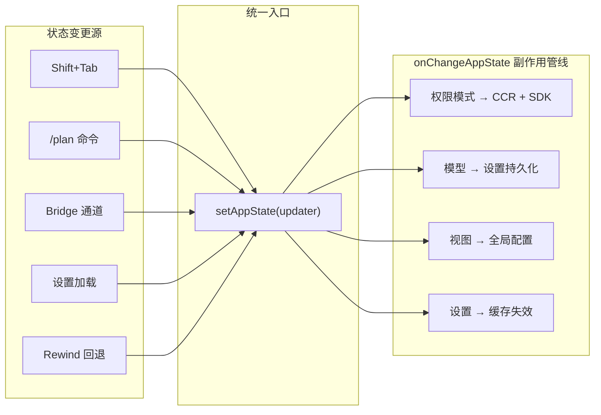
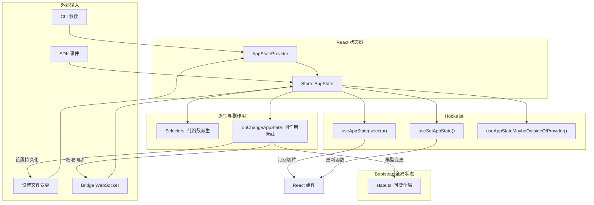

Claude Code 的状态管理架构采用了一个**极简自研 Store + React `useSyncExternalStore` 桥接**的方案，既不依赖 Redux 也不使用 Zustand 等第三方库，而是以 35 行核心代码构建了具备不可变更新、变更侦听与订阅机制的状态容器。整个体系由三层构成：**底层数据存储**（`Store<T>`）、**应用状态形状定义**（`AppState` 类型）、**React 集成层**（`AppStateProvider` 与 Hooks），辅以**纯函数选择器**和**变更副作用管线**，形成了一个高内聚、低耦合的状态管理闭环。

Sources: [store.ts](src/state/store.ts#L1-L35), [AppStateStore.ts](src/state/AppStateStore.ts#L1-L39), [AppState.tsx](src/state/AppState.tsx#L1-L27)

## 核心存储引擎：35 行代码的不可变 Store

整个状态系统的基石是 `createStore` 函数，它实现了一个泛型的不可变状态容器。该容器仅暴露三个接口：`getState` 读取当前快照、`setState` 通过 updater 函数产生新状态、`subscribe` 注册变更监听器。`setState` 的关键设计在于 **`Object.is` 相同性检查**——如果 updater 返回的对象与旧状态引用一致，则跳过通知，这保证了不会因无意义的引用替换触发重渲染。

```typescript
// 核心逻辑简化示意
setState: (updater) => {
  const prev = state
  const next = updater(prev)
  if (Object.is(next, prev)) return  // 不可变相同性守卫
  state = next
  onChange?.({ newState: next, oldState: prev })  // 变更副作用管线
  for (const listener of listeners) listener()    // 通知所有订阅者
}
```

`subscribe` 返回取消订阅函数（从 `Set` 中删除自身），这与 React `useSyncExternalStore` 的契约完全吻合。`onChange` 可选回调是**副作用管线的入口**——将"状态变更后需要做什么"从 Store 核心逻辑中解耦，由外部注入，保持了引擎的纯粹性。

Sources: [store.ts](src/state/store.ts#L1-L35)

## 应用状态形状：AppState 类型全景

`AppState` 是 Claude Code 运行时的**单一状态树**（Single State Tree），所有 UI 可观察的状态都汇聚于此。其类型定义通过 `DeepImmutable` 包装，确保编译期禁止直接赋值，强制走 `setState` updater 路径。下面按功能域分类梳理核心字段：

| 功能域 | 关键字段 | 用途说明 |
|--------|----------|----------|
| **模型与设置** | `mainLoopModel`, `mainLoopModelForSession`, `settings`, `verbose` | 当前使用的 LLM 模型、持久化设置、详细日志开关 |
| **UI 视图状态** | `expandedView`, `viewSelectionMode`, `footerSelection`, `coordinatorTaskIndex` | 展开面板、视图模式、底部导航栏焦点、协调器面板选择 |
| **工具权限** | `toolPermissionContext` | 权限模式、审批策略等运行时权限上下文 |
| **Bridge 远程控制** | `replBridgeEnabled`, `replBridgeConnected`, `replBridgeSessionActive` 等十余字段 | WebSocket 双向通道的完整状态机：enabled → connected → sessionActive |
| **远程会话** | `remoteSessionUrl`, `remoteConnectionStatus`, `remoteBackgroundTaskCount` | `claude assistant` 观察者模式的连接状态与后台任务计数 |
| **任务系统** | `tasks`, `foregroundedTaskId`, `viewingAgentTaskId`, `agentNameRegistry` | 统一任务状态注册表、前台任务、正在查看的 Agent、名字路由表 |
| **MCP 集成** | `mcp.clients`, `mcp.tools`, `mcp.commands`, `mcp.resources`, `mcp.pluginReconnectKey` | MCP 服务器连接、可用工具/命令/资源、插件重连信号量 |
| **插件系统** | `plugins.enabled`, `plugins.disabled`, `plugins.errors`, `plugins.installationStatus` | 已加载/禁用插件、错误收集、安装状态追踪 |
| **Buddy 伴侣** | `companionReaction`, `companionPetAt` | AI 电子宠物的情绪反应与互动时间戳 |
| **Kairos 助手** | `kairosEnabled` | 是否启用跨会话持久助手（Feature Gate + 设置 + 信任三重门控） |

`AppState` 还包含**排除于 `DeepImmutable` 的子对象**：`tasks` 和 `agentNameRegistry`——前者因为 `TaskState` 含函数类型（如 `abortController`），后者因为 `Map` 类型无法被递归冻结。这是一种务实的设计权衡：完全不可变是理想，但运行时约束要求在边界处做出让步。

Sources: [AppStateStore.ts](src/state/AppStateStore.ts#L89-L200)

## React 集成层：Provider、Hooks 与订阅模型

`AppStateProvider` 是状态树注入 React 组件树的桥梁，它完成四项关键工作：

1. **创建 Store 实例**——通过 `useState` 保持单例，仅在 `initialState` 或 `onChangeAppState` 变更时重建
2. **挂载时同步远程设置**——如果远程加载的设置在 Provider 挂载前已禁用 Bypass Permissions，则立即修正 `toolPermissionContext`
3. **响应设置变更**——通过 `useSettingsChange` 监听设置文件变化，调用 `applySettingsChange` 将外部配置同步到 Store
4. **嵌套防护**——`HasAppStateContext` 确保不会在另一个 `AppStateProvider` 内重复嵌套

Sources: [AppState.tsx](src/state/AppState.tsx#L37-L110)

### 订阅 Hooks 体系

系统提供了四个 Hook，形成**从精确订阅到完全逃逸**的梯度 API：

| Hook | 用途 | 重渲染行为 |
|------|------|------------|
| `useAppState(selector)` | 订阅 AppState 的一个切片 | 仅当 `selector` 返回值变化时重渲染（`Object.is` 比较） |
| `useSetAppState()` | 获取 `setState` 引用，不订阅状态 | **永不重渲染**——引用稳定 |
| `useAppStateStore()` | 获取完整 Store 对象 | **永不重渲染**——仅传递引用 |
| `useAppStateMaybeOutsideOfProvider(selector)` | 在 Provider 外安全使用 | Provider 不存在时返回 `undefined`，使用 NOOP 订阅函数 |

`useAppState` 的核心实现基于 React 18 的 `useSyncExternalStore`，这是 React 官方推荐的外部状态源集成方案。其 selector 模式要求使用者**必须返回已有的子对象引用**，而非新建对象——因为 `Object.is({}, {})` 永远为 `false`，后者会导致无限重渲染。文档注释中的反模式警示尤为关键：

```typescript
// ❌ 错误：每次调用都产生新对象
const { verbose, model } = useAppState(s => ({ verbose: s.verbose, model: s.mainLoopModel }))

// ✅ 正确：返回已有引用
const verbose = useAppState(s => s.verbose)
const model = useAppState(s => s.mainLoopModel)

// ✅ 正确：返回已有子对象
const { text, promptId } = useAppState(s => s.promptSuggestion)
```

Sources: [AppState.tsx](src/state/AppState.tsx#L117-L199)

## 选择器模式：纯函数派生状态

选择器体系遵循**纯提取、零副作用**的原则，仅从 AppState 中派生计算值，不产生任何状态变更。当前定义的选择器服务于两个核心场景：

**`getViewedTeammateTask`** 从 AppState 中提取当前正在查看的 Teammate 任务。它执行三重防护：`viewingAgentTaskId` 为空则返回 `undefined`、对应任务不存在则返回 `undefined`、任务类型不是 `InProcessTeammateTask` 则返回 `undefined`。这种**防御性提取**确保了 UI 组件不会因不完整的状态而崩溃。

**`getActiveAgentForInput`** 决定用户输入应路由到哪个 Agent，返回一个**判别联合类型**（Discriminated Union）：`{ type: 'leader' }` 时输入送往主会话，`{ type: 'viewed', task }` 时送往正在查看的 Teammate，`{ type: 'named_agent', task }` 时送往具名 Agent。这种类型安全的设计让输入路由逻辑无需运行时类型检查，TypeScript 编译器即可保证穷举匹配。

```mermaid
flowchart TD
    A[getActiveAgentForInput] --> B{viewingAgentTaskId?}
    B -->|undefined| C["{ type: 'leader' }"]
    B -->|defined| D{tasks[id] 存在?}
    D -->|否| C
    D -->|是| E{任务类型?}
    E -->|InProcessTeammateTask| F["{ type: 'viewed', task }"]
    E -->|LocalAgentTask| G["{ type: 'named_agent', task }"]
    E -->|其他| C
```

选择器函数签名采用 `Pick<AppState, ...>` 精确声明依赖字段，这在测试中尤为有用——只需构造最小化的状态切片而非完整 AppState。

Sources: [selectors.ts](src/state/selectors.ts#L1-L77)

## 变更副作用管线：onChangeAppState

`onChangeAppState` 是注入到 Store 的 `onChange` 回调，充当**状态变更的单点拦截器**——任何通过 `setAppState` 产生的状态变更都会流经此函数。这种设计解决了"分散的调用点各自处理副作用"的混乱局面，将副作用收敛到统一管线。

该管线处理的副作用按优先级排列如下：

**权限模式同步**（最高优先级）——当 `toolPermissionContext.mode` 变更时，同时通知 CCR（Claude Code Remote）和 SDK 状态流。引入此拦截器之前，8+ 个变更路径中只有 2 个会通知 CCR，导致 Web UI 与 CLI 权限模式脱节。现在，无论是 Shift+Tab 循环、ExitPlanMode 对话框、`/plan` 命令、rewind 还是 Bridge 通道触发，都经过同一出口。特别注意**内外部模式映射**：内部模式名（如 `bubble`、`ungated auto`）不会泄漏给 CCR，通过 `toExternalPermissionMode` 转换后再上报。

**模型变更持久化**——当 `mainLoopModel` 变为 `null` 时从设置中删除该字段，变更为具体模型时写入用户设置并更新启动覆盖变量。

**视图状态持久化**——`expandedView` 的变更被拆分为 `showExpandedTodos` 和 `showSpinnerTree` 两个布尔值写入全局配置，保持向后兼容。

**设置缓存失效**——`settings` 对象变更时，立即清除 API Key Helper 缓存、AWS/GCP 凭证缓存，确保新的认证配置即时生效；若 `settings.env` 变更则重新应用环境变量。



Sources: [onChangeAppState.ts](src/state/onChangeAppState.ts#L43-L171)

## Teammate 视图状态机：enter / exit / stopOrDismiss

`teammateViewHelpers.ts` 实现了 Teammate 转录视图的**有限状态机**，通过三个纯状态转移函数管理 `viewingAgentTaskId`、`viewSelectionMode` 和 `tasks` 之间的联动约束：

**`enterTeammateView(taskId, setAppState)`** 进入指定 Agent 的转录视图：设置 `viewingAgentTaskId`，对 `LocalAgentTask` 标记 `retain: true`（阻止内存回收、启用流追加、触发磁盘引导），清除 `evictAfter`。若从另一个 Agent 切换，先将前一个 Agent 执行 `release`——释放 `retain`、清空 `messages`、对已终止任务设置 `evictAfter` 延迟驱逐。

**`exitTeammateView(setAppState)`** 退出转录视图回到 Leader 主视图：释放当前 Agent（同上 `release` 逻辑），清除 `viewingAgentTaskId`，将 `viewSelectionMode` 重置为 `'none'`。

**`stopOrDismissAgent(taskId, setAppState)`** 上下文敏感操作：运行中则 `abort`，已终止则标记 `evictAfter: 0` 立即从列表隐藏。若正在查看被关闭的 Agent，同步退出到 Leader 视图。

这个状态机的关键设计是 **`retain` 标记 + `evictAfter` 延迟驱逐**：Agent 完成后不立即从任务列表移除，而是保留 30 秒（`PANEL_GRACE_MS`）的展示窗口。只有在用户显式关闭或超时后才真正驱逐，这避免了 Agent 完成瞬间的 UI 闪烁。

Sources: [teammateViewHelpers.ts](src/state/teammateViewHelpers.ts#L1-L142)

## 双重状态体系：React Store 与 Bootstrap 全局状态

Claude Code 实际上存在**两套并行的状态体系**，理解其边界至关重要：

| 维度 | React Store（`AppState`） | Bootstrap 全局状态（`state.ts`） |
|------|---------------------------|----------------------------------|
| **位置** | `src/state/AppStateStore.ts` | `src/bootstrap/state.ts` |
| **生命周期** | 组件挂载到卸载 | 进程启动到退出 |
| **可变性** | 不可变（updater 模式） | 可变（直接赋值） |
| **订阅机制** | React `useSyncExternalStore` | `createSignal` + 手动订阅 |
| **适用场景** | UI 驱动状态、可见元素、用户交互 | 服务端配置、遥测、进程级单例 |
| **线程安全** | React 调度保证 | 需调用者自行保证 |

Bootstrap 全局状态包含**不适合放在 React 状态树中的内容**：OpenTelemetry 的 `MeterProvider`/`TracerProvider`/`LoggerProvider`（重型对象引用）、API 请求参数快照、OAuth Token 文件描述符、Agent 颜色映射等。这些要么是不可序列化的对象引用，要么在 React 之外（如 SDK 回调、CRON 调度器）需要访问。文件开头的注释 `DO NOT ADD MORE STATE HERE - BE JUDICIOUS WITH GLOBAL STATE` 表明了设计者的克制态度——全局状态是必要之恶，新增需严格论证。

两套状态间的**桥梁**通过 `onChangeAppState` 实现：当 React Store 中的 `mainLoopModel` 变更时，同步更新 Bootstrap 全局状态的 `mainLoopModelOverride`（通过 `setMainLoopModelOverride`），确保非 React 代码也能读取最新模型设置。

Sources: [bootstrap/state.ts](src/bootstrap/state.ts#L31-L46), [onChangeAppState.ts](src/state/onChangeAppState.ts#L95-L112)

## 架构全景：数据流向与边界



## 设计原则总结

**单一状态树 + 不可变更新**——所有 UI 可观察状态汇聚于 `AppState`，通过 updater 函数产生新引用，`Object.is` 检查避免无意义通知。这比 `useReducer` + Context 的方案更轻量，比 Redux 省去了 action/type 样板代码。

**选择器精细化订阅**——`useAppState(selector)` 使组件仅订阅关心的切片，多字段需求时多次调用而非返回新对象。这是性能优化的核心机制：一个 50+ 字段的 AppState，只有用到变化字段的组件才会重渲染。

**副作用收敛到单点**——`onChangeAppState` 将分散在各调用点的副作用（权限同步、设置持久化、缓存失效）集中到一条管线，任何路径的状态变更都经过同一出口，消除了"改了状态忘了通知"的隐患。

**两层状态各有边界**——React Store 管 UI、Bootstrap 管 进程级单例，通过 `onChange` 桥梁单向同步。这种分离避免了将不可序列化的重型对象（如 `MeterProvider`）塞进 React 状态树，同时保持了两套体系的独立性。

---

**推荐阅读路径**：理解状态管理后，建议继续阅读 [整体架构：CLI 入口、查询引擎与会话生命周期](4-zheng-ti-jia-gou-cli-ru-kou-cha-xun-yin-qing-yu-hui-hua-sheng-ming-zhou-qi) 了解状态在会话生命周期中的作用，以及 [Coordinator：多 Agent 编排与 Worker 并行执行](14-coordinator-duo-agent-bian-pai-yu-worker-bing-xing-zhi-xing) 查看 Teammate 视图状态机在多 Agent 场景中的实际应用。