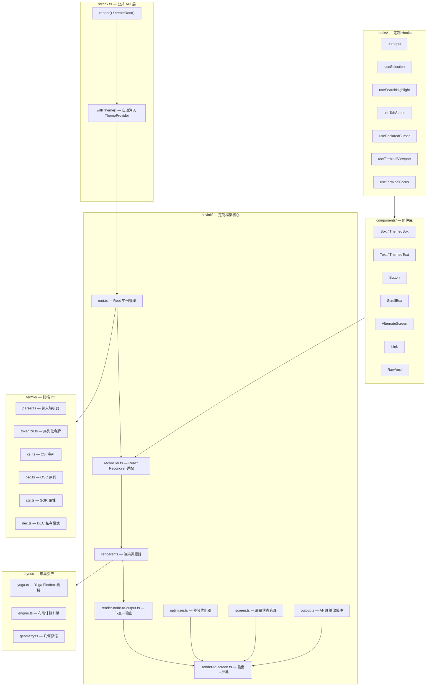

Claude Code 的终端 UI 并非直接使用开源 Ink 库，而是在其基础上构建了一套**深度定制的 React 终端渲染框架**。这套框架保留了两项核心遗产——React Reconciler 驱动的声明式 UI 模型与 Yoga Flexbox 布局引擎，同时从渲染管线、事件系统、终端 I/O 到组件库进行了全面改造，使之成为能支撑 50+ 交互组件、虚拟滚动、Vim 模态编辑、终端焦点检测等高级能力的生产级终端 UI 基础设施。本文将系统拆解这套定制框架的架构设计、关键适配层及其扩展机制。

Sources: [ink.ts](src/ink.ts#L1-L86)

## 架构全貌：从渲染入口到终端像素

框架的入口文件 `src/ink.ts` 并非简单转发 Ink 的 API——它在所有渲染调用外层自动注入 `ThemeProvider`，确保主题系统能在任意调用点生效而无需手动包裹。同时采用**分层导出策略**：`Box`/`Text` 指向带主题的 `ThemedBox`/`ThemedText`，而 `BaseBox`/`BaseText` 暴露原始无主题版本，为开发者提供了显式的选择权。



整个渲染管线遵循 **React 虚拟 DOM → Fiber 树 → Yoga 布局计算 → ANSI 输出缓冲 → 终端屏幕** 的单向数据流。每帧渲染时，Reconciler 将 React 组件树同步为自定义 Fiber 节点，Renderer 调度布局计算后交由 `render-node-to-output` 生成 ANSI 字符串，最终由 `render-to-screen` 结合前一帧的屏幕状态做差分刷新，最大限度减少终端写入量。

Sources: [ink.ts](src/ink.ts#L1-L86), [root.ts](src/ink/root.ts), [reconciler.ts](src/ink/reconciler.ts), [renderer.ts](src/ink/renderer.ts), [render-node-to-output.ts](src/ink/render-node-to-output.ts), [render-to-screen.ts](src/ink/render-to-screen.ts), [optimizer.ts](src/ink/optimizer.ts)

## 渲染管线深度解析

### 双入口渲染：render() 与 createRoot()

框架提供两种渲染入口，与 React 18 的新旧 API 模式对齐。`render()` 是一次性渲染函数，内部调用 `withTheme()` 自动包裹 `ThemeProvider` 后委托给 Ink 的原生渲染流程；`createRoot()` 则返回持久化的 `Root` 对象，其 `render()` 方法同样经过主题注入包装，适用于需要多次更新组件树的长生命周期场景（如 REPL 主界面）。

`withTheme()` 的设计体现了**约定优于配置**的原则——所有通过公共 API 发起的渲染自动具备主题能力，避免了每个调用点手动包裹 `ThemeProvider` 的样板代码。这意味着 Claude Code 的任何 UI 出口，无论是主 REPL 界面还是独立的对话框组件，都天然支持主题切换。

Sources: [ink.ts](src/ink.ts#L14-L31)

### Reconciler 适配：React 与终端 DOM 的桥梁

`reconciler.ts` 实现了 React Reconciler 的宿主配置（Host Config），将 React 的 Fiber 架构适配到终端渲染的目标平台。核心职责包括：

- **节点创建与更新**：将 React 元素映射为自定义 DOM 节点（`DOMElement`），承载样式、文本内容与子节点关系
- **子节点管理**：处理 `appendChild`、`insertBefore`、`removeChild` 等操作，维护 Fiber 树的正确拓扑
- **提交阶段优化**：在 React 的 commit 阶段批量处理 DOM 变更，确保终端输出的原子性刷新

`dom.ts` 定义了这个自定义 DOM 节点的类型系统——与浏览器 DOM 不同，终端 DOM 节点不涉及真实 DOM 操作，而是作为布局与渲染的中继数据结构，在 Yoga 布局计算和 ANSI 输出生成之间传递结构化信息。

Sources: [reconciler.ts](src/ink/reconciler.ts), [dom.ts](src/ink/dom.ts)

### 屏幕差分刷新：Optimizer + render-to-screen

终端渲染的性能瓶颈在于 I/O 写入量。`optimizer.ts` 实现了帧间差分算法——对比前后两帧的屏幕缓冲区，仅输出发生变化的行区域，将终端闪烁和刷新开销降至最低。`render-to-screen.ts` 则负责将差分结果通过 ANSI 转义序列定位光标并写入变化的区域。

`screen.ts` 维护了当前屏幕的完整状态快照，是差分计算的基准。`output.ts` 作为 ANSI 输出缓冲区，累积渲染结果并提供游标式写入接口。这一层的协作使得 Claude Code 在高频更新的场景下（如流式输出、进度条动画）依然能保持流畅的渲染表现。

Sources: [optimizer.ts](src/ink/optimizer.ts), [render-to-screen.ts](src/ink/render-to-screen.ts), [screen.ts](src/ink/screen.ts), [output.ts](src/ink/output.ts)

## 布局引擎：Yoga Flexbox 的终端适配

### 引擎架构

`layout/` 子目录构建了完整的终端布局计算引擎。这是一个三层架构：

| 层级 | 模块 | 职责 |
|------|------|------|
| **桥接层** | `yoga.ts` | 封装 Yoga WASM/Native 绑定，提供 Node 创建、属性设置的类型安全接口 |
| **计算层** | `engine.ts` | 遍历 Fiber 树，将组件样式映射为 Yoga 节点属性，触发布局计算，回读计算结果 |
| **几何层** | `geometry.ts` | 定义 `Position`、`Size`、`Rect` 等几何原语，为上层提供坐标与尺寸的统一抽象 |

### 样式映射与终端特异性

`styles.ts` 负责将 React 组件的样式 props 映射为 Yoga 可识别的布局属性。终端环境有两个关键差异需要处理：**尺寸单位是字符而非像素**，以及**终端宽度由运行时环境决定而非视口**。`get-max-width.ts` 和 `widest-line.ts` 处理了终端场景下的宽度约束计算，确保文本换行与容器边界的行为符合用户对终端应用的直觉预期。

`line-width-cache.ts` 对字符串宽度的计算结果做了缓存——由于终端中 CJK 字符占两列宽度而 ASCII 字符占一列，字符串宽度的计算涉及逐字符扫描，缓存机制避免了重复测量带来的性能开销。`wrap-text.ts` 与 `wrapAnsi.ts` 配合实现带 ANSI 转义序列的智能文本换行，在保持颜色/样式标记的同时正确处理字符宽度和换行位置。

Sources: [yoga.ts](src/ink/layout/yoga.ts), [engine.ts](src/ink/layout/engine.ts), [geometry.ts](src/ink/layout/geometry.ts), [styles.ts](src/ink/styles.ts), [get-max-width.ts](src/ink/get-max-width.ts), [widest-line.ts](src/ink/widest-line.ts), [line-width-cache.ts](src/ink/line-width-cache.ts), [wrap-text.ts](src/ink/wrap-text.ts), [wrapAnsi.ts](src/ink/wrapAnsi.ts)

## 事件系统：终端交互的抽象层

### 事件类型体系

`events/` 子目录构建了一套完整的事件抽象，将原始终端输入转化为结构化的 DOM-like 事件对象：

| 事件类 | 文件 | 触发时机 |
|--------|------|----------|
| `InputEvent` | `input-event.ts` | 任意键盘输入 |
| `KeyboardEvent` | `keyboard-event.ts` | 可打印字符与功能键 |
| `ClickEvent` | `click-event.ts` | 终端鼠标点击（通过 CSI 序列） |
| `FocusEvent` | `focus-event.ts` | 组件焦点转移 |
| `ResizeEvent` | `resize-event.ts` | 终端窗口尺寸变化 |
| `PasteEvent` | `paste-event.ts` | 括号粘贴模式下的文本粘贴 |
| `TerminalFocusEvent` | `terminal-focus-event.ts` | 终端窗口获取/失去焦点 |

`event.ts` 定义了所有事件的基类 `Event`，`emitter.ts` 实现了 `EventEmitter` 提供标准的发布-订阅接口，`dispatcher.ts` 负责将原始输入路由到正确的事件处理器，`event-handlers.ts` 则维护组件树上的事件监听器注册表。

### 输入解析：从字节流到结构化事件

`parse-keypress.ts` 是键盘输入解析的关键模块——它将终端转义序列解析为语义化的按键描述（如 `Ctrl+Shift+P`、`Escape`、`ArrowUp`），屏蔽了不同终端模拟器在序列编码上的差异。`termio/` 子目录进一步将终端协议拆解为 ANSI 层次化的子模块：

- **`tokenize.ts`**：原始字节流的令牌化，识别 ESC 前缀
- **`csi.ts`**：CSI（Control Sequence Introducer）序列解析，处理光标移动、鼠标事件等
- **`osc.ts`**：OSC（Operating System Command）序列，处理终端标题设置、Tab 状态查询等
- **`sgr.ts`**：SGR（Select Graphic Rendition）属性，处理颜色与文本样式
- **`dec.ts`**：DEC 私有模式，处理括号粘贴模式、焦点检测等
- **`ansi.ts`**：通用 ANSI 工具函数

Sources: [input-event.ts](src/ink/events/input-event.ts), [keyboard-event.ts](src/ink/events/keyboard-event.ts), [click-event.ts](src/ink/events/click-event.ts), [resize-event.ts](src/ink/events/resize-event.ts), [paste-event.ts](src/ink/events/paste-event.ts), [terminal-focus-event.ts](src/ink/events/terminal-focus-event.ts), [emitter.ts](src/ink/events/emitter.ts), [dispatcher.ts](src/ink/events/dispatcher.ts), [parse-keypress.ts](src/ink/parse-keypress.ts), [termio.ts](src/ink/termio.ts), [parser.ts](src/ink/termio/parser.ts), [tokenize.ts](src/ink/termio/tokenize.ts)

## 扩展组件：超越 Ink 的终端 UI 能力

Claude Code 在 Ink 基础组件之上构建了一批面向生产需求的扩展组件，每一项都对应了开源 Ink 未覆盖或实现不充分的终端 UI 场景。

### 核心扩展组件一览

| 组件 | 职责 | 对应文件的独特能力 |
|------|------|-------------------|
| `ScrollBox` | 可滚动容器 | 终端内的虚拟滚动视窗，支持上下滚动缓冲区 |
| `AlternateScreen` | 备用屏幕 | 切换到终端备用屏幕缓冲区，退出时恢复原内容 |
| `Button` | 可交互按钮 | 支持焦点样式、按压状态与键盘激活 |
| `Link` | 可点击链接 | 终端超链接协议支持（OSC 8） |
| `RawAnsi` | 原始 ANSI 输出 | 直接注入未经处理的 ANSI 序列，跳过框架转义 |
| `Ansi` | ANSI 渲染组件 | 安全渲染含 ANSI 转义的文本内容 |
| `NoSelect` | 禁止选择 | 标记内容不受文本选择影响 |
| `Spacer` | 弹性间距 | Flexbox 布局中的弹性占位元素 |

### 主题化双层组件体系

`src/ink.ts` 的导出揭示了**双层组件体系**的设计意图：

- **主题化层**（默认导出 `Box`/`Text`）：指向 `ThemedBox`/`ThemedText`，自动从 `ThemeProvider` 上下文获取颜色、边框等设计令牌，确保 UI 视觉一致性
- **基础层**（`BaseBox`/`BaseText`）：保留原始无主题组件，供需要完全手动控制样式的场景使用

`ThemeProvider` 在渲染入口通过 `withTheme()` 自动注入，但也可在组件树内部嵌套使用，实现局部主题覆盖。`useTheme`、`useThemeSetting`、`usePreviewTheme` 三个 Hook 分别提供当前主题读取、主题设置操作和预览模式，构成了完整的主题管理接口。

### 终端状态上下文组件

三个 Context 组件为组件树提供了终端环境的关键状态：

- **`TerminalSizeContext`**：提供终端尺寸信息，驱动响应式布局
- **`TerminalFocusContext`**：提供终端窗口焦点状态，支持 UI 据此调整行为（如暂停动画）
- **`ClockContext`**：提供帧时钟，驱动 `useAnimationFrame` 和 `useInterval` 的定时刷新

Sources: [ScrollBox.tsx](src/ink/components/ScrollBox.tsx), [AlternateScreen.tsx](src/ink/components/AlternateScreen.tsx), [Button.tsx](src/ink/components/Button.tsx), [Link.tsx](src/ink/components/Link.tsx), [RawAnsi.tsx](src/ink/components/RawAnsi.tsx), [Ansi.tsx](src/ink/Ansi.tsx), [NoSelect.tsx](src/ink/components/NoSelect.tsx), [Spacer.tsx](src/ink/components/Spacer.tsx), [TerminalSizeContext.tsx](src/ink/components/TerminalSizeContext.tsx), [TerminalFocusContext.tsx](src/ink/components/TerminalFocusContext.tsx), [ClockContext.tsx](src/ink/components/ClockContext.tsx), [ink.ts](src/ink.ts#L33-L43)

## 定制 Hooks：终端交互的声明式接口

### 输入处理：useInput 与 useStdin

`useInput` 是终端键盘交互的核心 Hook——它接受一个回调函数，在每次按键事件时触发，回调参数包含解析后的按键信息和事件元数据。`useStdin` 暴露了更底层的 stdin 访问，用于需要直接处理原始输入流的场景。

### 终端感知：焦点、标题、Tab 状态

Claude Code 的定制 Hooks 体现了对终端环境深层次感知的需求：

| Hook | 能力 | 终端协议依赖 |
|------|------|-------------|
| `useTerminalFocus` | 检测终端窗口是否获得焦点 | DECFocus 事件（`\x1b[?1004h`） |
| `useTerminalTitle` | 设置/读取终端标题栏文本 | OSC 0/2 序列 |
| `useTabStatus` | 检测终端 Tab 是否处于活跃状态 | OSC 1337/自定义序列 |
| `useTerminalViewport` | 响应终端视口尺寸变化 | SIGWINCH / CSI 事件 |

### 交互增强：选择、搜索与动画

| Hook | 能力 | 应用场景 |
|------|------|----------|
| `useSelection` | 管理终端文本选择状态 | 复制消息内容、选择代码块 |
| `useSearchHighlight` | 控制搜索高亮渲染 | 消息搜索结果高亮 |
| `useDeclaredCursor` | 声明式光标位置控制 | 输入框光标定位 |
| `useAnimationFrame` | 帧同步动画回调 | Spinner、进度条等动画效果 |
| `useInterval` | 定时器 Hook | 定时轮询、周期性 UI 更新 |

Sources: [use-input.ts](src/ink/hooks/use-input.ts), [use-stdin.ts](src/ink/hooks/use-stdin.ts), [use-terminal-focus.ts](src/ink/hooks/use-terminal-focus.ts), [use-terminal-title.ts](src/ink/hooks/use-terminal-title.ts), [use-tab-status.ts](src/ink/hooks/use-tab-status.ts), [use-terminal-viewport.ts](src/ink/hooks/use-terminal-viewport.ts), [use-selection.ts](src/ink/hooks/use-selection.ts), [use-search-highlight.ts](src/ink/hooks/use-search-highlight.ts), [use-declared-cursor.ts](src/ink/hooks/use-declared-cursor.ts), [use-animation-frame.ts](src/ink/hooks/use-animation-frame.ts), [use-interval.ts](src/ink/hooks/use-interval.ts)

## 终端 I/O 子系统：Termio 架构

`termio/` 子目录与顶层的 `termio.ts` 构成了框架与终端硬件交互的协议层。这一层的设计遵循**协议分层**原则，将复杂的终端序列处理拆解为正交的子模块：

```
原始字节流
    ↓ tokenize.ts（令牌化：识别 ESC 前缀与序列边界）
    ↓ parser.ts（语法解析：提取命令、参数与数据）
    ↓
    ├→ csi.ts  → 光标控制、鼠标事件、焦点通知
    ├→ osc.ts  → 终端标题、Tab 状态、超链接
    ├→ sgr.ts  → 颜色与文本样式属性
    └→ dec.ts  → 括号粘贴模式、焦点检测、备用屏幕
```

`termio.ts`（顶层文件）将这些底层协议封装为统一的 I/O 接口，供 `terminal.ts` 和 `screen.ts` 消费。`terminal.ts` 管理与真实终端的连接（stdin/stdout），`terminal-querier.ts` 负责向终端发送查询序列并解析响应（如终端能力探测），`terminal-focus-state.ts` 跟踪终端焦点状态。

Sources: [termio.ts](src/ink/termio.ts), [tokenize.ts](src/ink/termio/tokenize.ts), [parser.ts](src/ink/termio/parser.ts), [csi.ts](src/ink/termio/csi.ts), [osc.ts](src/ink/termio/osc.ts), [sgr.ts](src/ink/termio/sgr.ts), [dec.ts](src/ink/termio/dec.ts), [terminal.ts](src/ink/terminal.ts), [terminal-querier.ts](src/ink/terminal-querier.ts), [terminal-focus-state.ts](src/ink/terminal-focus-state.ts)

## 焦点管理与交互调试

### 焦点系统

`focus.ts` 导出 `FocusManager`，实现了终端环境下的焦点管理——包括焦点转移（Tab/Shift+Tab 遍历）、焦点 trap（对话框内的焦点循环）和焦点查询。`events/focus-event.ts` 定义了焦点转移事件，与 `FocusManager` 配合驱动组件的焦点样式更新。

### 帧管理与闪烁控制

`frame.ts` 定义了 `FlickerReason` 类型——标识可能导致终端闪烁的渲染场景（如全屏重绘、备用屏幕切换等），为优化器提供决策依据。配合 `clearTerminal.ts`（终端清屏策略）和 `cursor.ts`（光标显隐控制），框架能在不同渲染策略间做出最优选择。

### 点击检测与文本选择

`hit-test.ts` 实现了终端坐标到组件的命中测试——给定终端的行列坐标，确定点击落在哪个组件上，是终端鼠标交互的基础设施。`selection.ts` 管理文本选择的状态机，`searchHighlight.ts` 实现搜索匹配的高亮渲染。

Sources: [focus.ts](src/ink/focus.ts), [focus-event.ts](src/ink/events/focus-event.ts), [frame.ts](src/ink/frame.ts), [clearTerminal.ts](src/ink/clearTerminal.ts), [cursor.ts](src/ink/cursor.ts), [hit-test.ts](src/ink/hit-test.ts), [selection.ts](src/ink/selection.ts), [searchHighlight.ts](src/ink/searchHighlight.ts)

## 辅助工具与性能优化

### 文本测量与宽度计算

终端渲染中"宽度"是比"长度"更本质的概念——一个 CJK 字符在终端中占两列。`stringWidth.ts` 提供了精确的字符串显示宽度计算，`measure-text.ts` 和 `measure-element.ts` 分别测量文本节点和元素节点的渲染尺寸，这些测量结果是布局计算和滚动虚拟化的输入。

`node-cache.ts` 缓存了 DOM 节点的计算结果，`line-width-cache.ts` 缓存了字符串宽度，两者共同避免了重复计算。`squash-text-nodes.ts` 在渲染前将相邻的文本节点合并，减少不必要的节点遍历和宽度计算。

### 边框渲染与制表位

`render-border.ts` 专门处理 Box 组件的边框渲染——在终端中，边框使用 Unicode 绘图字符（Box Drawing Characters）实现，需要考虑字符宽度对齐和圆角连接。`tabstops.ts` 实现了终端制表位（Tab Stops）的处理，确保 `\t` 字符在渲染时的对齐行为与用户预期一致。

### 链接支持与颜色系统

`supports-hyperlinks.ts` 检测终端是否支持 OSC 8 超链接协议，决定 `Link` 组件是否启用可点击链接功能。`colorize.ts` 提供了统一的颜色处理工具，`bidi.ts` 处理双向文本（BiDi）的终端渲染，确保阿拉伯语、希伯来语等 RTL 文本的正确显示。

Sources: [stringWidth.ts](src/ink/stringWidth.ts), [measure-text.ts](src/ink/measure-text.ts), [measure-element.ts](src/ink/measure-element.ts), [node-cache.ts](src/ink/node-cache.ts), [line-width-cache.ts](src/ink/line-width-cache.ts), [squash-text-nodes.ts](src/ink/squash-text-nodes.ts), [render-border.ts](src/ink/render-border.ts), [tabstops.ts](src/ink/tabstops.ts), [supports-hyperlinks.ts](src/ink/supports-hyperlinks.ts), [colorize.ts](src/ink/colorize.ts), [bidi.ts](src/ink/bidi.ts)

## 框架定制总结：与开源 Ink 的关键差异

| 维度 | 开源 Ink | Claude Code 定制 Ink |
|------|----------|---------------------|
| **主题系统** | 无内置主题 | `ThemeProvider` + `ThemedBox`/`ThemedText` 双层组件 |
| **布局引擎** | 基础 Yoga 集成 | 完整三层布局架构（桥接/计算/几何） |
| **终端协议** | 基础 ANSI | 完整 Termio 子系统（CSI/OSC/SGR/DEC 分层解析） |
| **事件系统** | 简单键盘输入 | 7 种结构化事件类型 + 焦点管理 + 点击检测 |
| **滚动能力** | 无 | `ScrollBox` + 虚拟滚动 + 终端回滚缓冲 |
| **屏幕管理** | 单缓冲区直接输出 | 屏幕快照差分 + 备用屏幕 + 闪烁优化 |
| **终端感知** | 尺寸检测 | 尺寸 + 焦点 + Tab 状态 + 标题 + 视口 |
| **文本选择** | 无 | `useSelection` + 选择状态机 + 搜索高亮 |
| **超链接** | 无 | `Link` 组件 + OSC 8 协议检测 |
| **原始 ANSI** | 转义处理 | `RawAnsi` 直接注入 + `Ansi` 安全渲染 |

这套定制框架的核心设计哲学是**终端平等**——不因终端的局限性而降低 UI 的交互丰富度。通过完整的事件抽象、协议分层和组件扩展，它在终端环境中实现了接近桌面应用的交互体验，为上层 [组件体系：消息渲染、虚拟滚动与交互式对话框](9-zu-jian-ti-xi-xiao-xi-xuan-ran-xu-ni-gun-dong-yu-jiao-hu-shi-dui-hua-kuang) 和 [Vim 编辑模式：终端输入的模态编辑支持](10-vim-bian-ji-mo-shi-zhong-duan-shu-ru-de-mo-tai-bian-ji-zhi-chi) 提供了坚实的底层基础设施。