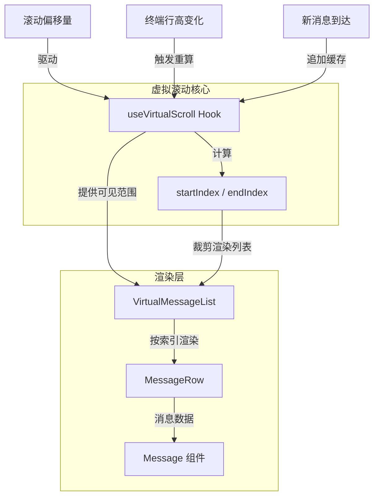
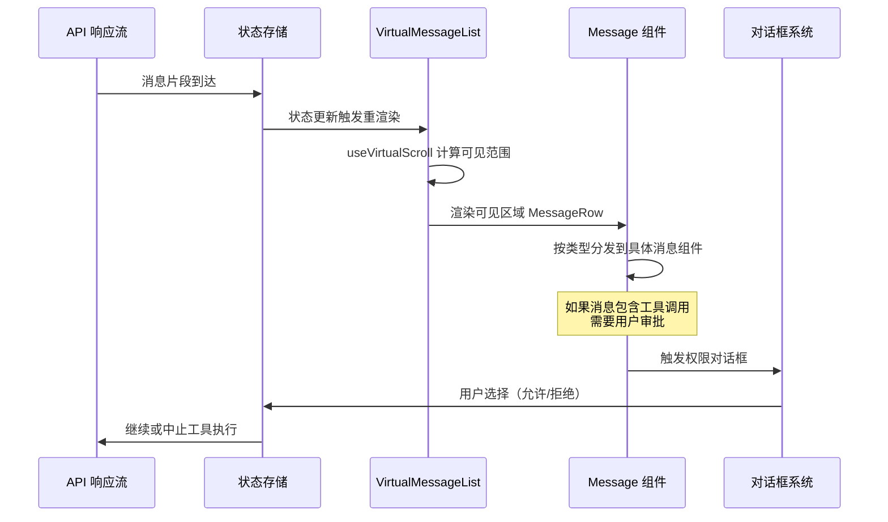

Claude Code 的终端 UI 构建在定制化 Ink（React for CLI）框架之上，其组件体系是整个用户交互体验的核心载体。本文聚焦三大支柱：**消息渲染管线**——如何将 30+ 种消息类型映射为终端可视化输出；**虚拟滚动引擎**——如何在有限终端行高下高效渲染海量对话；**交互式对话框系统**——如何在没有原生 GUI 的终端中实现模态交互。三者共同构成了一个「数据驱动 → 按需渲染 → 用户反馈」的完整闭环。

Sources: [VirtualMessageList.tsx](src/components/VirtualMessageList.tsx), [Messages.tsx](src/components/Messages.tsx), [Dialog.tsx](src/components/design-system/Dialog.tsx)

## 消息渲染管线：从数据模型到终端像素

### 消息类型体系与分发架构

Claude Code 的对话流中，每一条消息都被建模为特定的类型，由 `src/components/messages/` 目录下 30+ 个专用组件分别渲染。这种**类型驱动的渲染分发**模式，确保每种消息形态都有精确的视觉表达，而非用一套通用模板勉强适配。

核心消息类型可分为四大族系：

| 族系 | 代表组件 | 渲染职责 |
|------|----------|----------|
| **用户消息** | `UserTextMessage`, `UserCommandMessage`, `UserImageMessage`, `UserBashInputMessage` | 用户输入的文本、命令、图片粘贴、Bash 交互 |
| **助手消息** | `AssistantTextMessage`, `AssistantThinkingMessage`, `AssistantToolUseMessage`, `AssistantRedactedThinkingMessage` | AI 文本回复、思考过程、工具调用展示 |
| **系统消息** | `SystemTextMessage`, `SystemAPIErrorMessage`, `RateLimitMessage`, `ShutdownMessage` | 系统通知、API 错误、限速提示、关闭信号 |
| **工具结果** | `UserToolResultMessage`, `UserToolSuccessMessage`, `UserToolErrorMessage`, `UserToolRejectMessage` | 工具执行的成功/失败/拒绝/取消反馈 |

Sources: [messages/](src/components/messages/), [UserToolResultMessage/](src/components/messages/UserToolResultMessage/)

### 消息渲染的组件层级

消息从原始数据到终端输出，经历一个清晰的组件层级传递：

```
VirtualMessageList (虚拟滚动容器)
  └─ MessageRow (行包装：处理选中态、时间戳)
      └─ Message (消息分发器：根据 type 选择渲染组件)
          └─ MessageModel (消息数据模型适配)
              └─ 具体 Message 组件 (AssistantTextMessage / UserCommandMessage / ...)
```

`Message.tsx` 充当**类型分发器**的角色——它接收统一的消息数据，根据消息的 `type` 字段路由到对应的专用渲染组件。`MessageRow.tsx` 在外层包装行级关注点：选中高亮、时间戳显示、消息间距。`MessageModel.tsx` 则负责将原始消息数据适配为渲染组件所需的 props 结构。

Sources: [Message.tsx](src/components/Message.tsx), [MessageRow.tsx](src/components/MessageRow.tsx), [MessageModel.tsx](src/components/MessageModel.tsx)

### Markdown 渲染与代码高亮

终端环境下的 Markdown 渲染是一个独特的工程挑战——没有 HTML/CSS，只有 ANSI 转义序列。`Markdown.tsx` 是 Claude Code 中所有富文本渲染的基础设施组件，它将 Markdown AST 转换为 Ink 的组件树，利用终端颜色和样式转义码实现标题、列表、代码块、粗体/斜体等视觉效果。

代码高亮由 `HighlightedCode.tsx` 承载，配合 `src/components/HighlightedCode/` 目录下的降级组件 `Fallback.tsx`，在语法高亮引擎不可用时提供基本的代码块渲染。`MarkdownTable.tsx` 则专门处理表格的终端对齐渲染——在没有等宽字体保证的终端中，这是一个需要精确字符宽度计算的非平凡问题。

Sources: [Markdown.tsx](src/components/Markdown.tsx), [HighlightedCode.tsx](src/components/HighlightedCode.tsx), [MarkdownTable.tsx](src/components/MarkdownTable.tsx)

### 聚合与折叠策略

长对话中的工具调用输出可能极度冗长。`GroupedToolUseContent.tsx` 将连续的工具调用结果聚合展示，避免刷屏。`CollapsedReadSearchContent.tsx` 对文件读取和搜索结果实施折叠，仅展示摘要行。`CompactBoundaryMessage.tsx` 和 `SnipBoundaryMessage.tsx` 标记压缩和裁剪的边界，让用户知道哪些内容被省略。这些聚合与折叠策略是**可读性与信息密度之间的关键平衡**。

Sources: [GroupedToolUseContent.tsx](src/components/messages/GroupedToolUseContent.tsx), [CollapsedReadSearchContent.tsx](src/components/messages/CollapsedReadSearchContent.tsx), [CompactBoundaryMessage.tsx](src/components/messages/CompactBoundaryMessage.tsx)

## 虚拟滚动引擎：海量对话的按需渲染

### 为什么需要虚拟滚动

终端的行高是有限的——一个标准 80x24 的终端窗口只有 24 行可见区域。Claude Code 的对话可能包含数百条消息，每条消息的渲染高度从 1 行到数百行不等。如果采用全量渲染，Ink 的 React reconciliation 将在每次输入时重新计算所有消息的布局，导致显著的卡顿。**虚拟滚动的核心思想是：只渲染可视区域及其附近的消息，将 DOM（在 Ink 中是输出缓冲区）的规模控制在常数级。**

Sources: [VirtualMessageList.tsx](src/components/VirtualMessageList.tsx)

### 架构设计



`useVirtualScroll` 是虚拟滚动的核心 Hook，它接收全部消息列表和当前滚动偏移量，计算出当前可视区域的 `[startIndex, endIndex]` 范围。`VirtualMessageList` 仅渲染这个范围内的 `MessageRow`，同时保留上下各一定的缓冲行（overscan），确保滚动时不会出现白屏闪烁。

Sources: [useVirtualScroll.ts](src/hooks/useVirtualScroll.ts), [VirtualMessageList.tsx](src/components/VirtualMessageList.tsx)

### 滚动与键盘交互

`ScrollKeybindingHandler.tsx` 将终端的键盘事件映射为滚动操作——`j/k` 或方向键逐行滚动，`Ctrl+U/Ctrl+D` 半页滚动，`G/Shift+G` 跳至底部/顶部。`MessageSelector.tsx` 提供消息级别的选中与导航，允许用户用 `Enter` 选中某条消息进行操作（如复制、展开）。

`OffscreenFreeze.tsx` 是一个性能优化组件——当消息行滚出可视区域时，它冻结该行的重新渲染，避免不可见内容因状态变化触发无意义的 reconciliation。

Sources: [ScrollKeybindingHandler.tsx](src/components/ScrollKeybindingHandler.tsx), [MessageSelector.tsx](src/components/MessageSelector.tsx), [OffscreenFreeze.tsx](src/components/OffscreenFreeze.tsx)

### 动态高度与行测量

虚拟滚动在终端环境中的特殊挑战在于**消息高度不可预知**——一个 Markdown 代码块或一个工具调用结果的行高取决于终端宽度和内容复杂度，无法通过简单的计数推算。`useVirtualScroll` 需要维护一个高度缓存，对已渲染过的消息记录其实际行高，对未渲染过的消息提供估算值。随着用户滚动，缓存逐步被真实测量值替代，滚动偏移量的计算也趋于精确。

Sources: [useVirtualScroll.ts](src/hooks/useVirtualScroll.ts)

## 交互式对话框系统：终端中的模态交互

### 设计系统 Dialog 基础

`src/components/design-system/Dialog.tsx` 是所有对话框的基础组件，提供统一的视觉框架：标题栏、内容区、底部操作栏、焦点管理。在终端环境中实现「模态」意味着——对话框打开时，键盘输入被对话框捕获，底层的消息列表和输入框不响应按键；关闭后焦点归还。

Sources: [Dialog.tsx](src/components/design-system/Dialog.tsx)

### 对话框分类与用途

Claude Code 的对话框可按功能域分为以下几类：

| 类别 | 代表组件 | 交互模式 |
|------|----------|----------|
| **权限审批** | `PermissionDialog`, `PermissionPrompt`, `BashPermissionRequest`, `FileEditPermissionRequest` | 确认/拒绝/始终允许 |
| **MCP 管理** | `MCPServerApprovalDialog`, `MCPServerMultiselectDialog`, `MCPServerDesktopImportDialog` | 列表选择/审批 |
| **系统设置** | `Settings`, `InvalidConfigDialog`, `InvalidSettingsDialog`, `ManagedSettingsSecurityDialog` | 表单/警告确认 |
| **导航搜索** | `GlobalSearchDialog`, `HistorySearchDialog`, `QuickOpenDialog` | 模糊搜索/列表导航 |
| **模型与通道** | `ModelPicker`, `OutputStylePicker`, `ChannelDowngradeDialog`, `DevChannelsDialog` | 选择器/降级确认 |
| **远程与 Bridge** | `BridgeDialog`, `RemoteEnvironmentDialog`, `TeleportRepoMismatchDialog` | 连接确认/错误处理 |
| **安全与信任** | `TrustDialog`, `BypassPermissionsModeDialog`, `SandboxViolationExpandedView` | 信任确认/安全警告 |
| **导入导出** | `ExportDialog`, `WorkflowMultiselectDialog` | 流程配置/数据导出 |

Sources: [PermissionDialog.tsx](src/components/permissions/PermissionDialog.tsx), [MCPServerApprovalDialog.tsx](src/components/MCPServerApprovalDialog.tsx), [GlobalSearchDialog.tsx](src/components/GlobalSearchDialog.tsx), [TrustDialog/](src/components/TrustDialog/)

### 权限对话框：安全管控的交互入口

权限对话框是 Claude Code 安全模型的关键交互界面。当 AI 请求执行需要用户确认的操作时（如文件写入、Bash 命令执行、网络请求），系统弹出对应的权限对话框。`PermissionRequest.tsx` 是权限请求的统一入口组件，内部根据工具类型分发到专用对话框：

- `BashPermissionRequest` — 展示待执行的命令与工作目录
- `FileEditPermissionRequest` / `FileWritePermissionRequest` — 展示文件差异预览
- `WebFetchPermissionRequest` — 展示请求的 URL
- `SandboxPermissionRequest` — 沙箱违规详情与确认

`PermissionExplanation.tsx` 和 `PermissionRuleExplanation.tsx` 向用户解释为什么这个操作需要审批以及适用的规则，使安全决策有据可依。

Sources: [PermissionRequest.tsx](src/components/permissions/PermissionRequest.tsx), [PermissionExplanation.tsx](src/components/permissions/PermissionExplanation.tsx), [BashPermissionRequest/](src/components/permissions/BashPermissionRequest/)

### 模糊选择器与搜索对话框

终端中的模糊搜索由 `FuzzyPicker.tsx`（设计系统级）和 `SearchBox.tsx` 支持。`GlobalSearchDialog` 在所有对话中执行全文搜索，`HistorySearchDialog` 搜索历史会话，`QuickOpenDialog` 提供文件快速跳转。这些对话框共享一个交互模式：输入框 → 实时过滤 → 列表导航 → Enter 确认/Escape 取消。

`CustomSelect/` 目录实现了完整的多选/单选组件体系，包含选项导航（`use-select-navigation.ts`）、多选状态管理（`use-multi-select-state.ts`）和输入式选择（`use-select-input.ts`），为各种对话框提供列表交互基础设施。

Sources: [FuzzyPicker.tsx](src/components/design-system/FuzzyPicker.tsx), [GlobalSearchDialog.tsx](src/components/GlobalSearchDialog.tsx), [CustomSelect/](src/components/CustomSelect/)

### Wizard 向导系统

`src/components/wizard/` 实现了多步骤向导的通用框架。`WizardProvider.tsx` 通过 React Context 管理向导状态，`useWizard.ts` 提供 `next/prev/goTo` 等导航方法，`WizardDialogLayout.tsx` 定义统一的布局（标题、进度、内容、底部导航栏）。各功能向导（如 Onboarding、Settings、Sandbox 配置）复用此框架，只需定义步骤内容组件。

Sources: [WizardProvider.tsx](src/components/wizard/WizardProvider.tsx), [useWizard.ts](src/components/wizard/useWizard.ts), [WizardDialogLayout.tsx](src/components/wizard/WizardDialogLayout.tsx)

## 消息动作与辅助组件

### 消息动作系统

`messageActions.tsx` 定义了用户可对单条消息执行的操作集合——复制内容、在 IDE 中打开、展开/折叠、重新执行等。这些动作通过 `MessageRow` 的选中态激活，配合 `messageSelector` 的键盘导航提供高效的单手操作体验。

Sources: [messageActions.tsx](src/components/messageActions.tsx)

### Spinner 与状态指示

终端无法渲染 GIF 动画，状态反馈依赖字符动画。`Spinner/` 目录实现了丰富的加载状态视觉：
- `SpinnerAnimationRow.tsx` — 主加载行动画
- `GlimmerMessage.tsx` — 微光闪烁效果
- `ShimmerChar.tsx` / `useShimmerAnimation.ts` — 字符级闪烁
- `TeammateSpinnerLine.tsx` / `TeammateSpinnerTree.tsx` — 团队协作特有的树形加载指示
- `useStalledAnimation.ts` — 检测加载停滞并切换动画模式

Sources: [Spinner/](src/components/Spinner/), [ToolUseLoader.tsx](src/components/ToolUseLoader.tsx)

### 时间与上下文提示

`MessageTimestamp.tsx` 在消息旁显示时间戳，`CtrlOToExpand.tsx` 提供 `Ctrl+O` 展开折叠内容的快捷提示，`PressEnterToContinue.tsx` 是等待用户确认的通用组件，`CompactSummary.tsx` 在对话压缩后展示摘要信息。

Sources: [MessageTimestamp.tsx](src/components/MessageTimestamp.tsx), [CtrlOToExpand.tsx](src/components/CtrlOToExpand.tsx), [CompactSummary.tsx](src/components/CompactSummary.tsx)

## 整体协作：从消息到交互的完整流



整个组件体系的协作可概括为：**状态驱动渲染、类型驱动分发、虚拟驱动性能、模态驱动交互**。消息从 API 流入状态存储，虚拟滚动引擎按需提取可见子集，消息组件根据类型精确渲染，需要用户介入时弹出对话框拦截输入流。这种分层解耦的设计使得每个关注点都可以独立演进——新增消息类型只需添加一个组件并注册分发，优化滚动性能只需调整 `useVirtualScroll` 的缓存与估计算法，增加对话框只需基于 `Dialog.tsx` 组合内容与操作。

Sources: [App.tsx](src/components/App.tsx), [useVirtualScroll.ts](src/hooks/useVirtualScroll.ts), [Dialog.tsx](src/components/design-system/Dialog.tsx)

## 关键设计模式总结

| 模式 | 实现位置 | 核心思想 |
|------|----------|----------|
| **类型分发渲染** | `Message.tsx` → `messages/*` | 每种消息类型对应独立组件，避免巨型 switch |
| **虚拟滚动** | `useVirtualScroll` + `VirtualMessageList` | 仅渲染可视区域，O(视口) 而非 O(总数) |
| **离屏冻结** | `OffscreenFreeze.tsx` | 不可见内容不参与 reconciliation |
| **模态捕获** | `Dialog.tsx` + 键盘拦截 | 对话框打开时独占输入焦点 |
| **Wizard 步骤** | `WizardProvider` + `useWizard` | Context 驱动的多步骤状态机 |
| **动作附件** | `messageActions.tsx` | 选中态激活操作菜单，不干扰浏览 |

---

**延伸阅读**：理解本篇所述渲染管线的前置基础是 [Ink 定制框架：终端 React 渲染器的适配与扩展](8-ink-ding-zhi-kuang-jia-zhong-duan-react-xuan-ran-qi-de-gua-pei-yu-kuo-zhan)；消息组件的状态来源在 [状态管理：React 状态树、应用状态存储与选择器模式](7-zhuang-tai-guan-li-react-zhuang-tai-shu-ying-yong-zhuang-tai-cun-chu-yu-xuan-ze-qi-mo-shi) 中详解；输入交互的另一维度见 [Vim 编辑模式：终端输入的模态编辑支持](10-vim-bian-ji-mo-shi-zhong-duan-shu-ru-de-mo-tai-bian-ji-zhi-chi)。